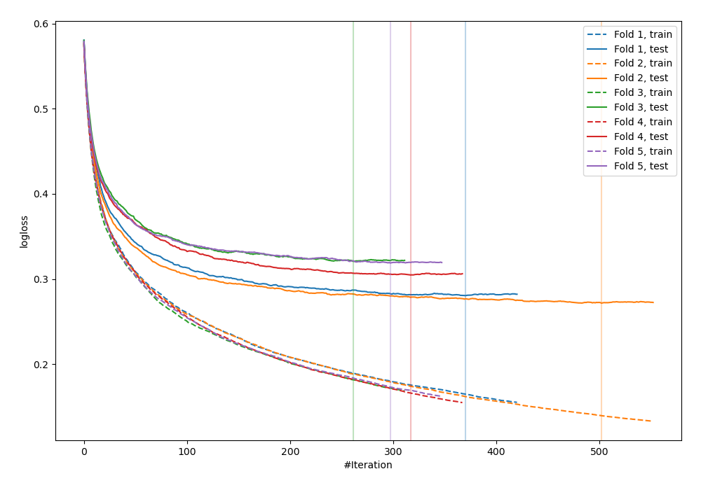
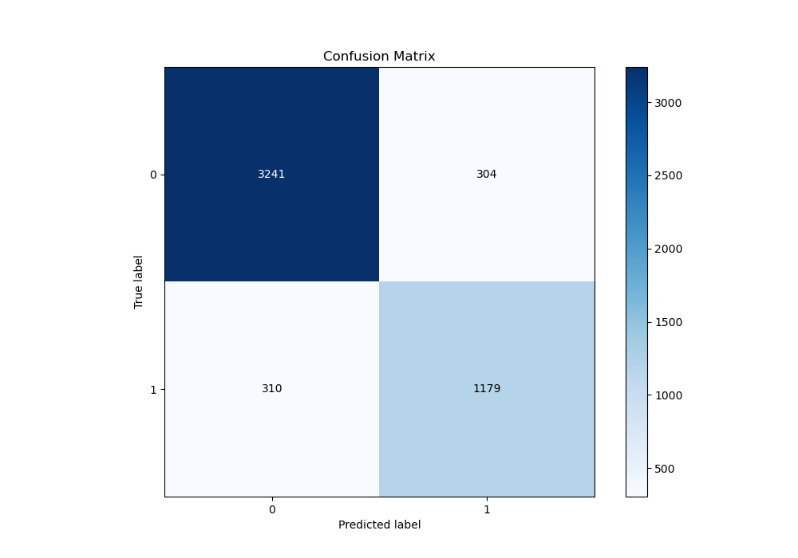
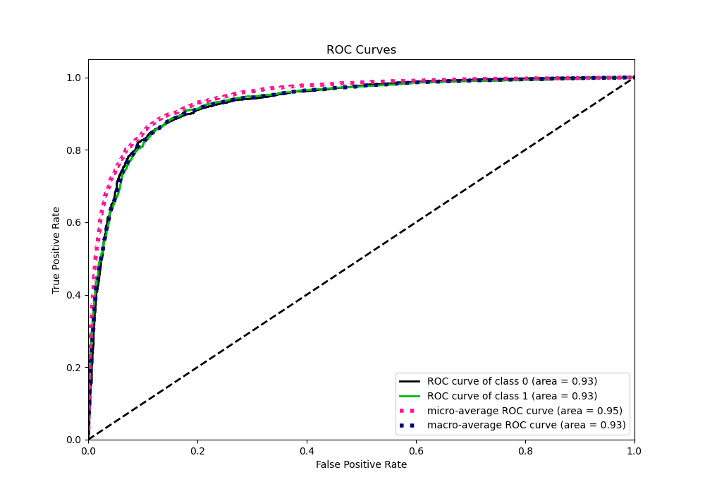
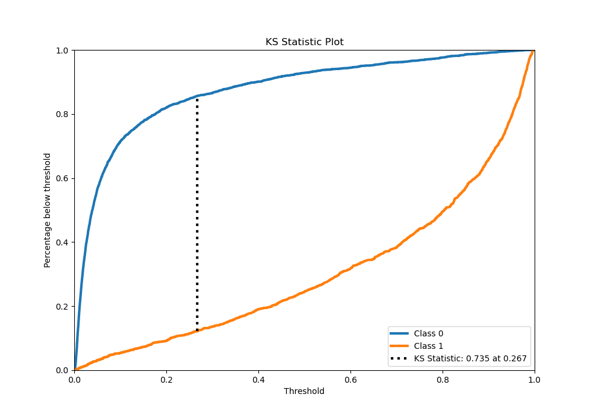
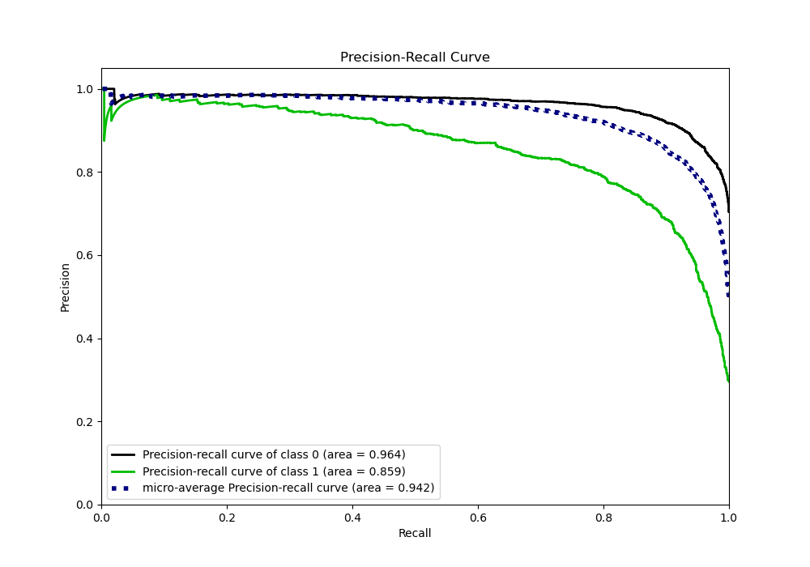
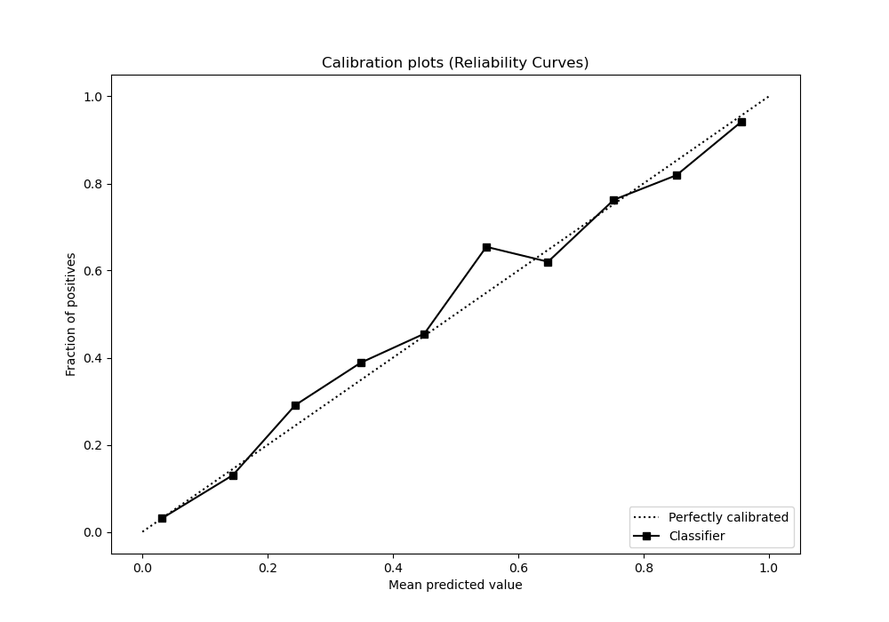
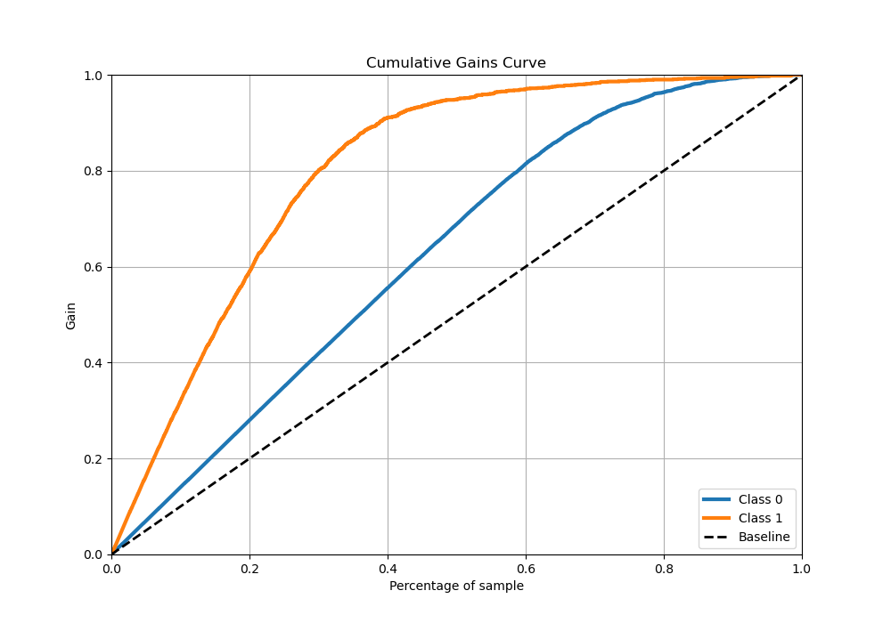
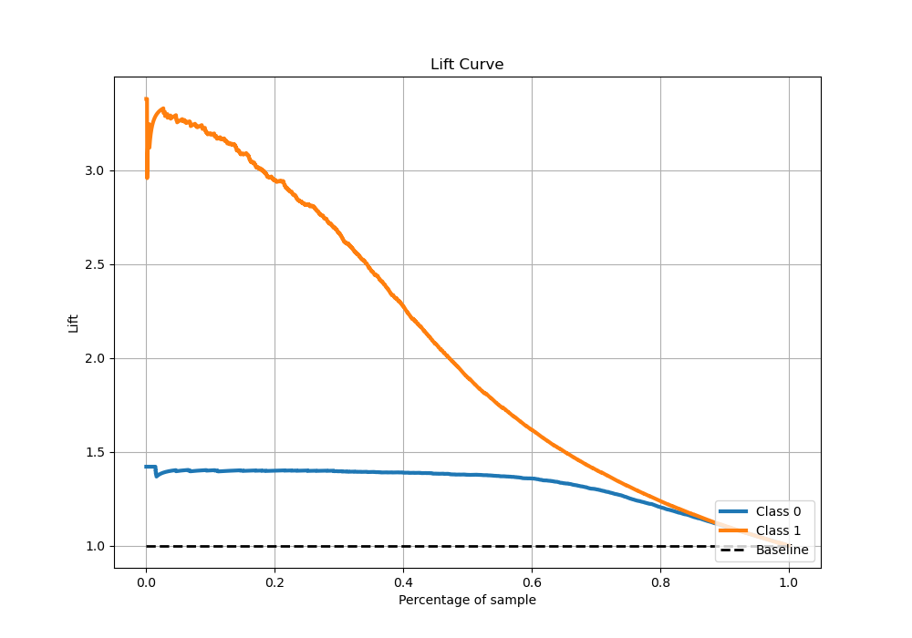

# Summary of 10_Xgboost

[<< Go back](../README.md)

## Extreme Gradient Boosting (Xgboost)
- **n_jobs**: -1
- **objective**: binary:logistic
- **eta**: 0.1
- **max_depth**: 5
- **min_child_weight**: 5
- **subsample**: 0.7
- **colsample_bytree**: 0.6
- **eval_metric**: logloss
- **explain_level**: 0

## Validation
 - **validation_type**: kfold
 - **stratify**: True
 - **k_folds**: 5
 - **shuffle**: True
 - **random_seed**: 42

## Optimized metric
logloss

## Training time

50.4 seconds

## Metric details
|           |    score |     threshold |
|:----------|---------:|--------------:|
| logloss   | 0.299243 | nan           |
| auc       | 0.930694 | nan           |
| f1        | 0.795573 |   0.385637    |
| accuracy  | 0.878029 |   0.441456    |
| precision | 0.984962 |   0.977401    |
| recall    | 1        |   0.000417406 |
| mcc       | 0.706881 |   0.441456    |

## Metric details with threshold from accuracy metric
|           |    score |   threshold |
|:----------|---------:|------------:|
| logloss   | 0.299243 |  nan        |
| auc       | 0.930694 |  nan        |
| f1        | 0.793405 |    0.441456 |
| accuracy  | 0.878029 |    0.441456 |
| precision | 0.79501  |    0.441456 |
| recall    | 0.791807 |    0.441456 |
| mcc       | 0.706881 |    0.441456 |

## Confusion matrix (at threshold=0.441456)
|              |   Predicted as 0 |   Predicted as 1 |
|:-------------|-----------------:|-----------------:|
| Labeled as 0 |             3241 |              304 |
| Labeled as 1 |              310 |             1179 |

## Learning curves

## Confusion Matrix

## Normalized Confusion Matrix

## ROC Curve

## Kolmogorov-Smirnov Statistic

## Precision-Recall Curve

## Calibration Curve

## Cumulative Gains Curve

## Lift Curve

[<< Go back](../README.md)
