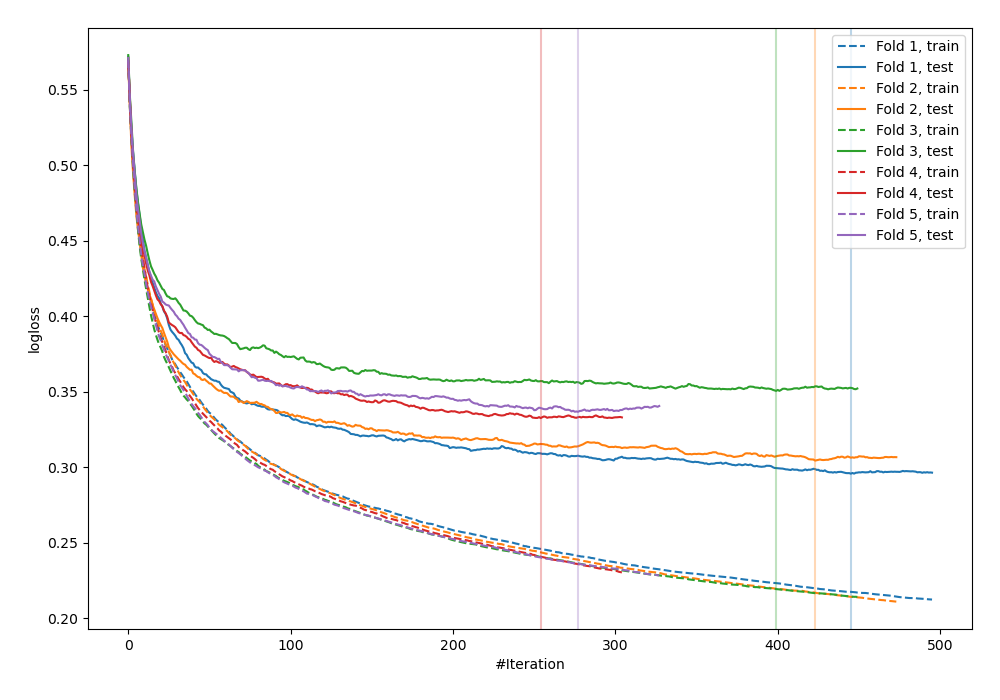
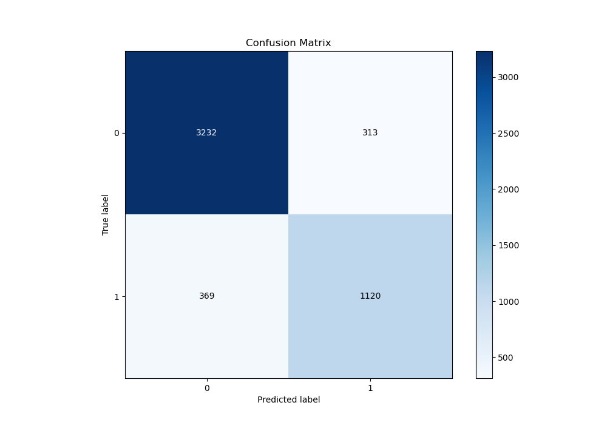
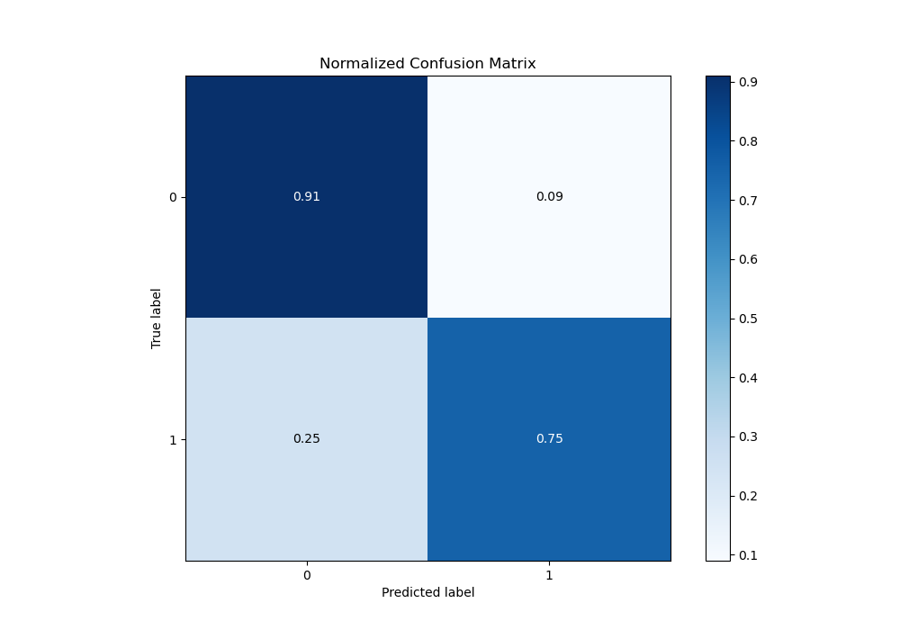
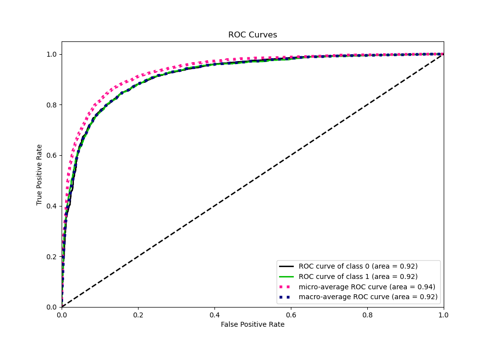
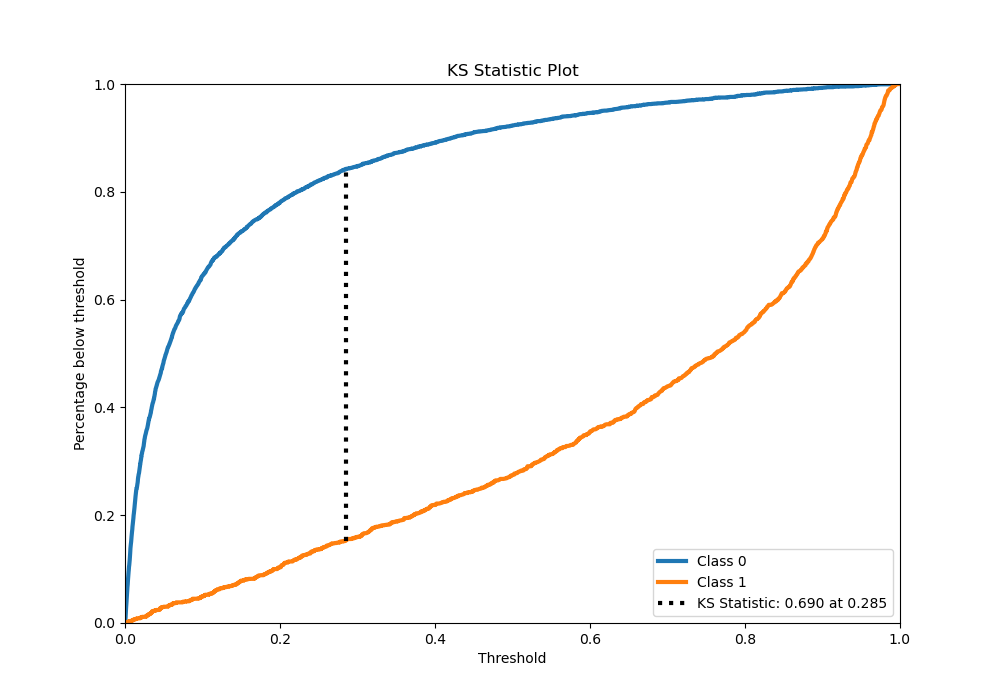
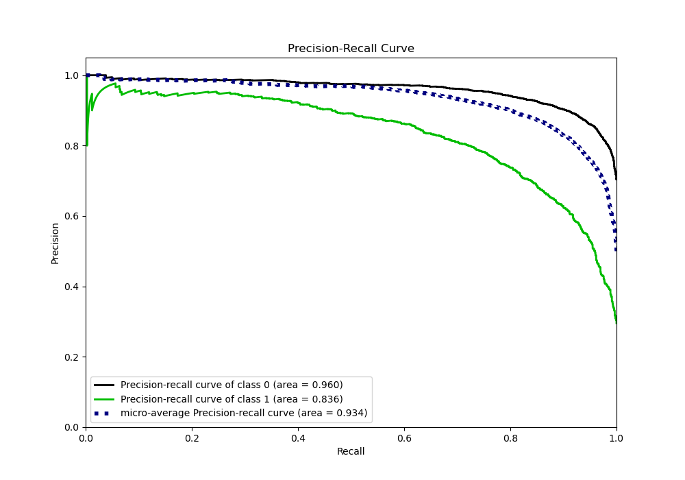
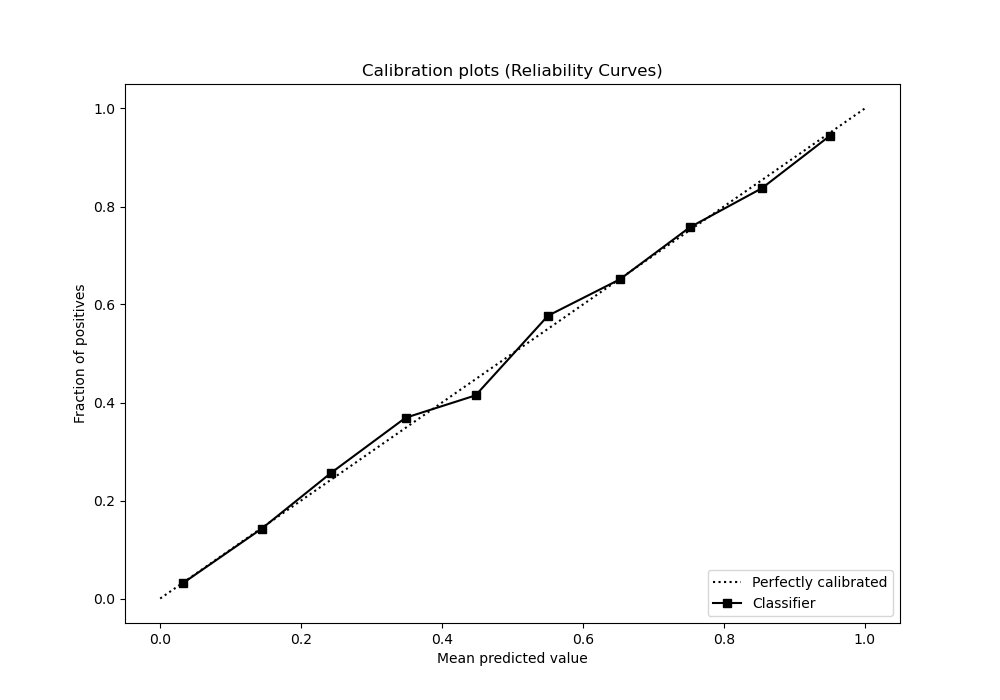
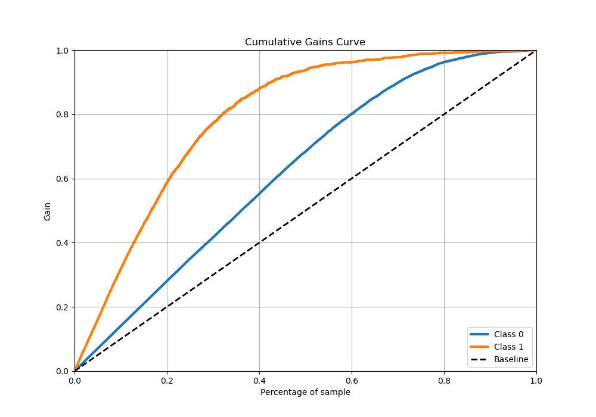
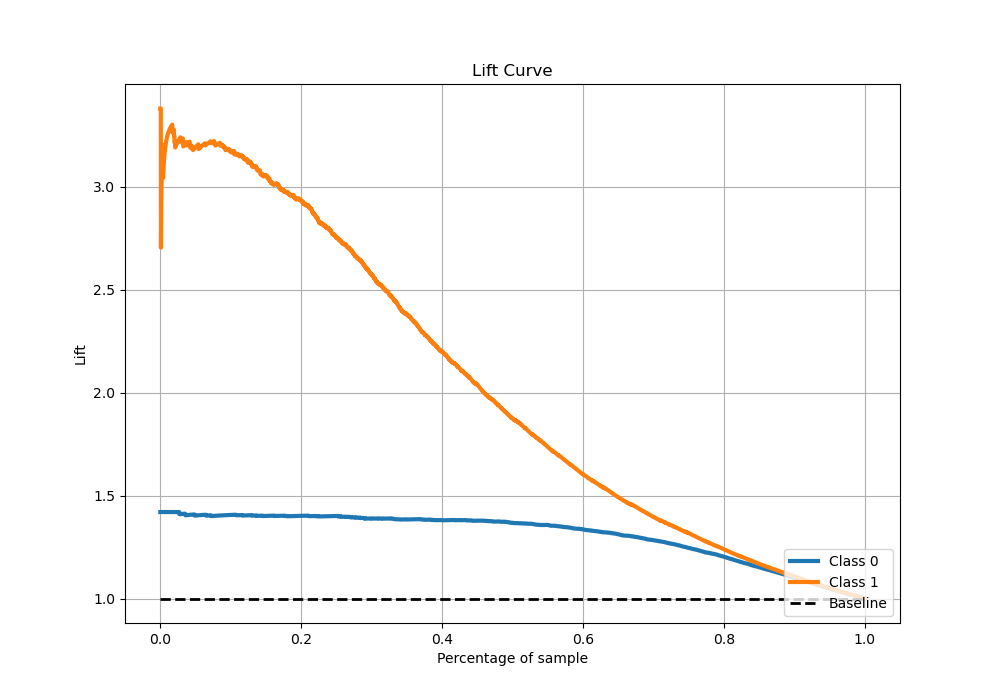

# Summary of 11_Xgboost

[<< Go back](../README.md)

## Extreme Gradient Boosting (Xgboost)
- **n_jobs**: -1
- **objective**: binary:logistic
- **eta**: 0.15
- **max_depth**: 7
- **min_child_weight**: 25
- **subsample**: 0.6
- **colsample_bytree**: 1.0
- **eval_metric**: logloss
- **explain_level**: 0

## Validation
 - **validation_type**: kfold
 - **stratify**: True
 - **k_folds**: 5
 - **shuffle**: True
 - **random_seed**: 42

## Optimized metric
logloss

## Training time

33.0 seconds

## Metric details
|           |    score |     threshold |
|:----------|---------:|--------------:|
| logloss   | 0.324035 | nan           |
| auc       | 0.918698 | nan           |
| f1        | 0.768097 |   0.363556    |
| accuracy  | 0.864521 |   0.456031    |
| precision | 0.975904 |   0.973527    |
| recall    | 1        |   0.000127253 |
| mcc       | 0.671454 |   0.456031    |

## Metric details with threshold from accuracy metric
|           |    score |   threshold |
|:----------|---------:|------------:|
| logloss   | 0.324035 |  nan        |
| auc       | 0.918698 |  nan        |
| f1        | 0.766598 |    0.456031 |
| accuracy  | 0.864521 |    0.456031 |
| precision | 0.781577 |    0.456031 |
| recall    | 0.752183 |    0.456031 |
| mcc       | 0.671454 |    0.456031 |

## Confusion matrix (at threshold=0.456031)
|              |   Predicted as 0 |   Predicted as 1 |
|:-------------|-----------------:|-----------------:|
| Labeled as 0 |             3232 |              313 |
| Labeled as 1 |              369 |             1120 |

## Learning curves

## Confusion Matrix

## Normalized Confusion Matrix

## ROC Curve

## Kolmogorov-Smirnov Statistic

## Precision-Recall Curve

## Calibration Curve

## Cumulative Gains Curve

## Lift Curve

[<< Go back](../README.md)
