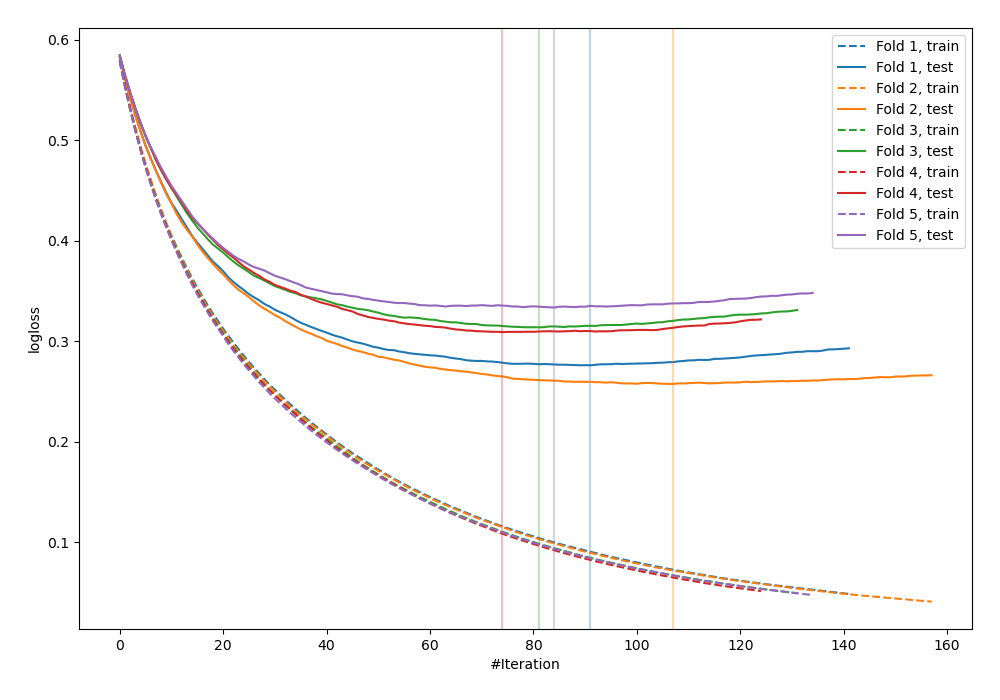
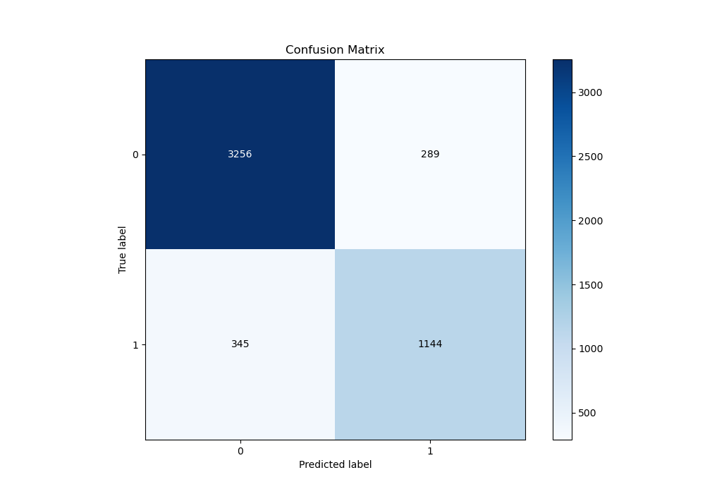
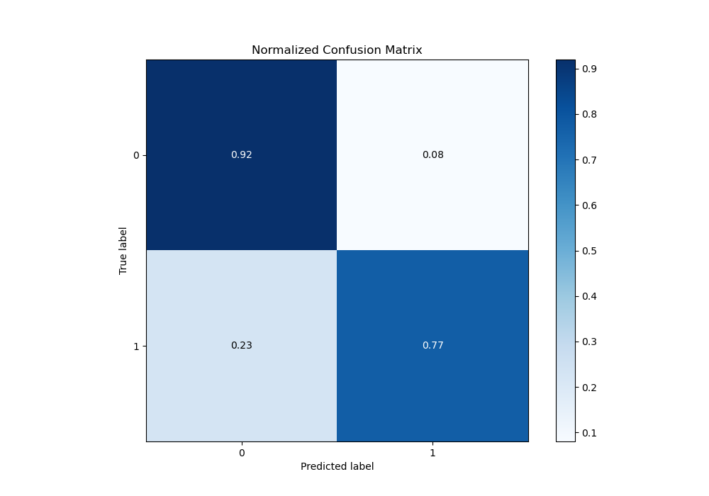
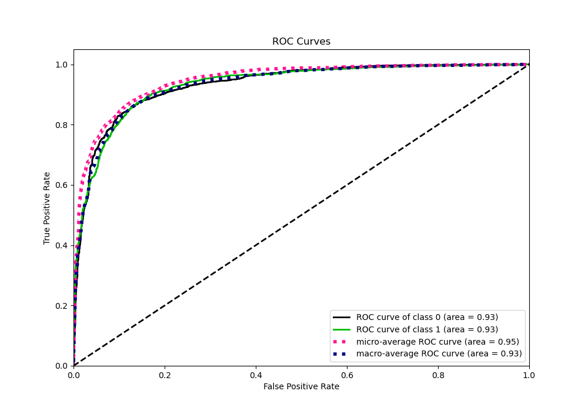
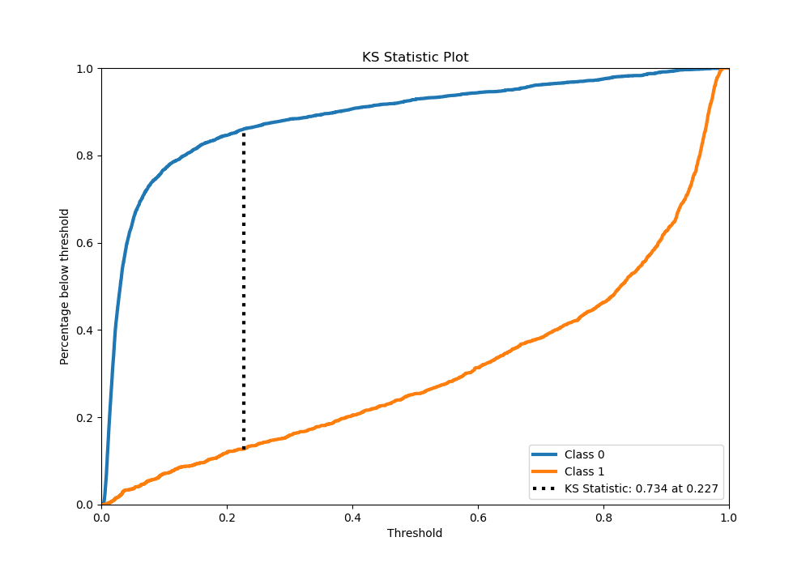
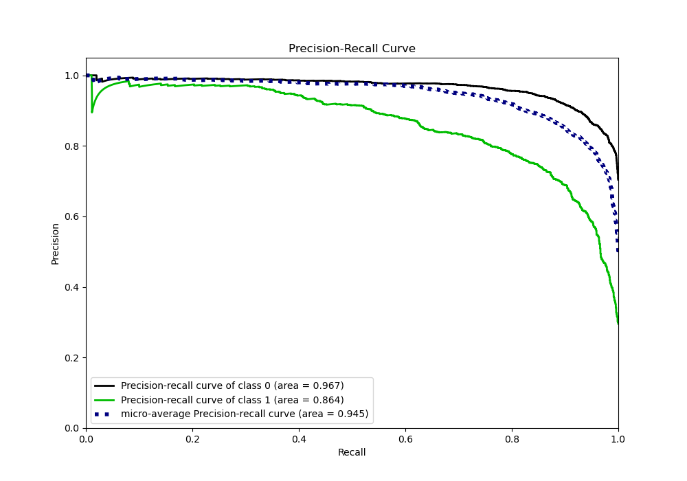
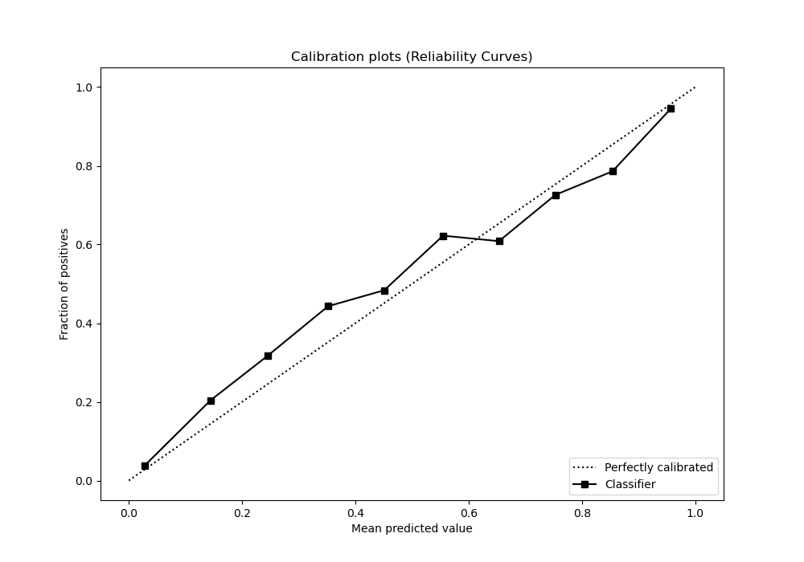
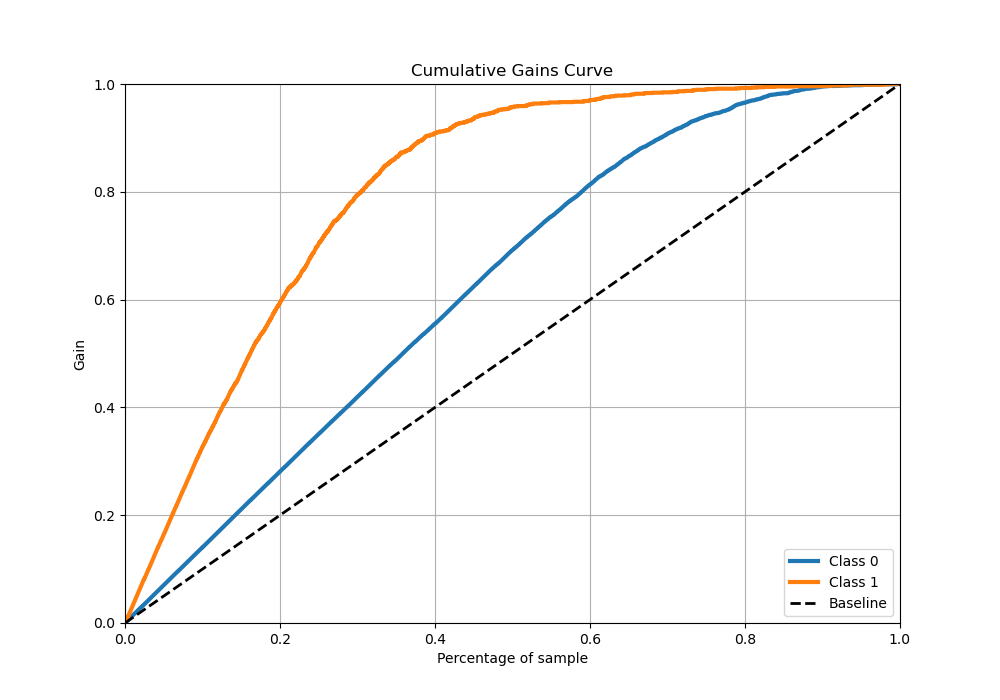
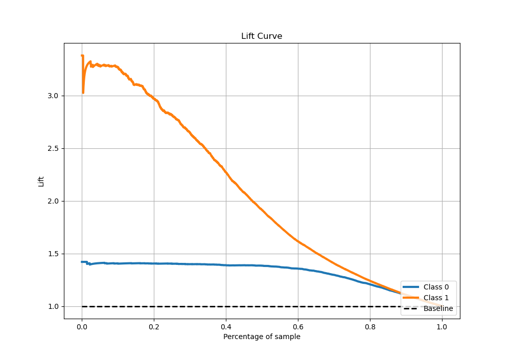

# Summary of 17_LightGBM

[<< Go back](../README.md)

## LightGBM
- **n_jobs**: -1
- **objective**: binary
- **num_leaves**: 95
- **learning_rate**: 0.05
- **feature_fraction**: 0.9
- **bagging_fraction**: 0.8
- **min_data_in_leaf**: 10
- **metric**: binary_logloss
- **custom_eval_metric_name**: None
- **explain_level**: 0

## Validation
 - **validation_type**: kfold
 - **stratify**: True
 - **k_folds**: 5
 - **shuffle**: True
 - **random_seed**: 42

## Optimized metric
logloss

## Training time

331.4 seconds

## Metric details
|           |    score |    threshold |
|:----------|---------:|-------------:|
| logloss   | 0.297998 | nan          |
| auc       | 0.932818 | nan          |
| f1        | 0.795082 |   0.294076   |
| accuracy  | 0.874056 |   0.461746   |
| precision | 0.975904 |   0.975318   |
| recall    | 1        |   0.00223829 |
| mcc       | 0.704141 |   0.294076   |

## Metric details with threshold from accuracy metric
|           |    score |   threshold |
|:----------|---------:|------------:|
| logloss   | 0.297998 |  nan        |
| auc       | 0.932818 |  nan        |
| f1        | 0.783025 |    0.461746 |
| accuracy  | 0.874056 |    0.461746 |
| precision | 0.798325 |    0.461746 |
| recall    | 0.768301 |    0.461746 |
| mcc       | 0.694603 |    0.461746 |

## Confusion matrix (at threshold=0.461746)
|              |   Predicted as 0 |   Predicted as 1 |
|:-------------|-----------------:|-----------------:|
| Labeled as 0 |             3256 |              289 |
| Labeled as 1 |              345 |             1144 |

## Learning curves

## Confusion Matrix

## Normalized Confusion Matrix

## ROC Curve

## Kolmogorov-Smirnov Statistic

## Precision-Recall Curve

## Calibration Curve

## Cumulative Gains Curve

## Lift Curve

[<< Go back](../README.md)
