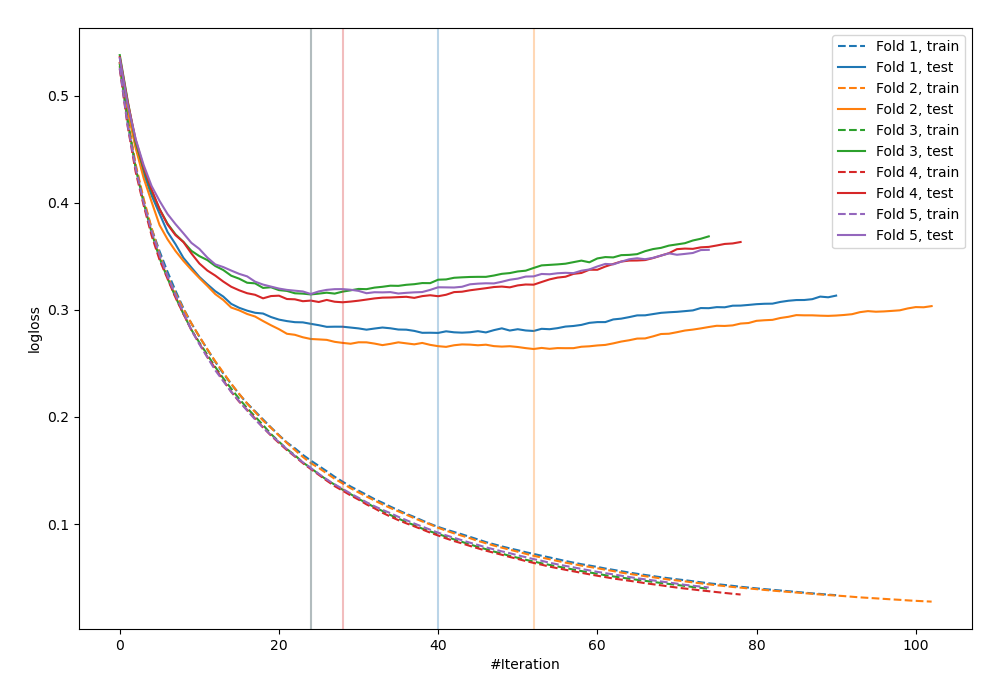
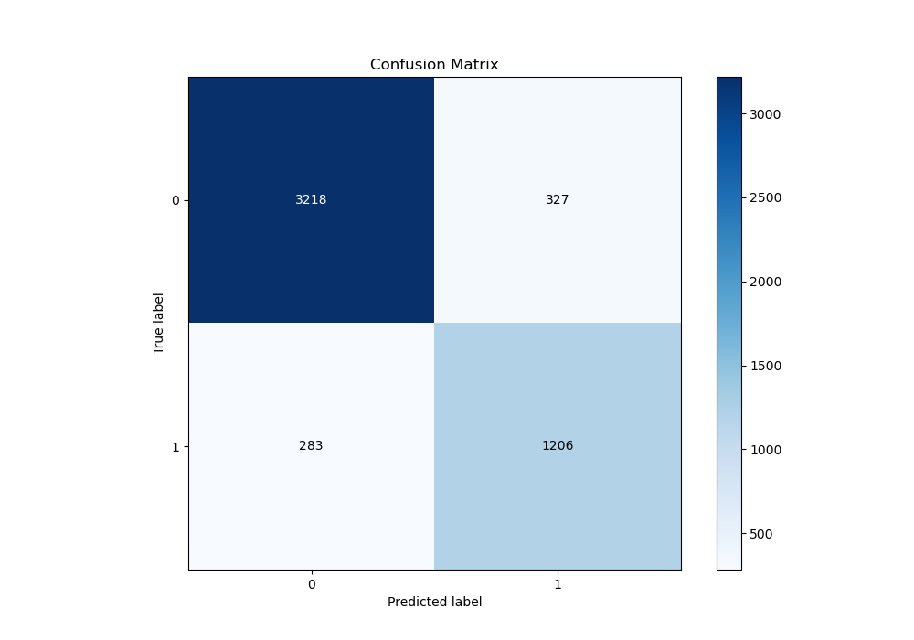
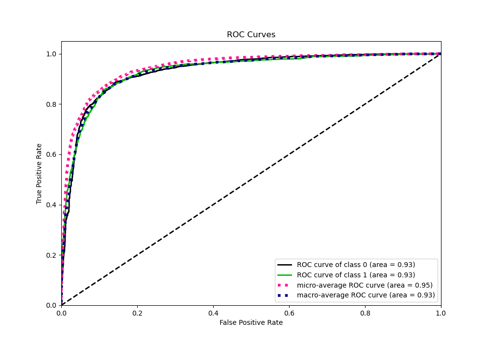
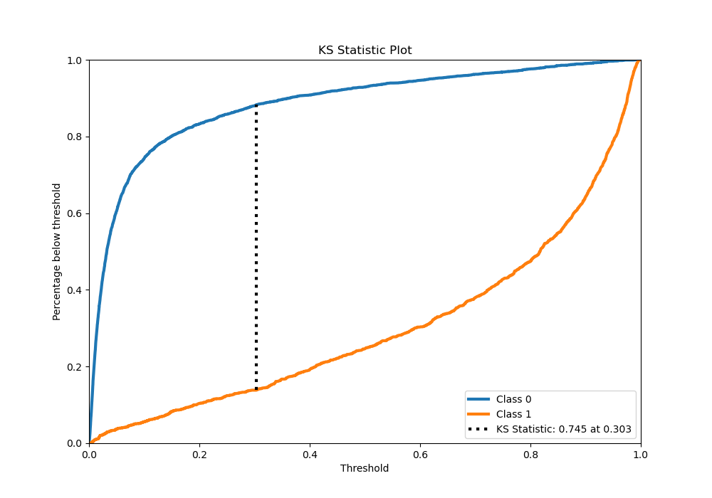
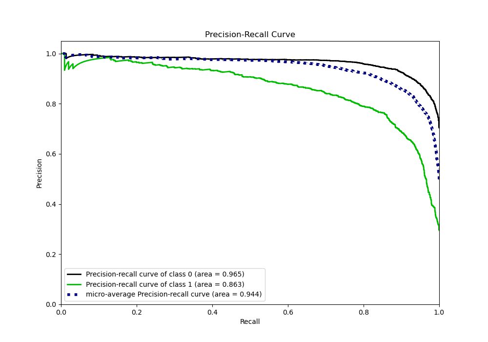
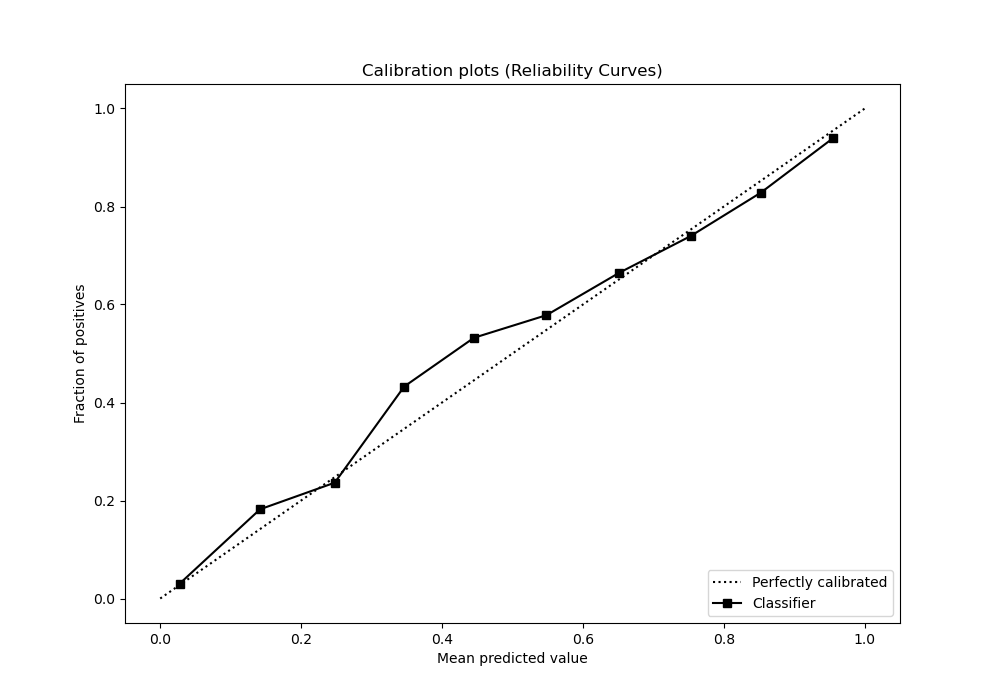
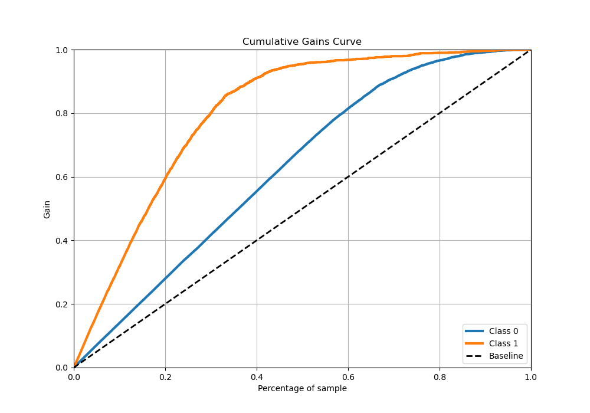
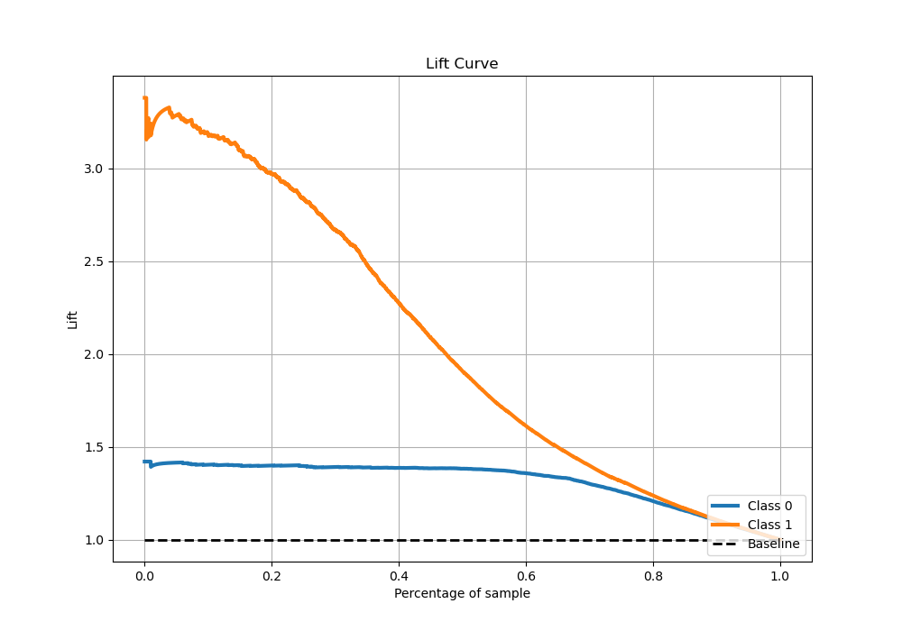

# Summary of 18_LightGBM

[<< Go back](../README.md)

## LightGBM
- **n_jobs**: -1
- **objective**: binary
- **num_leaves**: 63
- **learning_rate**: 0.2
- **feature_fraction**: 0.5
- **bagging_fraction**: 0.8
- **min_data_in_leaf**: 30
- **metric**: binary_logloss
- **custom_eval_metric_name**: None
- **explain_level**: 0

## Validation
 - **validation_type**: kfold
 - **stratify**: True
 - **k_folds**: 5
 - **shuffle**: True
 - **random_seed**: 42

## Optimized metric
logloss

## Training time

16.5 seconds

## Metric details
|           |    score |     threshold |
|:----------|---------:|--------------:|
| logloss   | 0.295668 | nan           |
| auc       | 0.932285 | nan           |
| f1        | 0.80517  |   0.31301     |
| accuracy  | 0.878824 |   0.398638    |
| precision | 0.983607 |   0.972034    |
| recall    | 1        |   0.000122169 |
| mcc       | 0.718903 |   0.31301     |

## Metric details with threshold from accuracy metric
|           |    score |   threshold |
|:----------|---------:|------------:|
| logloss   | 0.295668 |  nan        |
| auc       | 0.932285 |  nan        |
| f1        | 0.798147 |    0.398638 |
| accuracy  | 0.878824 |    0.398638 |
| precision | 0.786693 |    0.398638 |
| recall    | 0.80994  |    0.398638 |
| mcc       | 0.711753 |    0.398638 |

## Confusion matrix (at threshold=0.398638)
|              |   Predicted as 0 |   Predicted as 1 |
|:-------------|-----------------:|-----------------:|
| Labeled as 0 |             3218 |              327 |
| Labeled as 1 |              283 |             1206 |

## Learning curves

## Confusion Matrix

## Normalized Confusion Matrix

## ROC Curve

## Kolmogorov-Smirnov Statistic

## Precision-Recall Curve

## Calibration Curve

## Cumulative Gains Curve

## Lift Curve

[<< Go back](../README.md)
