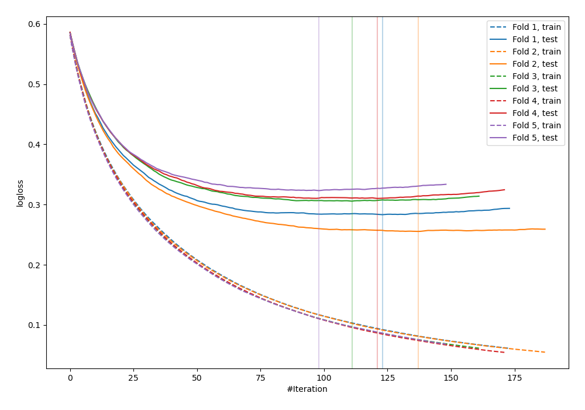
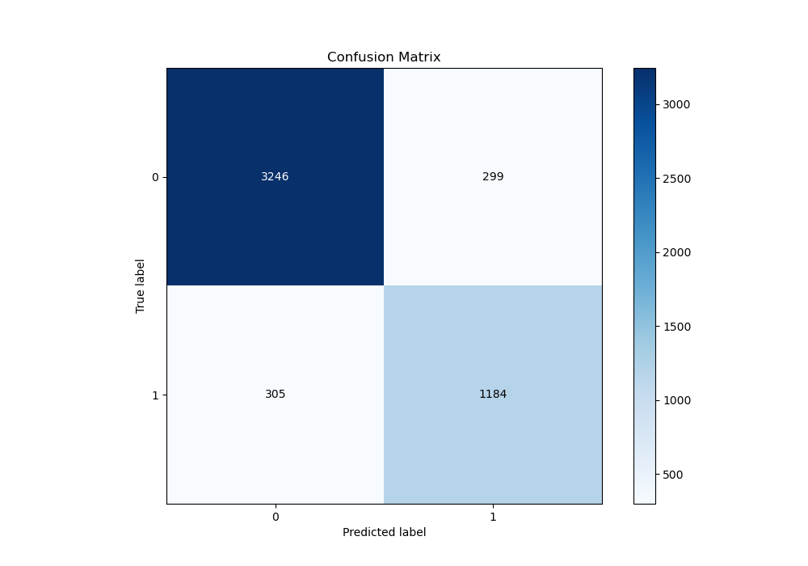
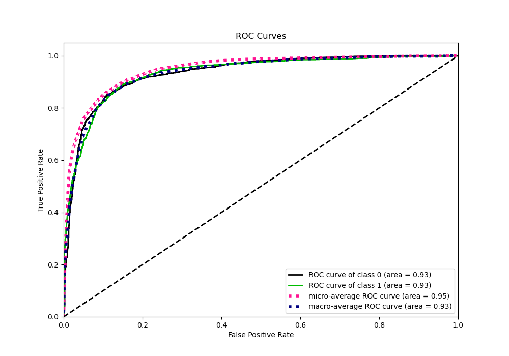
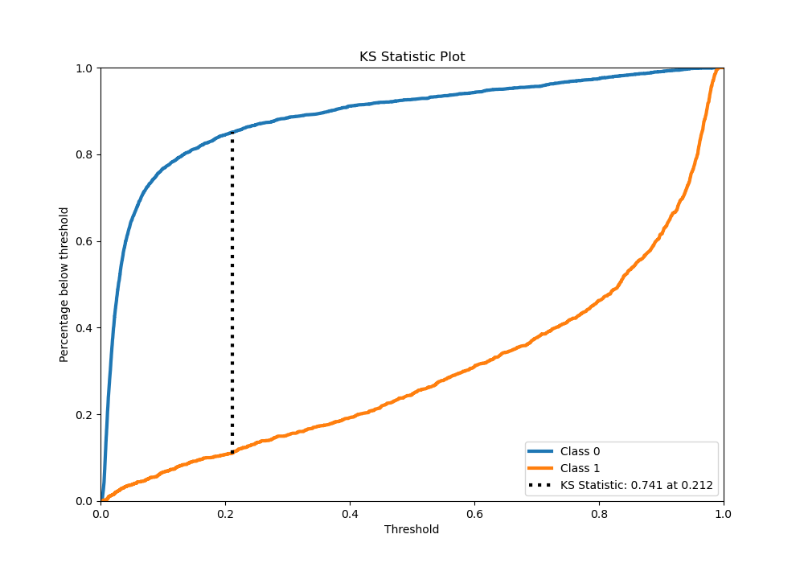
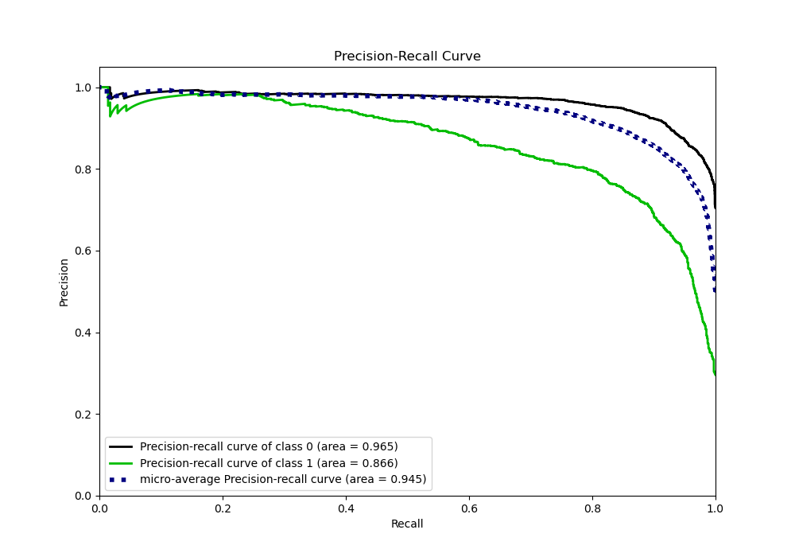
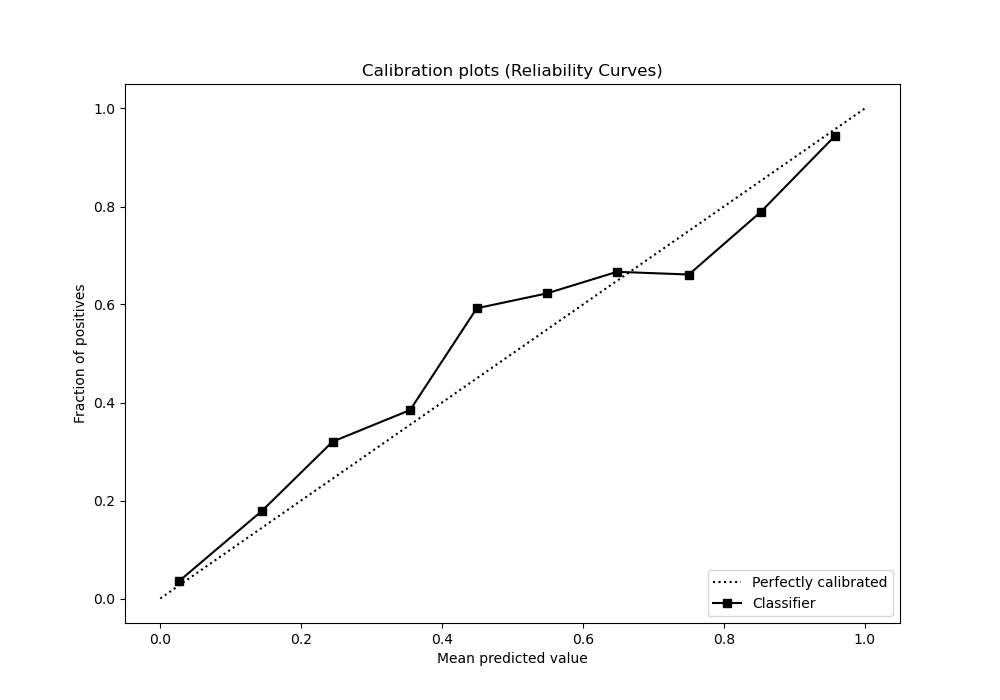
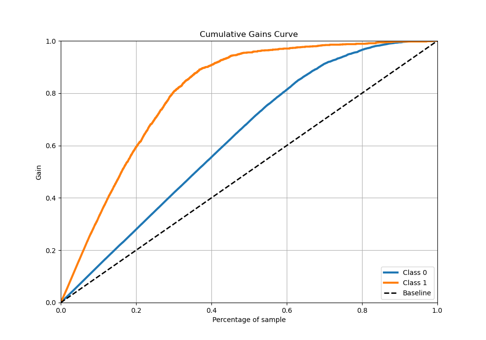
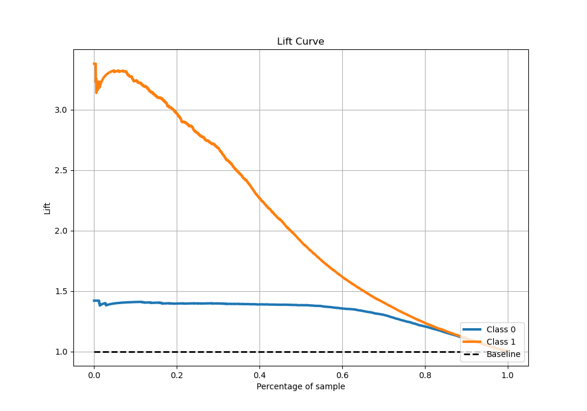

# Summary of 1_Default_LightGBM

[<< Go back](../README.md)

## LightGBM
- **n_jobs**: -1
- **objective**: binary
- **num_leaves**: 63
- **learning_rate**: 0.05
- **feature_fraction**: 0.9
- **bagging_fraction**: 0.9
- **min_data_in_leaf**: 10
- **metric**: binary_logloss
- **custom_eval_metric_name**: None
- **explain_level**: 0

## Validation
 - **validation_type**: kfold
 - **stratify**: True
 - **k_folds**: 5
 - **shuffle**: True
 - **random_seed**: 42

## Optimized metric
logloss

## Training time

29.4 seconds

## Metric details
|           |    score |    threshold |
|:----------|---------:|-------------:|
| logloss   | 0.295539 | nan          |
| auc       | 0.93305  | nan          |
| f1        | 0.798235 |   0.295417   |
| accuracy  | 0.880016 |   0.430433   |
| precision | 0.982833 |   0.964433   |
| recall    | 1        |   0.00158335 |
| mcc       | 0.711753 |   0.393203   |

## Metric details with threshold from accuracy metric
|           |    score |   threshold |
|:----------|---------:|------------:|
| logloss   | 0.295539 |  nan        |
| auc       | 0.93305  |  nan        |
| f1        | 0.79677  |    0.430433 |
| accuracy  | 0.880016 |    0.430433 |
| precision | 0.798382 |    0.430433 |
| recall    | 0.795165 |    0.430433 |
| mcc       | 0.711655 |    0.430433 |

## Confusion matrix (at threshold=0.430433)
|              |   Predicted as 0 |   Predicted as 1 |
|:-------------|-----------------:|-----------------:|
| Labeled as 0 |             3246 |              299 |
| Labeled as 1 |              305 |             1184 |

## Learning curves

## Confusion Matrix

## Normalized Confusion Matrix

## ROC Curve

## Kolmogorov-Smirnov Statistic

## Precision-Recall Curve

## Calibration Curve

## Cumulative Gains Curve

## Lift Curve

[<< Go back](../README.md)
