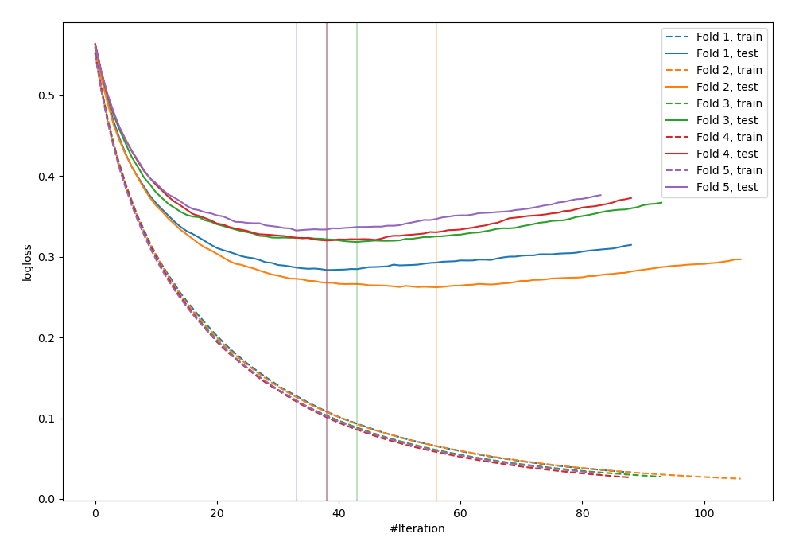
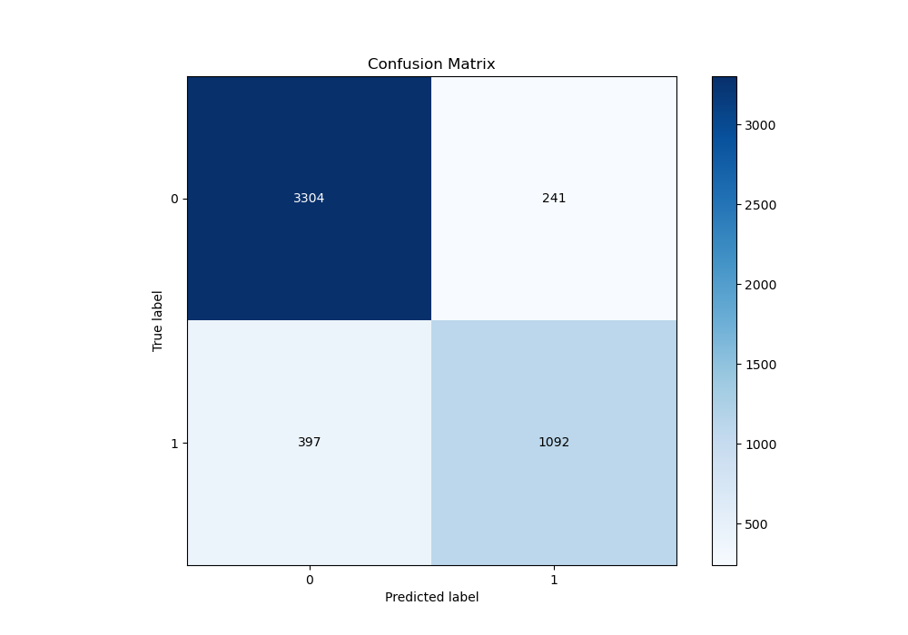
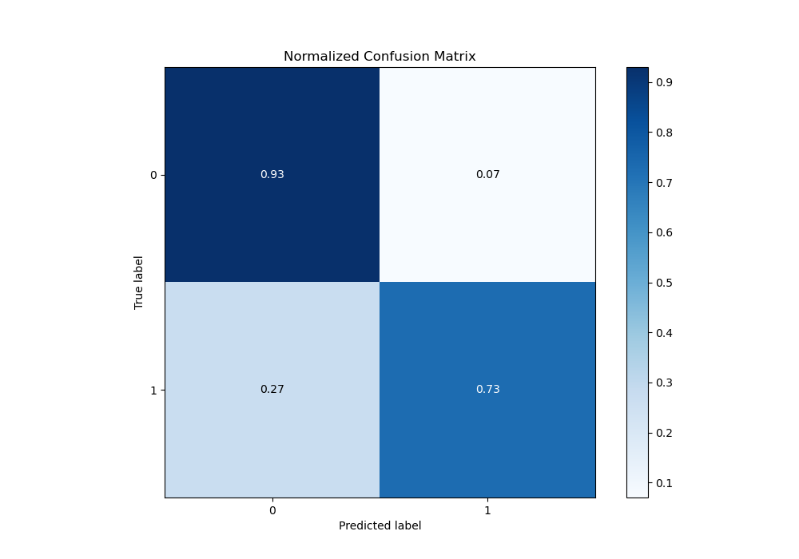
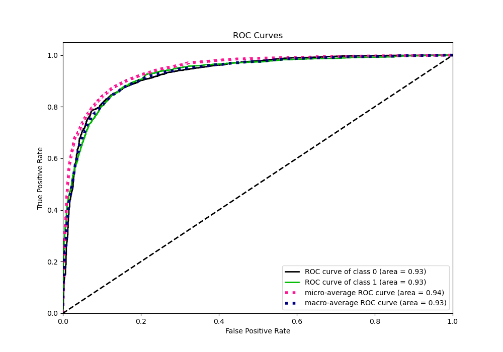
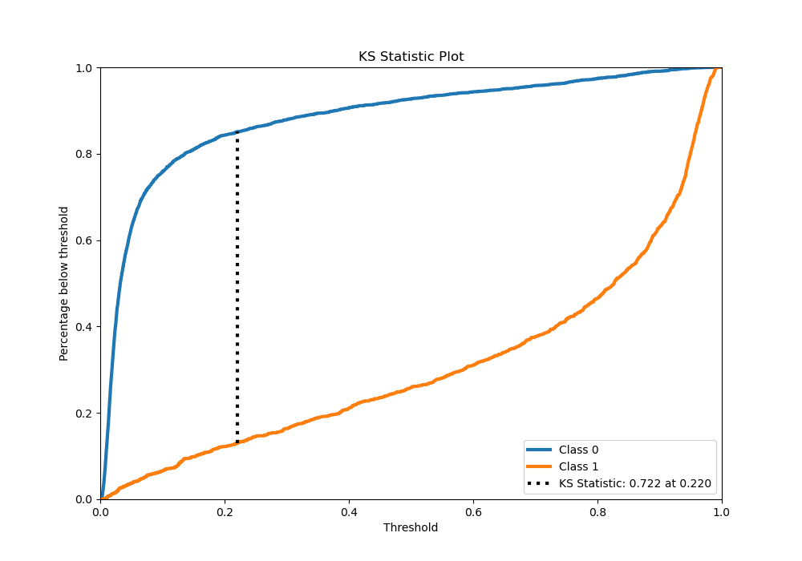
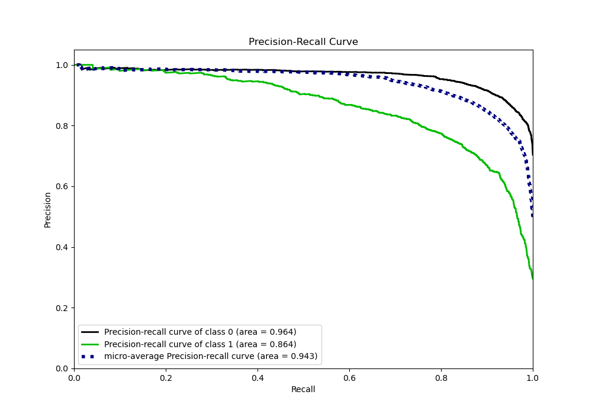
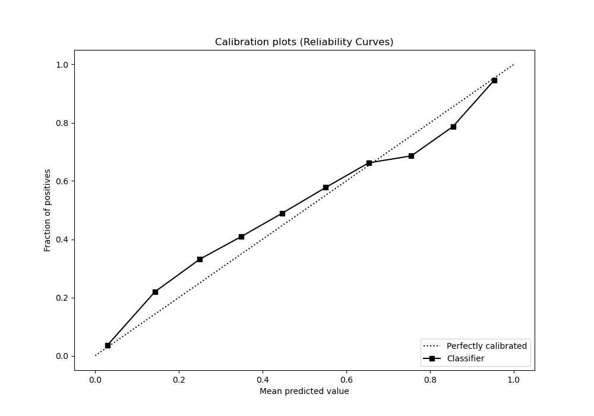
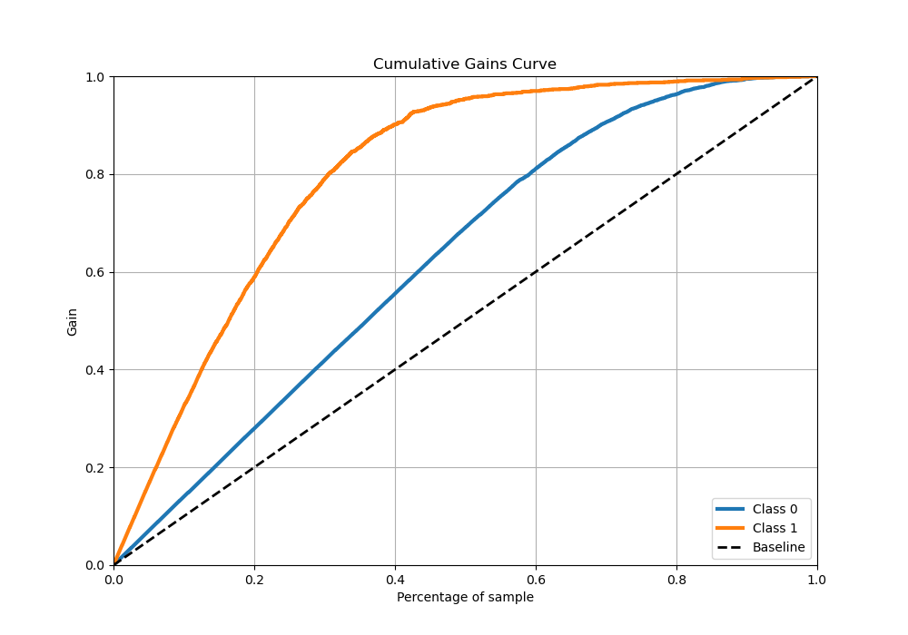
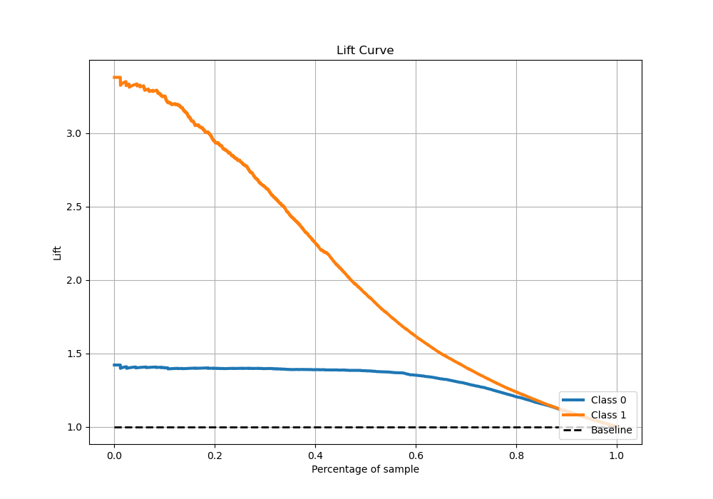

# Summary of 21_LightGBM

[<< Go back](../README.md)

## LightGBM
- **n_jobs**: -1
- **objective**: binary
- **num_leaves**: 95
- **learning_rate**: 0.1
- **feature_fraction**: 1.0
- **bagging_fraction**: 0.5
- **min_data_in_leaf**: 10
- **metric**: binary_logloss
- **custom_eval_metric_name**: None
- **explain_level**: 0

## Validation
 - **validation_type**: kfold
 - **stratify**: True
 - **k_folds**: 5
 - **shuffle**: True
 - **random_seed**: 42

## Optimized metric
logloss

## Training time

123.5 seconds

## Metric details
|           |    score |    threshold |
|:----------|---------:|-------------:|
| logloss   | 0.303371 | nan          |
| auc       | 0.92969  | nan          |
| f1        | 0.786885 |   0.295231   |
| accuracy  | 0.873262 |   0.526671   |
| precision | 0.987952 |   0.9754     |
| recall    | 1        |   0.00155692 |
| mcc       | 0.694729 |   0.386524   |

## Metric details with threshold from accuracy metric
|           |    score |   threshold |
|:----------|---------:|------------:|
| logloss   | 0.303371 |  nan        |
| auc       | 0.92969  |  nan        |
| f1        | 0.773919 |    0.526671 |
| accuracy  | 0.873262 |    0.526671 |
| precision | 0.819205 |    0.526671 |
| recall    | 0.733378 |    0.526671 |
| mcc       | 0.688272 |    0.526671 |

## Confusion matrix (at threshold=0.526671)
|              |   Predicted as 0 |   Predicted as 1 |
|:-------------|-----------------:|-----------------:|
| Labeled as 0 |             3304 |              241 |
| Labeled as 1 |              397 |             1092 |

## Learning curves

## Confusion Matrix

## Normalized Confusion Matrix

## ROC Curve

## Kolmogorov-Smirnov Statistic

## Precision-Recall Curve

## Calibration Curve

## Cumulative Gains Curve

## Lift Curve

[<< Go back](../README.md)
