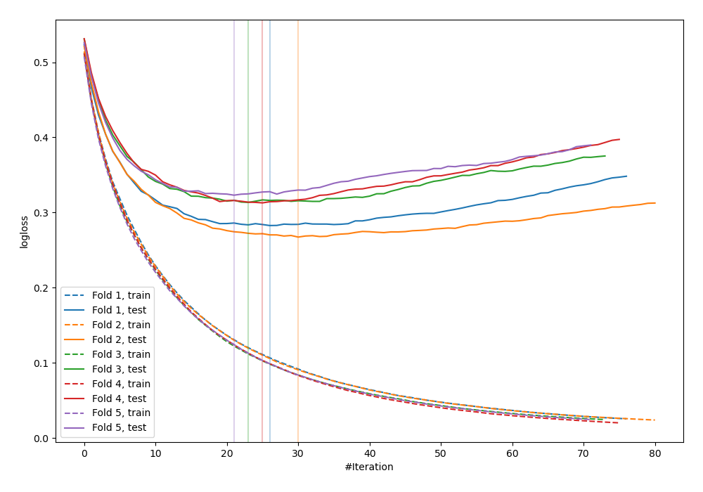
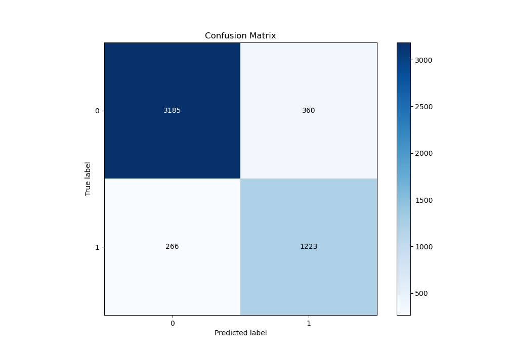
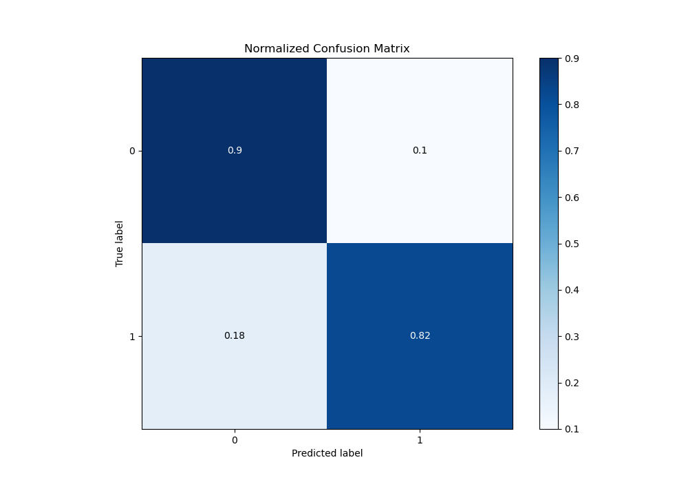
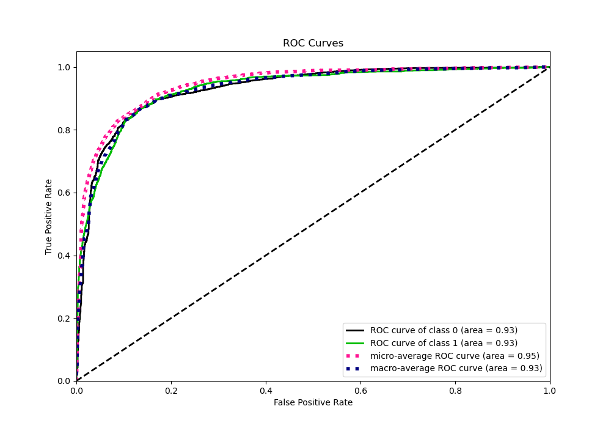
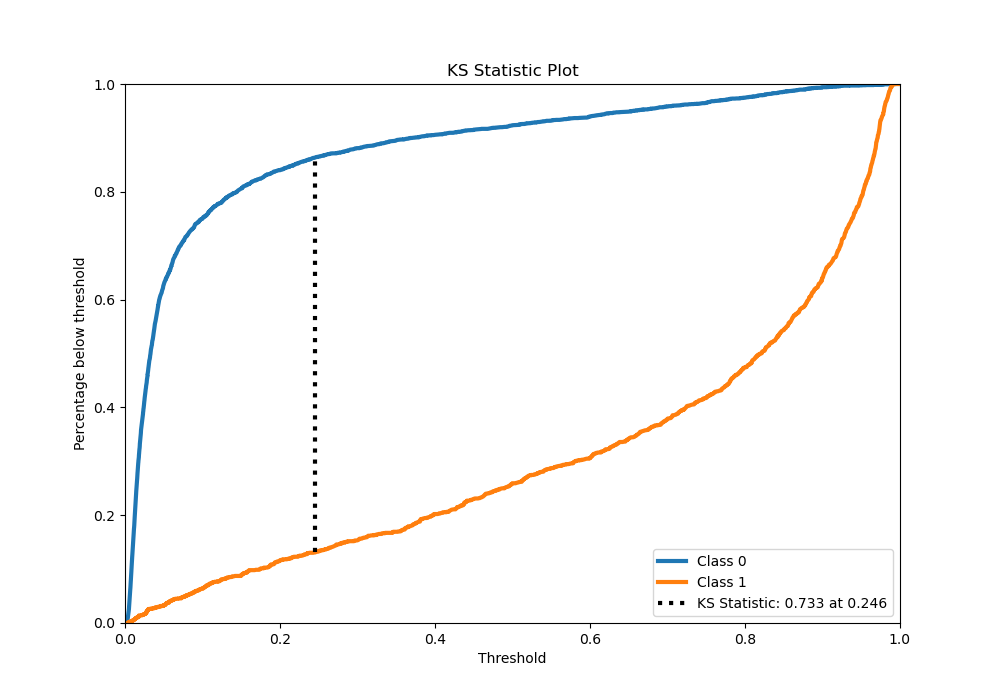
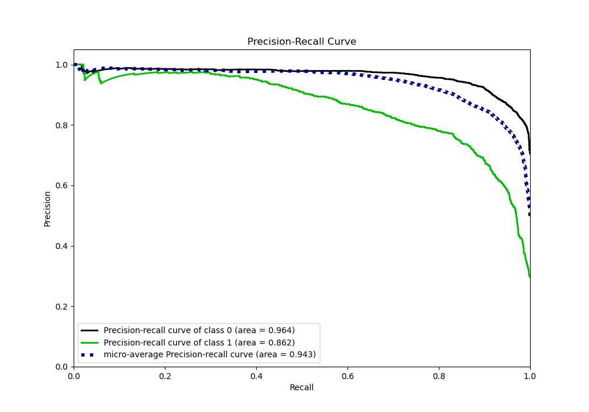
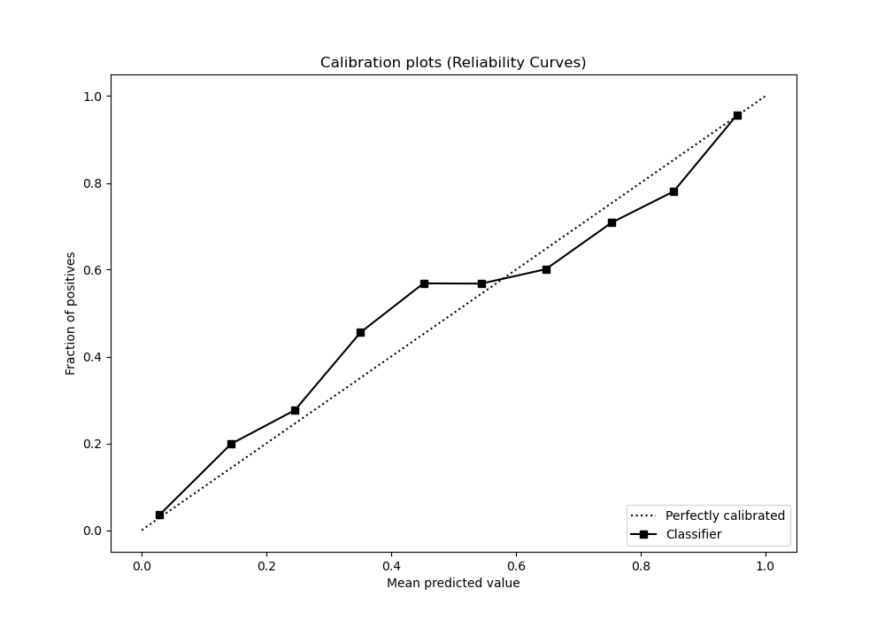
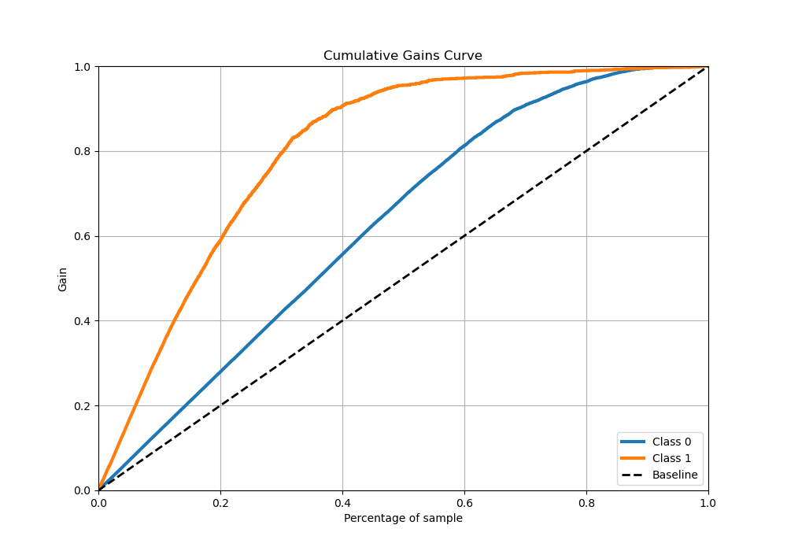
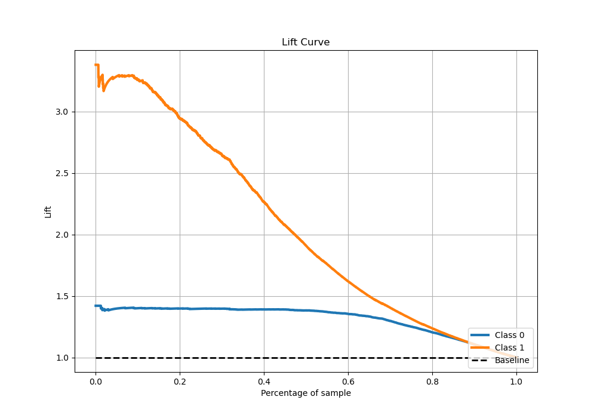

# Summary of 22_LightGBM

[<< Go back](../README.md)

## LightGBM
- **n_jobs**: -1
- **objective**: binary
- **num_leaves**: 63
- **learning_rate**: 0.2
- **feature_fraction**: 1.0
- **bagging_fraction**: 0.9
- **min_data_in_leaf**: 10
- **metric**: binary_logloss
- **custom_eval_metric_name**: None
- **explain_level**: 0

## Validation
 - **validation_type**: kfold
 - **stratify**: True
 - **k_folds**: 5
 - **shuffle**: True
 - **random_seed**: 42

## Optimized metric
logloss

## Training time

24.0 seconds

## Metric details
|           |    score |    threshold |
|:----------|---------:|-------------:|
| logloss   | 0.299881 | nan          |
| auc       | 0.930897 | nan          |
| f1        | 0.796284 |   0.331046   |
| accuracy  | 0.875646 |   0.365335   |
| precision | 0.975904 |   0.978571   |
| recall    | 1        |   0.00170502 |
| mcc       | 0.707551 |   0.365335   |

## Metric details with threshold from accuracy metric
|           |    score |   threshold |
|:----------|---------:|------------:|
| logloss   | 0.299881 |  nan        |
| auc       | 0.930897 |  nan        |
| f1        | 0.796224 |    0.365335 |
| accuracy  | 0.875646 |    0.365335 |
| precision | 0.772584 |    0.365335 |
| recall    | 0.821357 |    0.365335 |
| mcc       | 0.707551 |    0.365335 |

## Confusion matrix (at threshold=0.365335)
|              |   Predicted as 0 |   Predicted as 1 |
|:-------------|-----------------:|-----------------:|
| Labeled as 0 |             3185 |              360 |
| Labeled as 1 |              266 |             1223 |

## Learning curves

## Confusion Matrix

## Normalized Confusion Matrix

## ROC Curve

## Kolmogorov-Smirnov Statistic

## Precision-Recall Curve

## Calibration Curve

## Cumulative Gains Curve

## Lift Curve

[<< Go back](../README.md)
