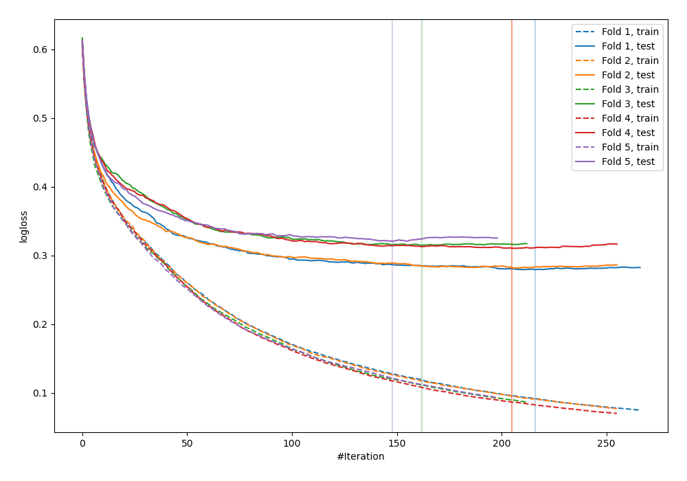
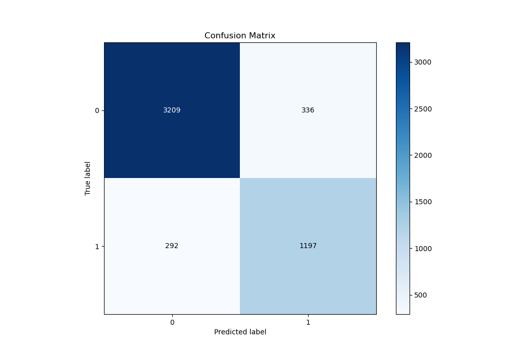
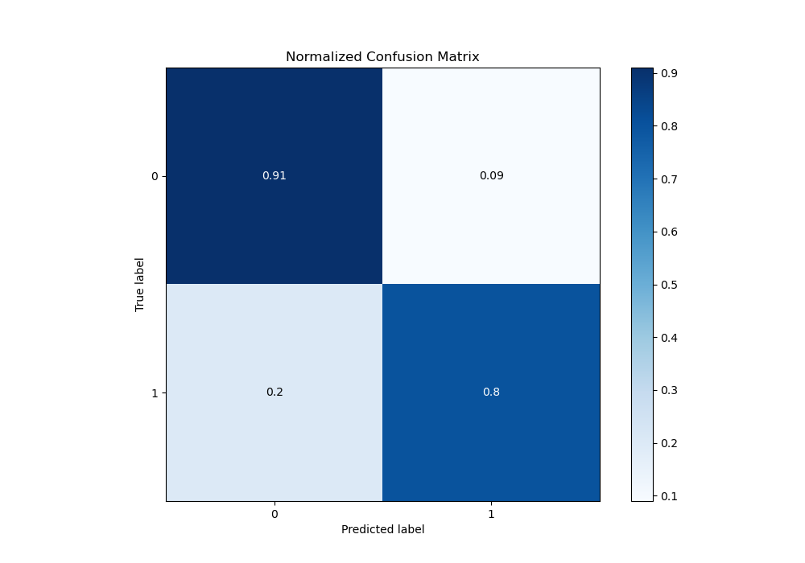
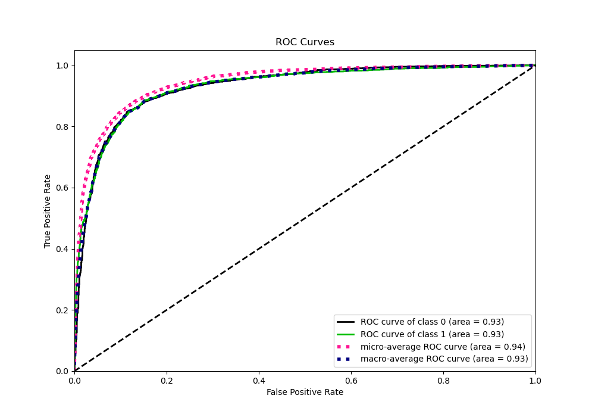
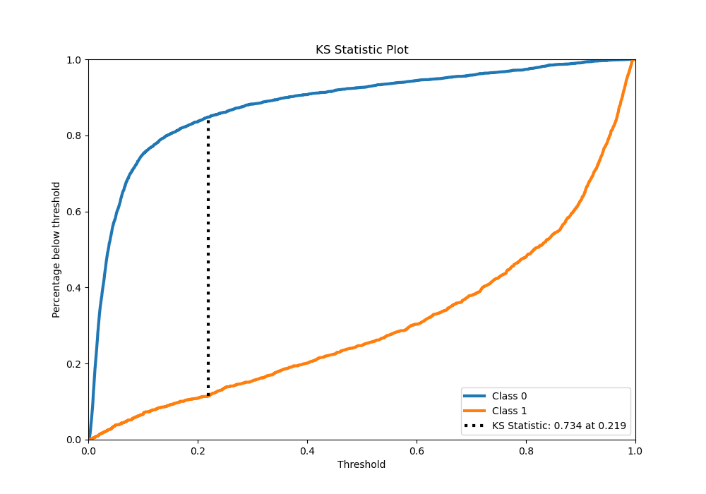
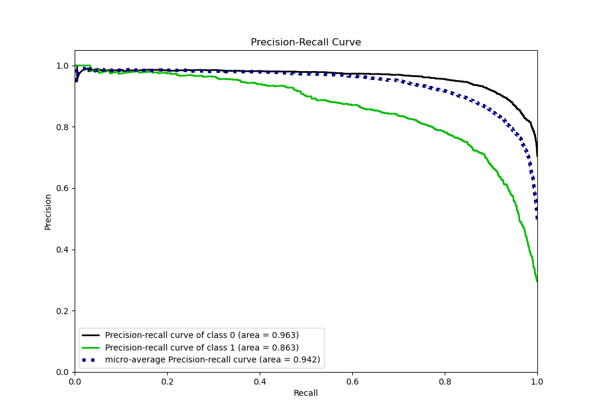
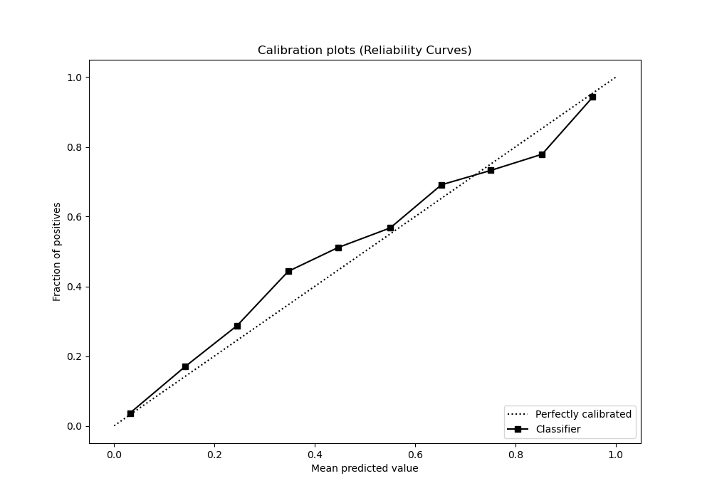
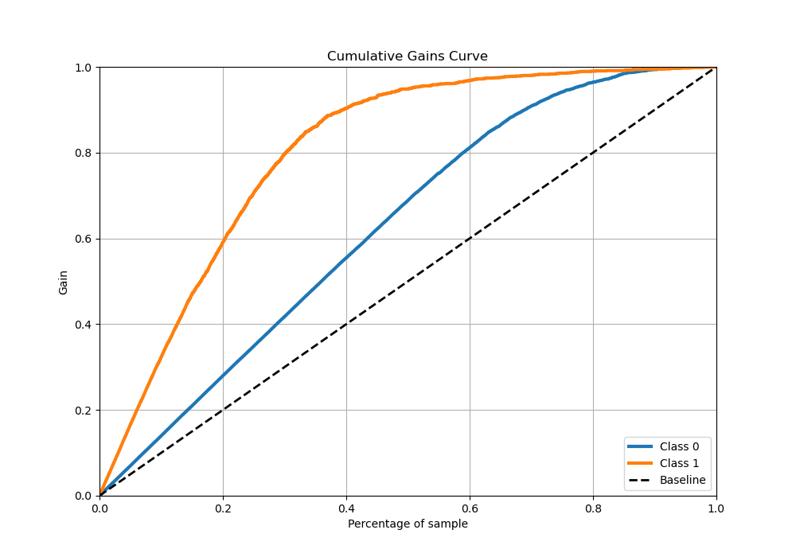
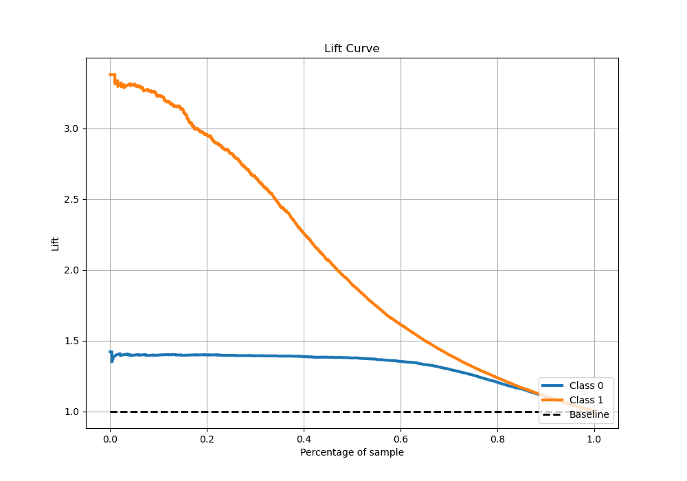

# Summary of 24_CatBoost

[<< Go back](../README.md)

## CatBoost
- **n_jobs**: -1
- **learning_rate**: 0.2
- **depth**: 6
- **rsm**: 0.8
- **loss_function**: Logloss
- **eval_metric**: Logloss
- **explain_level**: 0

## Validation
 - **validation_type**: kfold
 - **stratify**: True
 - **k_folds**: 5
 - **shuffle**: True
 - **random_seed**: 42

## Optimized metric
logloss

## Training time

13.8 seconds

## Metric details
|           |    score |     threshold |
|:----------|---------:|--------------:|
| logloss   | 0.301282 | nan           |
| auc       | 0.929531 | nan           |
| f1        | 0.796343 |   0.295579    |
| accuracy  | 0.875248 |   0.386266    |
| precision | 0.978541 |   0.96615     |
| recall    | 1        |   0.000805643 |
| mcc       | 0.705987 |   0.295579    |

## Metric details with threshold from accuracy metric
|           |    score |   threshold |
|:----------|---------:|------------:|
| logloss   | 0.301282 |  nan        |
| auc       | 0.929531 |  nan        |
| f1        | 0.792191 |    0.386266 |
| accuracy  | 0.875248 |    0.386266 |
| precision | 0.780822 |    0.386266 |
| recall    | 0.803895 |    0.386266 |
| mcc       | 0.703241 |    0.386266 |

## Confusion matrix (at threshold=0.386266)
|              |   Predicted as 0 |   Predicted as 1 |
|:-------------|-----------------:|-----------------:|
| Labeled as 0 |             3209 |              336 |
| Labeled as 1 |              292 |             1197 |

## Learning curves

## Confusion Matrix

## Normalized Confusion Matrix

## ROC Curve

## Kolmogorov-Smirnov Statistic

## Precision-Recall Curve

## Calibration Curve

## Cumulative Gains Curve

## Lift Curve

[<< Go back](../README.md)
