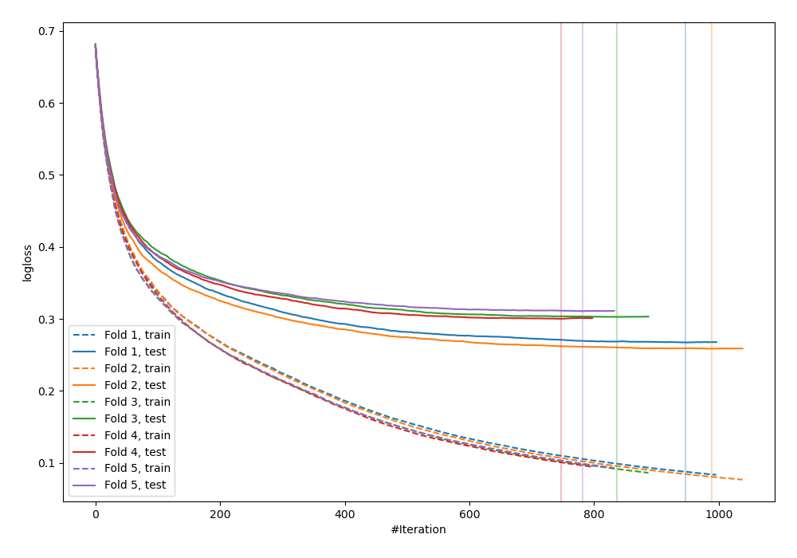
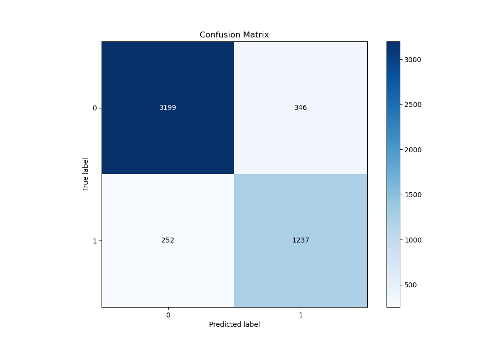
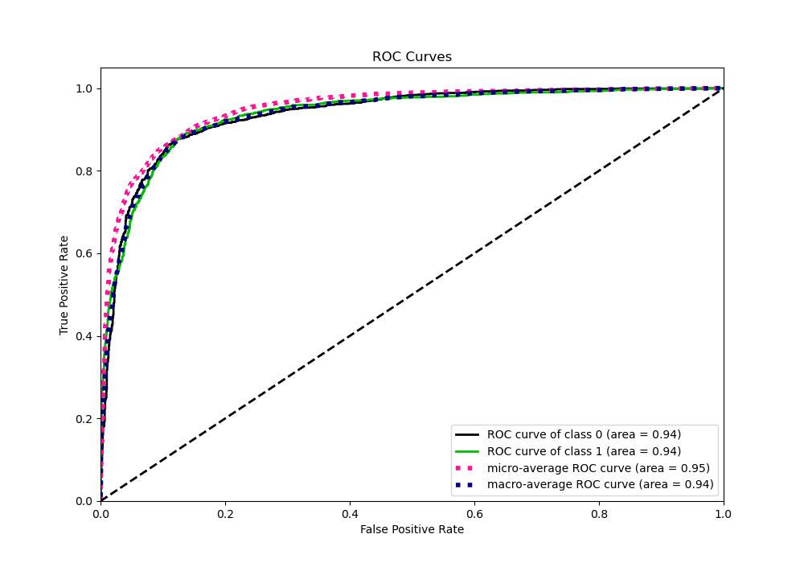
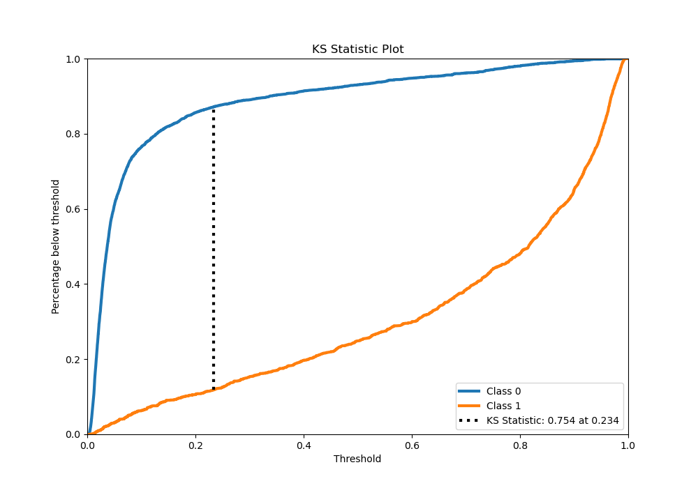
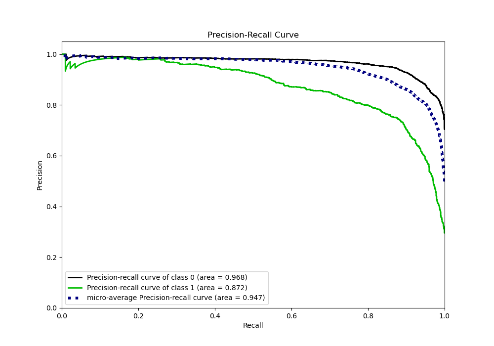
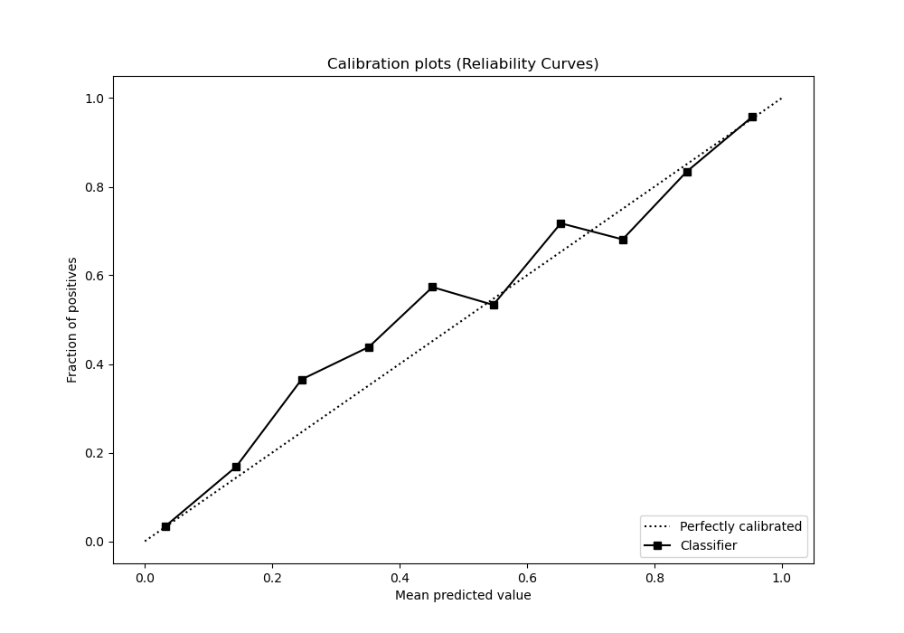
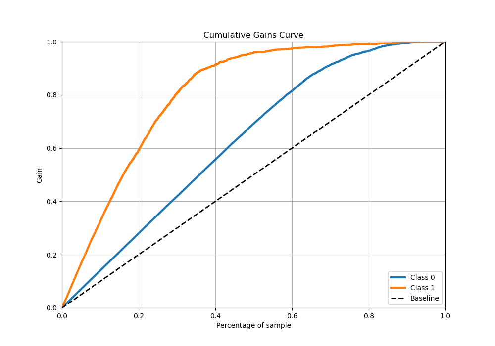
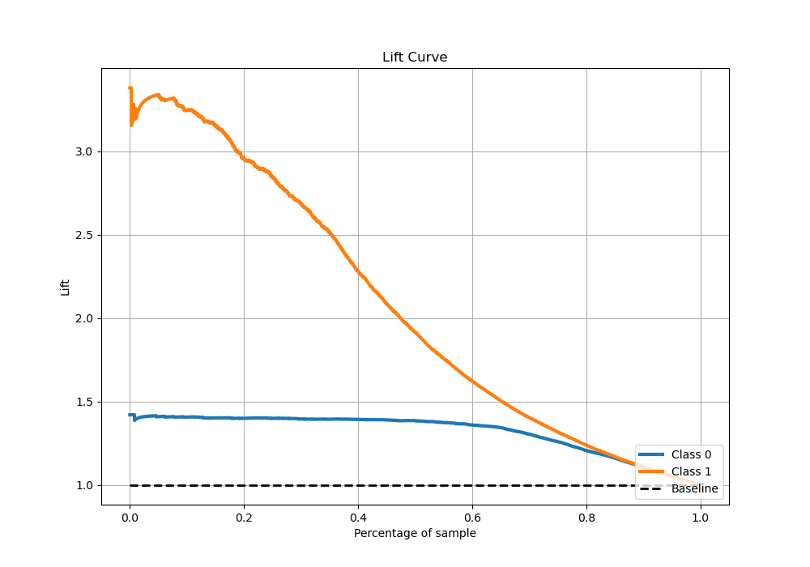

# Summary of 25_CatBoost

[<< Go back](../README.md)

## CatBoost
- **n_jobs**: -1
- **learning_rate**: 0.025
- **depth**: 9
- **rsm**: 0.9
- **loss_function**: Logloss
- **eval_metric**: Logloss
- **explain_level**: 0

## Validation
 - **validation_type**: kfold
 - **stratify**: True
 - **k_folds**: 5
 - **shuffle**: True
 - **random_seed**: 42

## Optimized metric
logloss

## Training time

264.9 seconds

## Metric details
|           |    score |   threshold |
|:----------|---------:|------------:|
| logloss   | 0.287927 |  nan        |
| auc       | 0.936051 |  nan        |
| f1        | 0.806952 |    0.252386 |
| accuracy  | 0.881208 |    0.34843  |
| precision | 0.987124 |    0.95954  |
| recall    | 1        |    0.001978 |
| mcc       | 0.721324 |    0.252386 |

## Metric details with threshold from accuracy metric
|           |    score |   threshold |
|:----------|---------:|------------:|
| logloss   | 0.287927 |   nan       |
| auc       | 0.936051 |   nan       |
| f1        | 0.805339 |     0.34843 |
| accuracy  | 0.881208 |     0.34843 |
| precision | 0.781428 |     0.34843 |
| recall    | 0.830759 |     0.34843 |
| mcc       | 0.720675 |     0.34843 |

## Confusion matrix (at threshold=0.34843)
|              |   Predicted as 0 |   Predicted as 1 |
|:-------------|-----------------:|-----------------:|
| Labeled as 0 |             3199 |              346 |
| Labeled as 1 |              252 |             1237 |

## Learning curves

## Confusion Matrix

## Normalized Confusion Matrix

## ROC Curve

## Kolmogorov-Smirnov Statistic

## Precision-Recall Curve

## Calibration Curve

## Cumulative Gains Curve

## Lift Curve

[<< Go back](../README.md)
