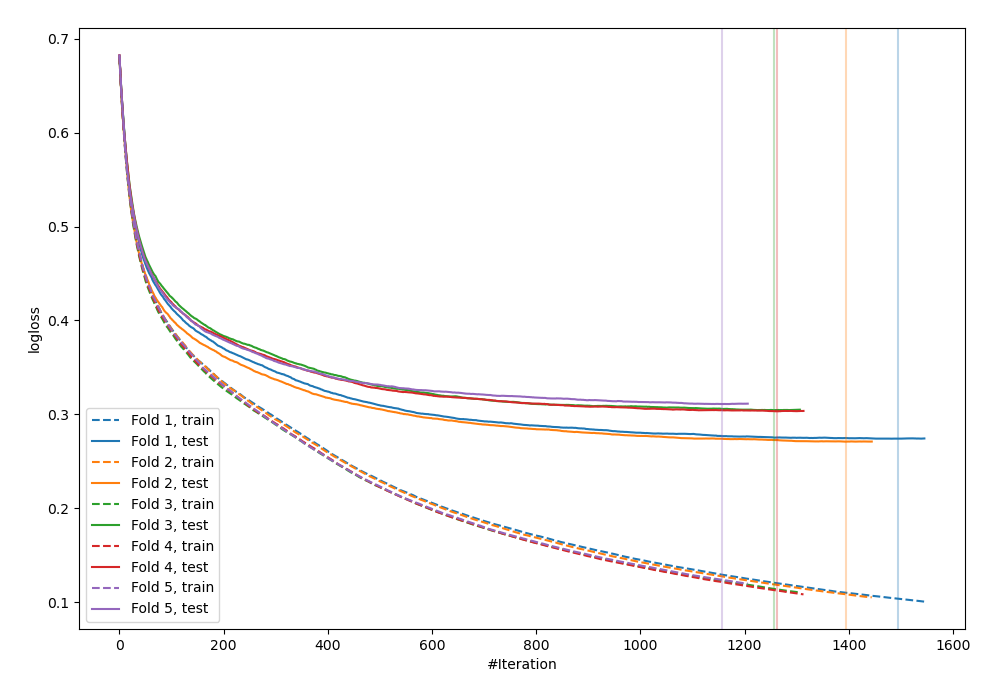
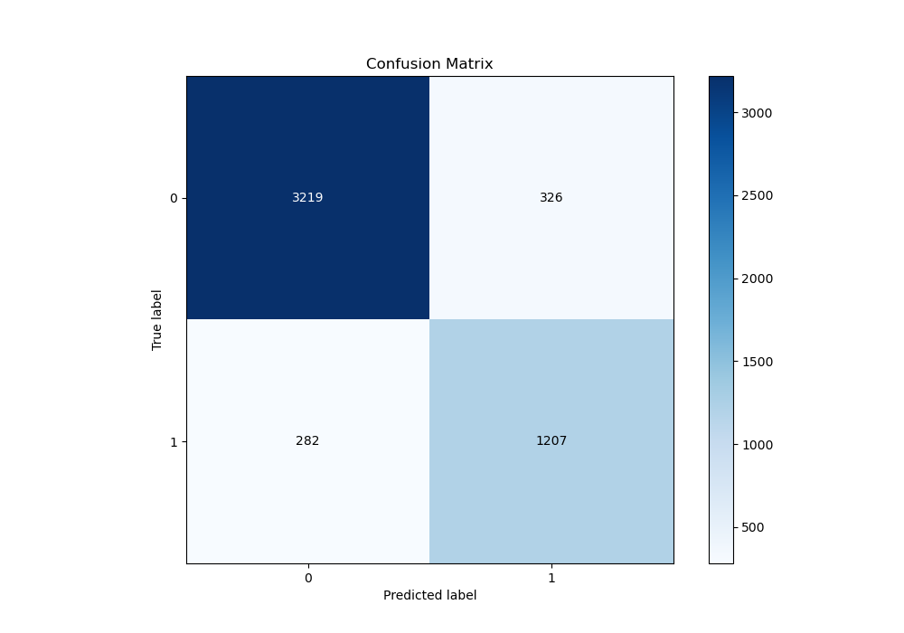
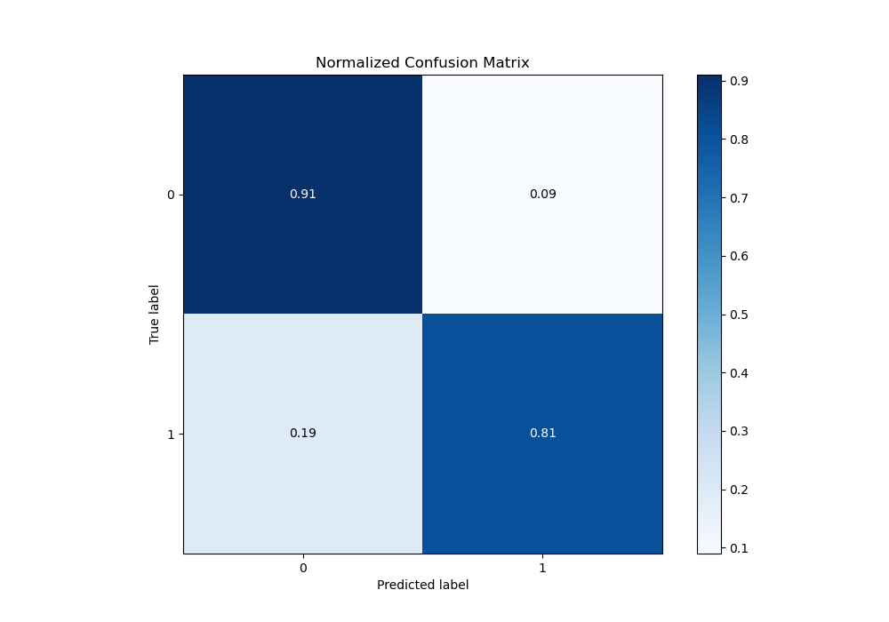
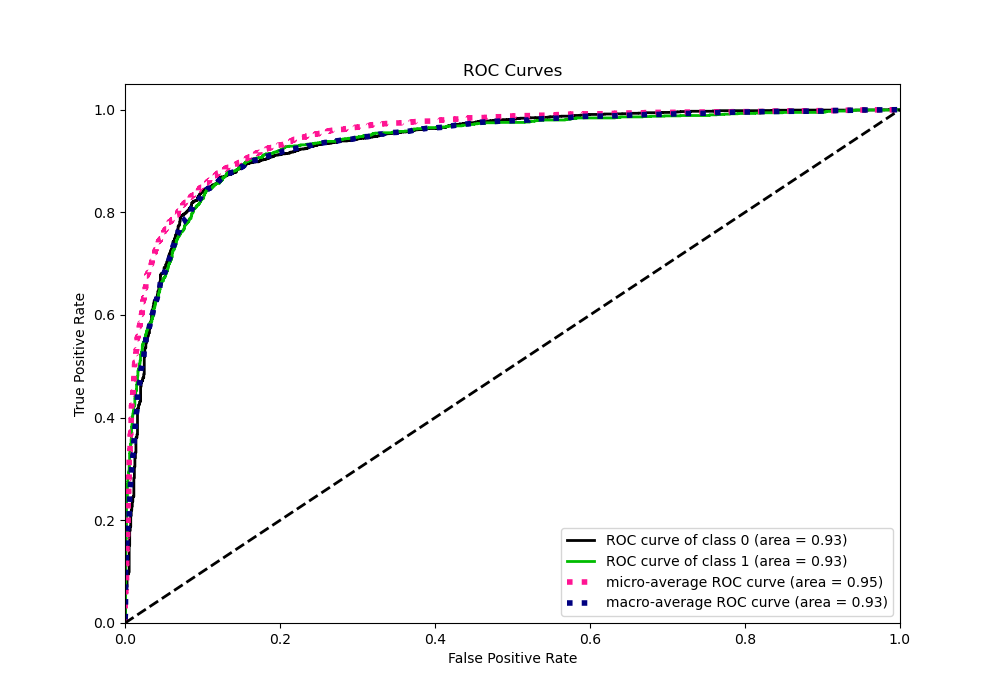
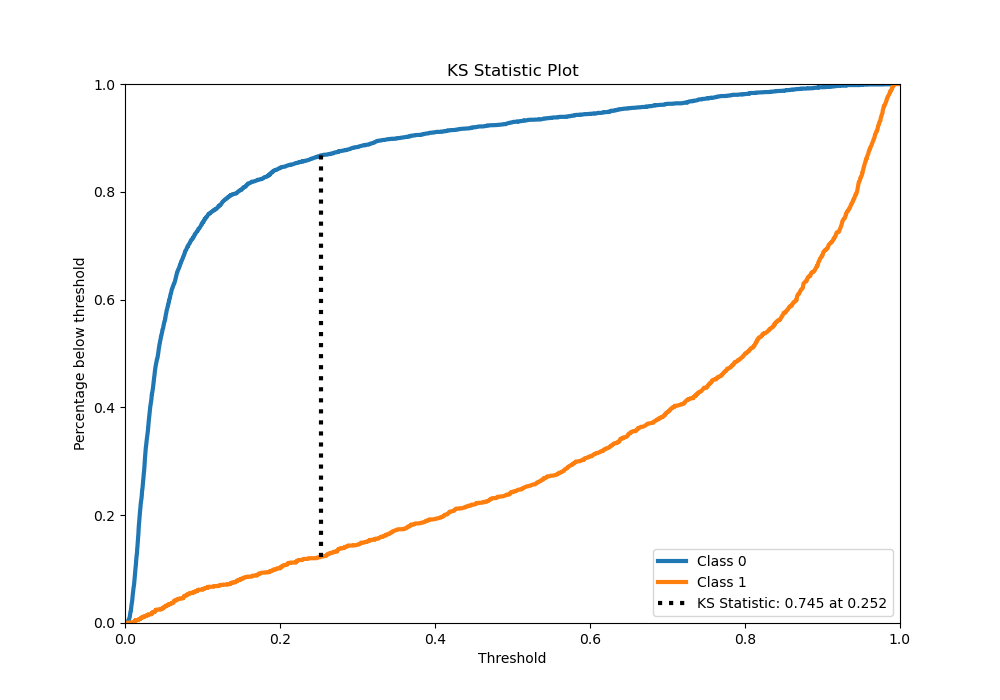
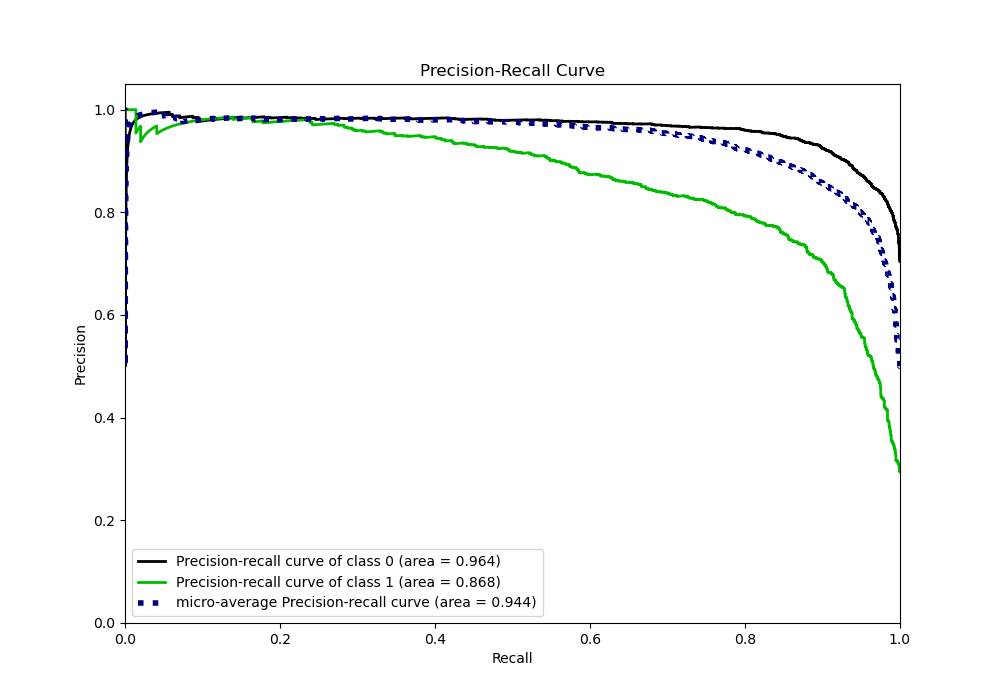
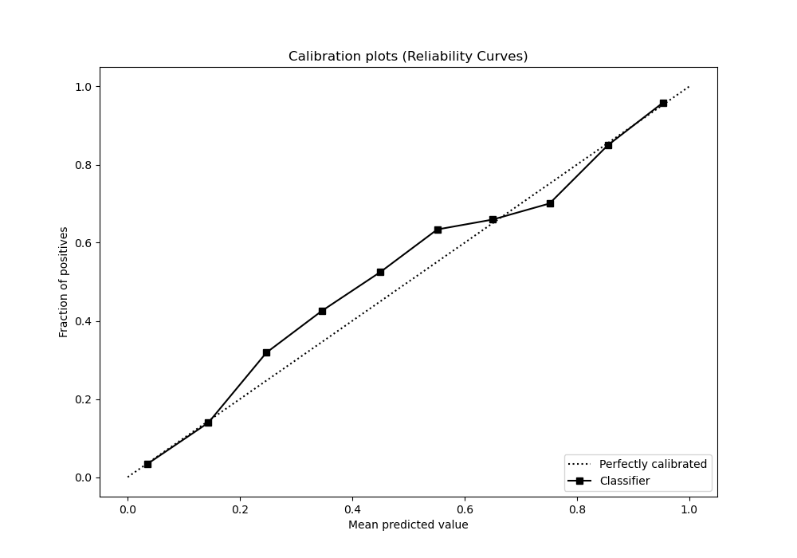
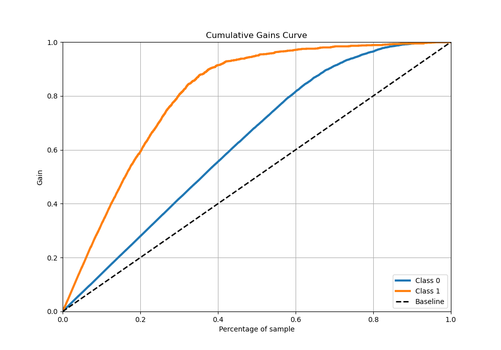
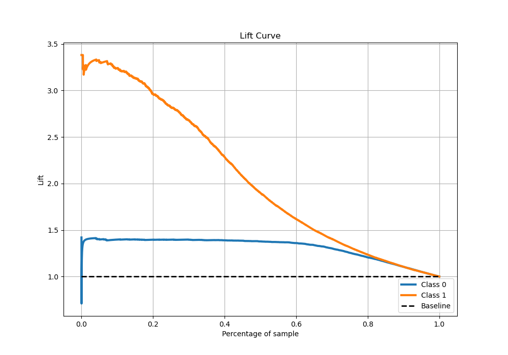

# Summary of 27_CatBoost

[<< Go back](../README.md)

## CatBoost
- **n_jobs**: -1
- **learning_rate**: 0.025
- **depth**: 6
- **rsm**: 0.9
- **loss_function**: Logloss
- **eval_metric**: Logloss
- **explain_level**: 0

## Validation
 - **validation_type**: kfold
 - **stratify**: True
 - **k_folds**: 5
 - **shuffle**: True
 - **random_seed**: 42

## Optimized metric
logloss

## Training time

66.3 seconds

## Metric details
|           |    score |    threshold |
|:----------|---------:|-------------:|
| logloss   | 0.292758 | nan          |
| auc       | 0.932977 | nan          |
| f1        | 0.804612 |   0.324714   |
| accuracy  | 0.879221 |   0.389545   |
| precision | 0.983607 |   0.961061   |
| recall    | 1        |   0.00144338 |
| mcc       | 0.718667 |   0.324714   |

## Metric details with threshold from accuracy metric
|           |    score |   threshold |
|:----------|---------:|------------:|
| logloss   | 0.292758 |  nan        |
| auc       | 0.932977 |  nan        |
| f1        | 0.798809 |    0.389545 |
| accuracy  | 0.879221 |    0.389545 |
| precision | 0.787345 |    0.389545 |
| recall    | 0.810611 |    0.389545 |
| mcc       | 0.712699 |    0.389545 |

## Confusion matrix (at threshold=0.389545)
|              |   Predicted as 0 |   Predicted as 1 |
|:-------------|-----------------:|-----------------:|
| Labeled as 0 |             3219 |              326 |
| Labeled as 1 |              282 |             1207 |

## Learning curves

## Confusion Matrix

## Normalized Confusion Matrix

## ROC Curve

## Kolmogorov-Smirnov Statistic

## Precision-Recall Curve

## Calibration Curve

## Cumulative Gains Curve

## Lift Curve

[<< Go back](../README.md)
