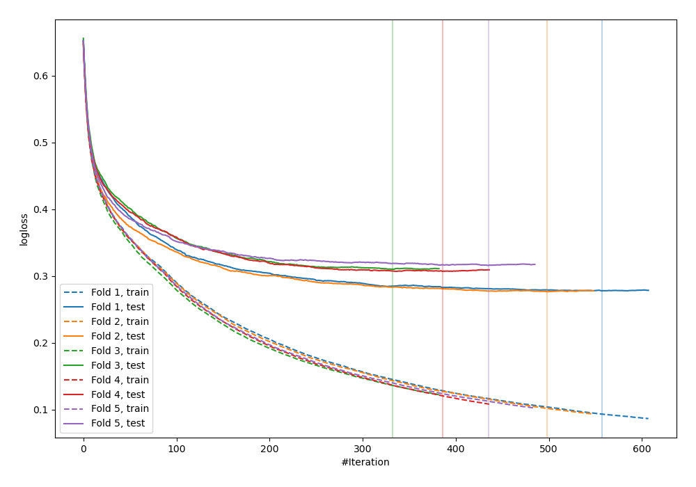
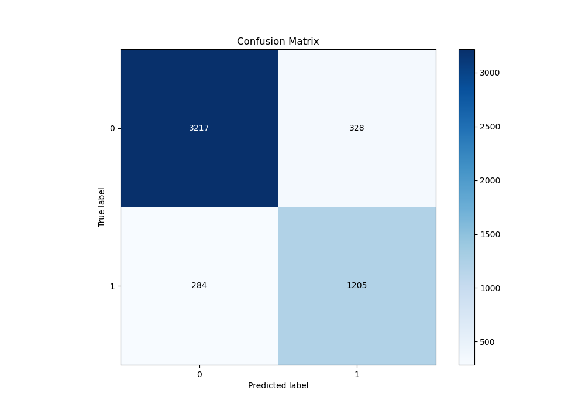
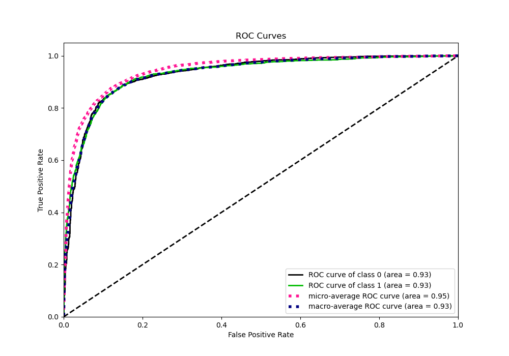
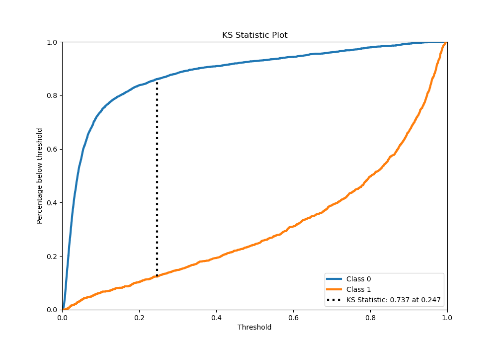
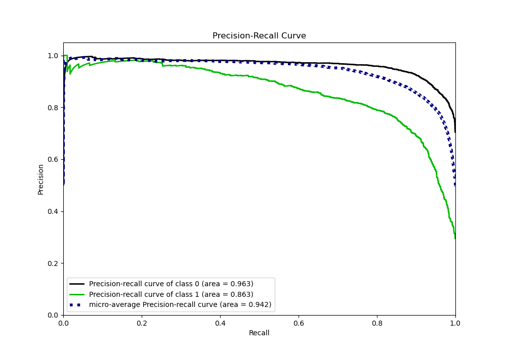
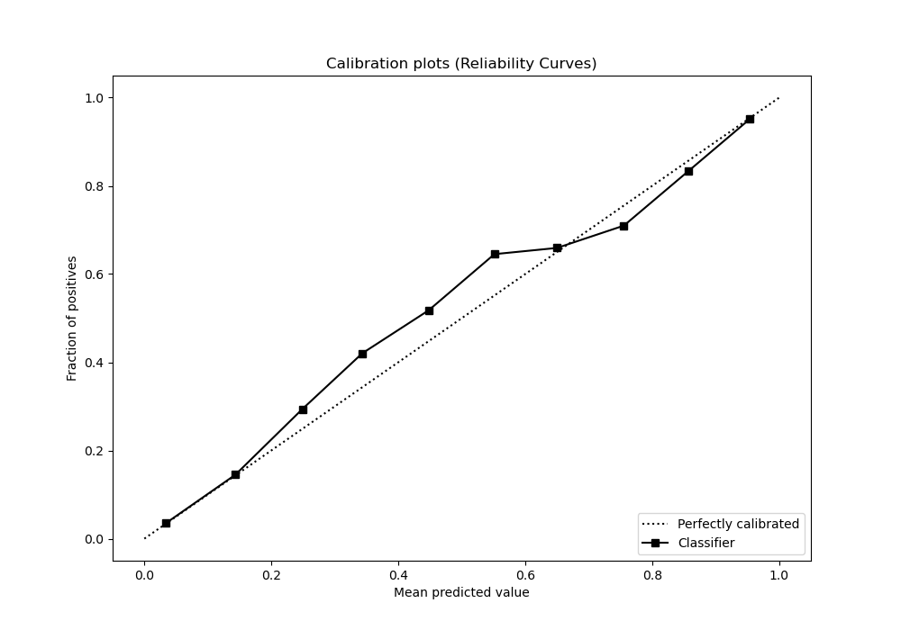
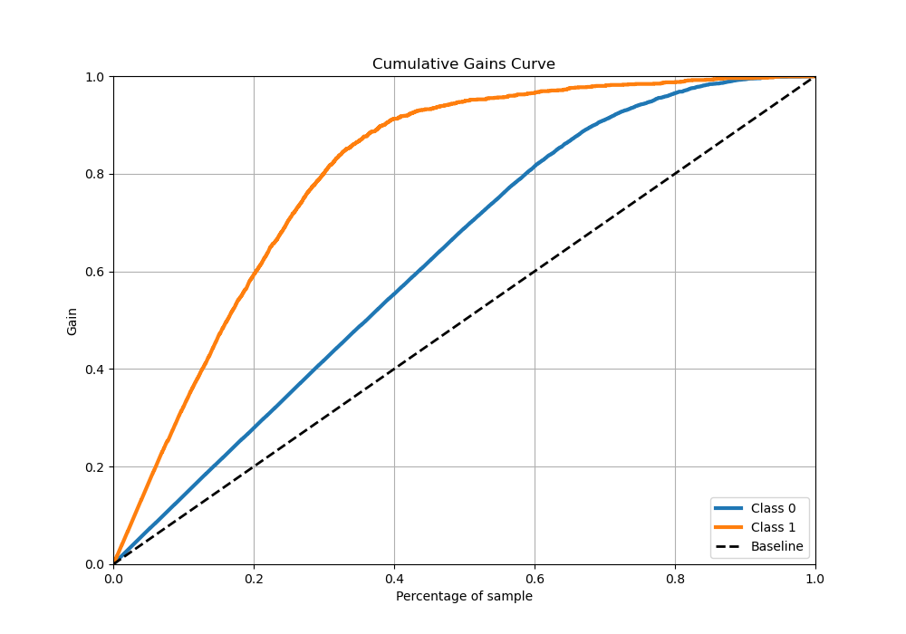
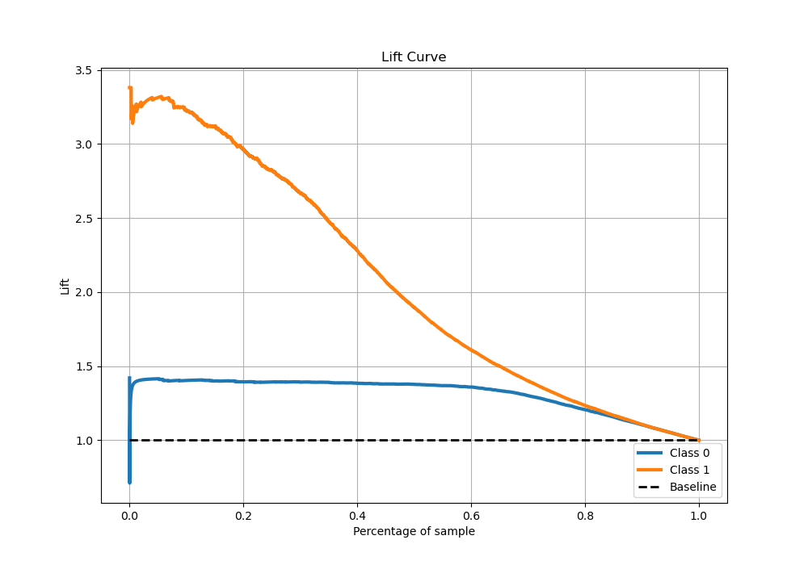

# Summary of 28_CatBoost

[<< Go back](../README.md)

## CatBoost
- **n_jobs**: -1
- **learning_rate**: 0.1
- **depth**: 5
- **rsm**: 0.8
- **loss_function**: Logloss
- **eval_metric**: Logloss
- **explain_level**: 0

## Validation
 - **validation_type**: kfold
 - **stratify**: True
 - **k_folds**: 5
 - **shuffle**: True
 - **random_seed**: 42

## Optimized metric
logloss

## Training time

18.9 seconds

## Metric details
|           |    score |    threshold |
|:----------|---------:|-------------:|
| logloss   | 0.297593 | nan          |
| auc       | 0.930512 | nan          |
| f1        | 0.801409 |   0.32611    |
| accuracy  | 0.878427 |   0.390918   |
| precision | 0.982332 |   0.951367   |
| recall    | 1        |   0.00065061 |
| mcc       | 0.714019 |   0.32611    |

## Metric details with threshold from accuracy metric
|           |    score |   threshold |
|:----------|---------:|------------:|
| logloss   | 0.297593 |  nan        |
| auc       | 0.930512 |  nan        |
| f1        | 0.797485 |    0.390918 |
| accuracy  | 0.878427 |    0.390918 |
| precision | 0.78604  |    0.390918 |
| recall    | 0.809268 |    0.390918 |
| mcc       | 0.710807 |    0.390918 |

## Confusion matrix (at threshold=0.390918)
|              |   Predicted as 0 |   Predicted as 1 |
|:-------------|-----------------:|-----------------:|
| Labeled as 0 |             3217 |              328 |
| Labeled as 1 |              284 |             1205 |

## Learning curves

## Confusion Matrix

## Normalized Confusion Matrix

## ROC Curve

## Kolmogorov-Smirnov Statistic

## Precision-Recall Curve

## Calibration Curve

## Cumulative Gains Curve

## Lift Curve

[<< Go back](../README.md)
