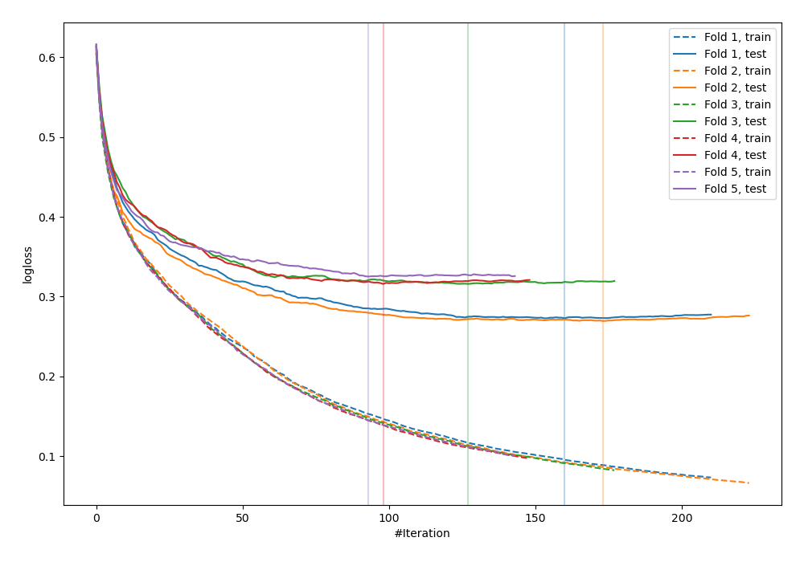
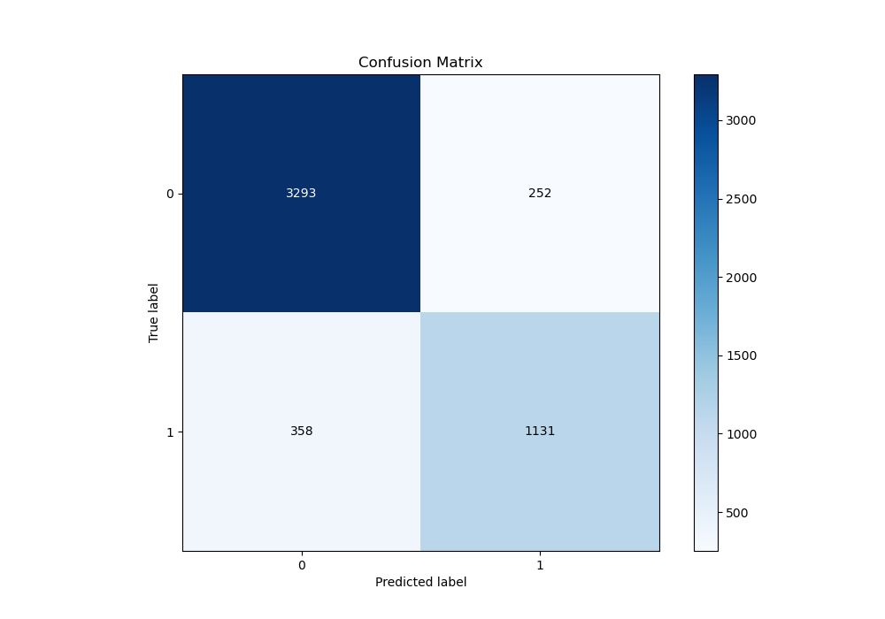
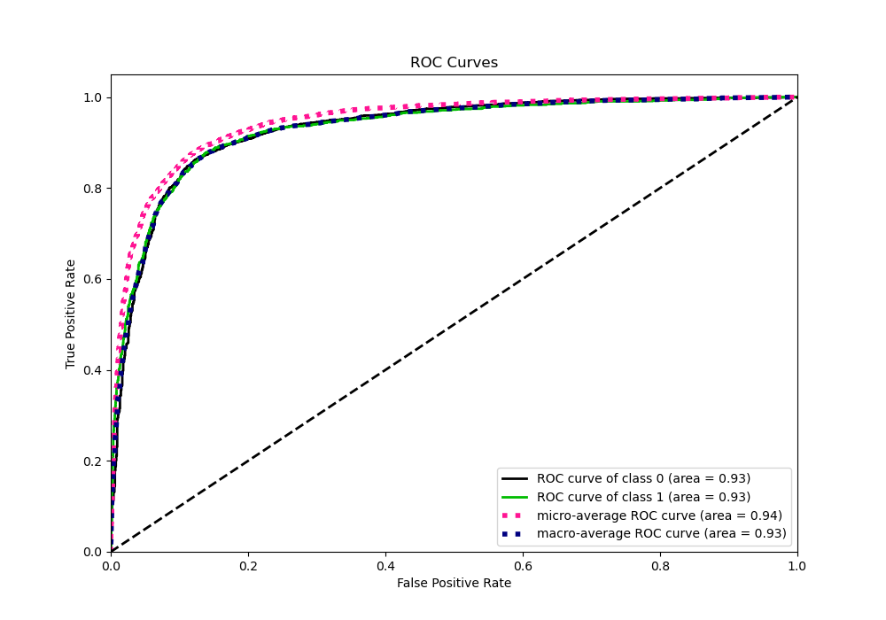
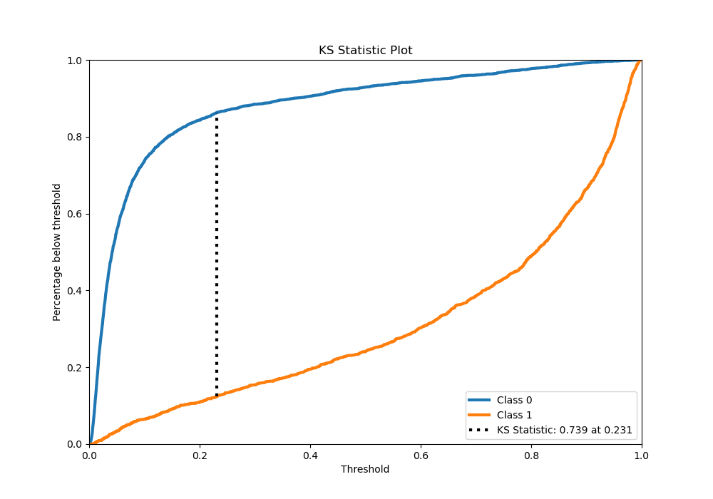
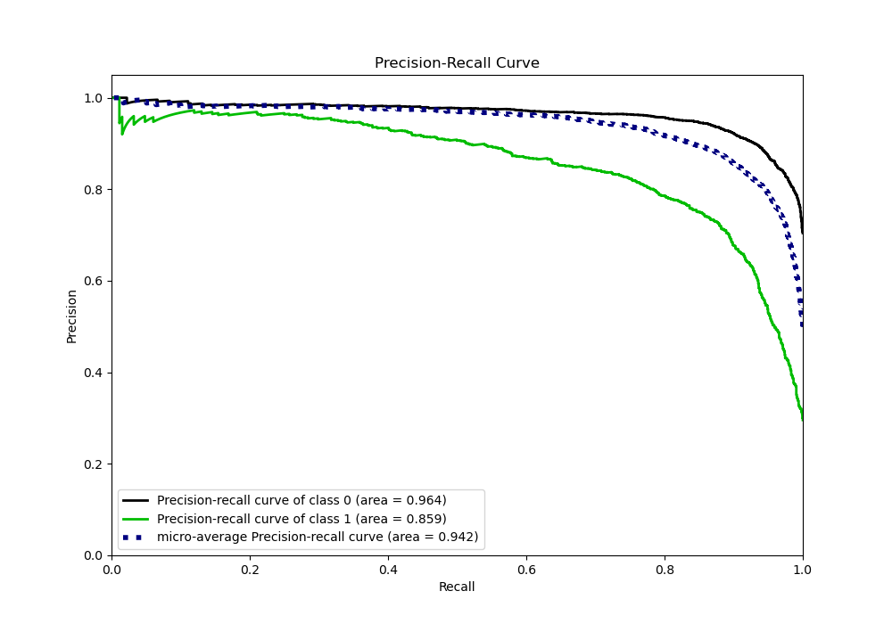
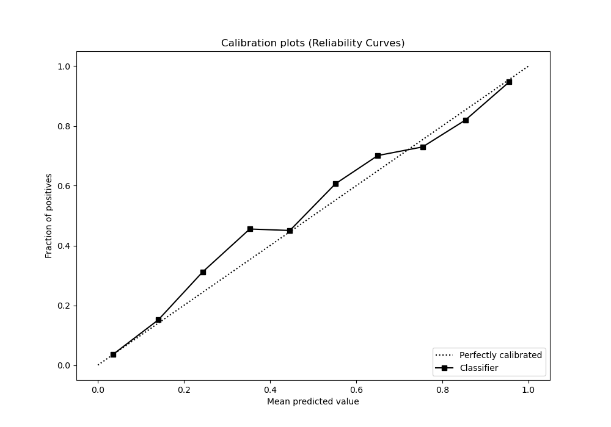
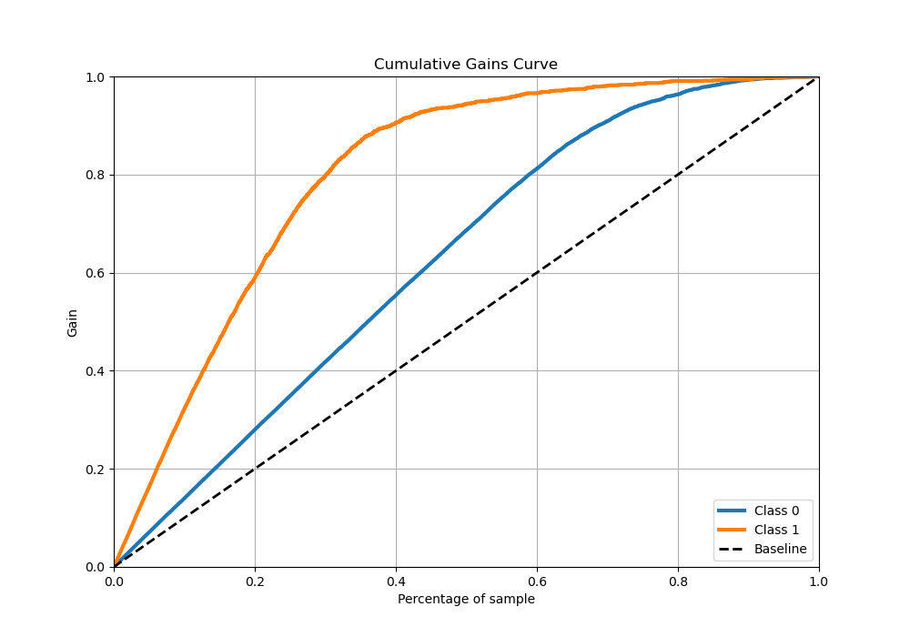
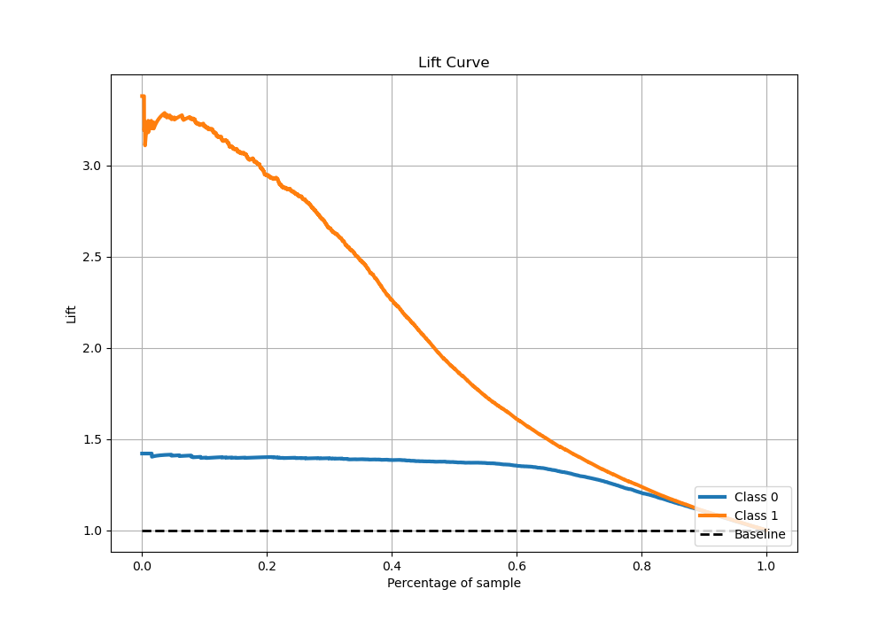

# Summary of 29_CatBoost

[<< Go back](../README.md)

## CatBoost
- **n_jobs**: -1
- **learning_rate**: 0.2
- **depth**: 7
- **rsm**: 1.0
- **loss_function**: Logloss
- **eval_metric**: Logloss
- **explain_level**: 0

## Validation
 - **validation_type**: kfold
 - **stratify**: True
 - **k_folds**: 5
 - **shuffle**: True
 - **random_seed**: 42

## Optimized metric
logloss

## Training time

21.5 seconds

## Metric details
|           |    score |    threshold |
|:----------|---------:|-------------:|
| logloss   | 0.299765 | nan          |
| auc       | 0.929482 | nan          |
| f1        | 0.797566 |   0.331423   |
| accuracy  | 0.878824 |   0.500439   |
| precision | 0.972678 |   0.967204   |
| recall    | 1        |   0.00053934 |
| mcc       | 0.709425 |   0.364853   |

## Metric details with threshold from accuracy metric
|           |    score |   threshold |
|:----------|---------:|------------:|
| logloss   | 0.299765 |  nan        |
| auc       | 0.929482 |  nan        |
| f1        | 0.787604 |    0.500439 |
| accuracy  | 0.878824 |    0.500439 |
| precision | 0.817787 |    0.500439 |
| recall    | 0.75957  |    0.500439 |
| mcc       | 0.703935 |    0.500439 |

## Confusion matrix (at threshold=0.500439)
|              |   Predicted as 0 |   Predicted as 1 |
|:-------------|-----------------:|-----------------:|
| Labeled as 0 |             3293 |              252 |
| Labeled as 1 |              358 |             1131 |

## Learning curves

## Confusion Matrix

## Normalized Confusion Matrix

## ROC Curve

## Kolmogorov-Smirnov Statistic

## Precision-Recall Curve

## Calibration Curve

## Cumulative Gains Curve

## Lift Curve

[<< Go back](../README.md)
