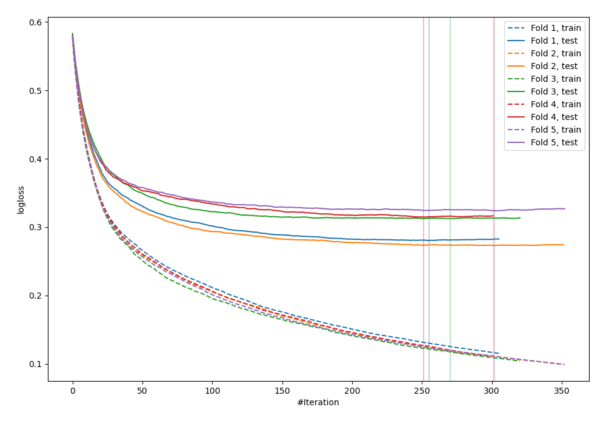
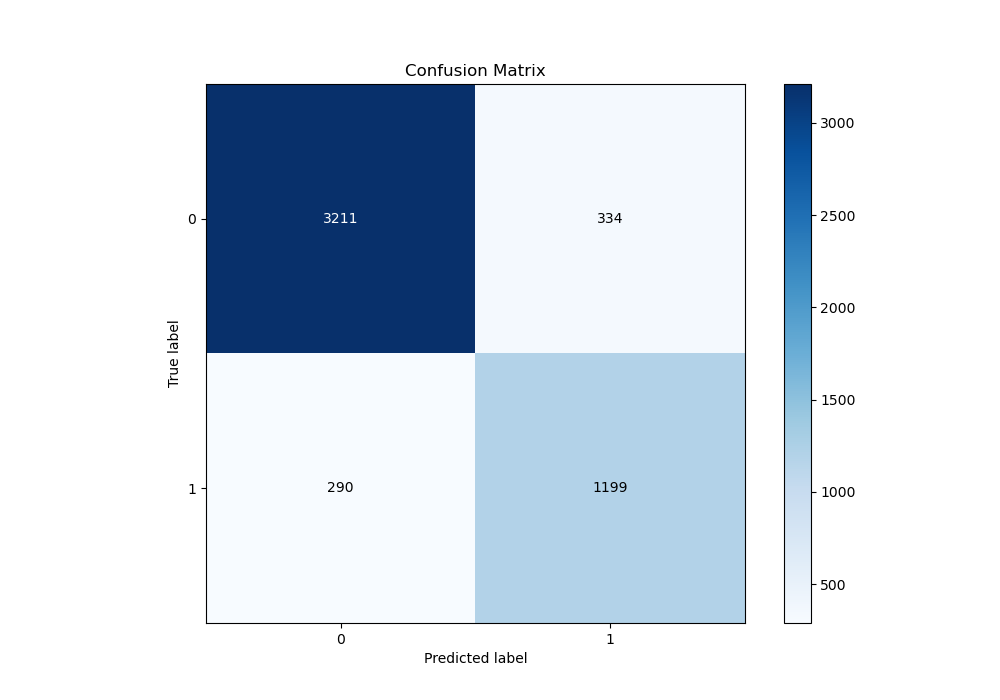
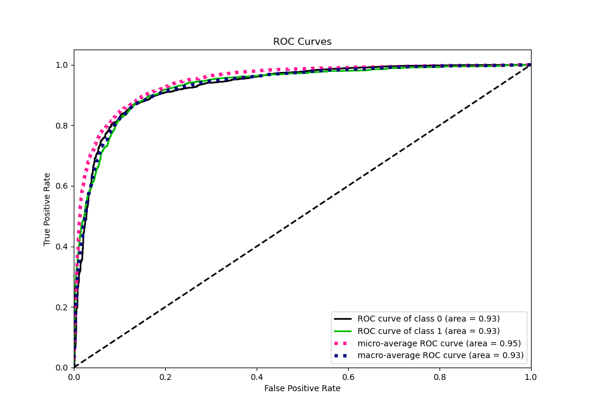
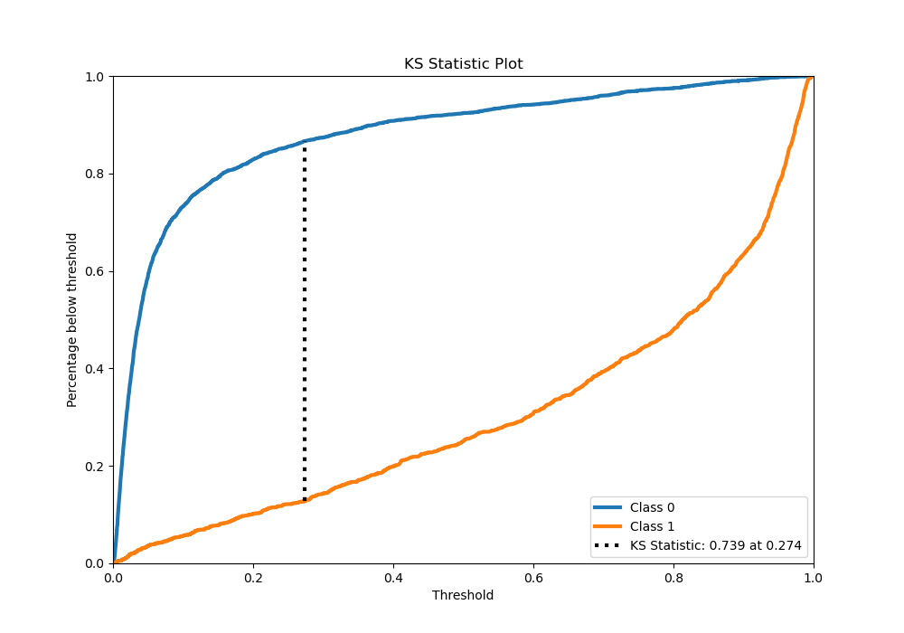
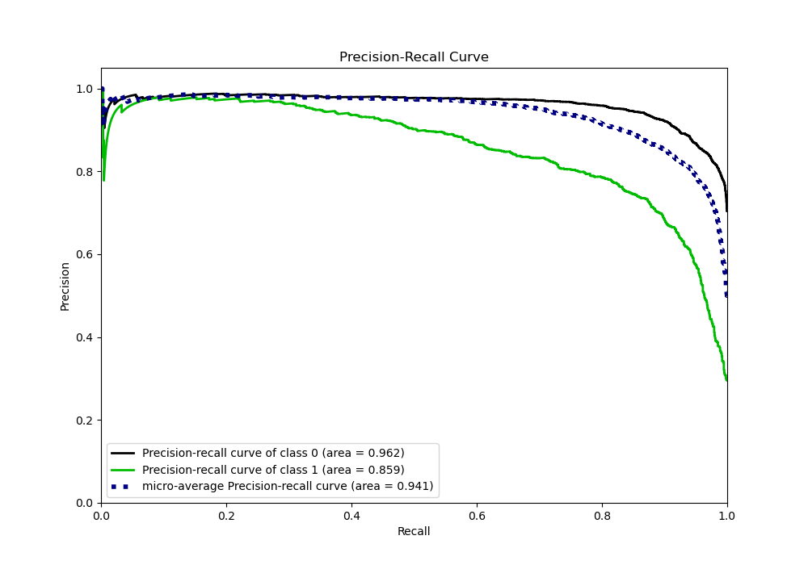
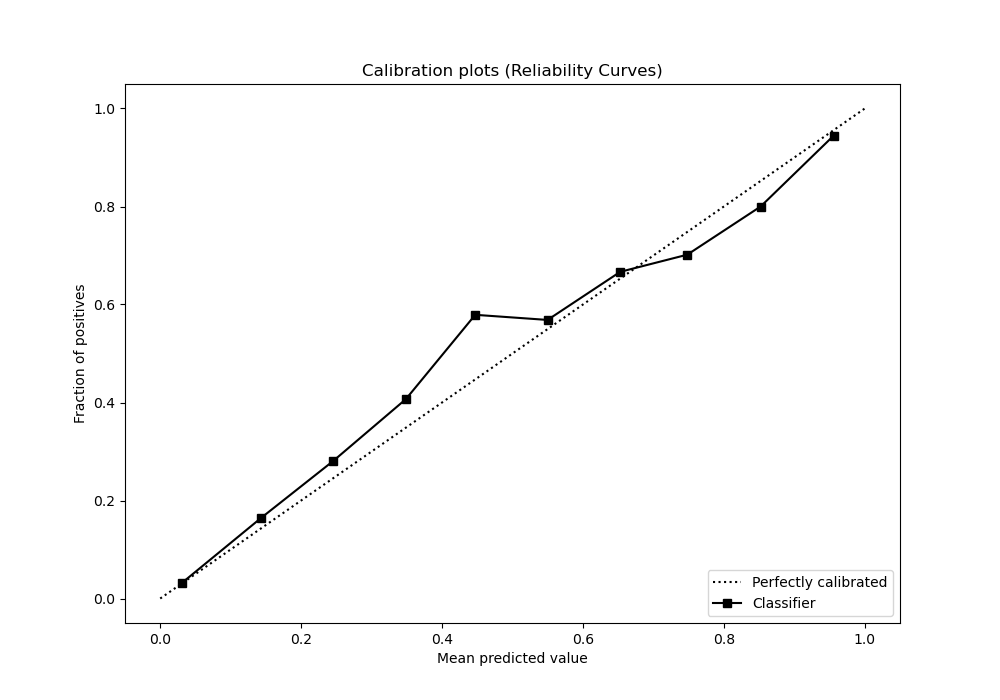
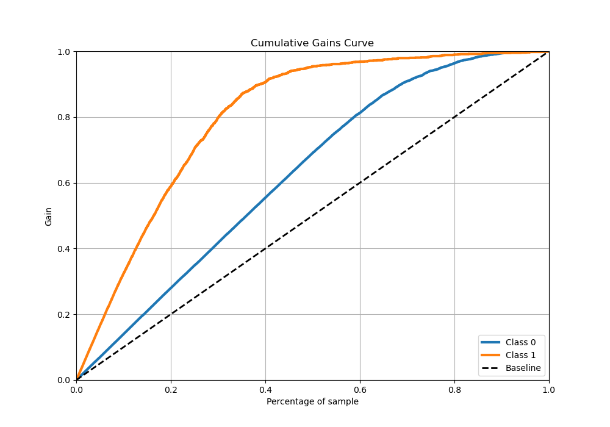
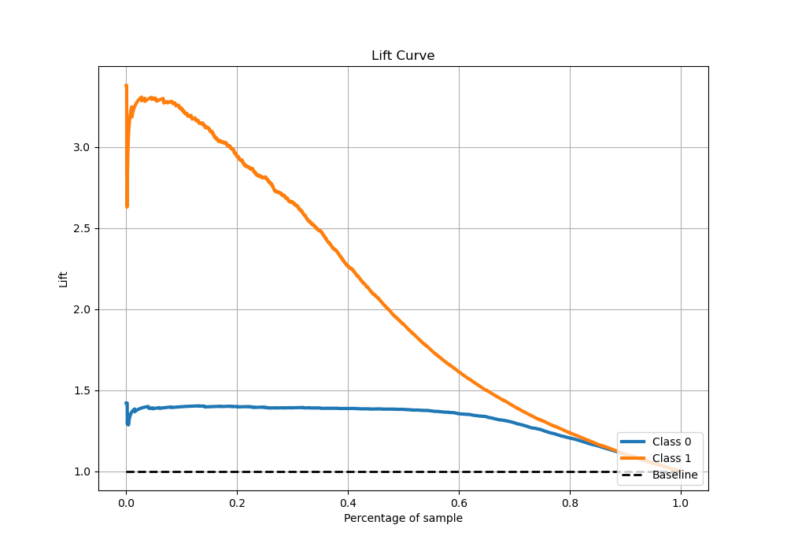

# Summary of 2_Default_Xgboost

[<< Go back](../README.md)

## Extreme Gradient Boosting (Xgboost)
- **n_jobs**: -1
- **objective**: binary:logistic
- **eta**: 0.075
- **max_depth**: 6
- **min_child_weight**: 1
- **subsample**: 1.0
- **colsample_bytree**: 1.0
- **eval_metric**: logloss
- **explain_level**: 0

## Validation
 - **validation_type**: kfold
 - **stratify**: True
 - **k_folds**: 5
 - **shuffle**: True
 - **random_seed**: 42

## Optimized metric
logloss

## Training time

16.0 seconds

## Metric details
|           |    score |     threshold |
|:----------|---------:|--------------:|
| logloss   | 0.300857 | nan           |
| auc       | 0.929907 | nan           |
| f1        | 0.796224 |   0.366343    |
| accuracy  | 0.876043 |   0.391996    |
| precision | 0.977444 |   0.977852    |
| recall    | 1        |   0.000441627 |
| mcc       | 0.707551 |   0.366343    |

## Metric details with threshold from accuracy metric
|           |    score |   threshold |
|:----------|---------:|------------:|
| logloss   | 0.300857 |  nan        |
| auc       | 0.929907 |  nan        |
| f1        | 0.793514 |    0.391996 |
| accuracy  | 0.876043 |    0.391996 |
| precision | 0.782127 |    0.391996 |
| recall    | 0.805238 |    0.391996 |
| mcc       | 0.705133 |    0.391996 |

## Confusion matrix (at threshold=0.391996)
|              |   Predicted as 0 |   Predicted as 1 |
|:-------------|-----------------:|-----------------:|
| Labeled as 0 |             3211 |              334 |
| Labeled as 1 |              290 |             1199 |

## Learning curves

## Confusion Matrix

## Normalized Confusion Matrix

## ROC Curve

## Kolmogorov-Smirnov Statistic

## Precision-Recall Curve

## Calibration Curve

## Cumulative Gains Curve

## Lift Curve

[<< Go back](../README.md)
