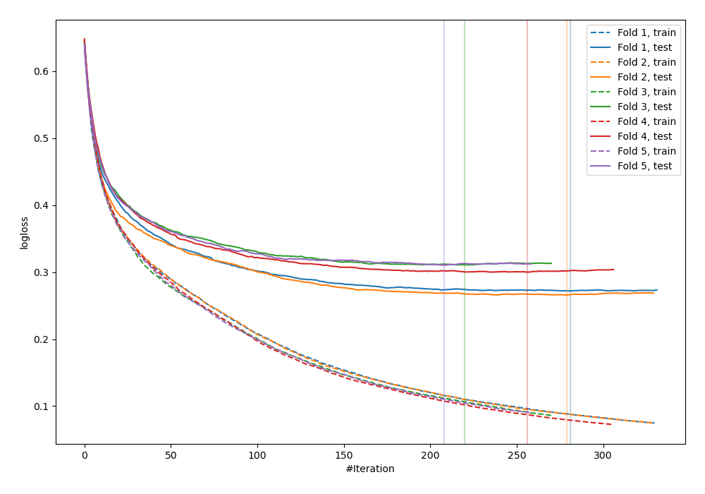
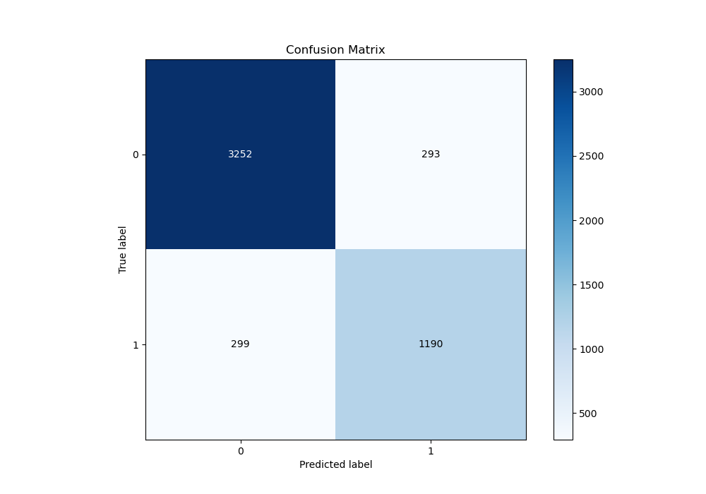
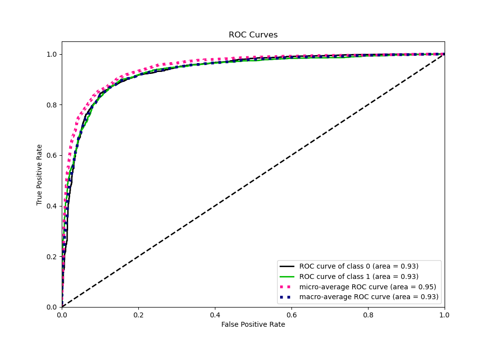
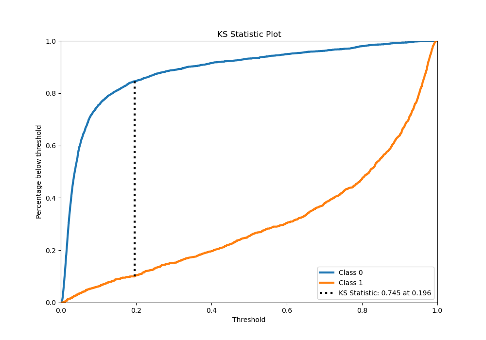
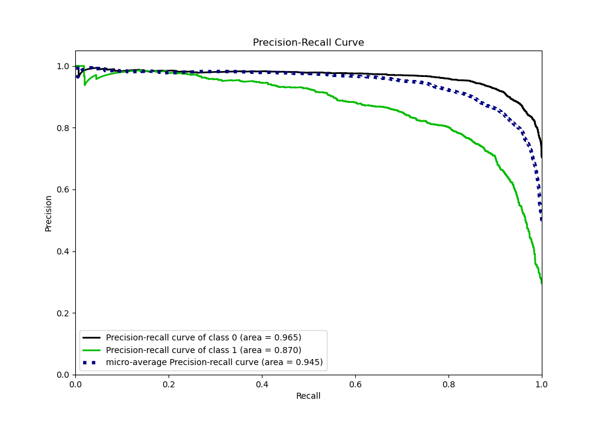
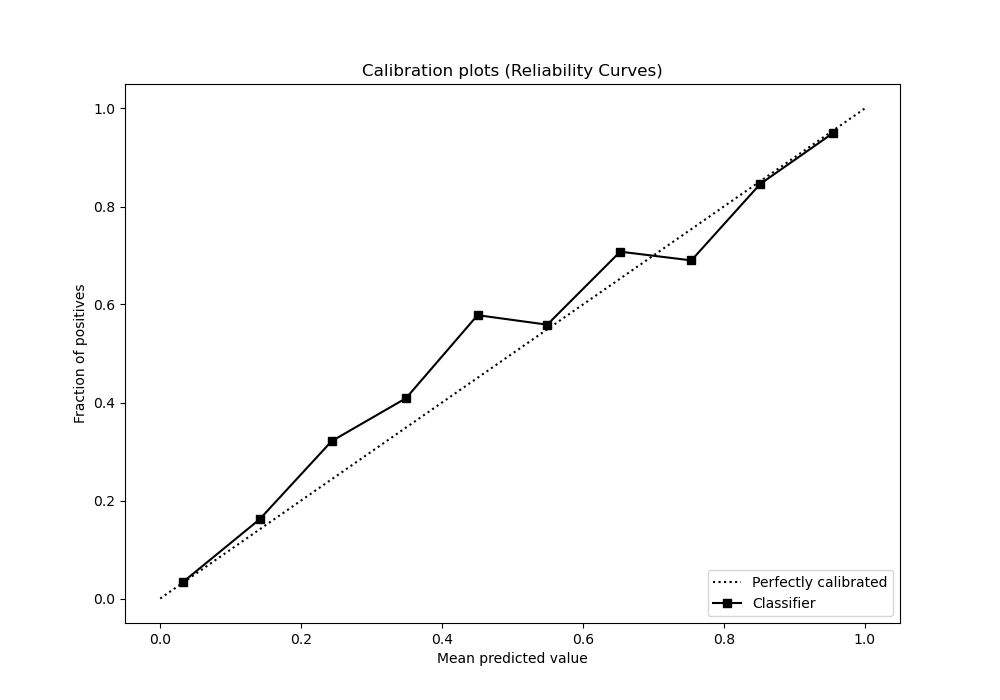
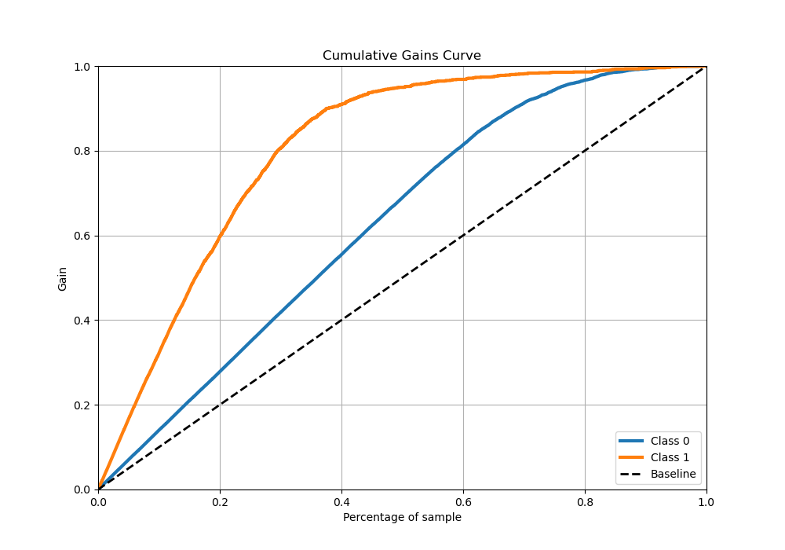
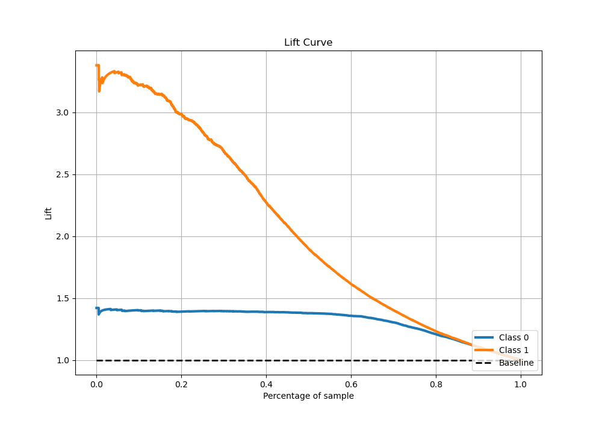

# Summary of 30_CatBoost

[<< Go back](../README.md)

## CatBoost
- **n_jobs**: -1
- **learning_rate**: 0.1
- **depth**: 8
- **rsm**: 1.0
- **loss_function**: Logloss
- **eval_metric**: Logloss
- **explain_level**: 0

## Validation
 - **validation_type**: kfold
 - **stratify**: True
 - **k_folds**: 5
 - **shuffle**: True
 - **random_seed**: 42

## Optimized metric
logloss

## Training time

47.1 seconds

## Metric details
|           |    score |    threshold |
|:----------|---------:|-------------:|
| logloss   | 0.291867 | nan          |
| auc       | 0.933278 | nan          |
| f1        | 0.802734 |   0.342997   |
| accuracy  | 0.8824   |   0.40741    |
| precision | 0.983607 |   0.968952   |
| recall    | 1        |   0.00101397 |
| mcc       | 0.717384 |   0.40741    |

## Metric details with threshold from accuracy metric
|           |    score |   threshold |
|:----------|---------:|------------:|
| logloss   | 0.291867 |   nan       |
| auc       | 0.933278 |   nan       |
| f1        | 0.800808 |     0.40741 |
| accuracy  | 0.8824   |     0.40741 |
| precision | 0.802428 |     0.40741 |
| recall    | 0.799194 |     0.40741 |
| mcc       | 0.717384 |     0.40741 |

## Confusion matrix (at threshold=0.40741)
|              |   Predicted as 0 |   Predicted as 1 |
|:-------------|-----------------:|-----------------:|
| Labeled as 0 |             3252 |              293 |
| Labeled as 1 |              299 |             1190 |

## Learning curves

## Confusion Matrix

## Normalized Confusion Matrix

## ROC Curve

## Kolmogorov-Smirnov Statistic

## Precision-Recall Curve

## Calibration Curve

## Cumulative Gains Curve

## Lift Curve

[<< Go back](../README.md)
