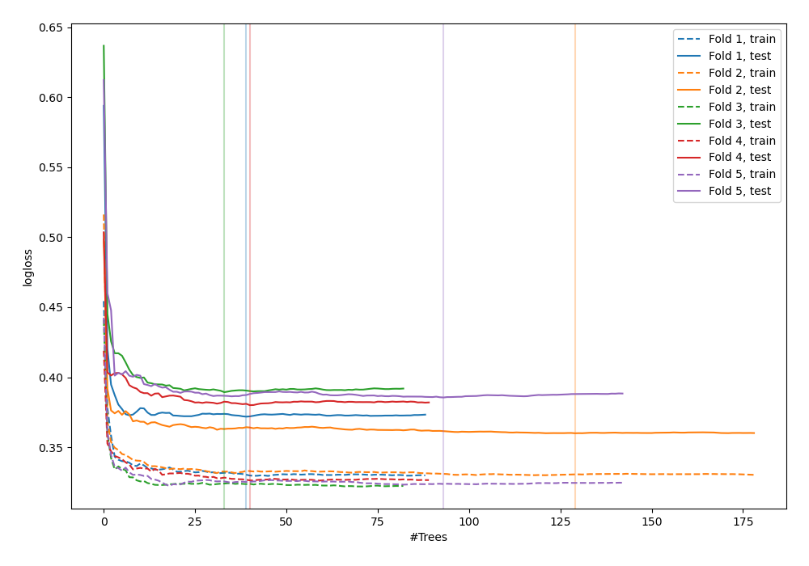
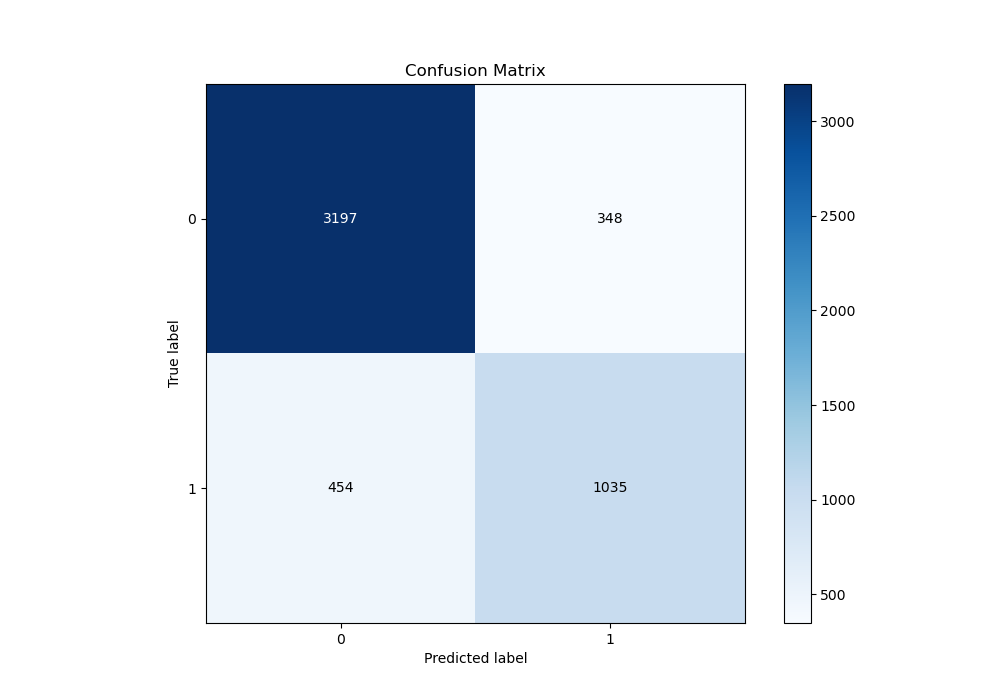
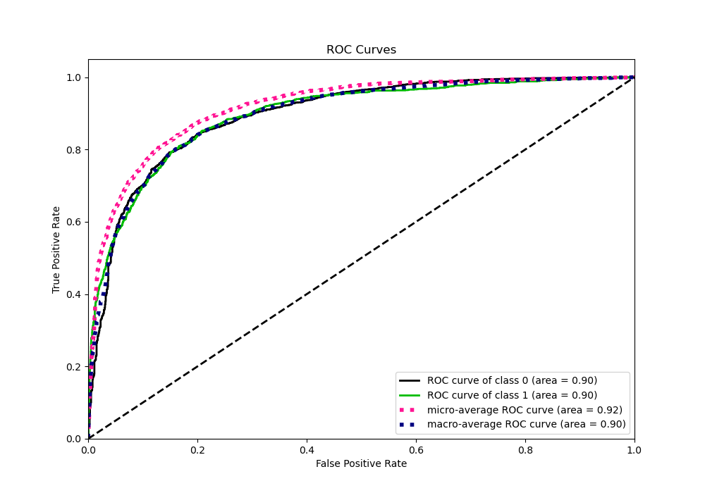
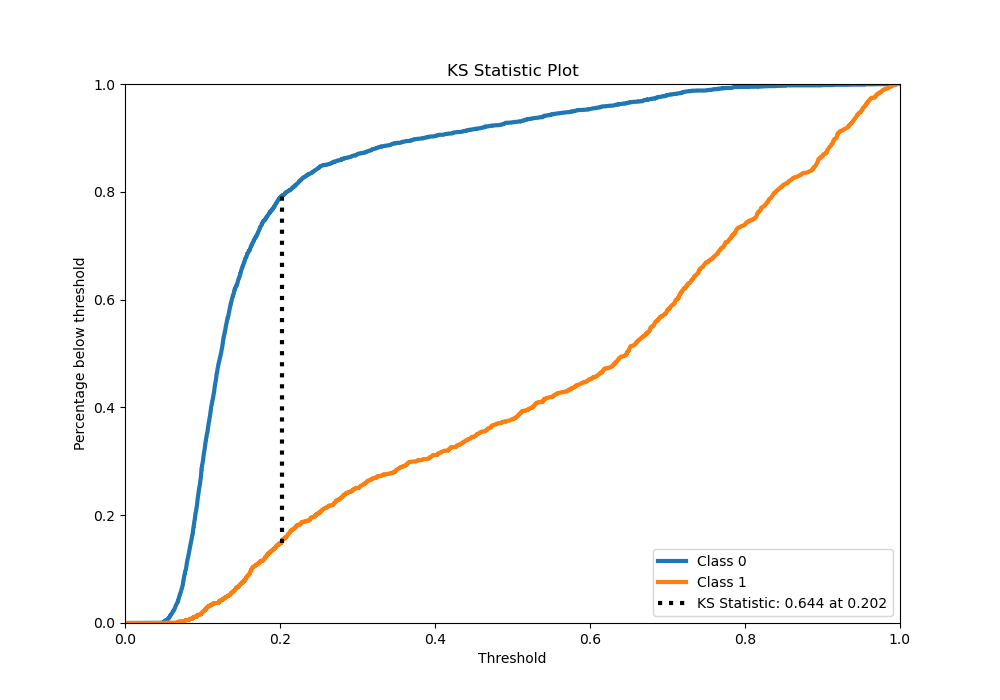
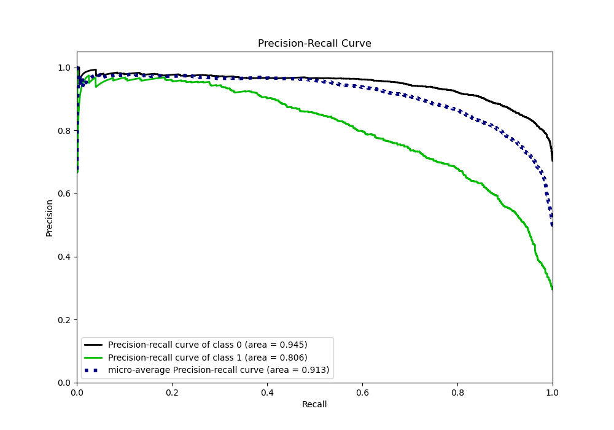
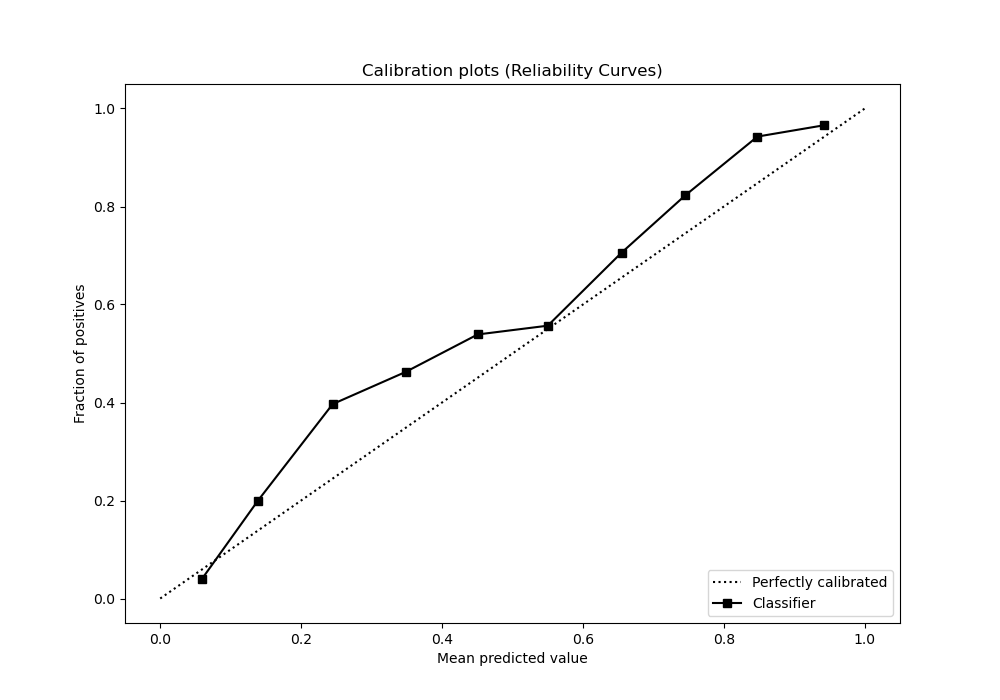
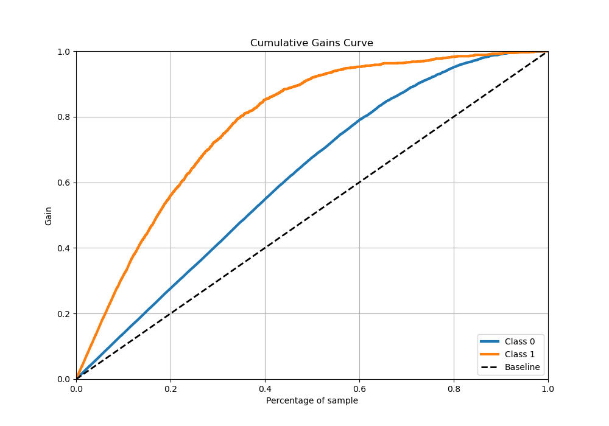
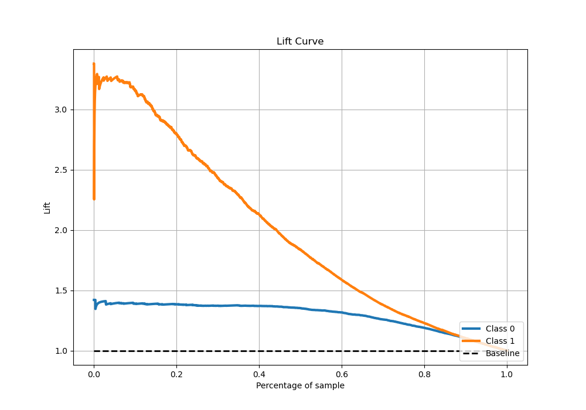

# Summary of 32_RandomForest

[<< Go back](../README.md)

## Random Forest
- **n_jobs**: -1
- **criterion**: entropy
- **max_features**: 0.8
- **min_samples_split**: 50
- **max_depth**: 7
- **eval_metric_name**: logloss
- **explain_level**: 0

## Validation
 - **validation_type**: kfold
 - **stratify**: True
 - **k_folds**: 5
 - **shuffle**: True
 - **random_seed**: 42

## Optimized metric
logloss

## Training time

19.4 seconds

## Metric details
|           |    score |   threshold |
|:----------|---------:|------------:|
| logloss   | 0.377331 | nan         |
| auc       | 0.896111 | nan         |
| f1        | 0.734947 |   0.250396  |
| accuracy  | 0.840683 |   0.391803  |
| precision | 0.968198 |   0.854993  |
| recall    | 1        |   0.0408931 |
| mcc       | 0.615058 |   0.250396  |

## Metric details with threshold from accuracy metric
|           |    score |   threshold |
|:----------|---------:|------------:|
| logloss   | 0.377331 |  nan        |
| auc       | 0.896111 |  nan        |
| f1        | 0.720752 |    0.391803 |
| accuracy  | 0.840683 |    0.391803 |
| precision | 0.748373 |    0.391803 |
| recall    | 0.695097 |    0.391803 |
| mcc       | 0.610327 |    0.391803 |

## Confusion matrix (at threshold=0.391803)
|              |   Predicted as 0 |   Predicted as 1 |
|:-------------|-----------------:|-----------------:|
| Labeled as 0 |             3197 |              348 |
| Labeled as 1 |              454 |             1035 |

## Learning curves

## Confusion Matrix

## Normalized Confusion Matrix

## ROC Curve

## Kolmogorov-Smirnov Statistic

## Precision-Recall Curve

## Calibration Curve

## Cumulative Gains Curve

## Lift Curve

[<< Go back](../README.md)
