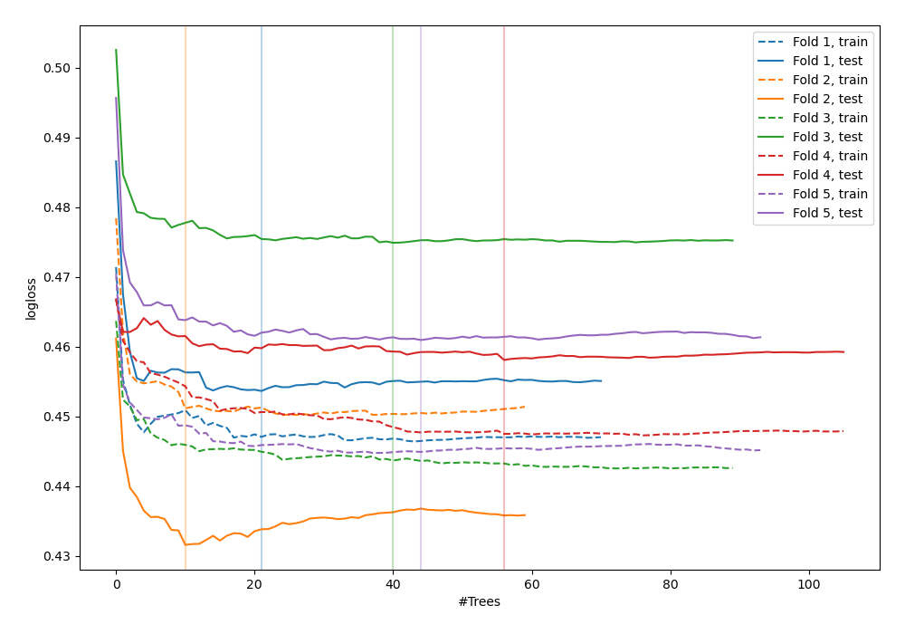
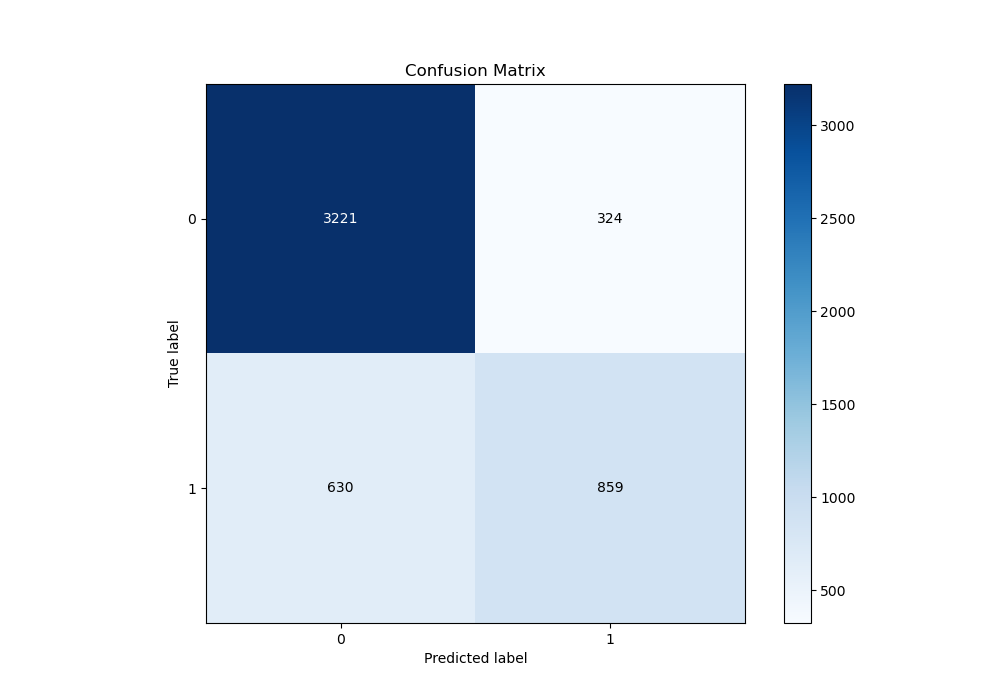
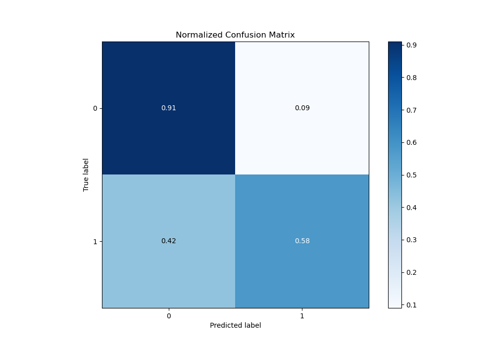
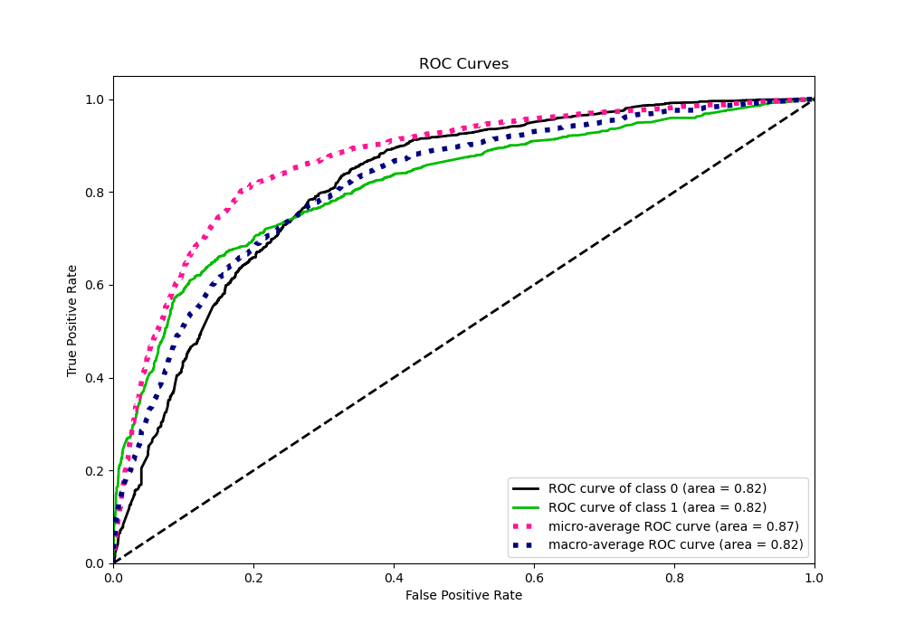
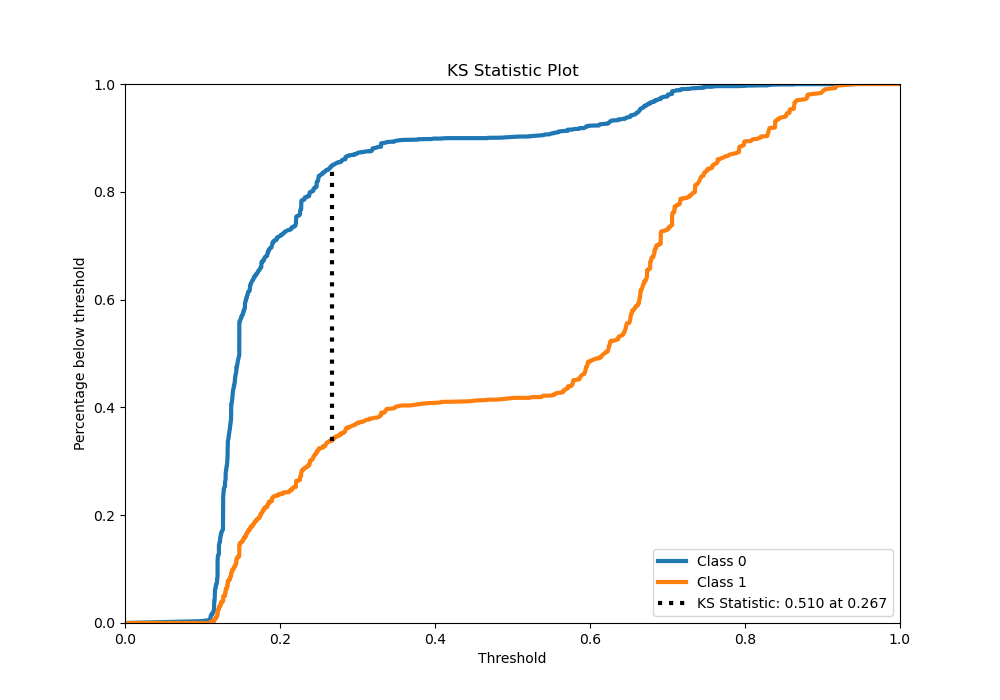
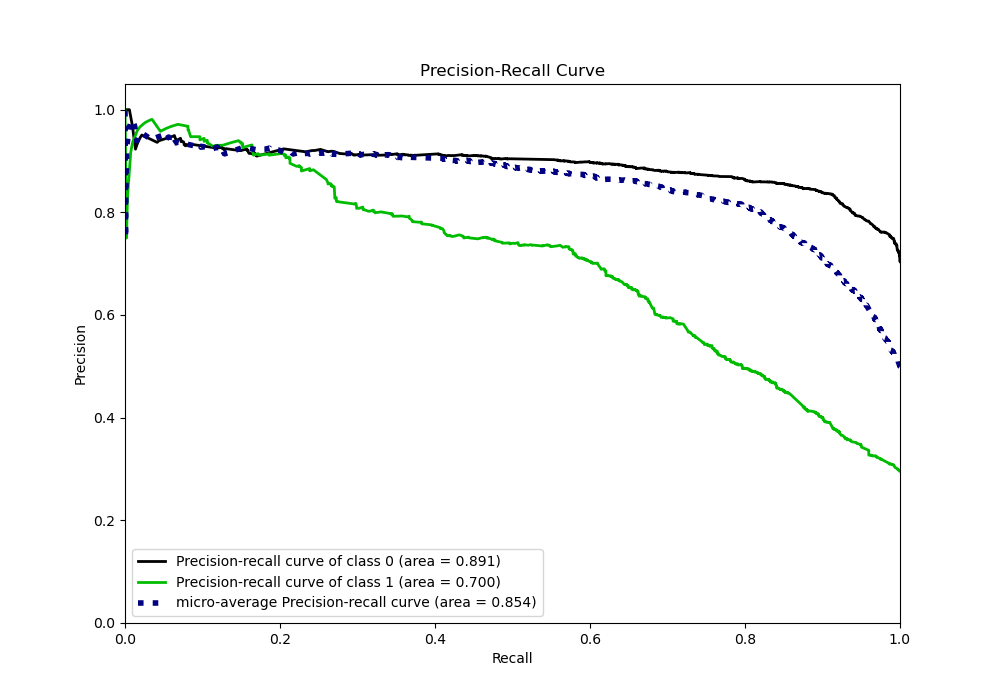
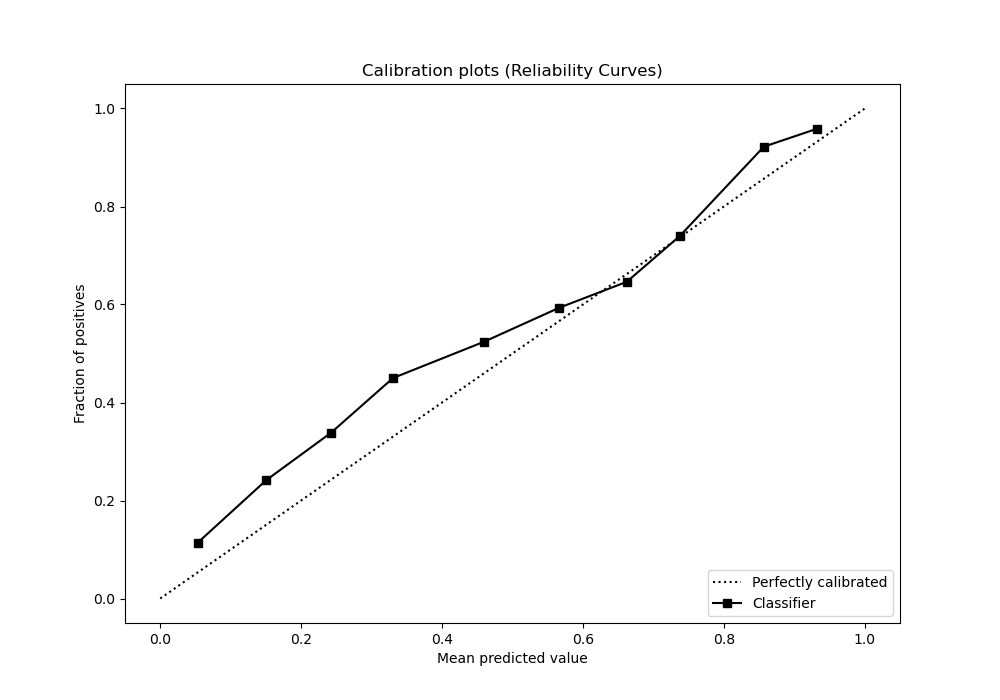
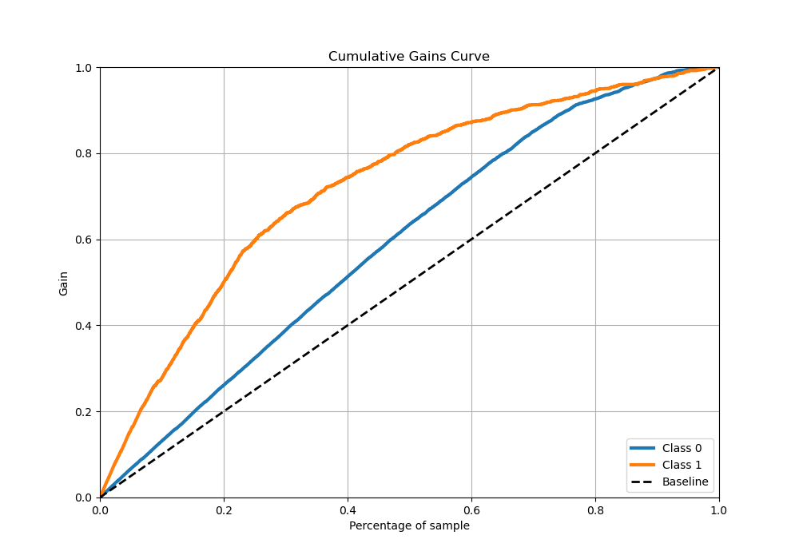
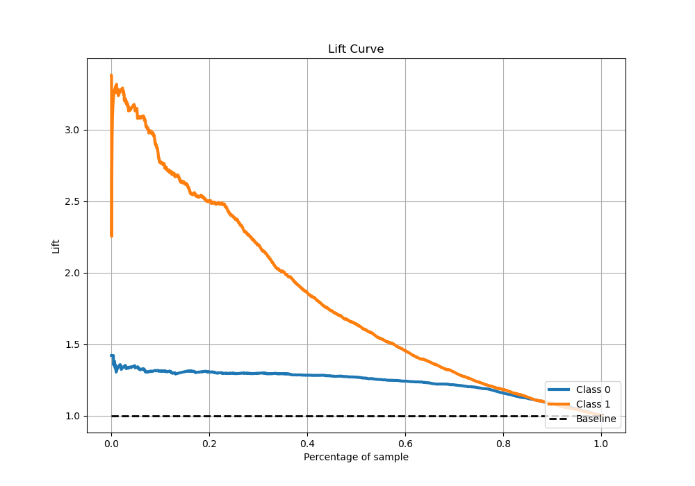

# Summary of 33_RandomForest

[<< Go back](../README.md)

## Random Forest
- **n_jobs**: -1
- **criterion**: entropy
- **max_features**: 1.0
- **min_samples_split**: 20
- **max_depth**: 3
- **eval_metric_name**: logloss
- **explain_level**: 0

## Validation
 - **validation_type**: kfold
 - **stratify**: True
 - **k_folds**: 5
 - **shuffle**: True
 - **random_seed**: 42

## Optimized metric
logloss

## Training time

16.7 seconds

## Metric details
|           |    score |   threshold |
|:----------|---------:|------------:|
| logloss   | 0.455832 | nan         |
| auc       | 0.816354 | nan         |
| f1        | 0.653196 |   0.265563  |
| accuracy  | 0.810489 |   0.55333   |
| precision | 0.963855 |   0.857428  |
| recall    | 1        |   0.0817832 |
| mcc       | 0.522596 |   0.55333   |

## Metric details with threshold from accuracy metric
|           |    score |   threshold |
|:----------|---------:|------------:|
| logloss   | 0.455832 |   nan       |
| auc       | 0.816354 |   nan       |
| f1        | 0.642964 |     0.55333 |
| accuracy  | 0.810489 |     0.55333 |
| precision | 0.72612  |     0.55333 |
| recall    | 0.576897 |     0.55333 |
| mcc       | 0.522596 |     0.55333 |

## Confusion matrix (at threshold=0.55333)
|              |   Predicted as 0 |   Predicted as 1 |
|:-------------|-----------------:|-----------------:|
| Labeled as 0 |             3221 |              324 |
| Labeled as 1 |              630 |              859 |

## Learning curves

## Confusion Matrix

## Normalized Confusion Matrix

## ROC Curve

## Kolmogorov-Smirnov Statistic

## Precision-Recall Curve

## Calibration Curve

## Cumulative Gains Curve

## Lift Curve

[<< Go back](../README.md)
