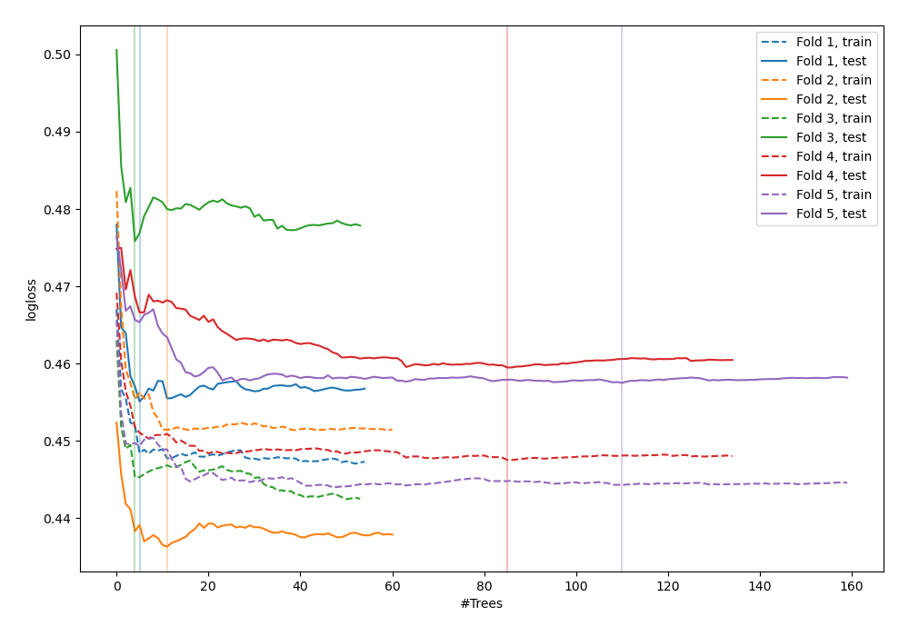
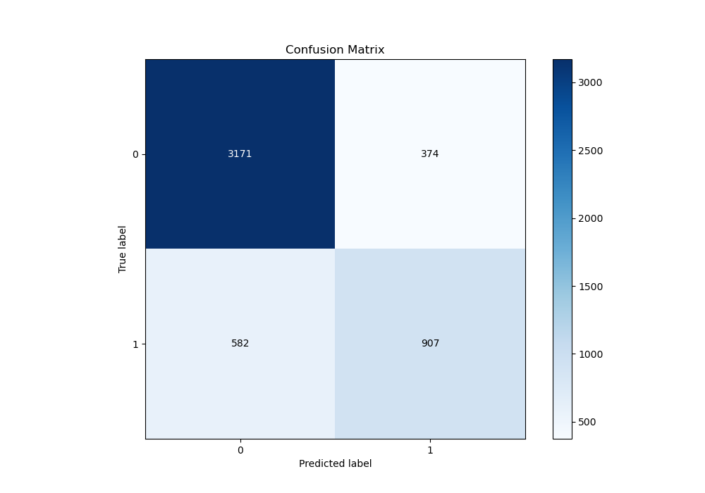
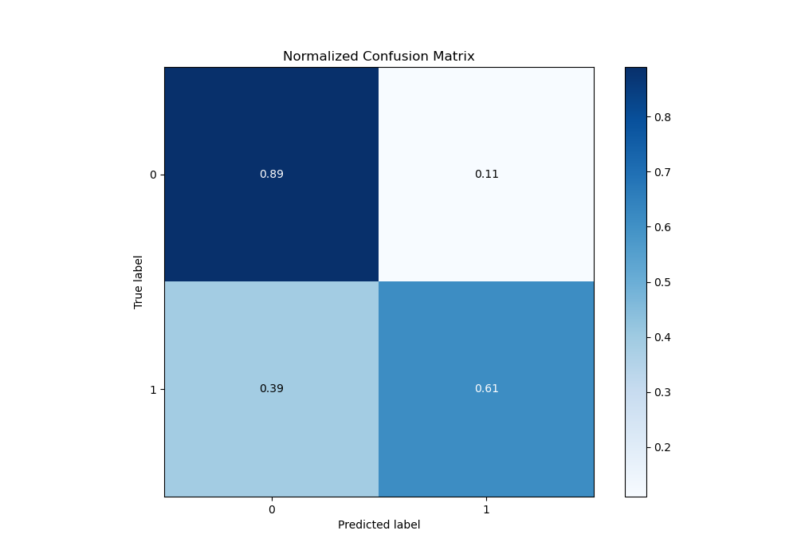
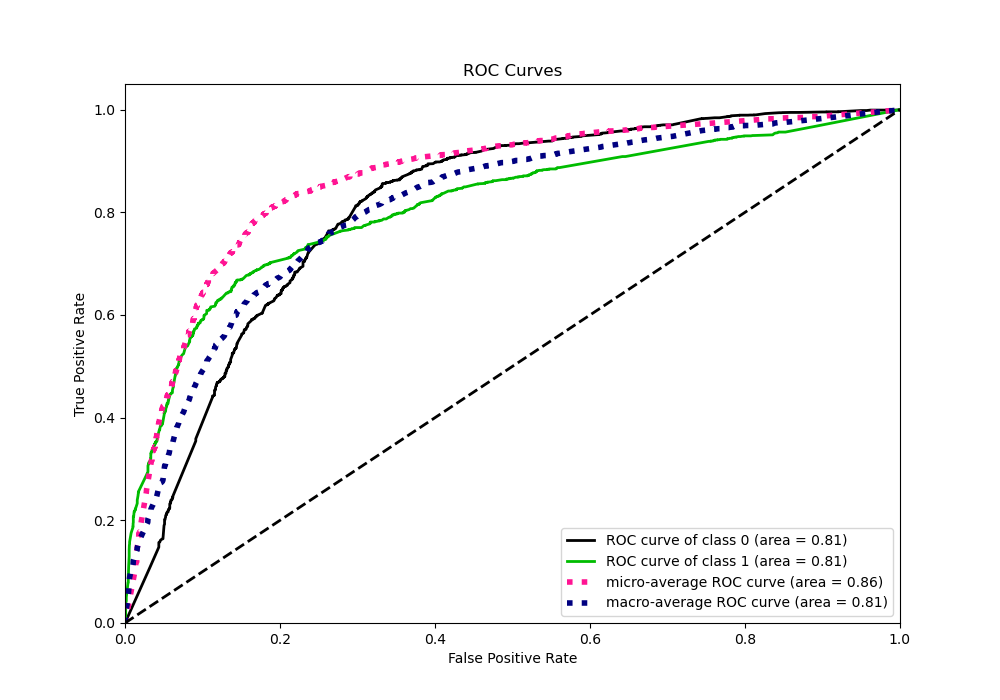
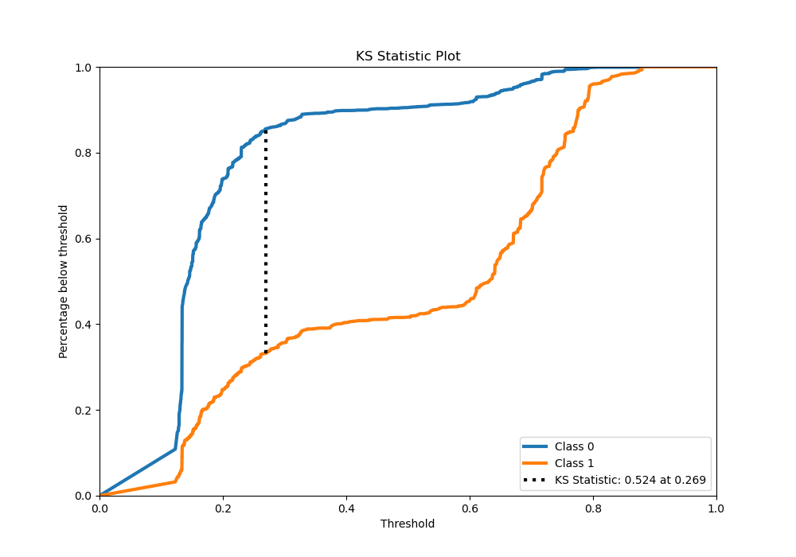
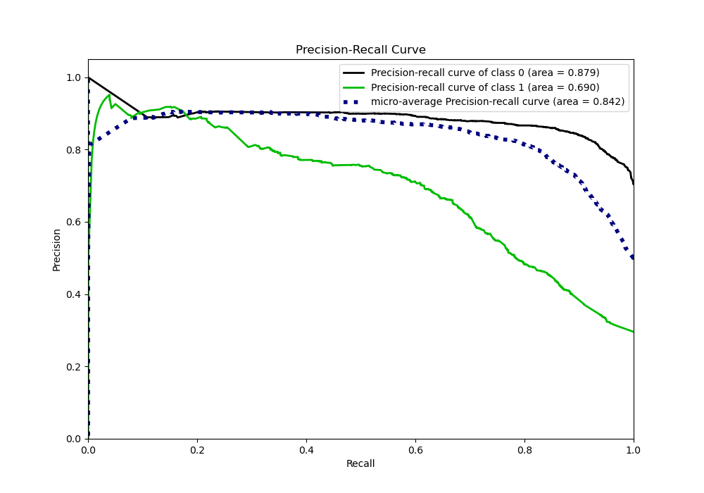
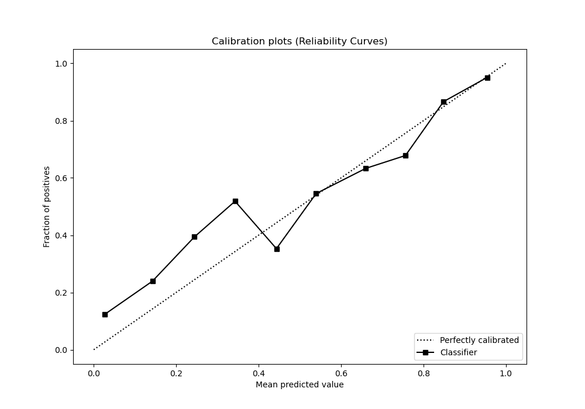
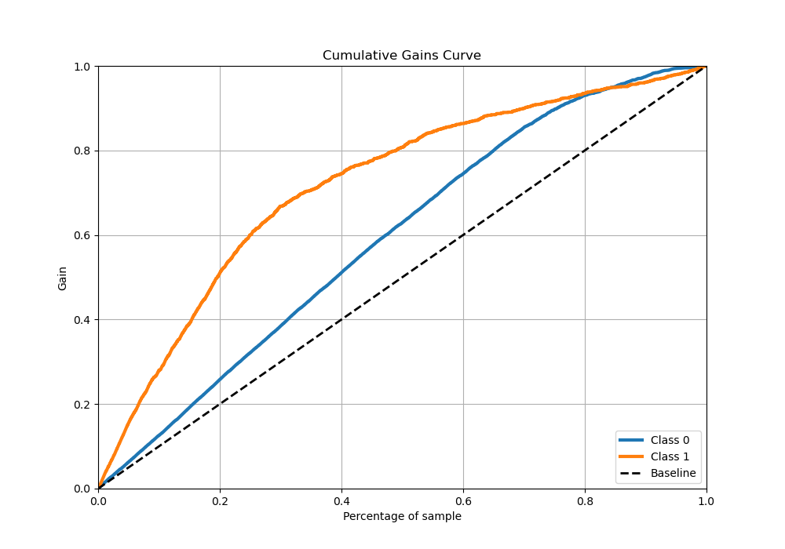
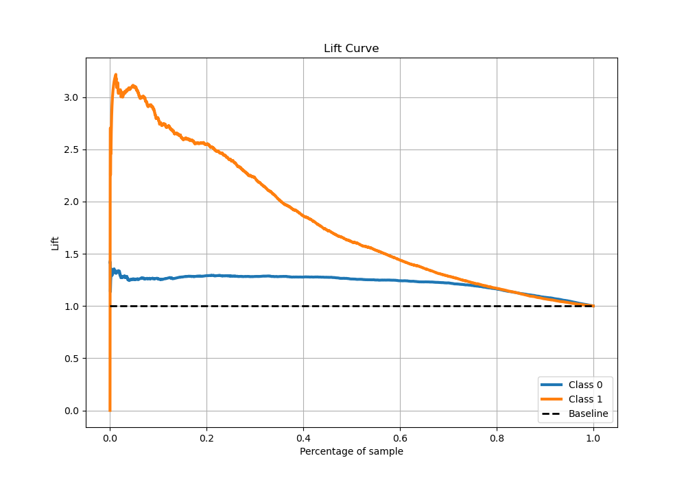

# Summary of 34_RandomForest

[<< Go back](../README.md)

## Random Forest
- **n_jobs**: -1
- **criterion**: gini
- **max_features**: 1.0
- **min_samples_split**: 30
- **max_depth**: 3
- **eval_metric_name**: logloss
- **explain_level**: 0

## Validation
 - **validation_type**: kfold
 - **stratify**: True
 - **k_folds**: 5
 - **shuffle**: True
 - **random_seed**: 42

## Optimized metric
logloss

## Training time

18.3 seconds

## Metric details
|           |    score |   threshold |
|:----------|---------:|------------:|
| logloss   | 0.456845 |  nan        |
| auc       | 0.811652 |  nan        |
| f1        | 0.659828 |    0.263559 |
| accuracy  | 0.810091 |    0.369393 |
| precision | 0.925926 |    0.794093 |
| recall    | 1        |    0.110578 |
| mcc       | 0.527723 |    0.369393 |

## Metric details with threshold from accuracy metric
|           |    score |   threshold |
|:----------|---------:|------------:|
| logloss   | 0.456845 |  nan        |
| auc       | 0.811652 |  nan        |
| f1        | 0.654874 |    0.369393 |
| accuracy  | 0.810091 |    0.369393 |
| precision | 0.708041 |    0.369393 |
| recall    | 0.609134 |    0.369393 |
| mcc       | 0.527723 |    0.369393 |

## Confusion matrix (at threshold=0.369393)
|              |   Predicted as 0 |   Predicted as 1 |
|:-------------|-----------------:|-----------------:|
| Labeled as 0 |             3171 |              374 |
| Labeled as 1 |              582 |              907 |

## Learning curves

## Confusion Matrix

## Normalized Confusion Matrix

## ROC Curve

## Kolmogorov-Smirnov Statistic

## Precision-Recall Curve

## Calibration Curve

## Cumulative Gains Curve

## Lift Curve

[<< Go back](../README.md)
