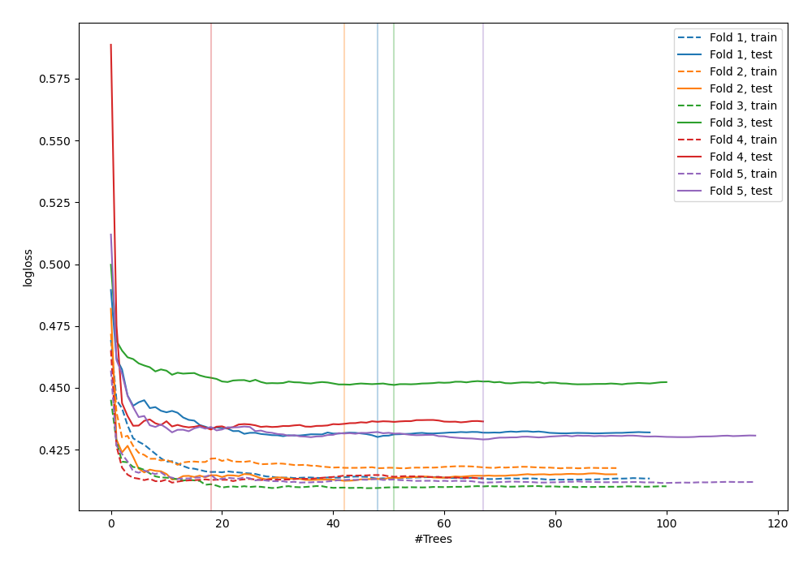
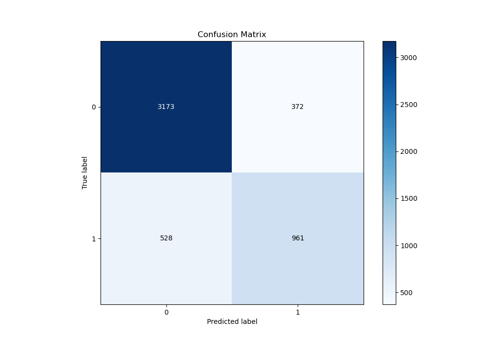
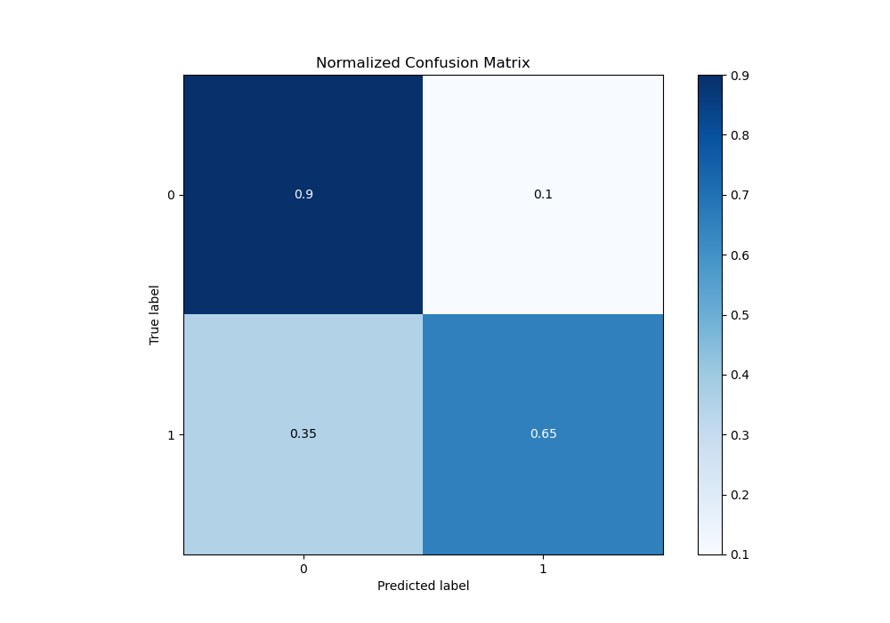
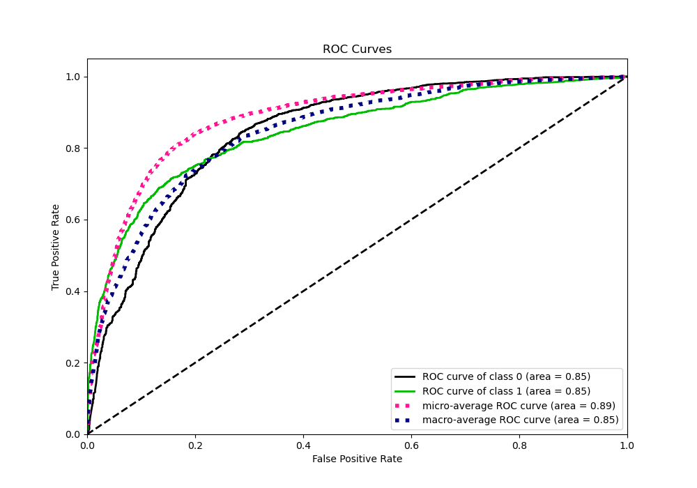
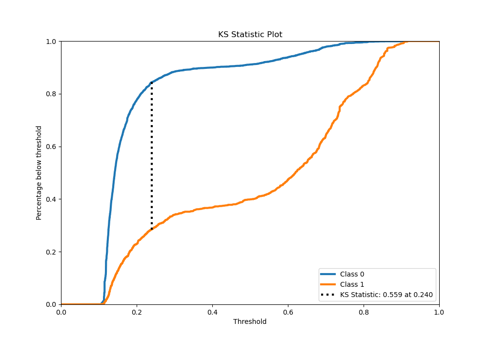
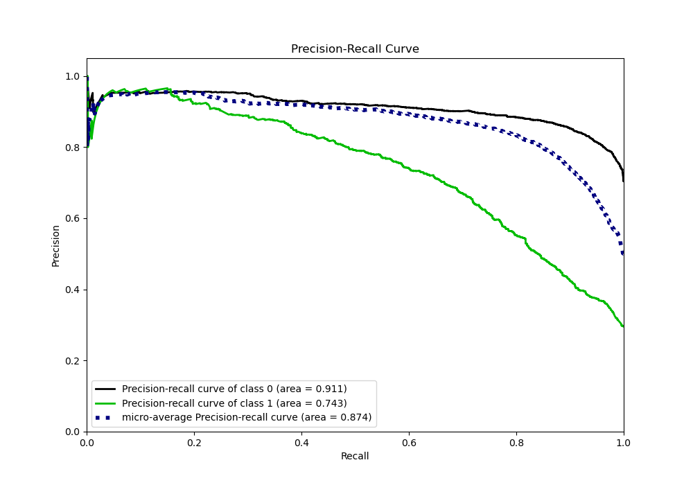
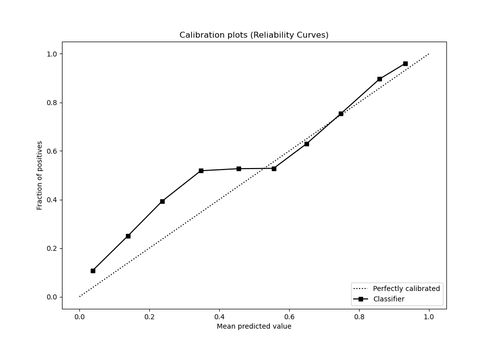
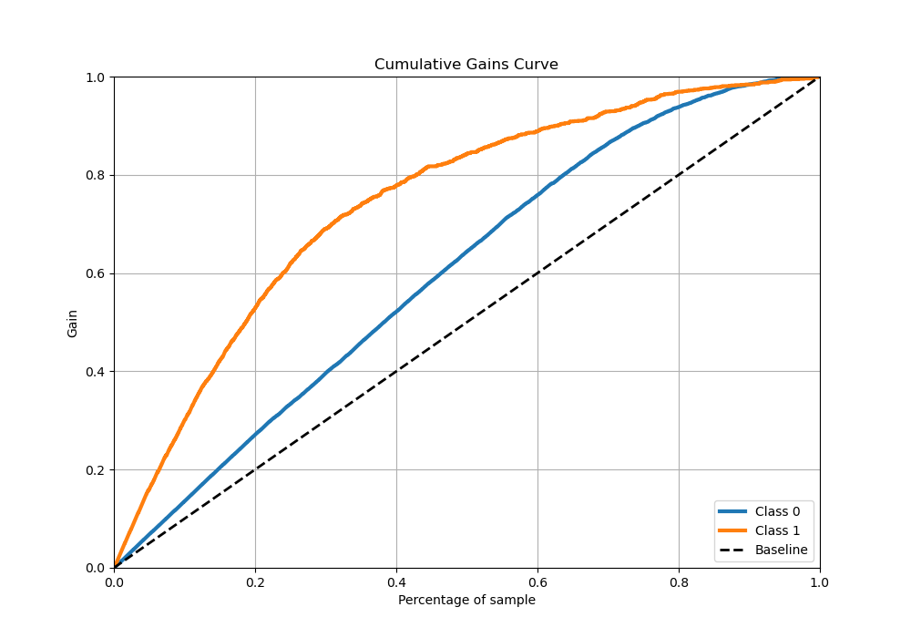
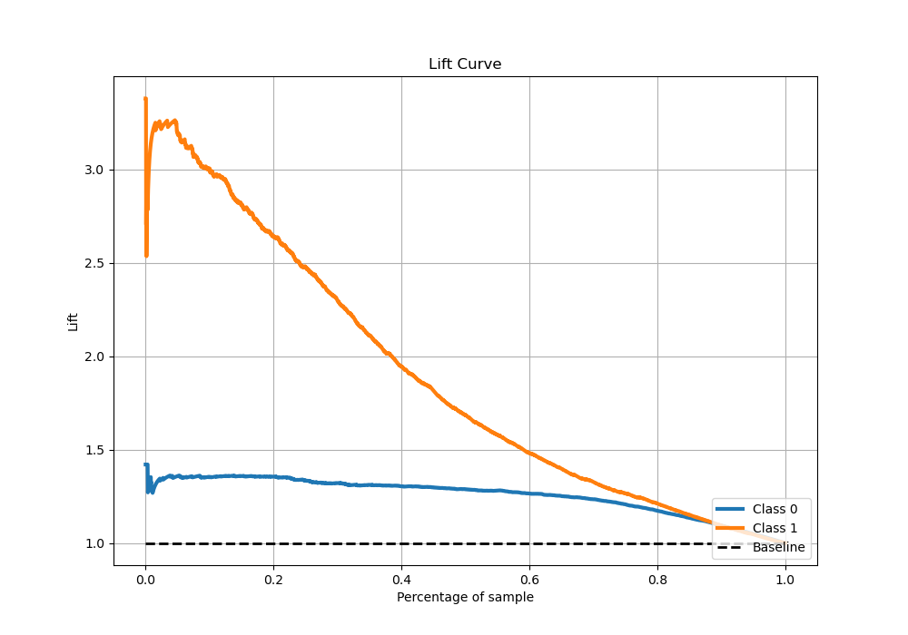

# Summary of 35_RandomForest

[<< Go back](../README.md)

## Random Forest
- **n_jobs**: -1
- **criterion**: gini
- **max_features**: 0.8
- **min_samples_split**: 50
- **max_depth**: 4
- **eval_metric_name**: logloss
- **explain_level**: 0

## Validation
 - **validation_type**: kfold
 - **stratify**: True
 - **k_folds**: 5
 - **shuffle**: True
 - **random_seed**: 42

## Optimized metric
logloss

## Training time

17.2 seconds

## Metric details
|           |    score |   threshold |
|:----------|---------:|------------:|
| logloss   | 0.431186 | nan         |
| auc       | 0.845677 | nan         |
| f1        | 0.685734 |   0.274087  |
| accuracy  | 0.821216 |   0.34975   |
| precision | 0.961373 |   0.813255  |
| recall    | 1        |   0.0965741 |
| mcc       | 0.559045 |   0.34975   |

## Metric details with threshold from accuracy metric
|           |    score |   threshold |
|:----------|---------:|------------:|
| logloss   | 0.431186 |   nan       |
| auc       | 0.845677 |   nan       |
| f1        | 0.681077 |     0.34975 |
| accuracy  | 0.821216 |     0.34975 |
| precision | 0.72093  |     0.34975 |
| recall    | 0.6454   |     0.34975 |
| mcc       | 0.559045 |     0.34975 |

## Confusion matrix (at threshold=0.34975)
|              |   Predicted as 0 |   Predicted as 1 |
|:-------------|-----------------:|-----------------:|
| Labeled as 0 |             3173 |              372 |
| Labeled as 1 |              528 |              961 |

## Learning curves

## Confusion Matrix

## Normalized Confusion Matrix

## ROC Curve

## Kolmogorov-Smirnov Statistic

## Precision-Recall Curve

## Calibration Curve

## Cumulative Gains Curve

## Lift Curve

[<< Go back](../README.md)
