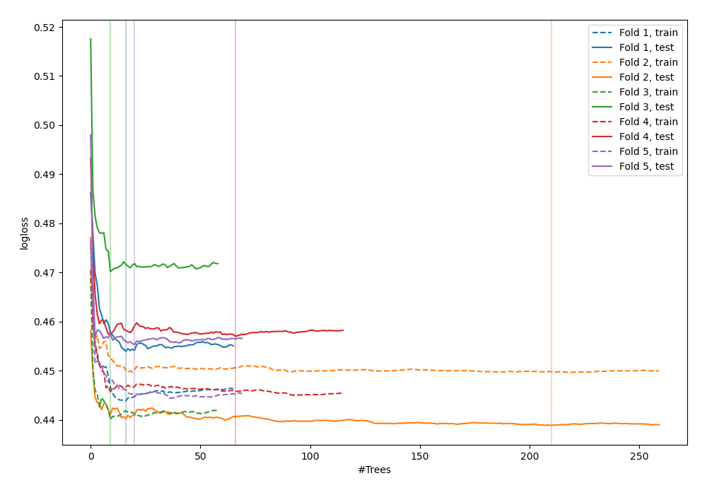
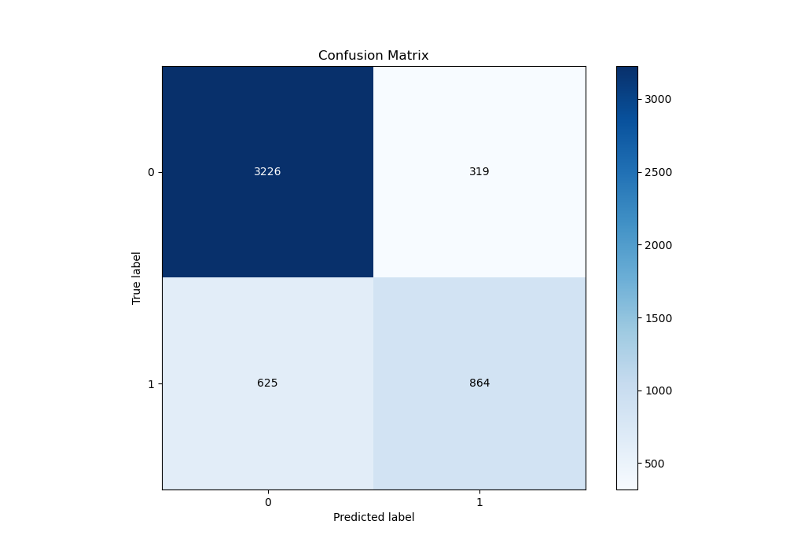
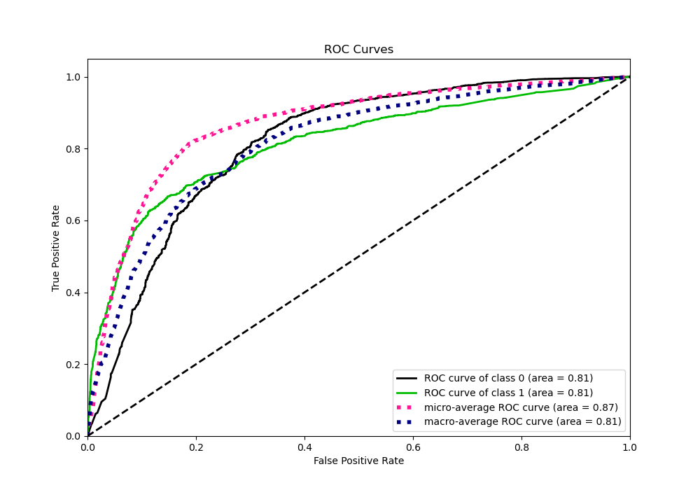
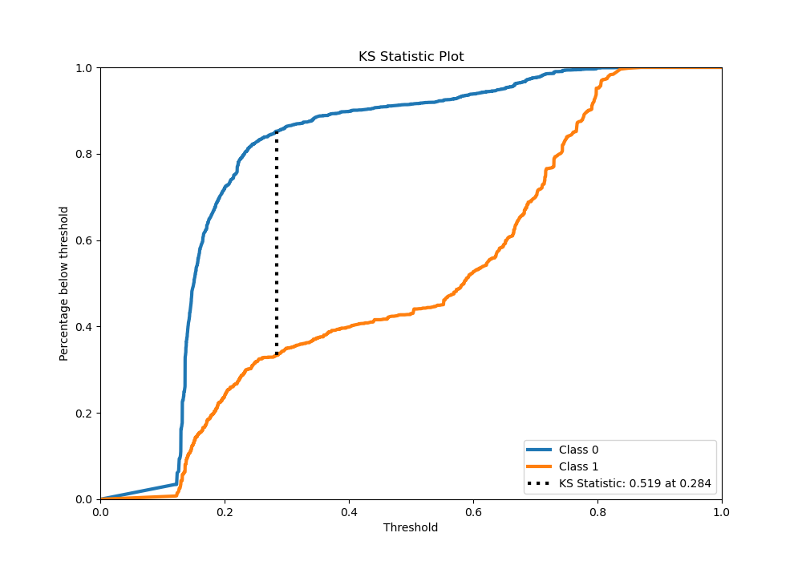
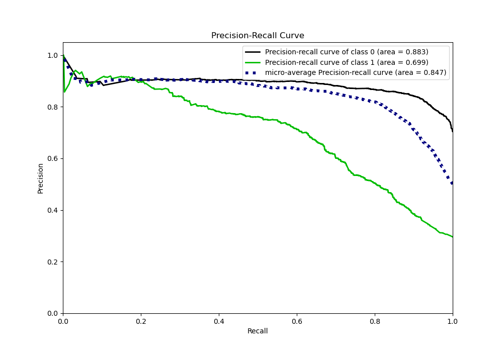
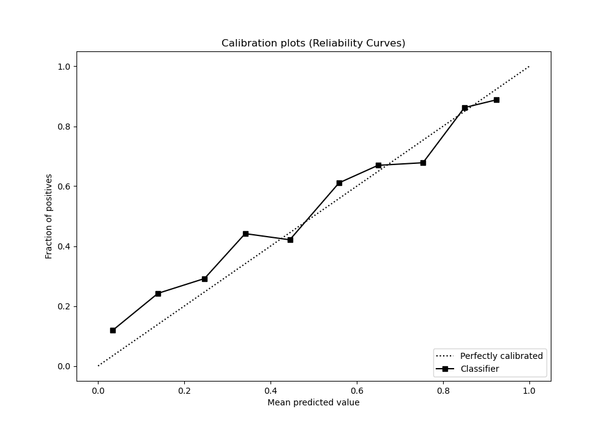
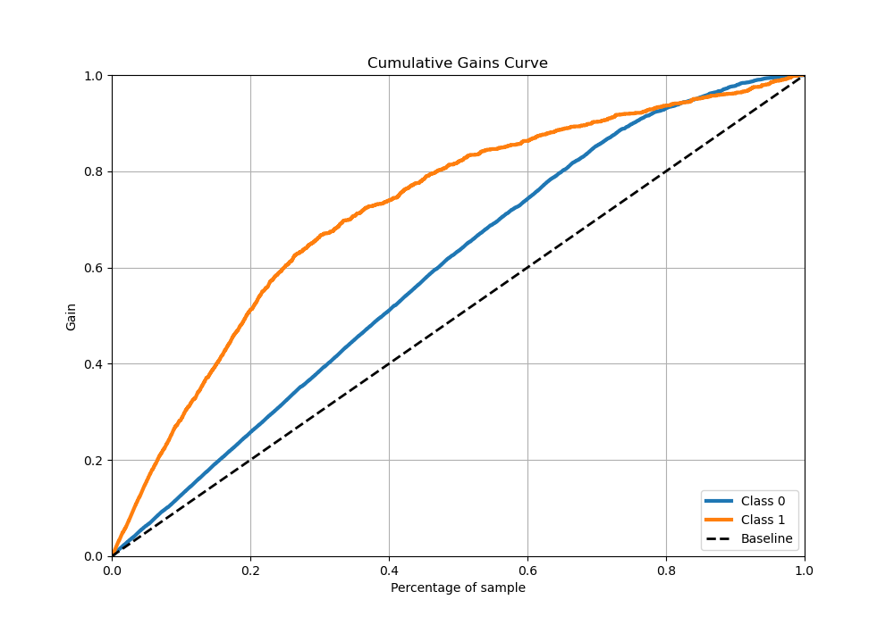
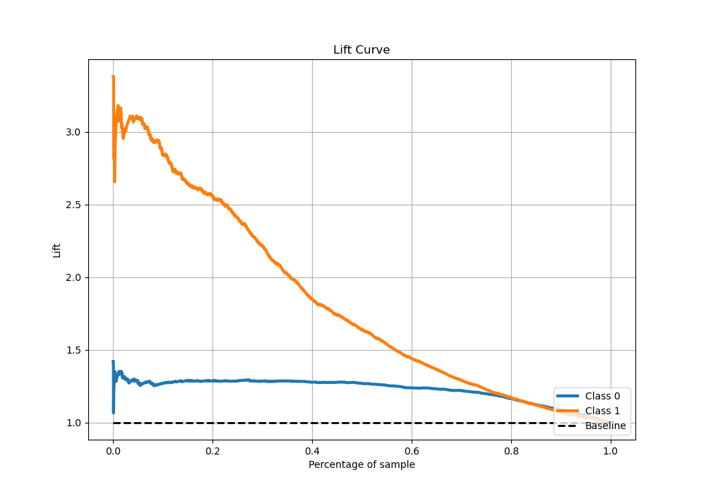

# Summary of 36_RandomForest

[<< Go back](../README.md)

## Random Forest
- **n_jobs**: -1
- **criterion**: gini
- **max_features**: 0.7
- **min_samples_split**: 50
- **max_depth**: 3
- **eval_metric_name**: logloss
- **explain_level**: 0

## Validation
 - **validation_type**: kfold
 - **stratify**: True
 - **k_folds**: 5
 - **shuffle**: True
 - **random_seed**: 42

## Optimized metric
logloss

## Training time

20.9 seconds

## Metric details
|           |    score |   threshold |
|:----------|---------:|------------:|
| logloss   | 0.455066 |  nan        |
| auc       | 0.814686 |  nan        |
| f1        | 0.659816 |    0.351693 |
| accuracy  | 0.812475 |    0.462573 |
| precision | 0.935065 |    0.798164 |
| recall    | 1        |    0.107552 |
| mcc       | 0.529451 |    0.351693 |

## Metric details with threshold from accuracy metric
|           |    score |   threshold |
|:----------|---------:|------------:|
| logloss   | 0.455066 |  nan        |
| auc       | 0.814686 |  nan        |
| f1        | 0.646707 |    0.462573 |
| accuracy  | 0.812475 |    0.462573 |
| precision | 0.730347 |    0.462573 |
| recall    | 0.580255 |    0.462573 |
| mcc       | 0.527729 |    0.462573 |

## Confusion matrix (at threshold=0.462573)
|              |   Predicted as 0 |   Predicted as 1 |
|:-------------|-----------------:|-----------------:|
| Labeled as 0 |             3226 |              319 |
| Labeled as 1 |              625 |              864 |

## Learning curves

## Confusion Matrix

## Normalized Confusion Matrix

## ROC Curve

## Kolmogorov-Smirnov Statistic

## Precision-Recall Curve

## Calibration Curve

## Cumulative Gains Curve

## Lift Curve

[<< Go back](../README.md)
