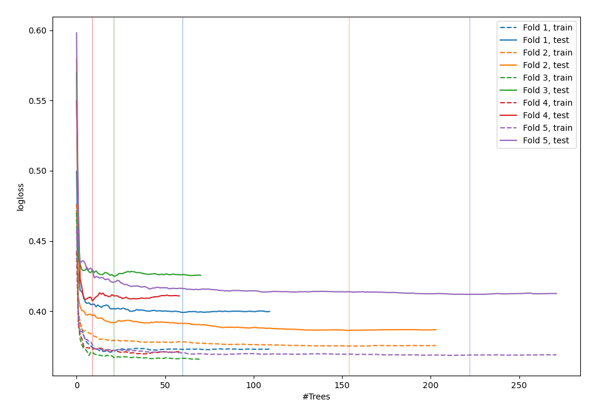
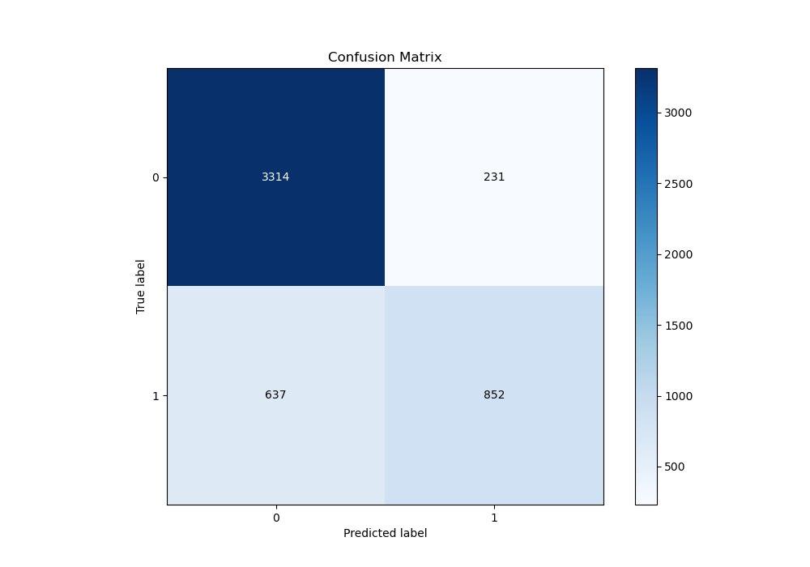
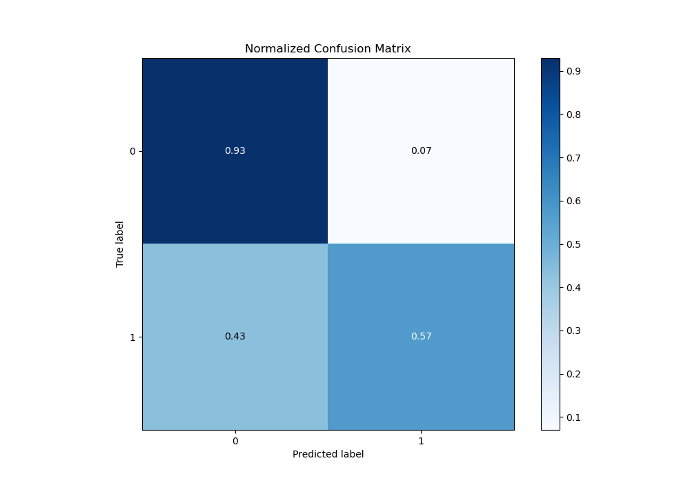
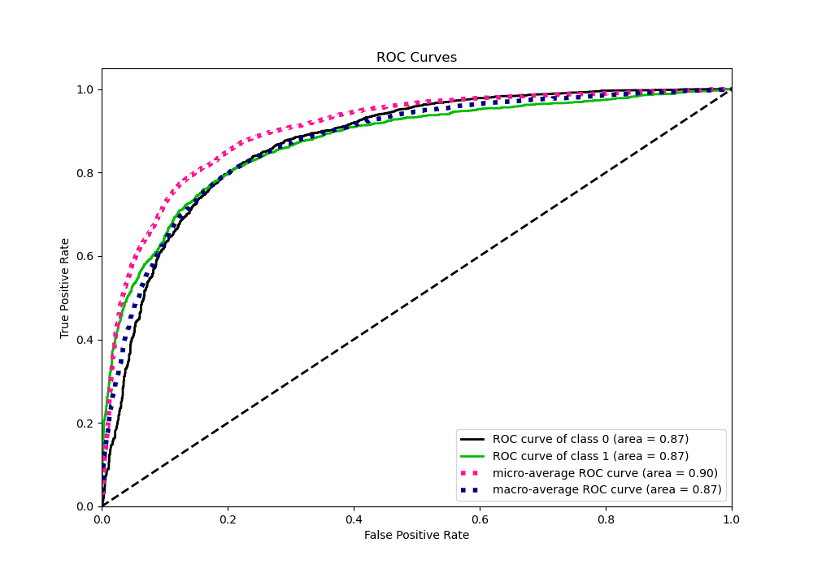
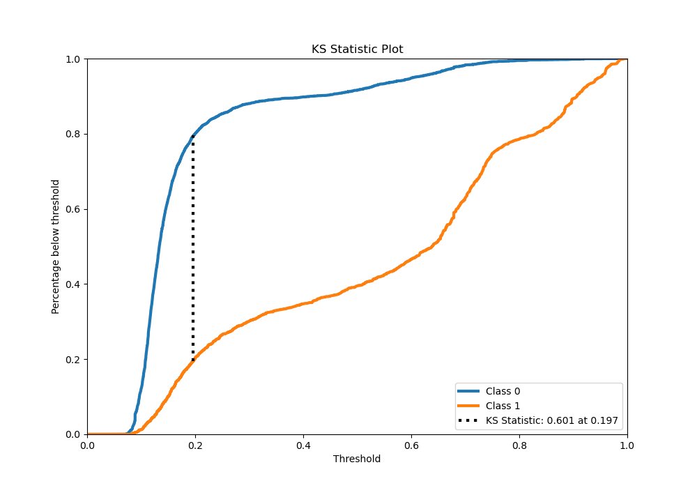
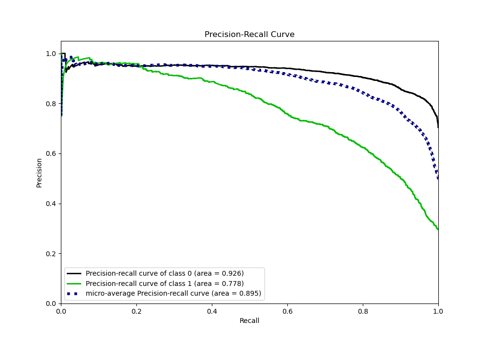
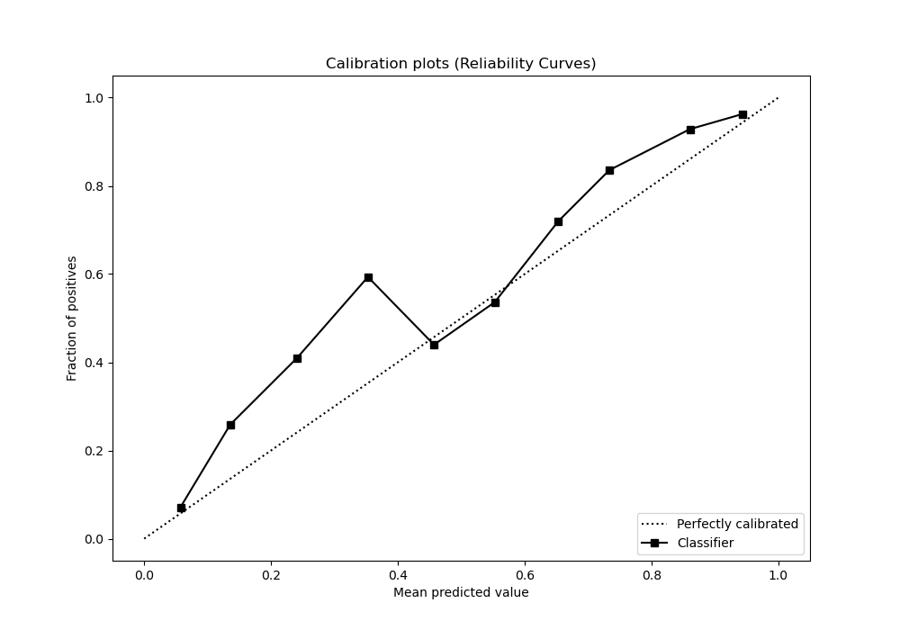
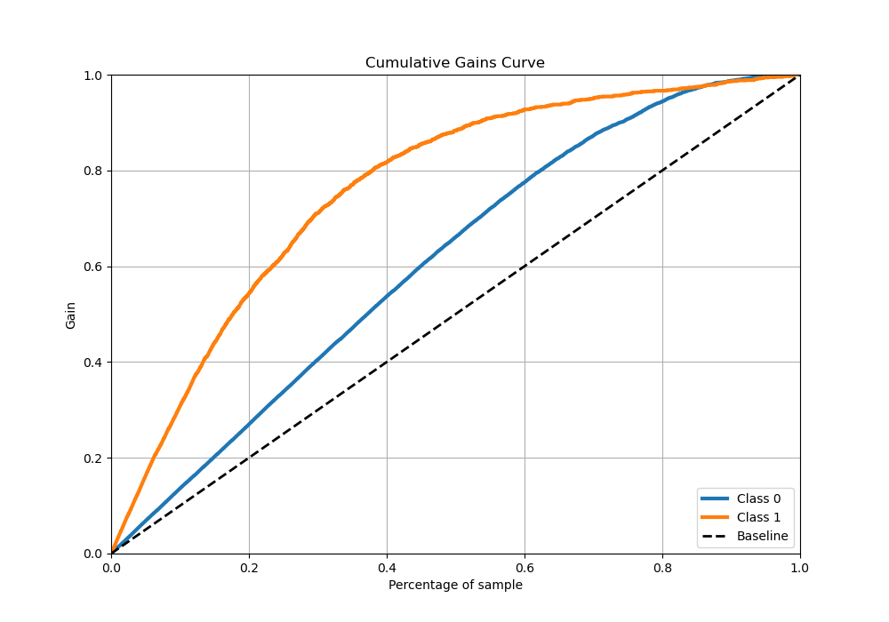
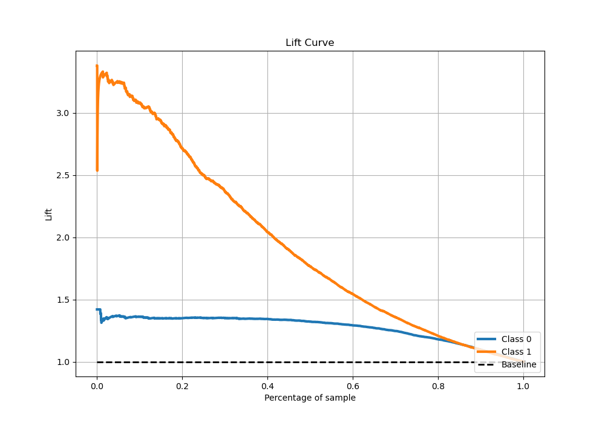

# Summary of 37_RandomForest

[<< Go back](../README.md)

## Random Forest
- **n_jobs**: -1
- **criterion**: entropy
- **max_features**: 0.9
- **min_samples_split**: 20
- **max_depth**: 5
- **eval_metric_name**: logloss
- **explain_level**: 0

## Validation
 - **validation_type**: kfold
 - **stratify**: True
 - **k_folds**: 5
 - **shuffle**: True
 - **random_seed**: 42

## Optimized metric
logloss

## Training time

25.8 seconds

## Metric details
|           |    score |   threshold |
|:----------|---------:|------------:|
| logloss   | 0.405926 | nan         |
| auc       | 0.871595 | nan         |
| f1        | 0.70681  |   0.234527  |
| accuracy  | 0.827573 |   0.55443   |
| precision | 0.975904 |   0.94413   |
| recall    | 1        |   0.0606667 |
| mcc       | 0.583712 |   0.291052  |

## Metric details with threshold from accuracy metric
|           |    score |   threshold |
|:----------|---------:|------------:|
| logloss   | 0.405926 |   nan       |
| auc       | 0.871595 |   nan       |
| f1        | 0.662519 |     0.55443 |
| accuracy  | 0.827573 |     0.55443 |
| precision | 0.786704 |     0.55443 |
| recall    | 0.572196 |     0.55443 |
| mcc       | 0.563151 |     0.55443 |

## Confusion matrix (at threshold=0.55443)
|              |   Predicted as 0 |   Predicted as 1 |
|:-------------|-----------------:|-----------------:|
| Labeled as 0 |             3314 |              231 |
| Labeled as 1 |              637 |              852 |

## Learning curves

## Confusion Matrix

## Normalized Confusion Matrix

## ROC Curve

## Kolmogorov-Smirnov Statistic

## Precision-Recall Curve

## Calibration Curve

## Cumulative Gains Curve

## Lift Curve

[<< Go back](../README.md)
