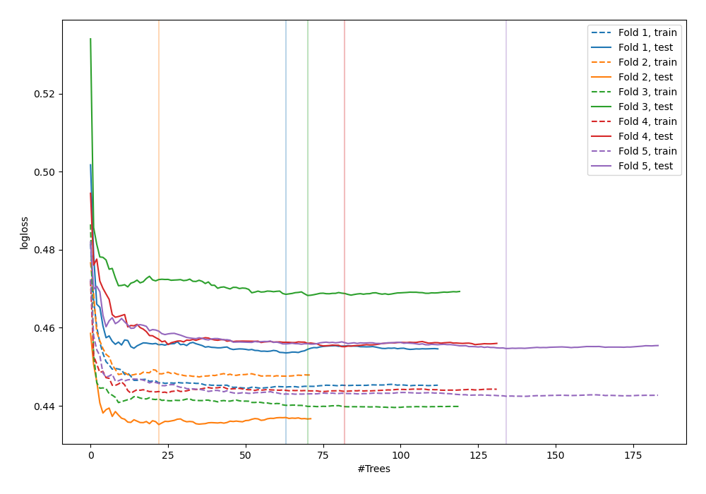
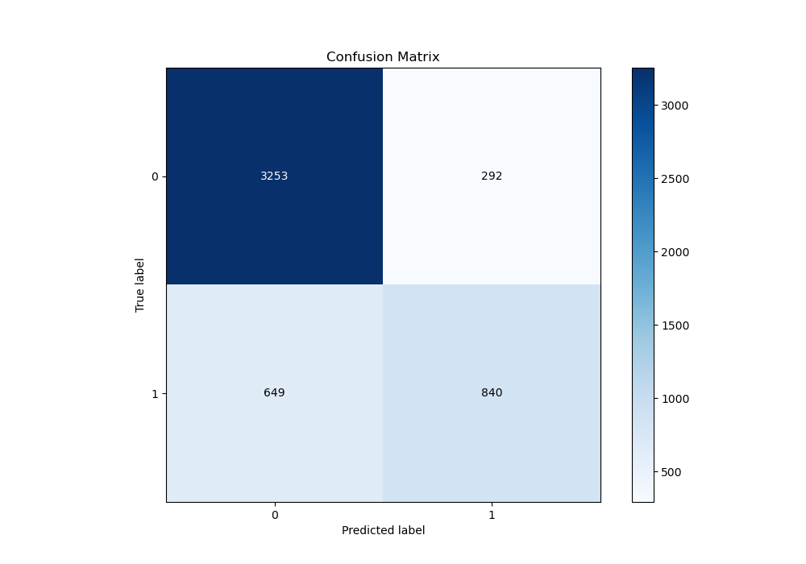
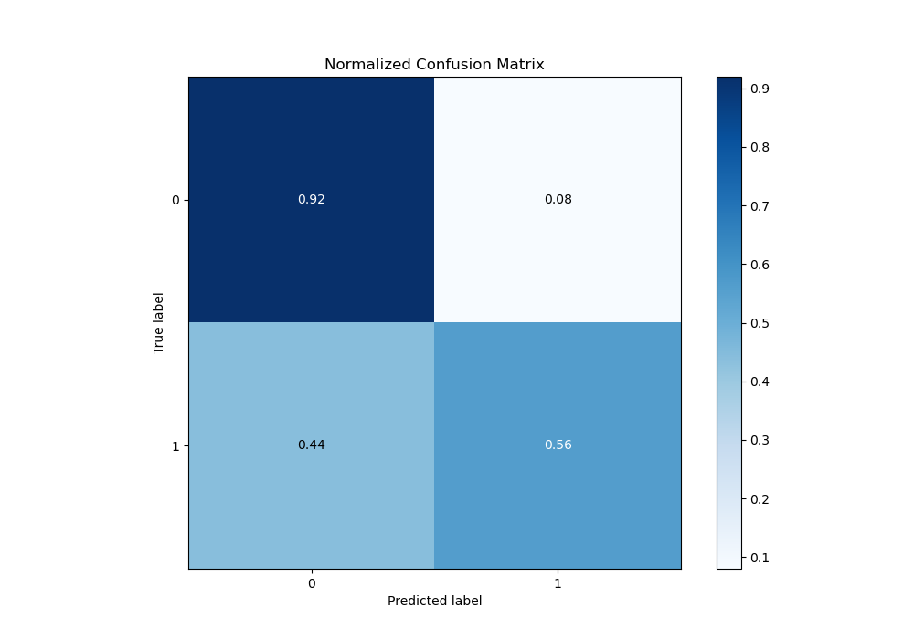
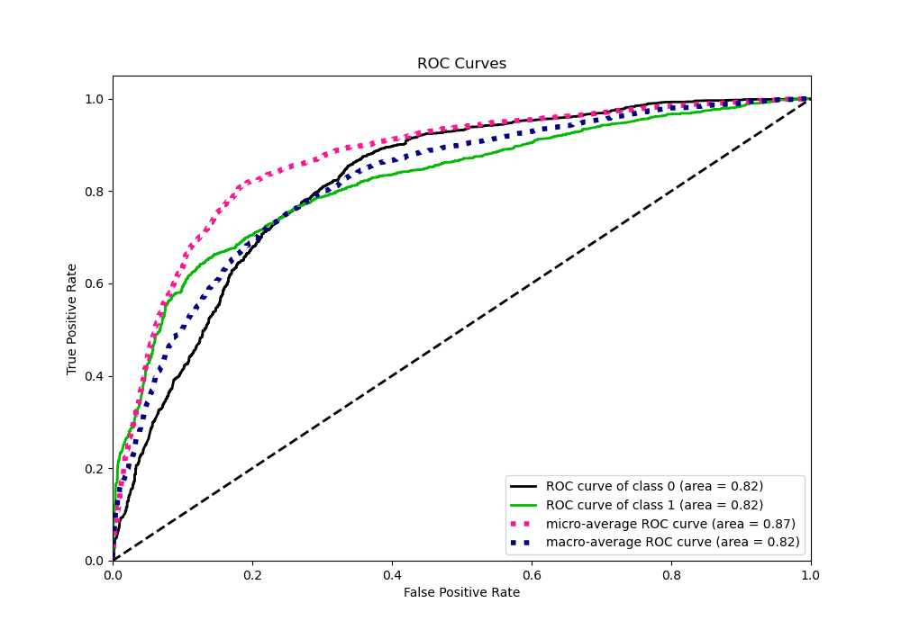
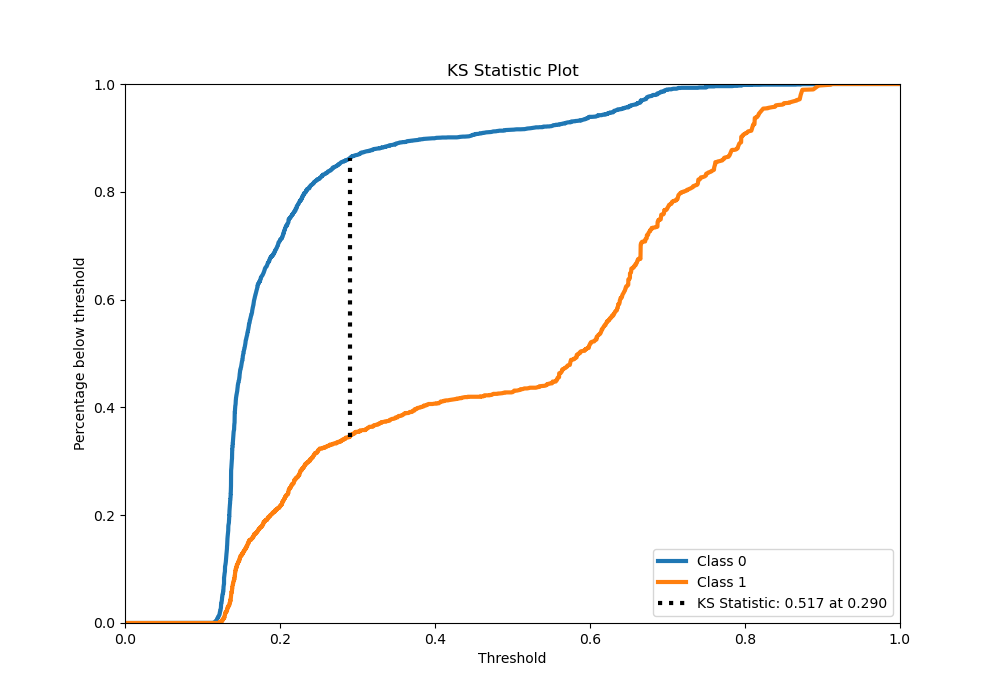
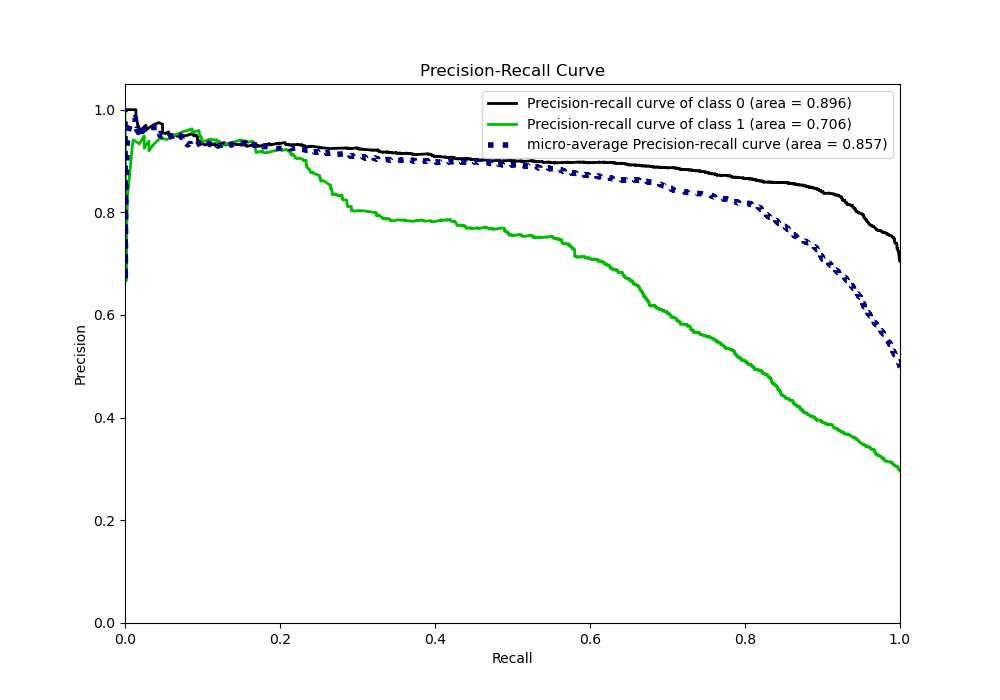
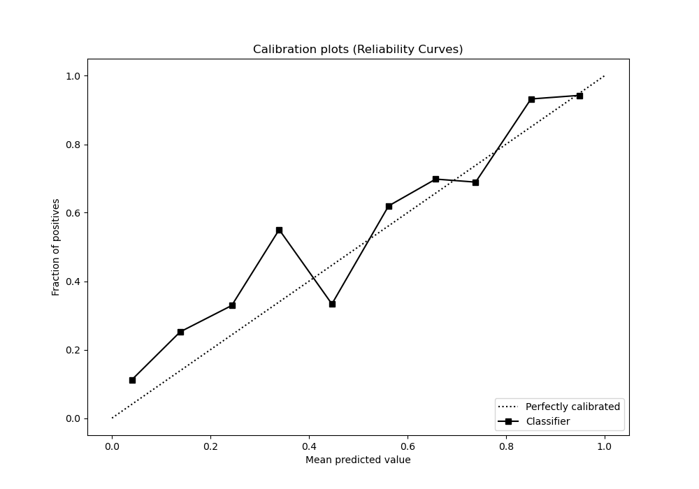
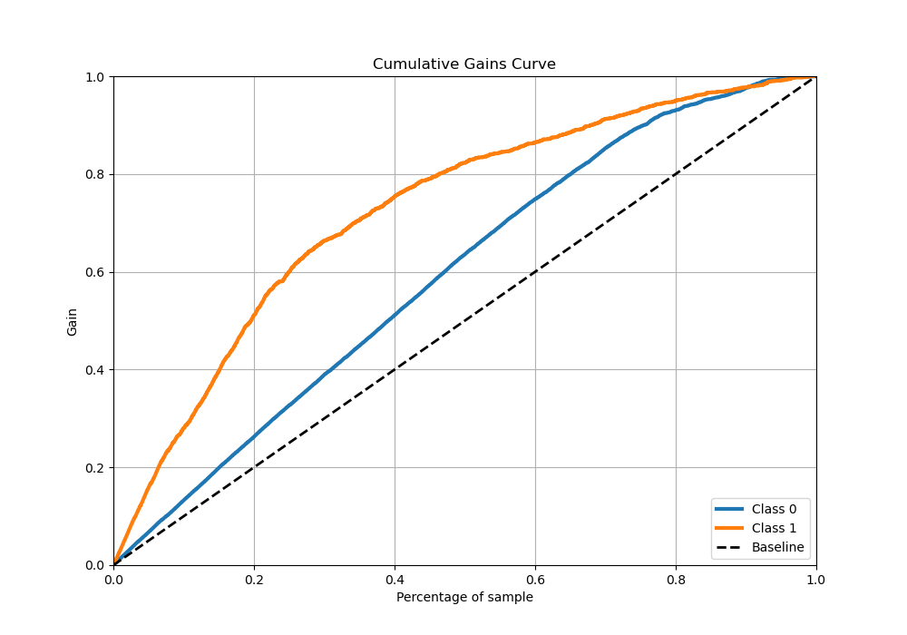
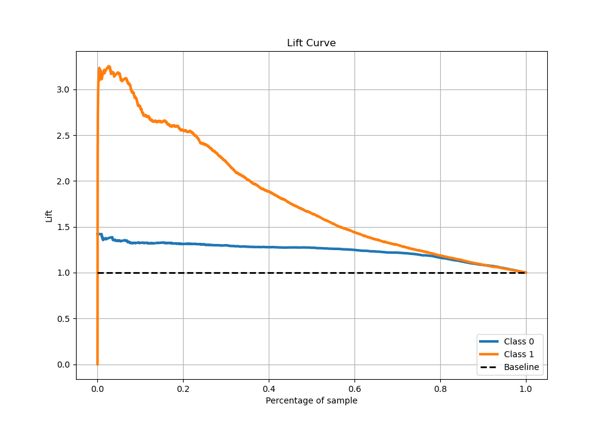

# Summary of 39_RandomForest

[<< Go back](../README.md)

## Random Forest
- **n_jobs**: -1
- **criterion**: entropy
- **max_features**: 0.7
- **min_samples_split**: 40
- **max_depth**: 3
- **eval_metric_name**: logloss
- **explain_level**: 0

## Validation
 - **validation_type**: kfold
 - **stratify**: True
 - **k_folds**: 5
 - **shuffle**: True
 - **random_seed**: 42

## Optimized metric
logloss

## Training time

21.7 seconds

## Metric details
|           |    score |   threshold |
|:----------|---------:|------------:|
| logloss   | 0.453365 |  nan        |
| auc       | 0.8207   |  nan        |
| f1        | 0.659471 |    0.318044 |
| accuracy  | 0.813071 |    0.521203 |
| precision | 0.958333 |    0.810149 |
| recall    | 1        |    0.101934 |
| mcc       | 0.52786  |    0.366841 |

## Metric details with threshold from accuracy metric
|           |    score |   threshold |
|:----------|---------:|------------:|
| logloss   | 0.453365 |  nan        |
| auc       | 0.8207   |  nan        |
| f1        | 0.640977 |    0.521203 |
| accuracy  | 0.813071 |    0.521203 |
| precision | 0.742049 |    0.521203 |
| recall    | 0.564137 |    0.521203 |
| mcc       | 0.526655 |    0.521203 |

## Confusion matrix (at threshold=0.521203)
|              |   Predicted as 0 |   Predicted as 1 |
|:-------------|-----------------:|-----------------:|
| Labeled as 0 |             3253 |              292 |
| Labeled as 1 |              649 |              840 |

## Learning curves

## Confusion Matrix

## Normalized Confusion Matrix

## ROC Curve

## Kolmogorov-Smirnov Statistic

## Precision-Recall Curve

## Calibration Curve

## Cumulative Gains Curve

## Lift Curve

[<< Go back](../README.md)
