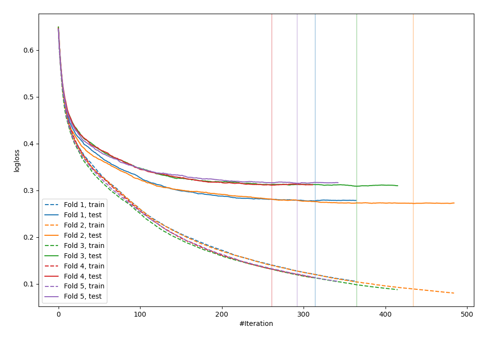
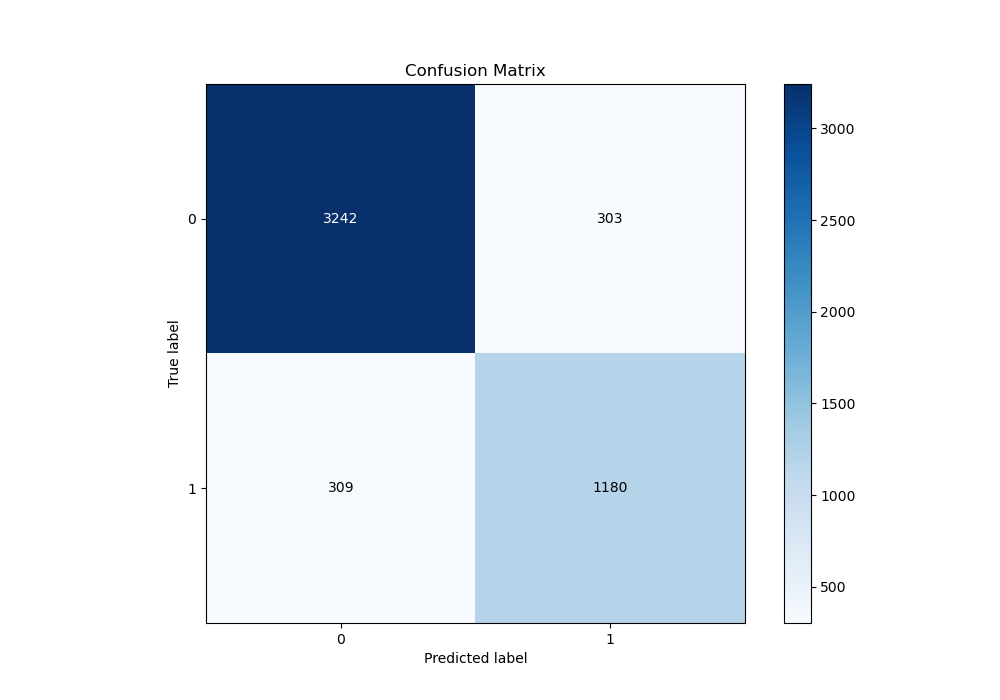
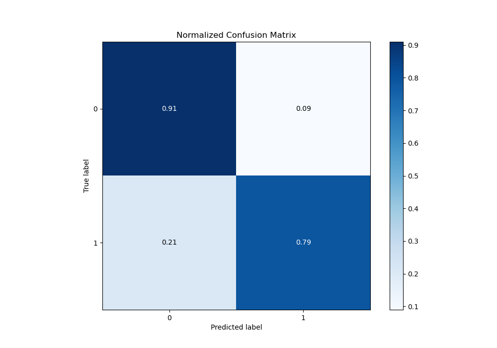
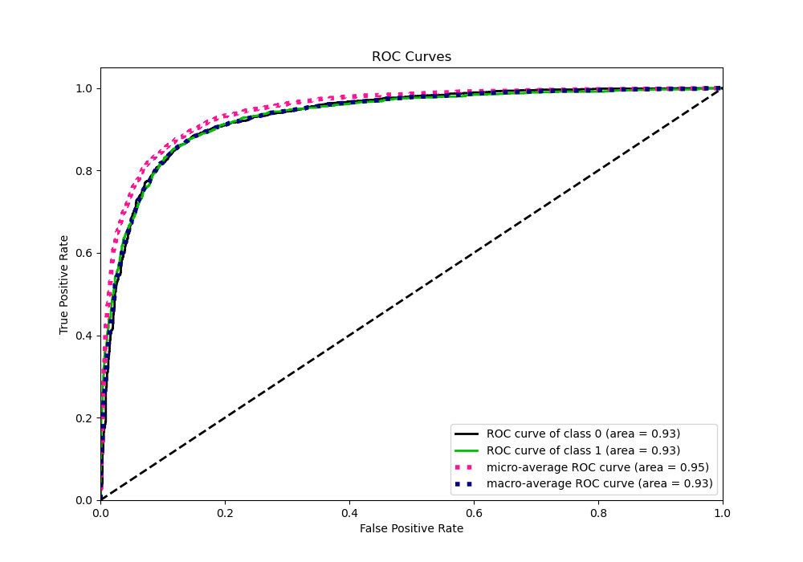
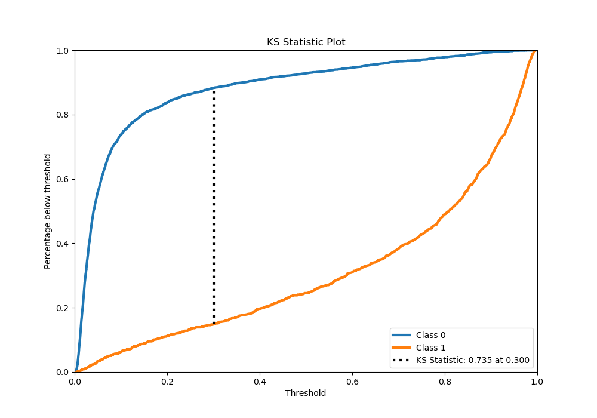
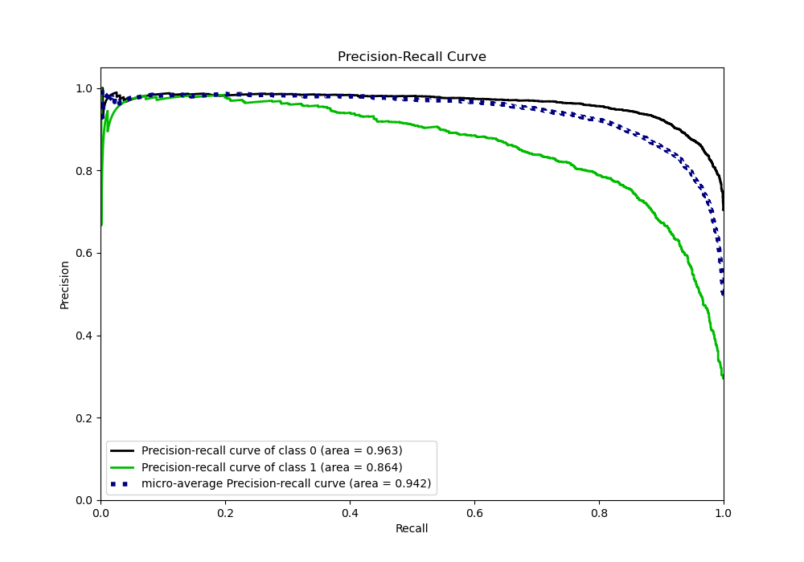
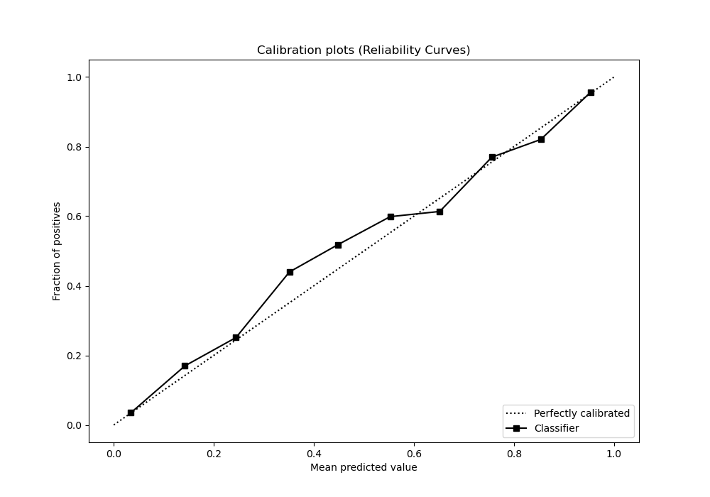
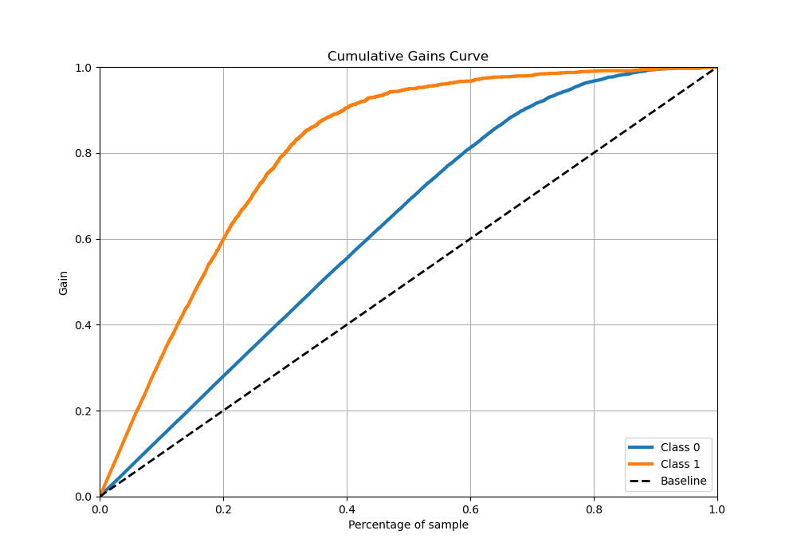
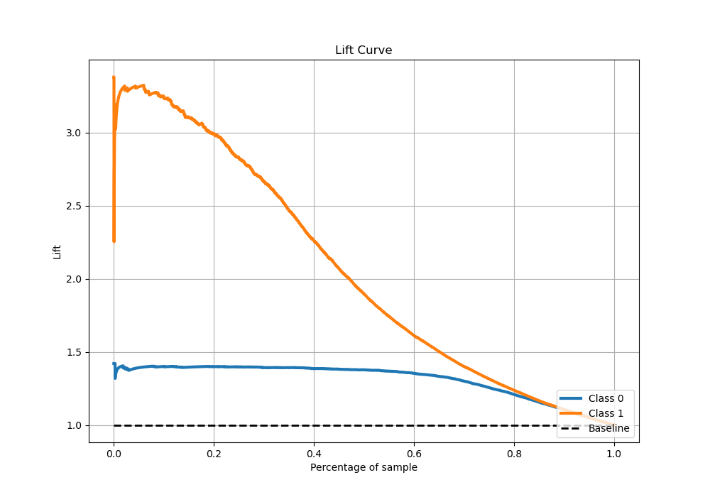

# Summary of 3_Default_CatBoost

[<< Go back](../README.md)

## CatBoost
- **n_jobs**: -1
- **learning_rate**: 0.1
- **depth**: 6
- **rsm**: 1
- **loss_function**: Logloss
- **eval_metric**: Logloss
- **explain_level**: 0

## Validation
 - **validation_type**: kfold
 - **stratify**: True
 - **k_folds**: 5
 - **shuffle**: True
 - **random_seed**: 42

## Optimized metric
logloss

## Training time

18.3 seconds

## Metric details
|           |    score |    threshold |
|:----------|---------:|-------------:|
| logloss   | 0.297063 | nan          |
| auc       | 0.931012 | nan          |
| f1        | 0.799744 |   0.333162   |
| accuracy  | 0.878427 |   0.424817   |
| precision | 0.982332 |   0.951004   |
| recall    | 1        |   0.00147659 |
| mcc       | 0.711618 |   0.333162   |

## Metric details with threshold from accuracy metric
|           |    score |   threshold |
|:----------|---------:|------------:|
| logloss   | 0.297063 |  nan        |
| auc       | 0.931012 |  nan        |
| f1        | 0.794078 |    0.424817 |
| accuracy  | 0.878427 |    0.424817 |
| precision | 0.795684 |    0.424817 |
| recall    | 0.792478 |    0.424817 |
| mcc       | 0.707836 |    0.424817 |

## Confusion matrix (at threshold=0.424817)
|              |   Predicted as 0 |   Predicted as 1 |
|:-------------|-----------------:|-----------------:|
| Labeled as 0 |             3242 |              303 |
| Labeled as 1 |              309 |             1180 |

## Learning curves

## Confusion Matrix

## Normalized Confusion Matrix

## ROC Curve

## Kolmogorov-Smirnov Statistic

## Precision-Recall Curve

## Calibration Curve

## Cumulative Gains Curve

## Lift Curve

[<< Go back](../README.md)
