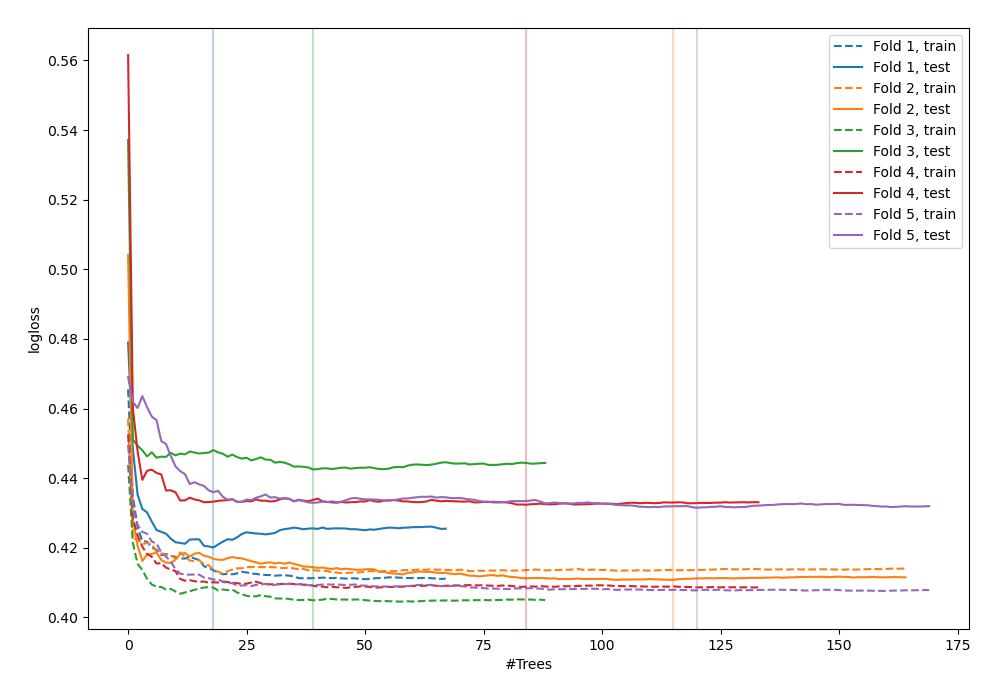
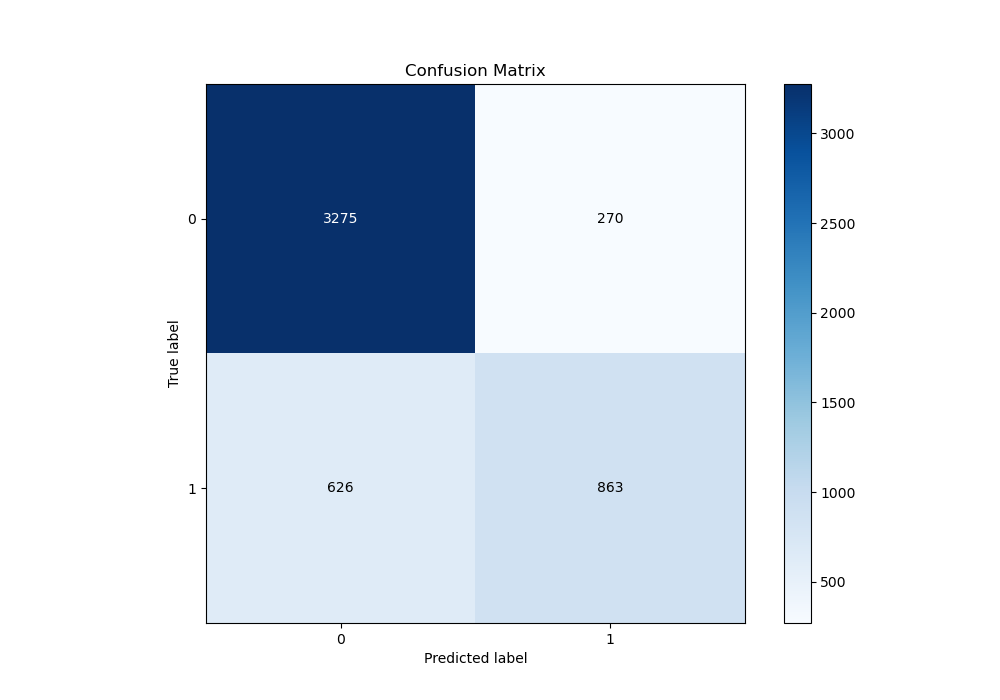
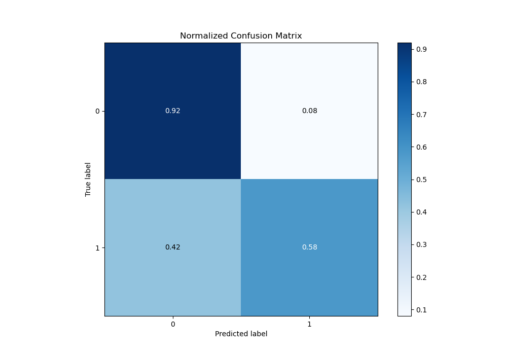
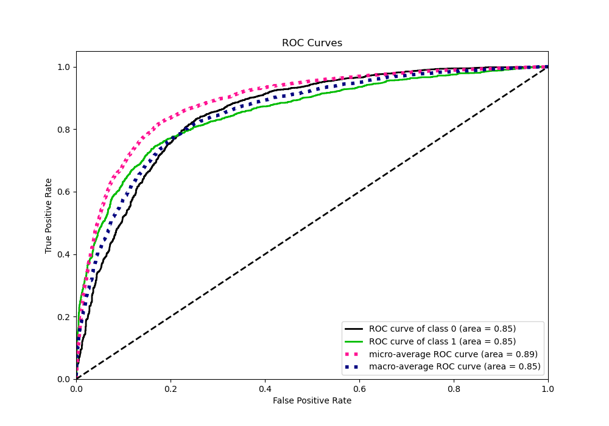
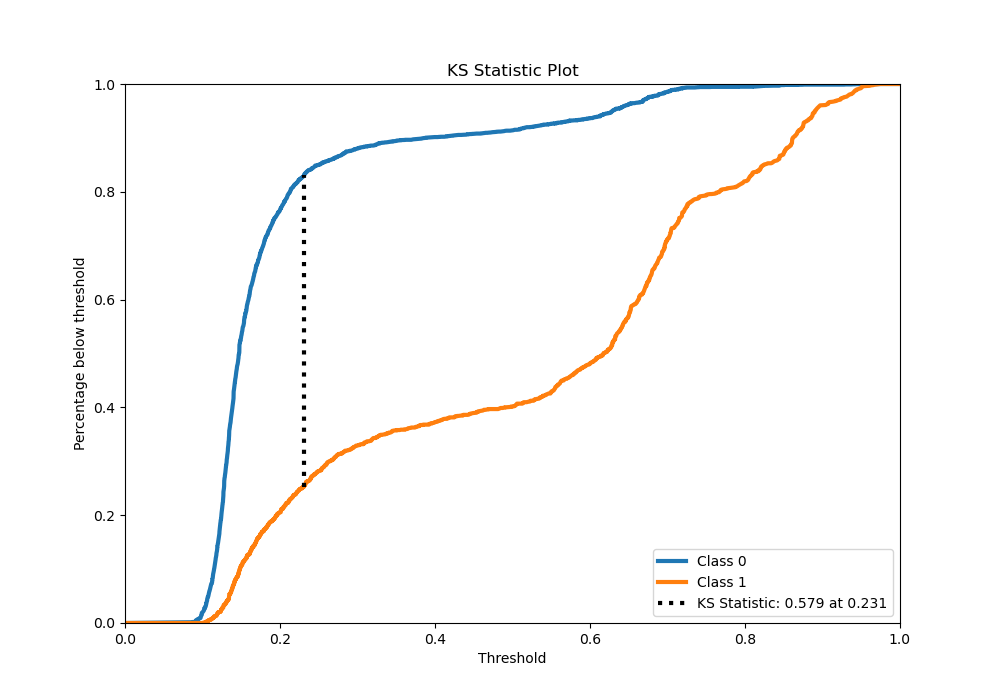
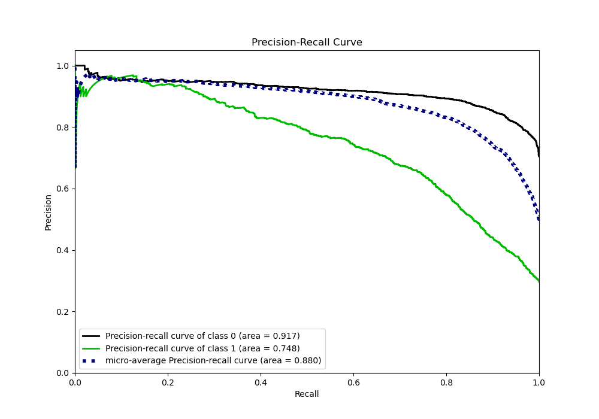
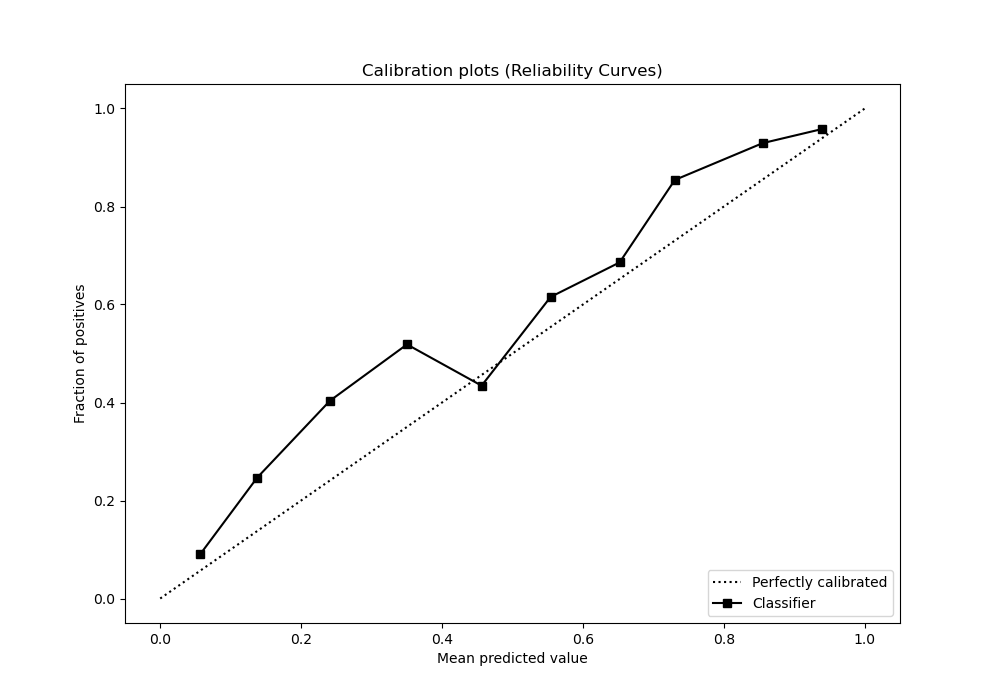
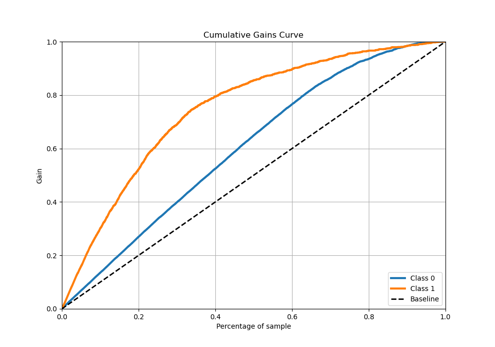
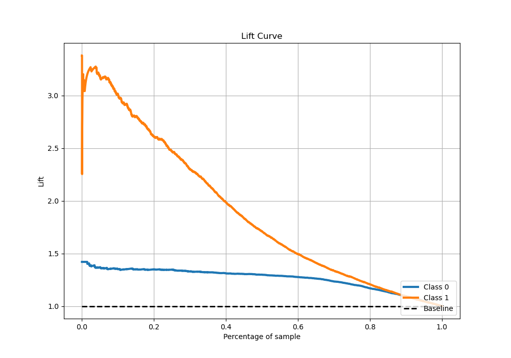

# Summary of 40_RandomForest

[<< Go back](../README.md)

## Random Forest
- **n_jobs**: -1
- **criterion**: entropy
- **max_features**: 0.7
- **min_samples_split**: 30
- **max_depth**: 4
- **eval_metric_name**: logloss
- **explain_level**: 0

## Validation
 - **validation_type**: kfold
 - **stratify**: True
 - **k_folds**: 5
 - **shuffle**: True
 - **random_seed**: 42

## Optimized metric
logloss

## Training time

21.4 seconds

## Metric details
|           |    score |   threshold |
|:----------|---------:|------------:|
| logloss   | 0.427432 |  nan        |
| auc       | 0.852304 |  nan        |
| f1        | 0.694199 |    0.233655 |
| accuracy  | 0.82201  |    0.538989 |
| precision | 0.967213 |    0.854239 |
| recall    | 1        |    0.076501 |
| mcc       | 0.557638 |    0.296257 |

## Metric details with threshold from accuracy metric
|           |    score |   threshold |
|:----------|---------:|------------:|
| logloss   | 0.427432 |  nan        |
| auc       | 0.852304 |  nan        |
| f1        | 0.658276 |    0.538989 |
| accuracy  | 0.82201  |    0.538989 |
| precision | 0.761695 |    0.538989 |
| recall    | 0.579584 |    0.538989 |
| mcc       | 0.550152 |    0.538989 |

## Confusion matrix (at threshold=0.538989)
|              |   Predicted as 0 |   Predicted as 1 |
|:-------------|-----------------:|-----------------:|
| Labeled as 0 |             3275 |              270 |
| Labeled as 1 |              626 |              863 |

## Learning curves

## Confusion Matrix

## Normalized Confusion Matrix

## ROC Curve

## Kolmogorov-Smirnov Statistic

## Precision-Recall Curve

## Calibration Curve

## Cumulative Gains Curve

## Lift Curve

[<< Go back](../README.md)
