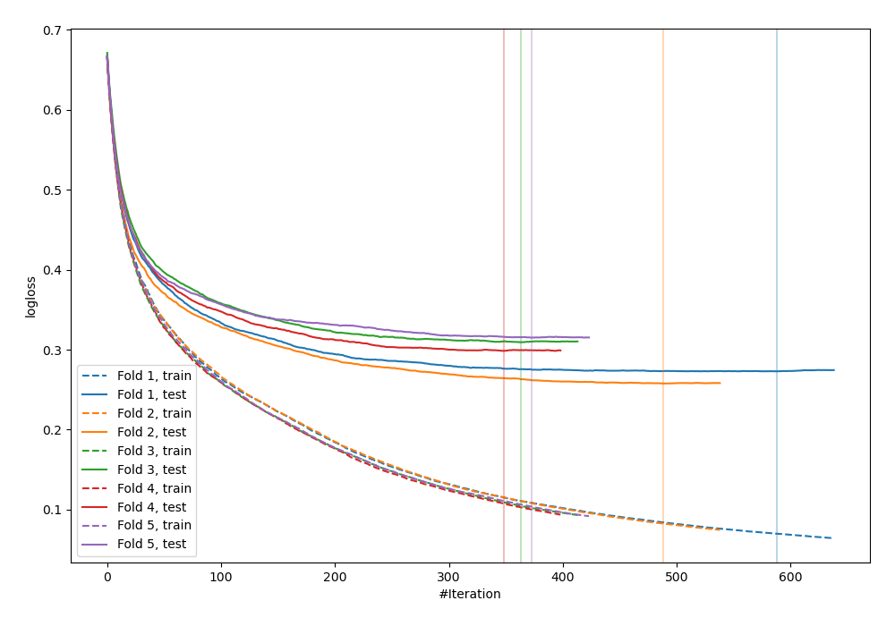
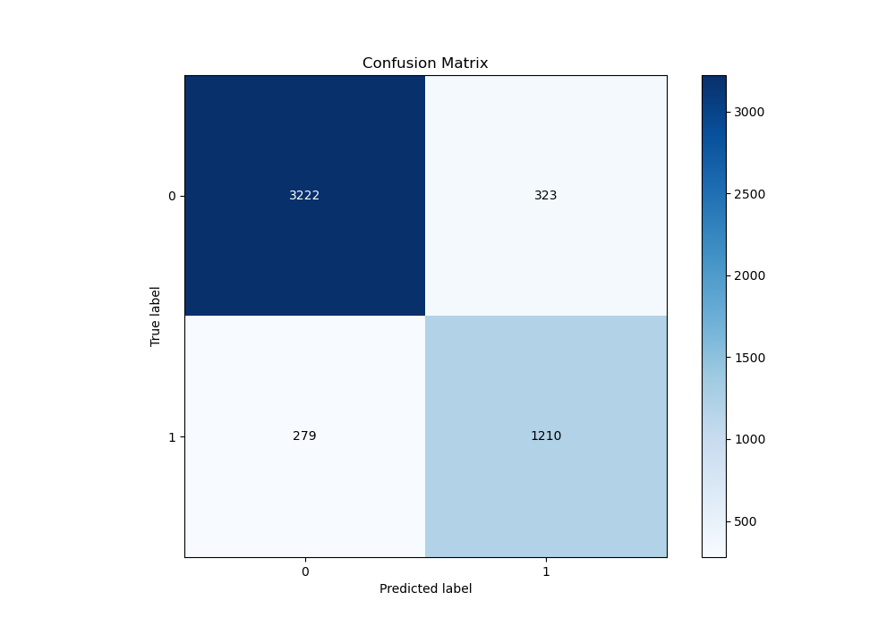
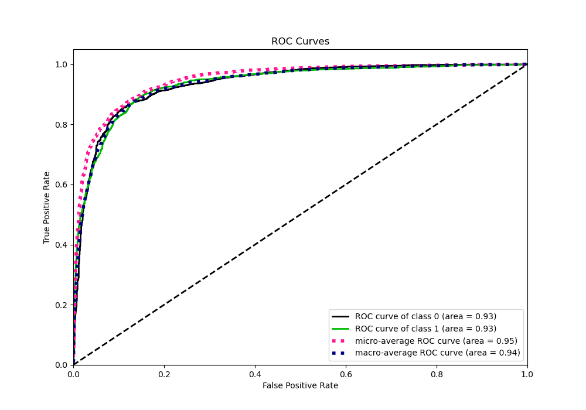
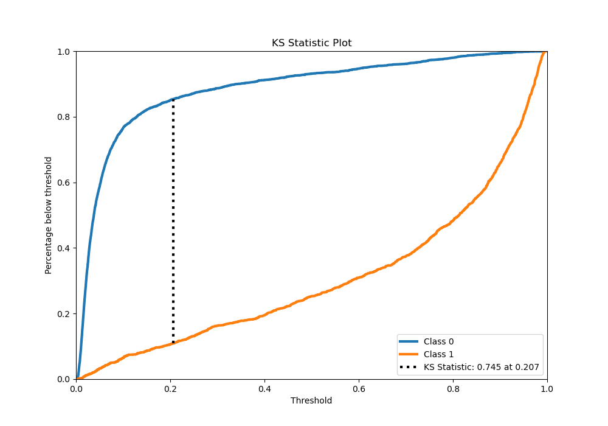
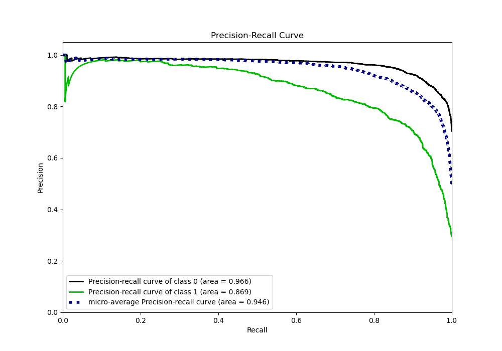
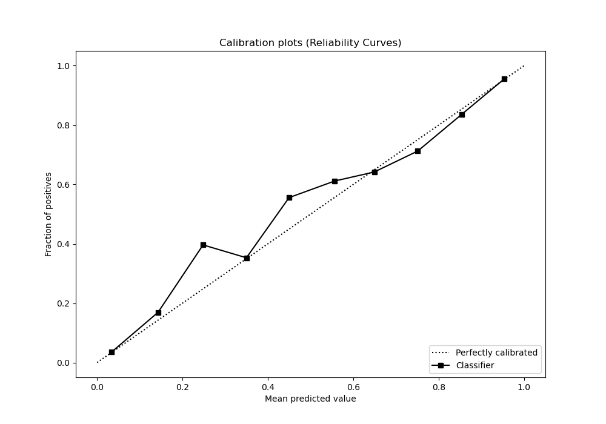
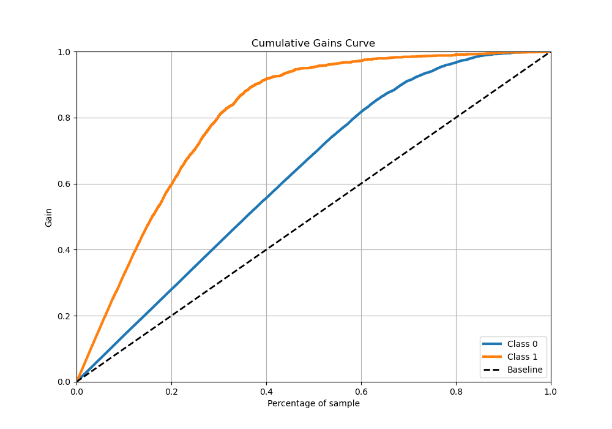
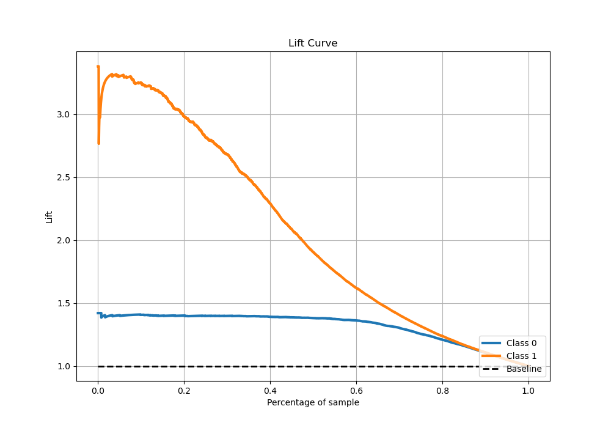

# Summary of 43_CatBoost

[<< Go back](../README.md)

## CatBoost
- **n_jobs**: -1
- **learning_rate**: 0.05
- **depth**: 9
- **rsm**: 0.9
- **loss_function**: Logloss
- **eval_metric**: Logloss
- **explain_level**: 0

## Validation
 - **validation_type**: kfold
 - **stratify**: True
 - **k_folds**: 5
 - **shuffle**: True
 - **random_seed**: 42

## Optimized metric
logloss

## Training time

145.5 seconds

## Metric details
|           |    score |    threshold |
|:----------|---------:|-------------:|
| logloss   | 0.290747 | nan          |
| auc       | 0.934899 | nan          |
| f1        | 0.800794 |   0.385897   |
| accuracy  | 0.880413 |   0.385897   |
| precision | 0.978799 |   0.952811   |
| recall    | 1        |   0.00130434 |
| mcc       | 0.715536 |   0.385897   |

## Metric details with threshold from accuracy metric
|           |    score |   threshold |
|:----------|---------:|------------:|
| logloss   | 0.290747 |  nan        |
| auc       | 0.934899 |  nan        |
| f1        | 0.800794 |    0.385897 |
| accuracy  | 0.880413 |    0.385897 |
| precision | 0.789302 |    0.385897 |
| recall    | 0.812626 |    0.385897 |
| mcc       | 0.715536 |    0.385897 |

## Confusion matrix (at threshold=0.385897)
|              |   Predicted as 0 |   Predicted as 1 |
|:-------------|-----------------:|-----------------:|
| Labeled as 0 |             3222 |              323 |
| Labeled as 1 |              279 |             1210 |

## Learning curves

## Confusion Matrix

## Normalized Confusion Matrix

## ROC Curve

## Kolmogorov-Smirnov Statistic

## Precision-Recall Curve

## Calibration Curve

## Cumulative Gains Curve

## Lift Curve

[<< Go back](../README.md)
