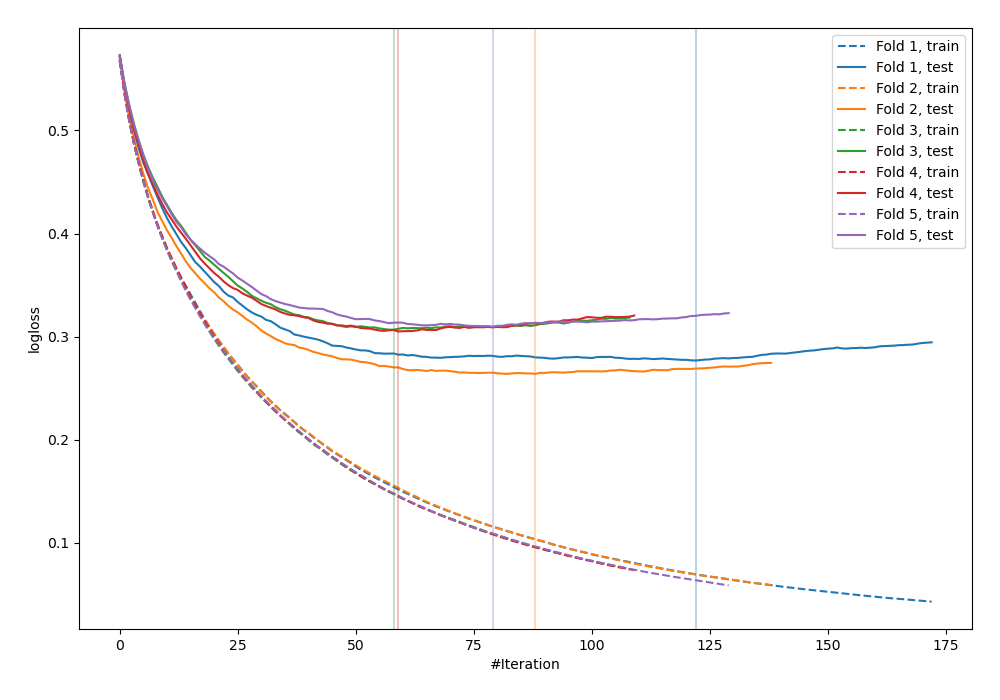
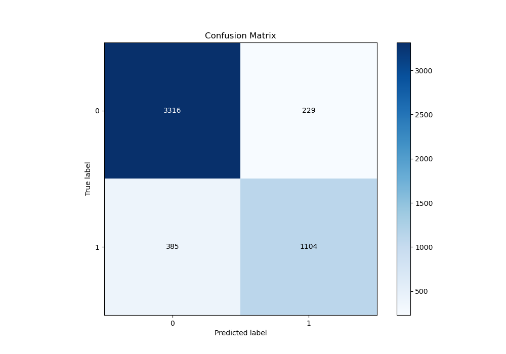
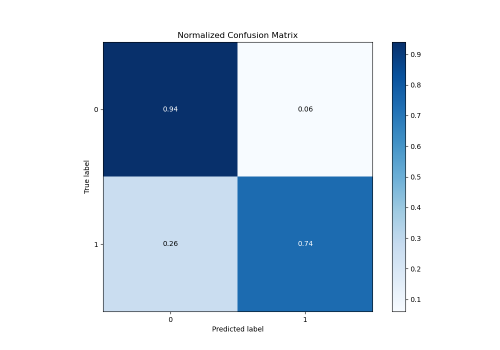
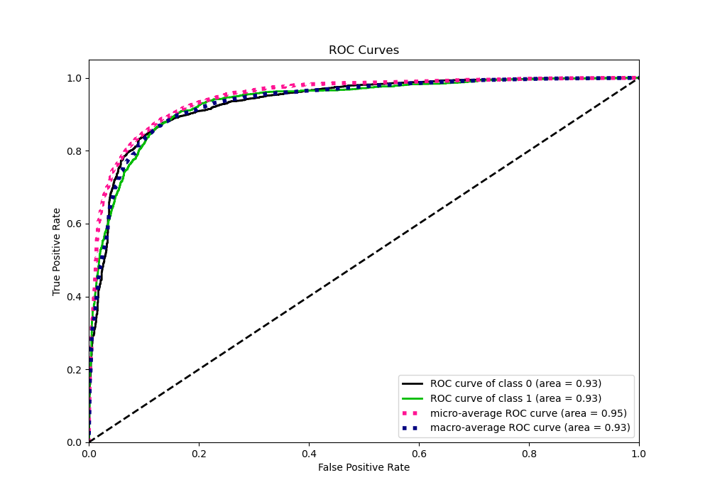
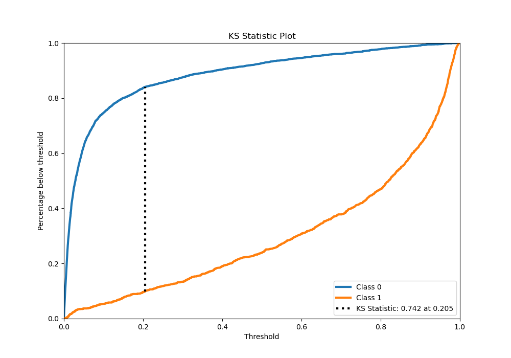
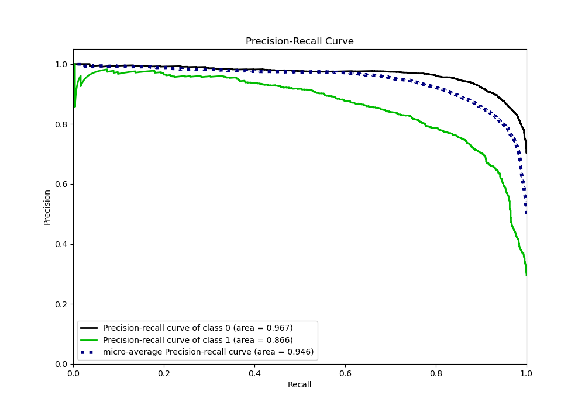
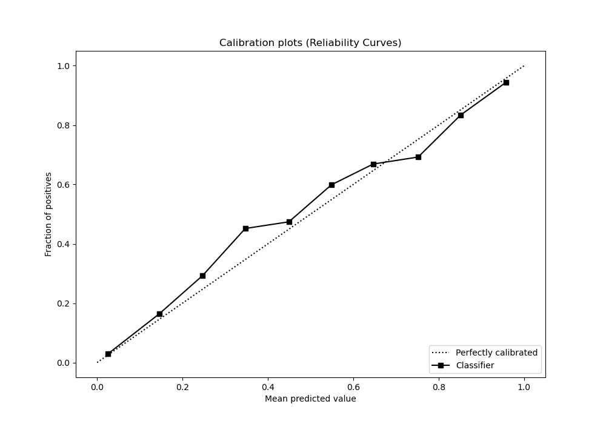
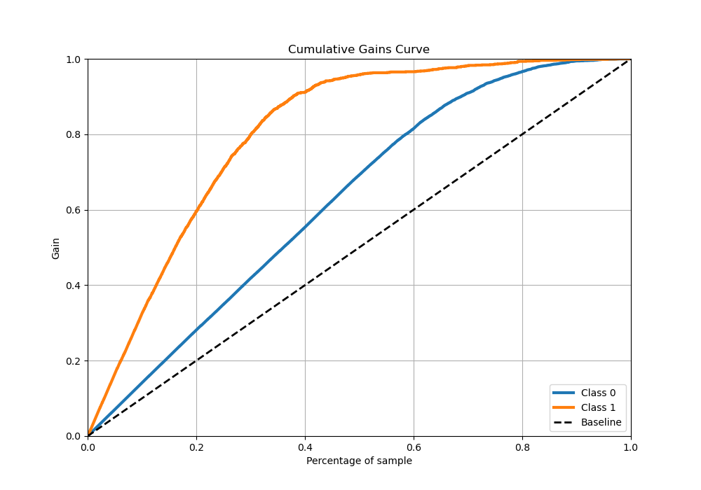
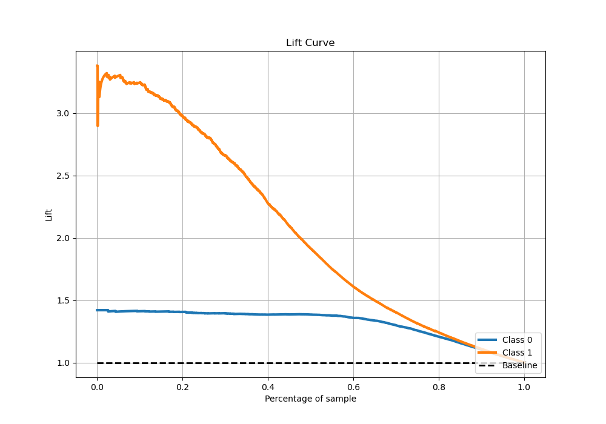

# Summary of 48_LightGBM

[<< Go back](../README.md)

## LightGBM
- **n_jobs**: -1
- **objective**: binary
- **num_leaves**: 127
- **learning_rate**: 0.1
- **feature_fraction**: 1.0
- **bagging_fraction**: 0.9
- **min_data_in_leaf**: 50
- **metric**: binary_logloss
- **custom_eval_metric_name**: None
- **explain_level**: 0

## Validation
 - **validation_type**: kfold
 - **stratify**: True
 - **k_folds**: 5
 - **shuffle**: True
 - **random_seed**: 42

## Optimized metric
logloss

## Training time

9.8 seconds

## Metric details
|           |    score |     threshold |
|:----------|---------:|--------------:|
| logloss   | 0.292437 | nan           |
| auc       | 0.93422  | nan           |
| f1        | 0.800757 |   0.319781    |
| accuracy  | 0.878029 |   0.536855    |
| precision | 0.977444 |   0.978079    |
| recall    | 1        |   8.76592e-06 |
| mcc       | 0.712445 |   0.319781    |

## Metric details with threshold from accuracy metric
|           |    score |   threshold |
|:----------|---------:|------------:|
| logloss   | 0.292437 |  nan        |
| auc       | 0.93422  |  nan        |
| f1        | 0.782424 |    0.536855 |
| accuracy  | 0.878029 |    0.536855 |
| precision | 0.828207 |    0.536855 |
| recall    | 0.741437 |    0.536855 |
| mcc       | 0.70011  |    0.536855 |

## Confusion matrix (at threshold=0.536855)
|              |   Predicted as 0 |   Predicted as 1 |
|:-------------|-----------------:|-----------------:|
| Labeled as 0 |             3316 |              229 |
| Labeled as 1 |              385 |             1104 |

## Learning curves

## Confusion Matrix

## Normalized Confusion Matrix

## ROC Curve

## Kolmogorov-Smirnov Statistic

## Precision-Recall Curve

## Calibration Curve

## Cumulative Gains Curve

## Lift Curve

[<< Go back](../README.md)
