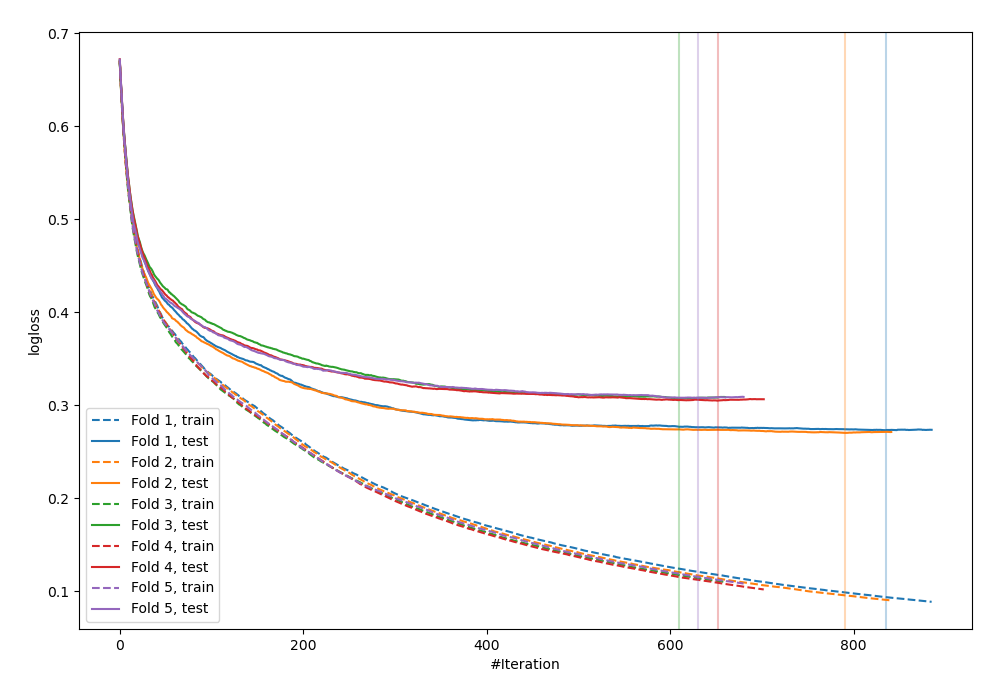
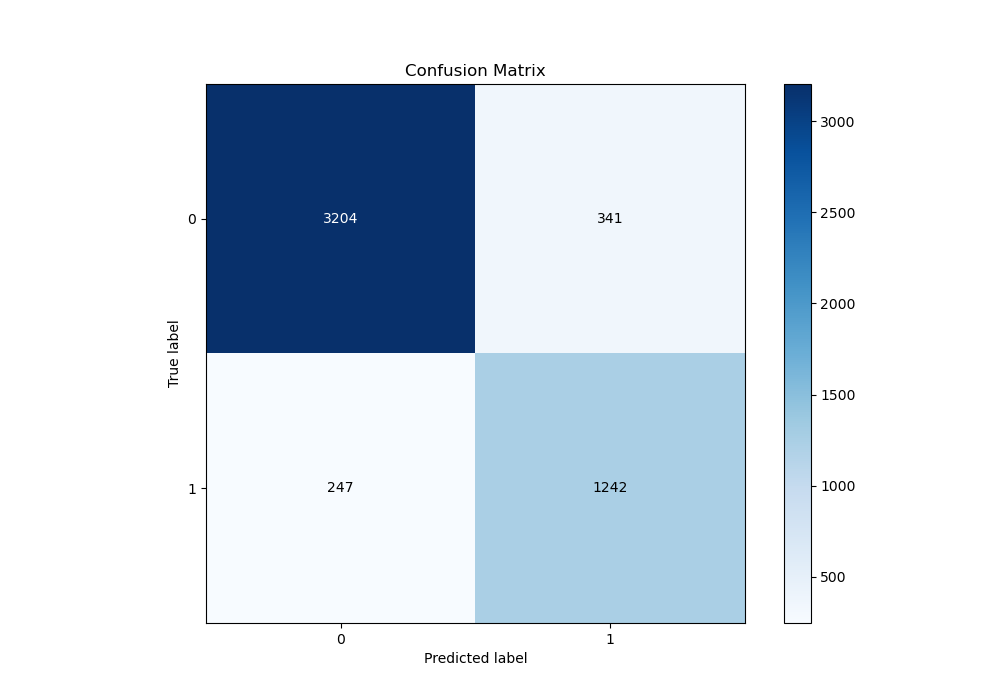
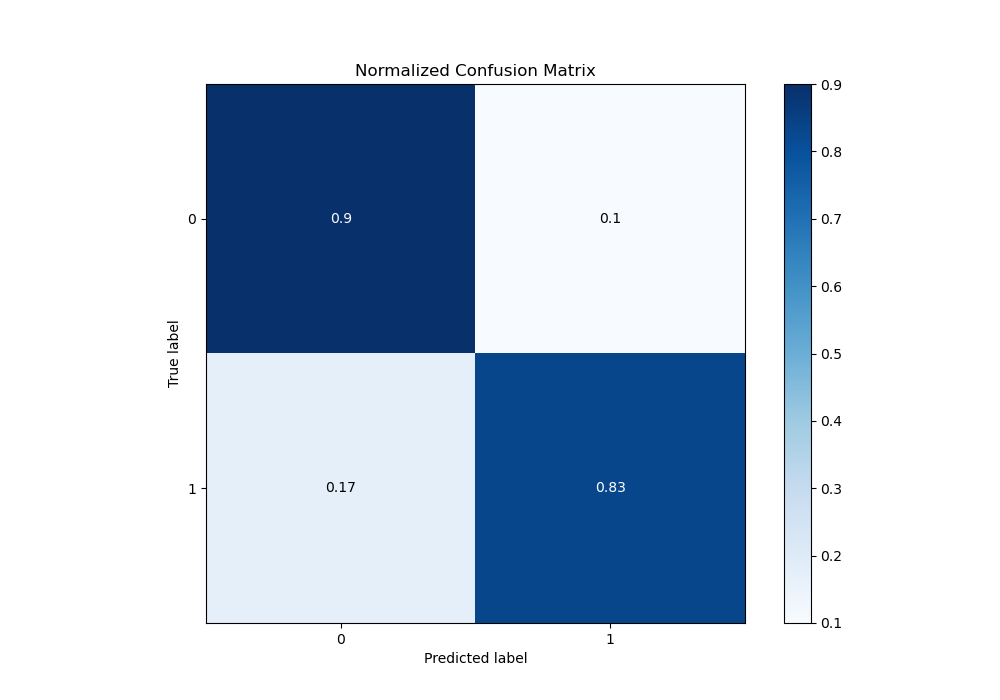
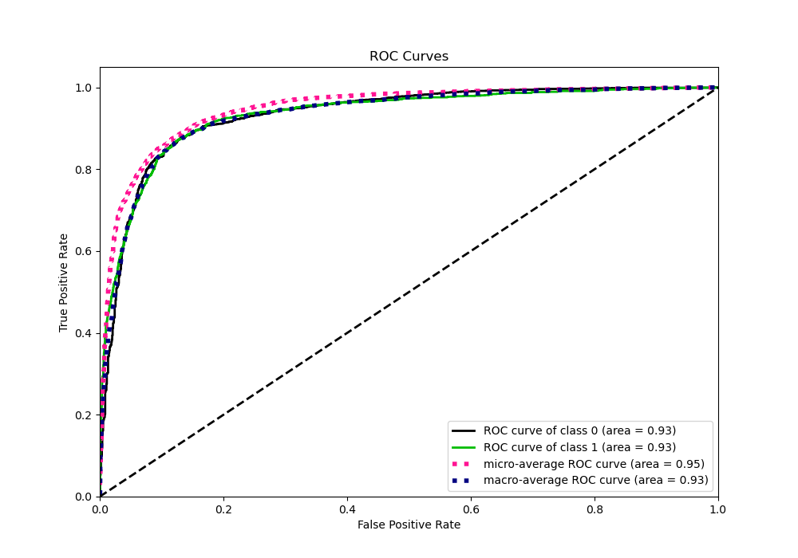
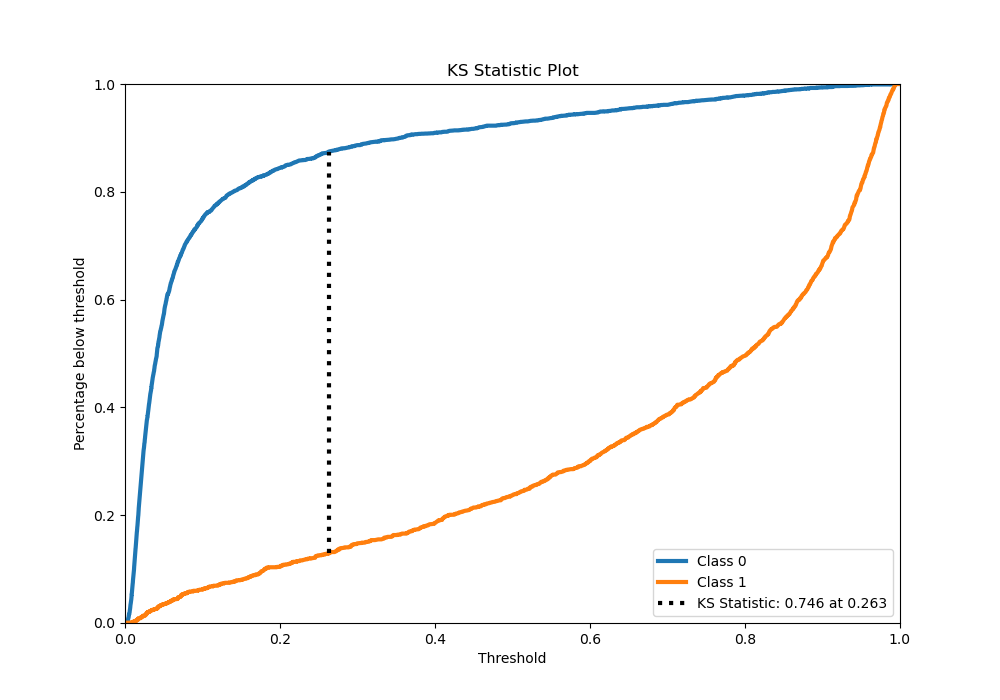
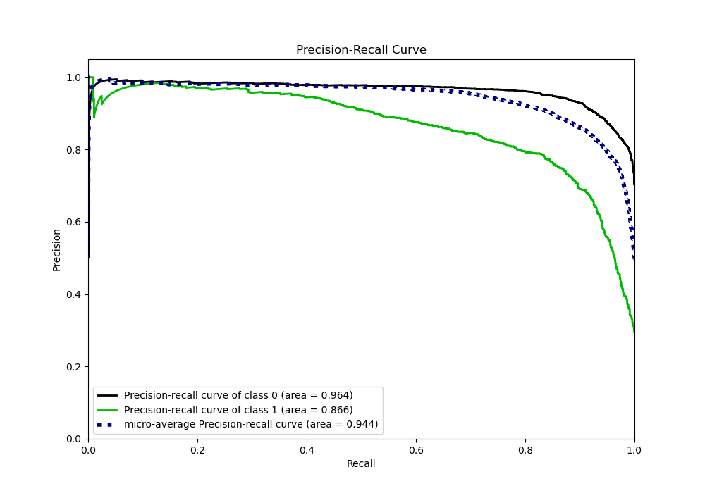
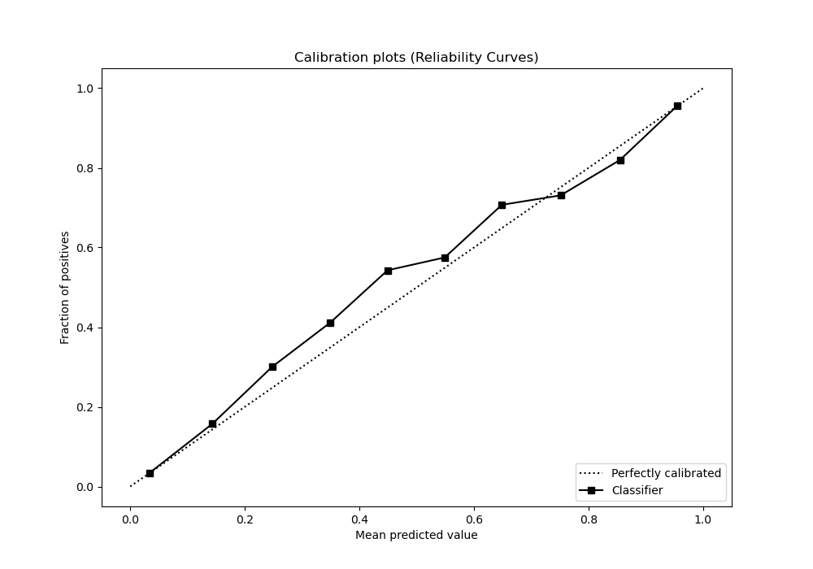
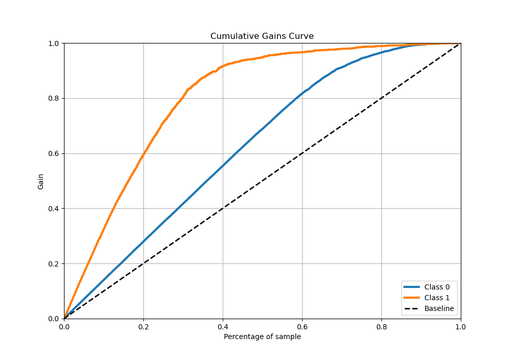
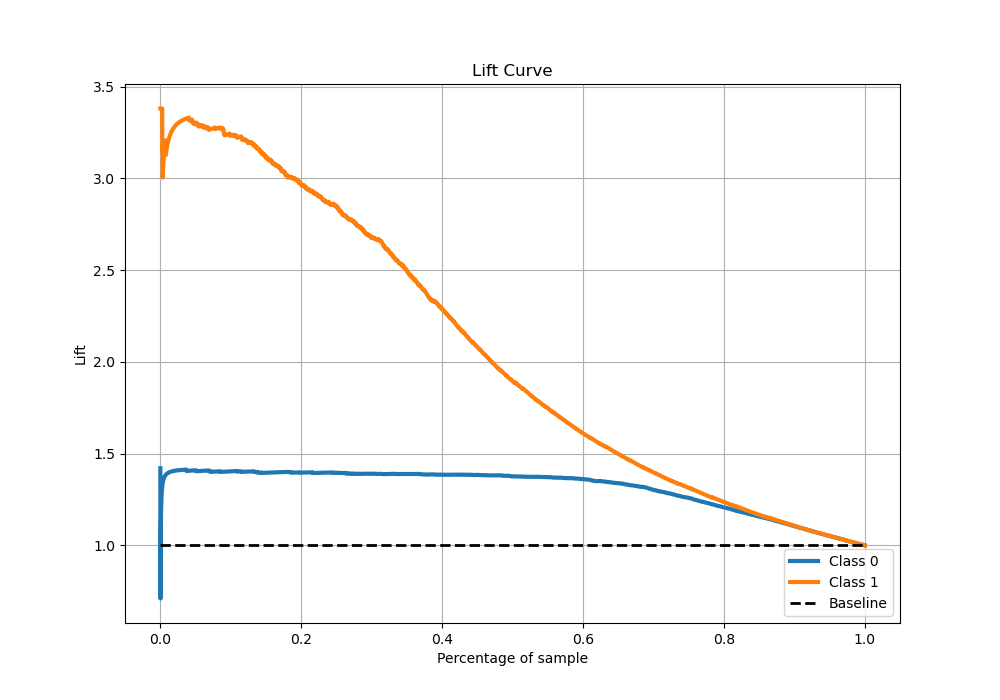

# Summary of 49_CatBoost

[<< Go back](../README.md)

## CatBoost
- **n_jobs**: -1
- **learning_rate**: 0.05
- **depth**: 6
- **rsm**: 0.9
- **loss_function**: Logloss
- **eval_metric**: Logloss
- **explain_level**: 0

## Validation
 - **validation_type**: kfold
 - **stratify**: True
 - **k_folds**: 5
 - **shuffle**: True
 - **random_seed**: 42

## Optimized metric
logloss

## Training time

42.2 seconds

## Metric details
|           |    score |    threshold |
|:----------|---------:|-------------:|
| logloss   | 0.292742 | nan          |
| auc       | 0.93239  | nan          |
| f1        | 0.808594 |   0.362938   |
| accuracy  | 0.883194 |   0.362938   |
| precision | 0.983607 |   0.966269   |
| recall    | 1        |   0.00166461 |
| mcc       | 0.725362 |   0.362938   |

## Metric details with threshold from accuracy metric
|           |    score |   threshold |
|:----------|---------:|------------:|
| logloss   | 0.292742 |  nan        |
| auc       | 0.93239  |  nan        |
| f1        | 0.808594 |    0.362938 |
| accuracy  | 0.883194 |    0.362938 |
| precision | 0.784586 |    0.362938 |
| recall    | 0.834117 |    0.362938 |
| mcc       | 0.725362 |    0.362938 |

## Confusion matrix (at threshold=0.362938)
|              |   Predicted as 0 |   Predicted as 1 |
|:-------------|-----------------:|-----------------:|
| Labeled as 0 |             3204 |              341 |
| Labeled as 1 |              247 |             1242 |

## Learning curves

## Confusion Matrix

## Normalized Confusion Matrix

## ROC Curve

## Kolmogorov-Smirnov Statistic

## Precision-Recall Curve

## Calibration Curve

## Cumulative Gains Curve

## Lift Curve

[<< Go back](../README.md)
