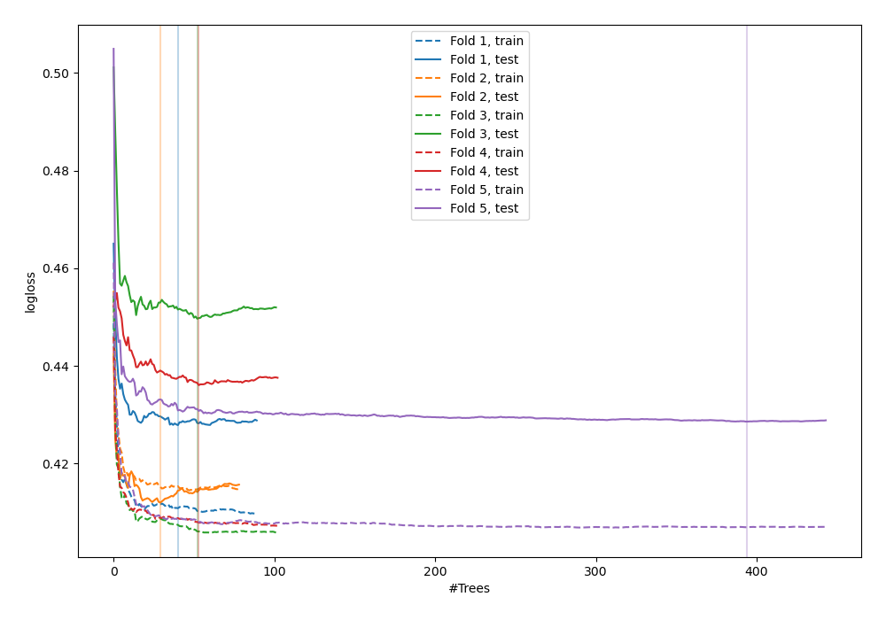
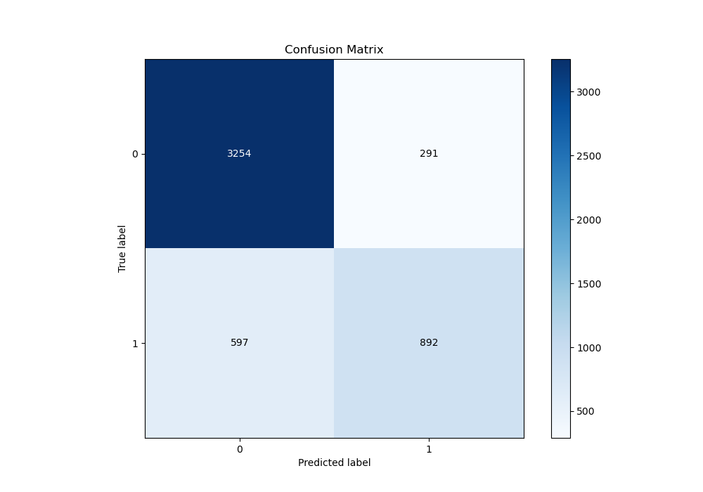
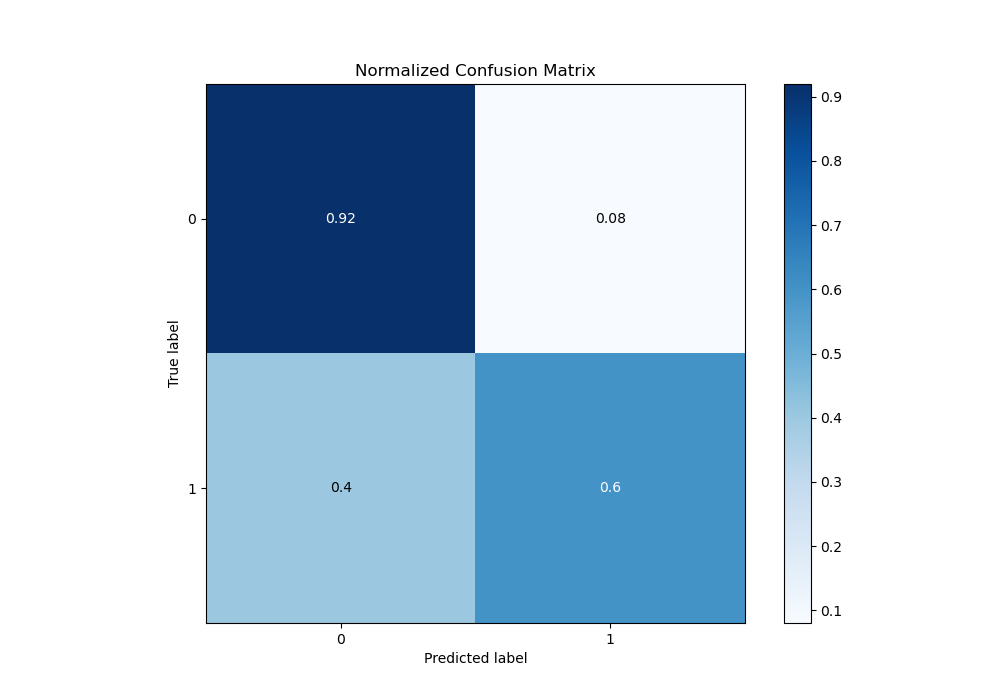
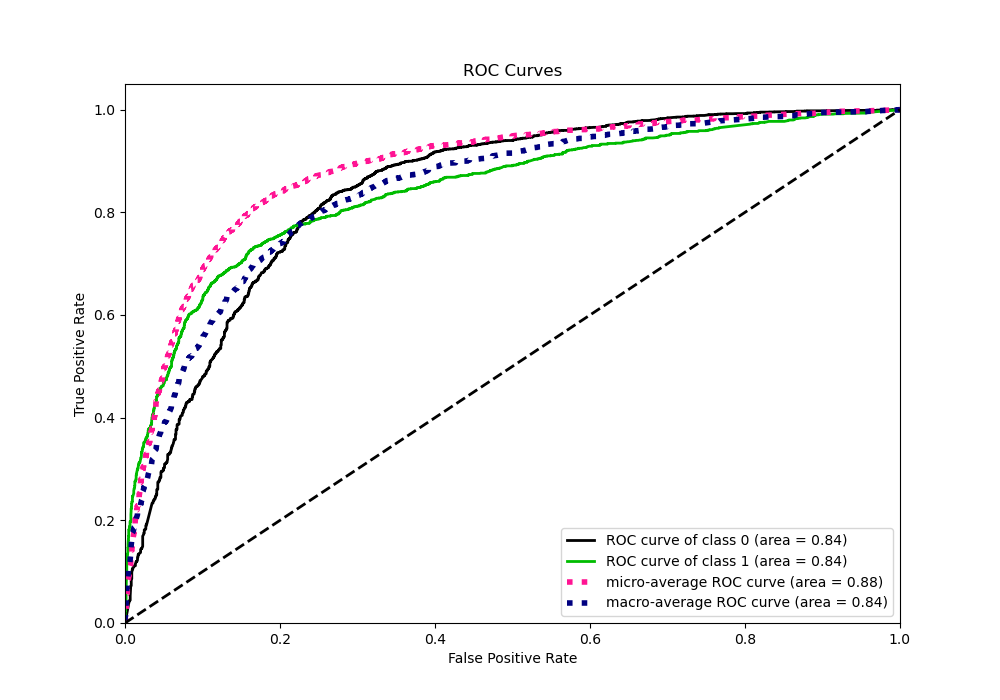
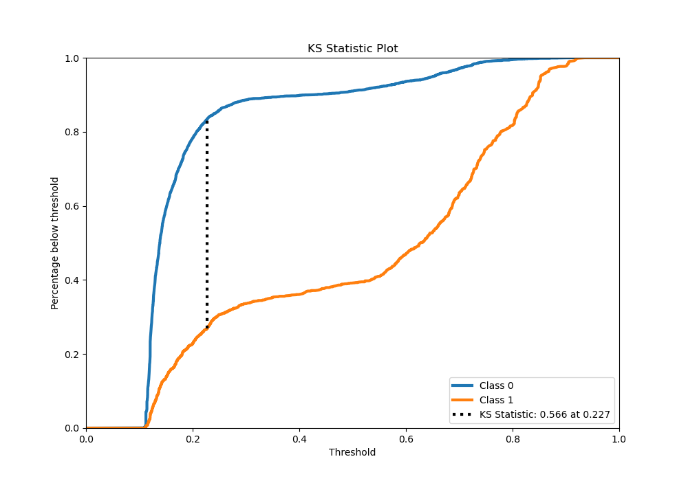
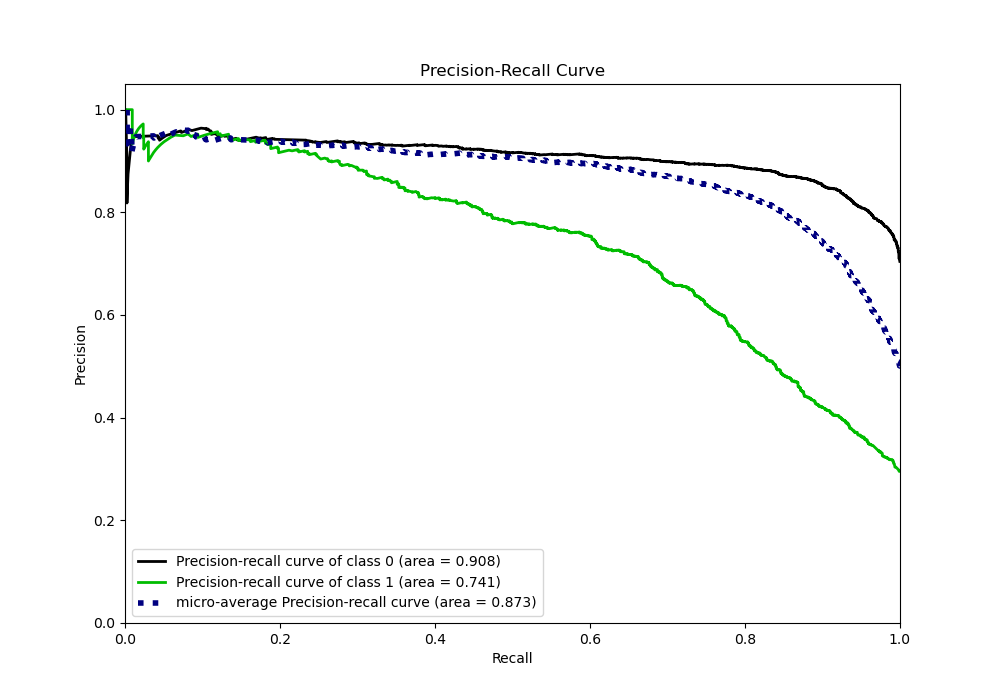
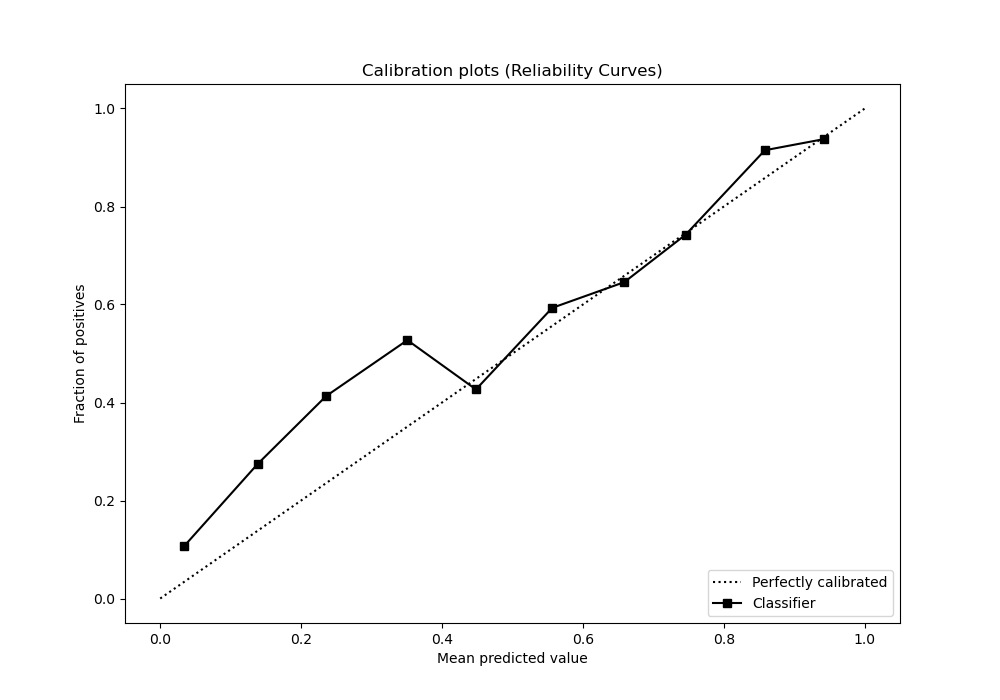
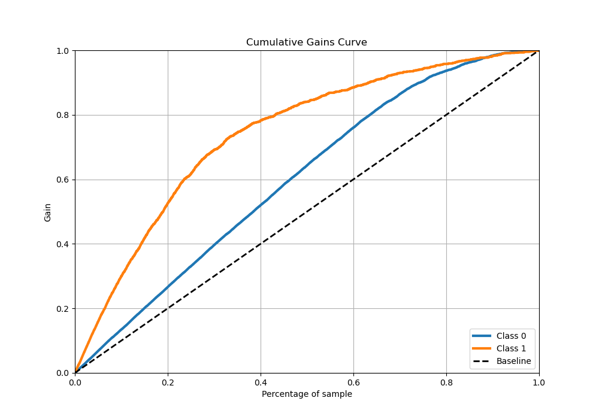
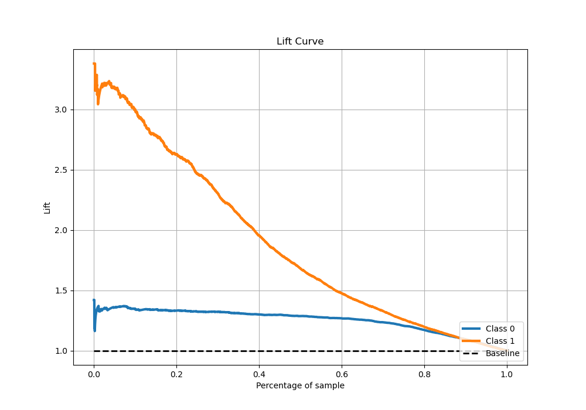

# Summary of 4_Default_RandomForest

[<< Go back](../README.md)

## Random Forest
- **n_jobs**: -1
- **criterion**: gini
- **max_features**: 0.9
- **min_samples_split**: 30
- **max_depth**: 4
- **eval_metric_name**: logloss
- **explain_level**: 0

## Validation
 - **validation_type**: kfold
 - **stratify**: True
 - **k_folds**: 5
 - **shuffle**: True
 - **random_seed**: 42

## Optimized metric
logloss

## Training time

26.7 seconds

## Metric details
|           |    score |   threshold |
|:----------|---------:|------------:|
| logloss   | 0.430844 | nan         |
| auc       | 0.843349 | nan         |
| f1        | 0.688569 |   0.282341  |
| accuracy  | 0.8236   |   0.535673  |
| precision | 0.956284 |   0.829285  |
| recall    | 1        |   0.0972225 |
| mcc       | 0.562548 |   0.305084  |

## Metric details with threshold from accuracy metric
|           |    score |   threshold |
|:----------|---------:|------------:|
| logloss   | 0.430844 |  nan        |
| auc       | 0.843349 |  nan        |
| f1        | 0.667665 |    0.535673 |
| accuracy  | 0.8236   |    0.535673 |
| precision | 0.754015 |    0.535673 |
| recall    | 0.59906  |    0.535673 |
| mcc       | 0.556472 |    0.535673 |

## Confusion matrix (at threshold=0.535673)
|              |   Predicted as 0 |   Predicted as 1 |
|:-------------|-----------------:|-----------------:|
| Labeled as 0 |             3254 |              291 |
| Labeled as 1 |              597 |              892 |

## Learning curves

## Confusion Matrix

## Normalized Confusion Matrix

## ROC Curve

## Kolmogorov-Smirnov Statistic

## Precision-Recall Curve

## Calibration Curve

## Cumulative Gains Curve

## Lift Curve

[<< Go back](../README.md)
