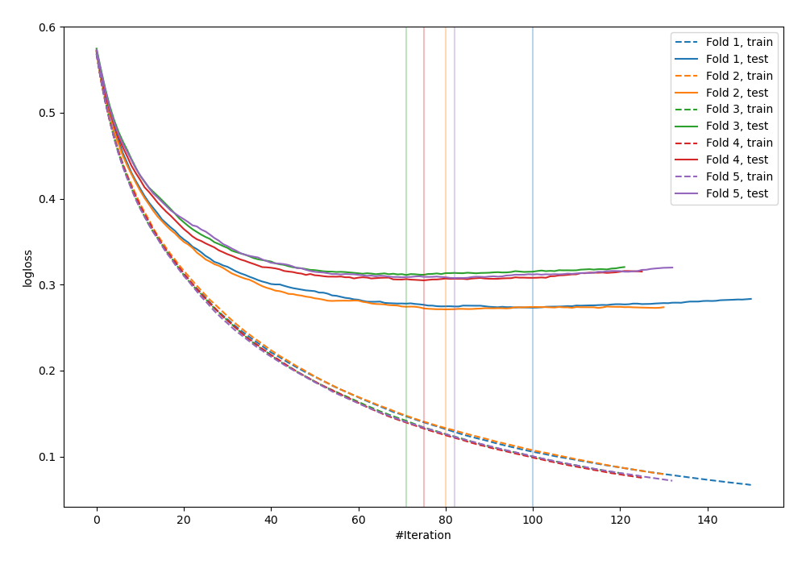
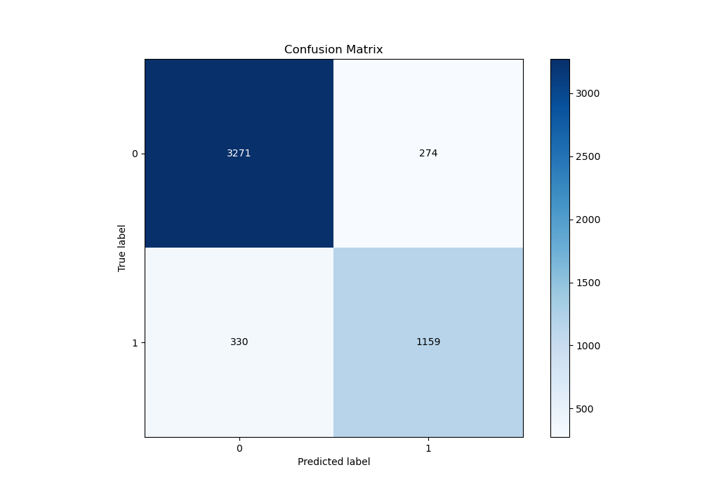
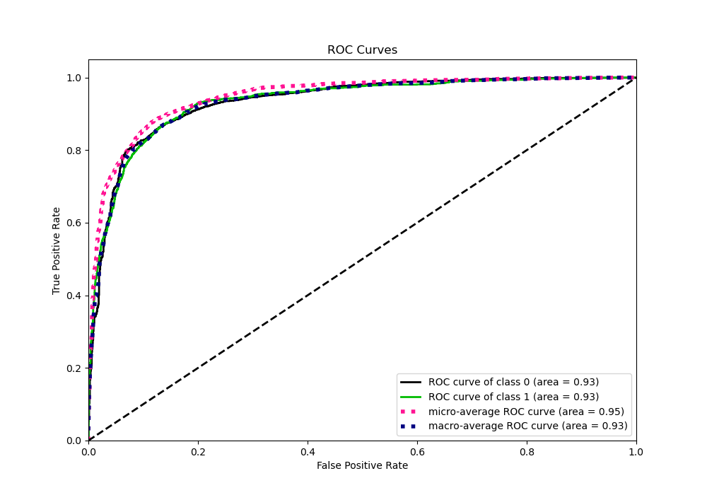
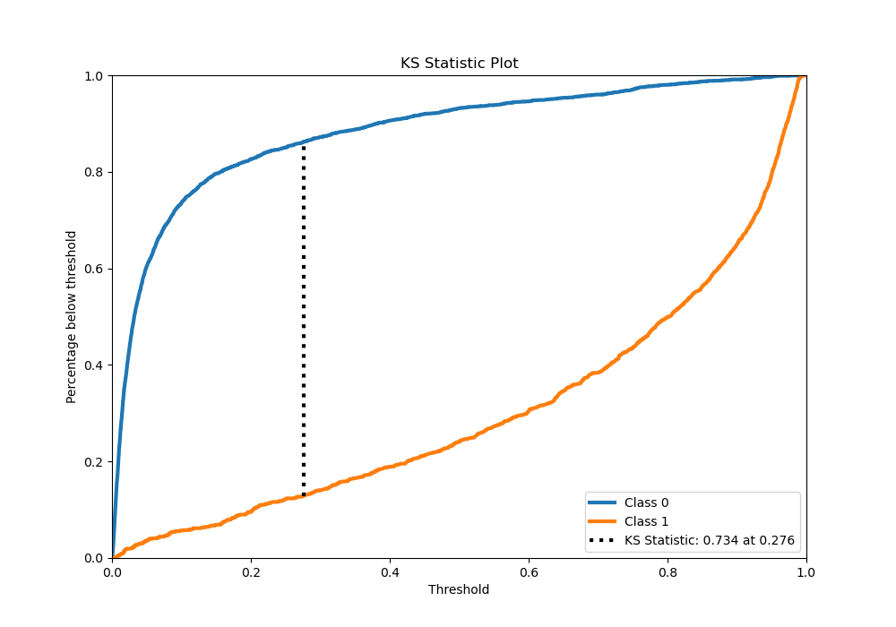
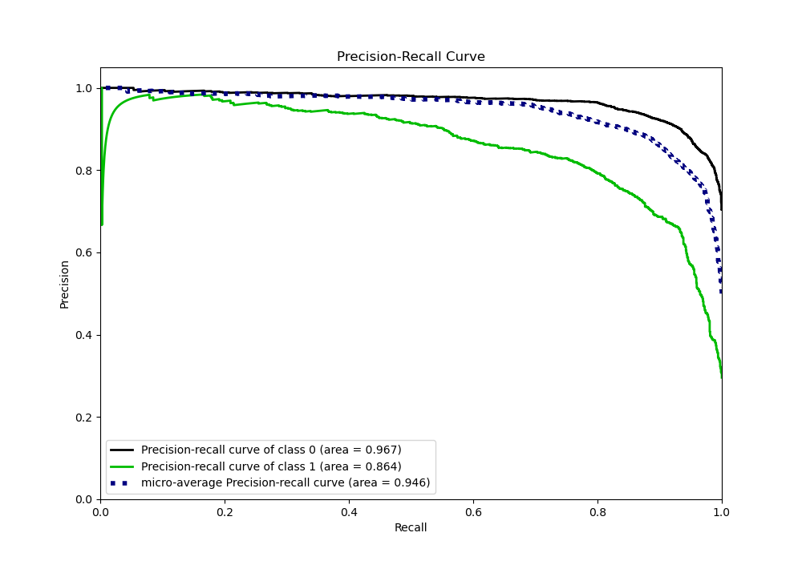
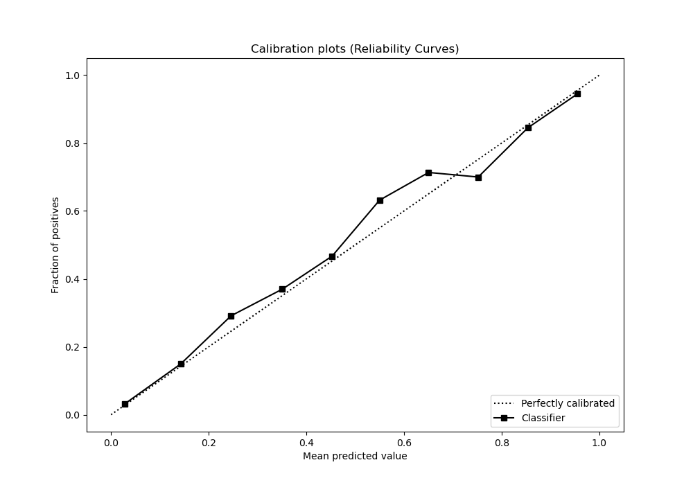
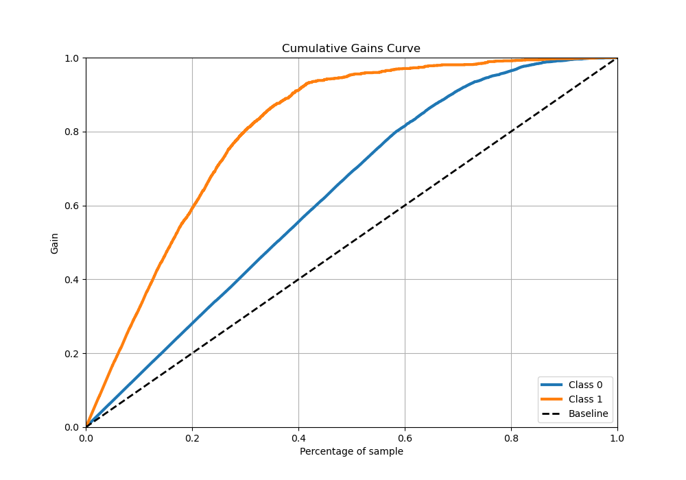
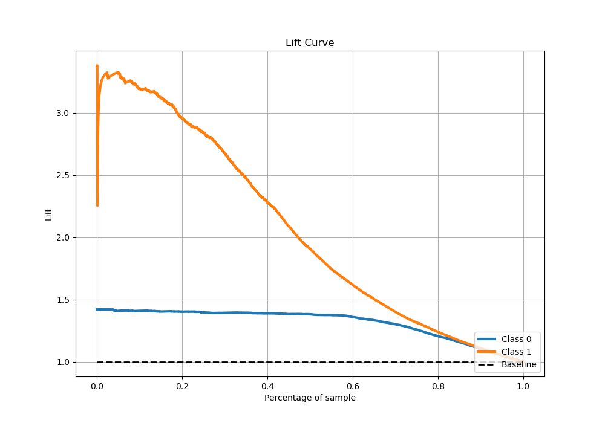

# Summary of 50_LightGBM

[<< Go back](../README.md)

## LightGBM
- **n_jobs**: -1
- **objective**: binary
- **num_leaves**: 95
- **learning_rate**: 0.1
- **feature_fraction**: 0.5
- **bagging_fraction**: 0.5
- **min_data_in_leaf**: 50
- **metric**: binary_logloss
- **custom_eval_metric_name**: None
- **explain_level**: 0

## Validation
 - **validation_type**: kfold
 - **stratify**: True
 - **k_folds**: 5
 - **shuffle**: True
 - **random_seed**: 42

## Optimized metric
logloss

## Training time

14.7 seconds

## Metric details
|           |    score |    threshold |
|:----------|---------:|-------------:|
| logloss   | 0.293602 | nan          |
| auc       | 0.933243 | nan          |
| f1        | 0.797485 |   0.406718   |
| accuracy  | 0.880016 |   0.471922   |
| precision | 0.982833 |   0.960547   |
| recall    | 1        |   4.5252e-05 |
| mcc       | 0.710807 |   0.406718   |

## Metric details with threshold from accuracy metric
|           |    score |   threshold |
|:----------|---------:|------------:|
| logloss   | 0.293602 |  nan        |
| auc       | 0.933243 |  nan        |
| f1        | 0.793292 |    0.471922 |
| accuracy  | 0.880016 |    0.471922 |
| precision | 0.808793 |    0.471922 |
| recall    | 0.778375 |    0.471922 |
| mcc       | 0.709072 |    0.471922 |

## Confusion matrix (at threshold=0.471922)
|              |   Predicted as 0 |   Predicted as 1 |
|:-------------|-----------------:|-----------------:|
| Labeled as 0 |             3271 |              274 |
| Labeled as 1 |              330 |             1159 |

## Learning curves

## Confusion Matrix

## Normalized Confusion Matrix

## ROC Curve

## Kolmogorov-Smirnov Statistic

## Precision-Recall Curve

## Calibration Curve

## Cumulative Gains Curve

## Lift Curve

[<< Go back](../README.md)
