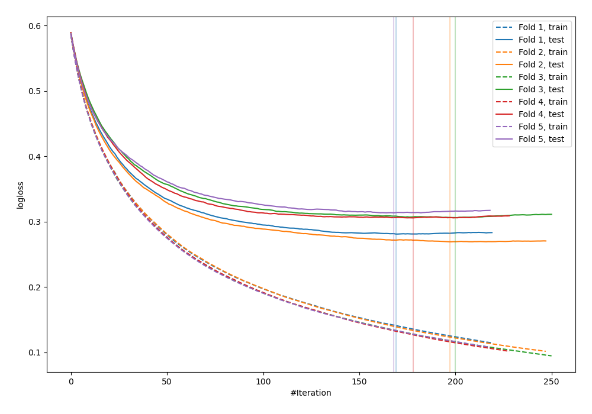
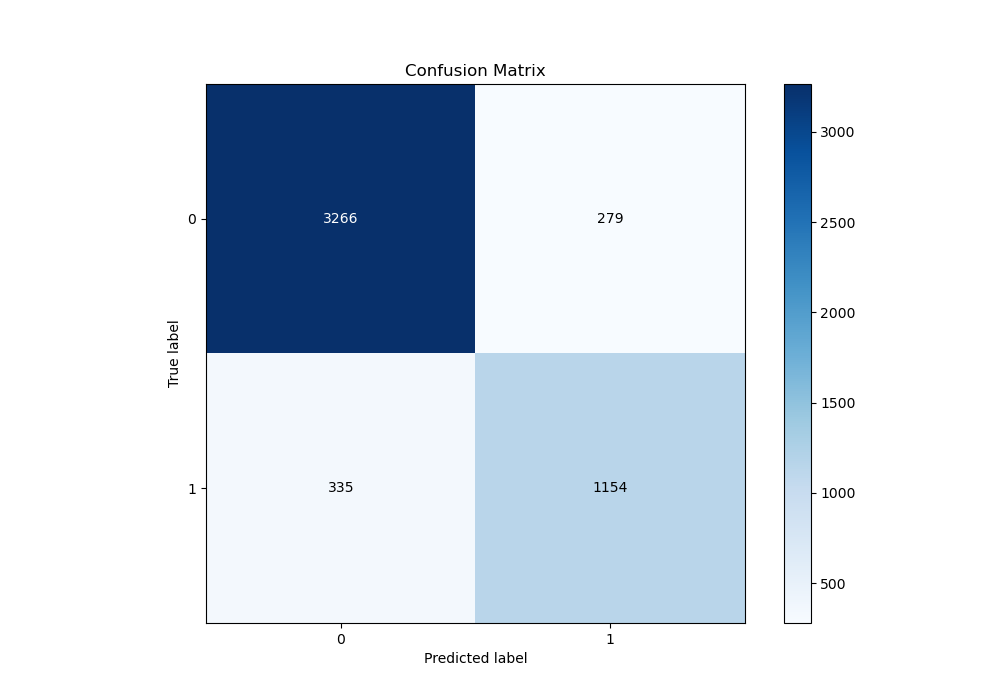
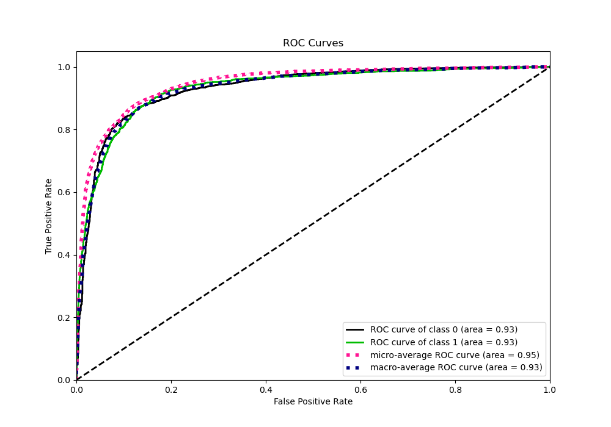
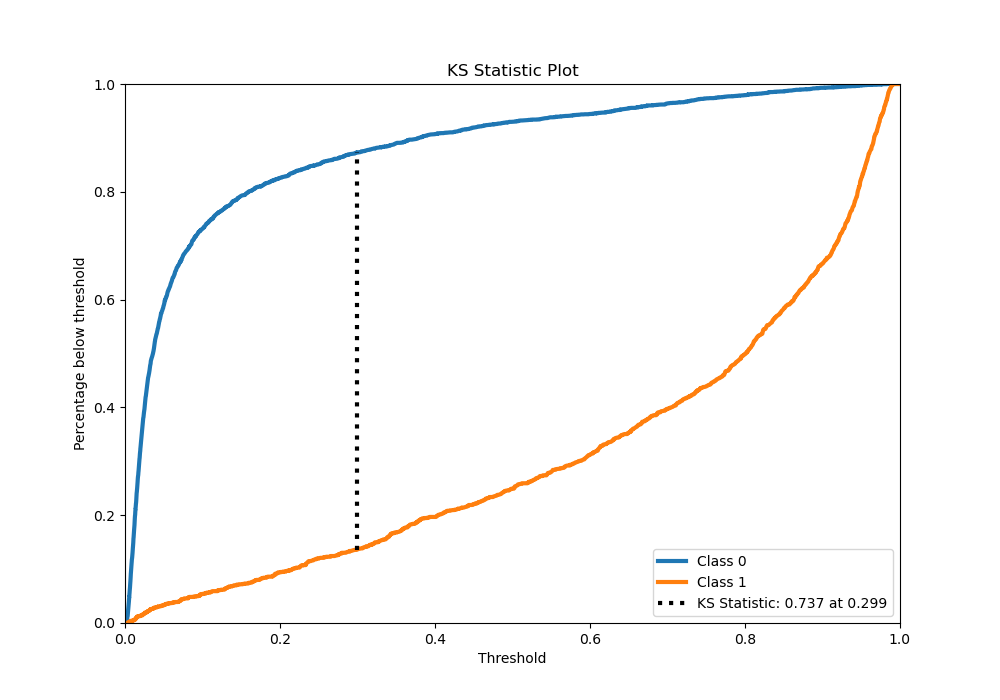
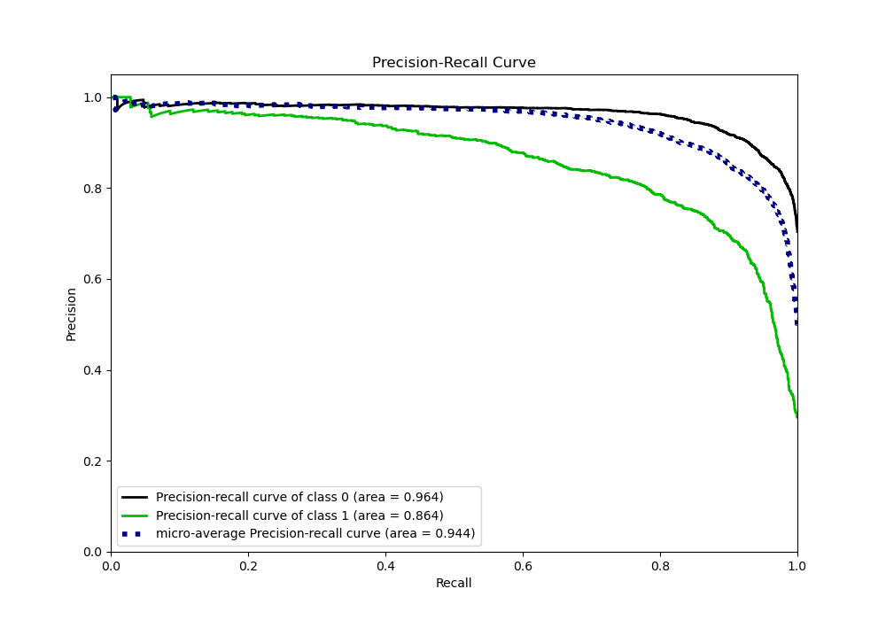
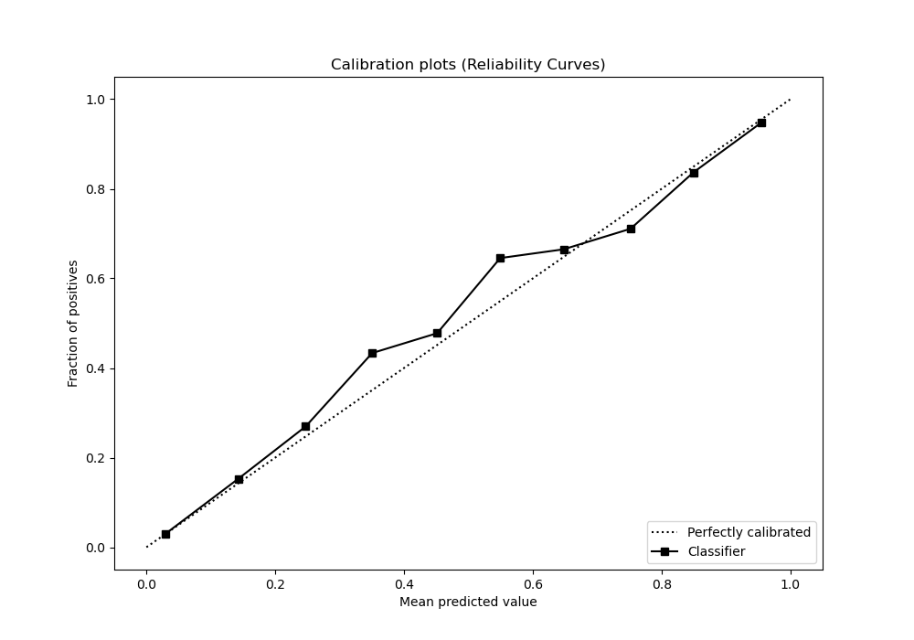
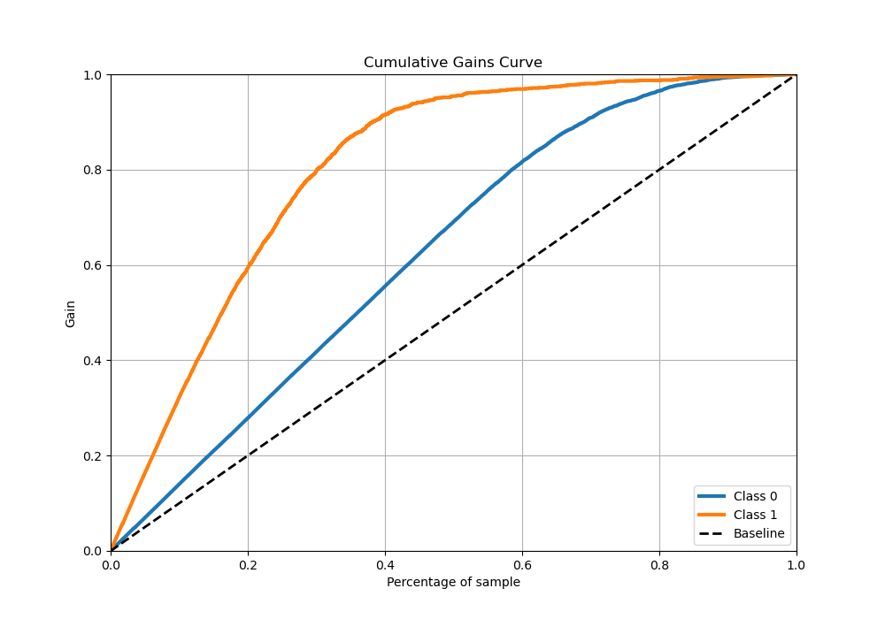
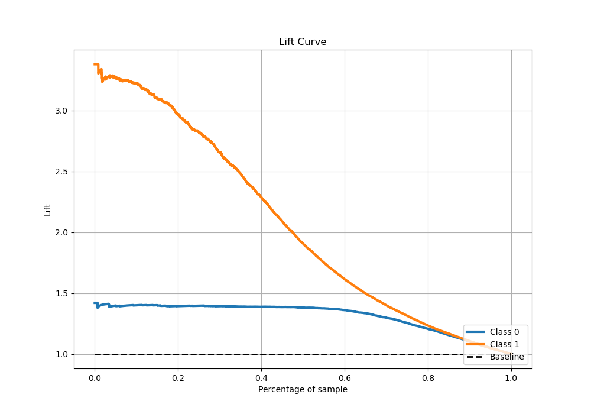

# Summary of 54_LightGBM

[<< Go back](../README.md)

## LightGBM
- **n_jobs**: -1
- **objective**: binary
- **num_leaves**: 31
- **learning_rate**: 0.05
- **feature_fraction**: 0.9
- **bagging_fraction**: 1.0
- **min_data_in_leaf**: 20
- **metric**: binary_logloss
- **custom_eval_metric_name**: None
- **explain_level**: 0

## Validation
 - **validation_type**: kfold
 - **stratify**: True
 - **k_folds**: 5
 - **shuffle**: True
 - **random_seed**: 42

## Optimized metric
logloss

## Training time

15.7 seconds

## Metric details
|           |    score |   threshold |
|:----------|---------:|------------:|
| logloss   | 0.295024 |  nan        |
| auc       | 0.932024 |  nan        |
| f1        | 0.79702  |    0.302612 |
| accuracy  | 0.878029 |    0.458833 |
| precision | 0.975904 |    0.977263 |
| recall    | 1        |    0.001186 |
| mcc       | 0.706909 |    0.327451 |

## Metric details with threshold from accuracy metric
|           |    score |   threshold |
|:----------|---------:|------------:|
| logloss   | 0.295024 |  nan        |
| auc       | 0.932024 |  nan        |
| f1        | 0.78987  |    0.458833 |
| accuracy  | 0.878029 |    0.458833 |
| precision | 0.805304 |    0.458833 |
| recall    | 0.775017 |    0.458833 |
| mcc       | 0.704249 |    0.458833 |

## Confusion matrix (at threshold=0.458833)
|              |   Predicted as 0 |   Predicted as 1 |
|:-------------|-----------------:|-----------------:|
| Labeled as 0 |             3266 |              279 |
| Labeled as 1 |              335 |             1154 |

## Learning curves

## Confusion Matrix

## Normalized Confusion Matrix

## ROC Curve

## Kolmogorov-Smirnov Statistic

## Precision-Recall Curve

## Calibration Curve

## Cumulative Gains Curve

## Lift Curve

[<< Go back](../README.md)
