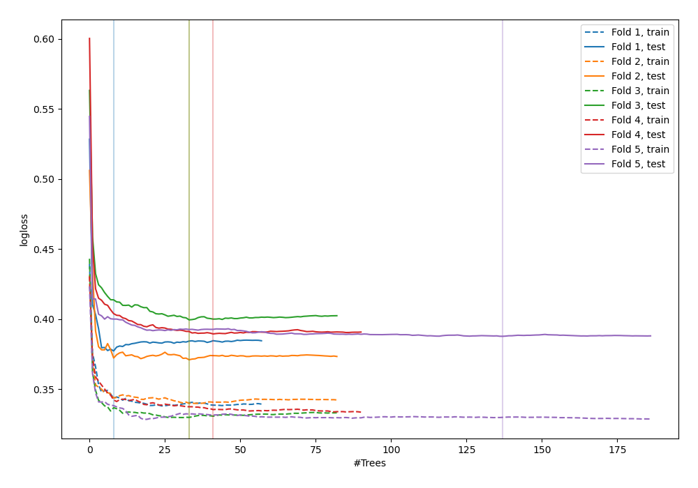
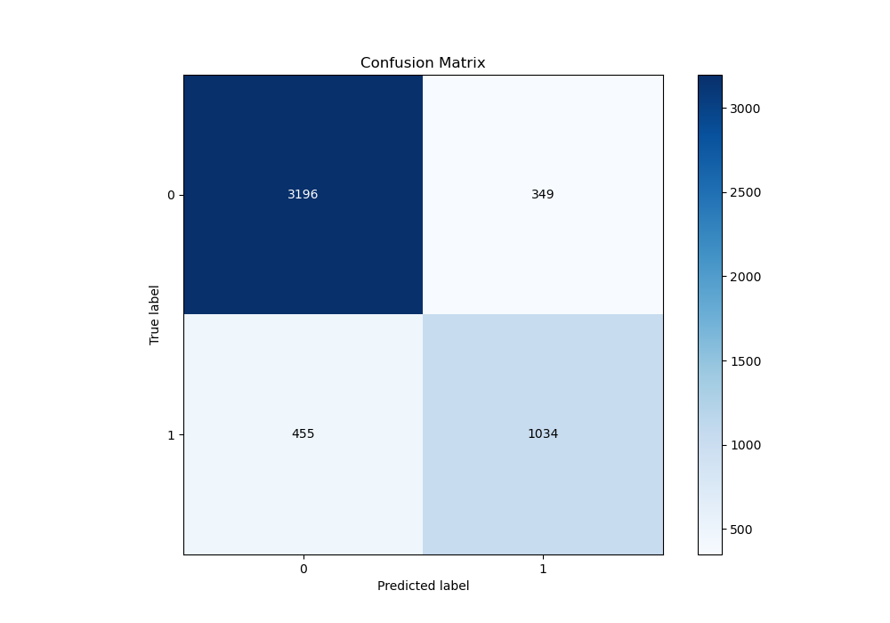
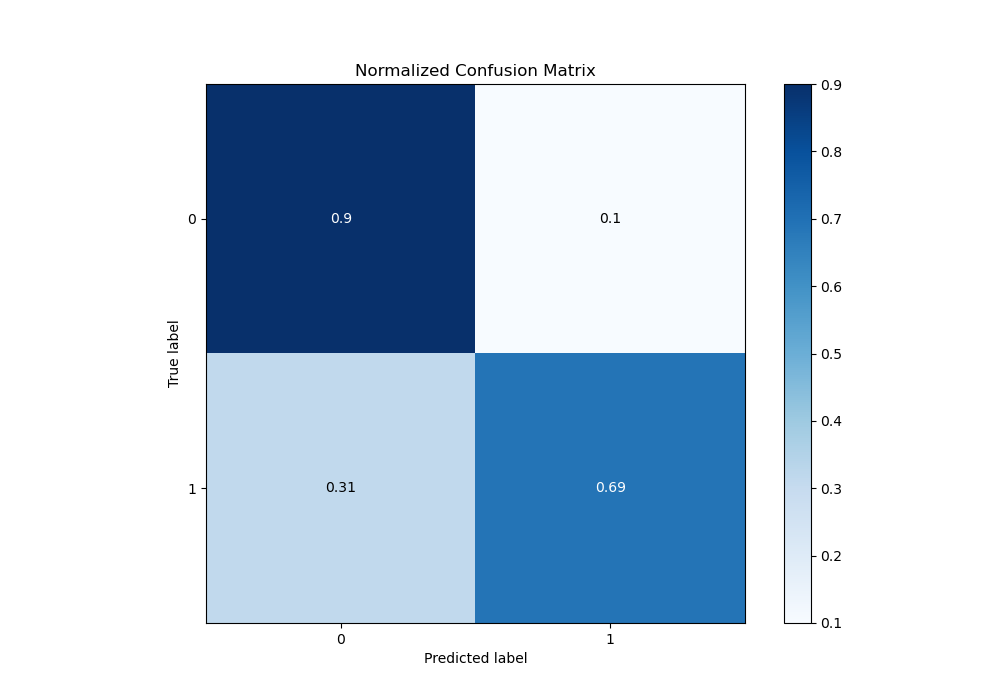
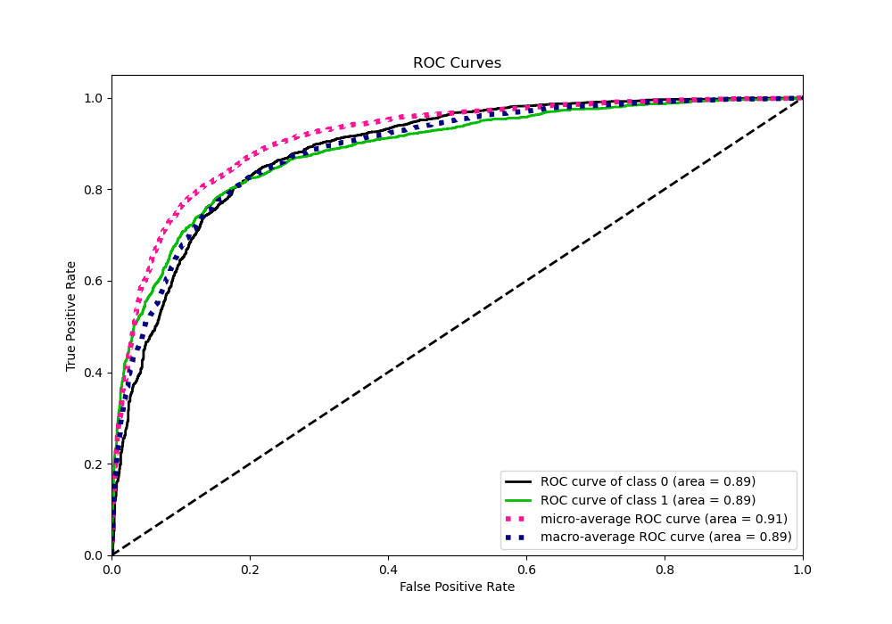
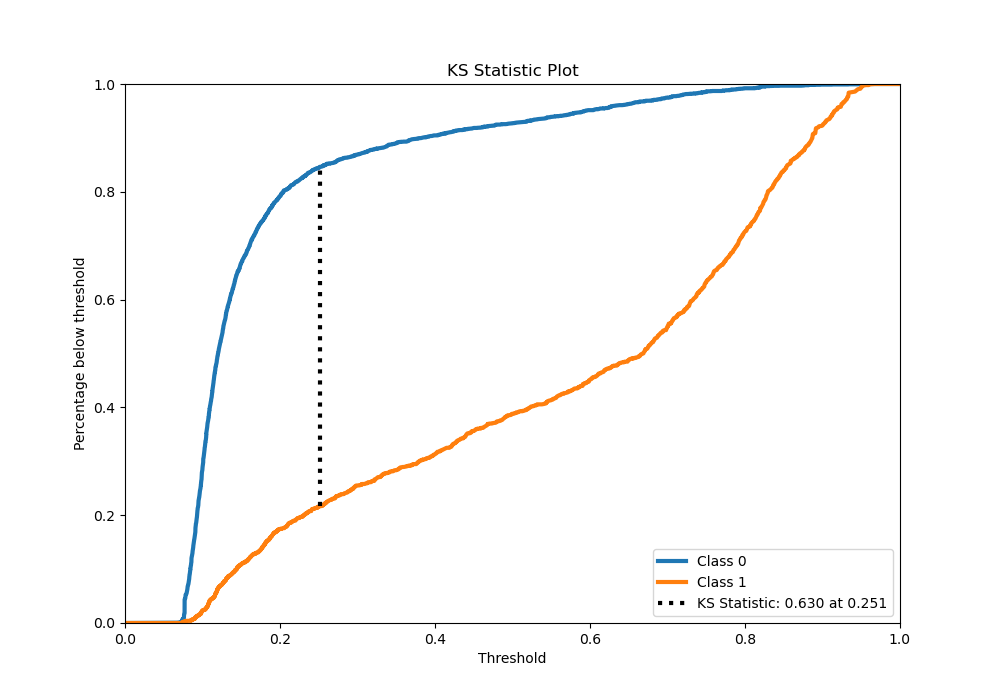
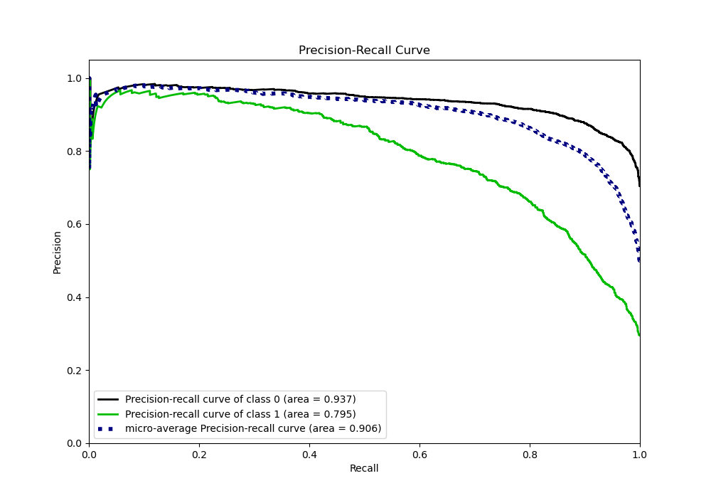
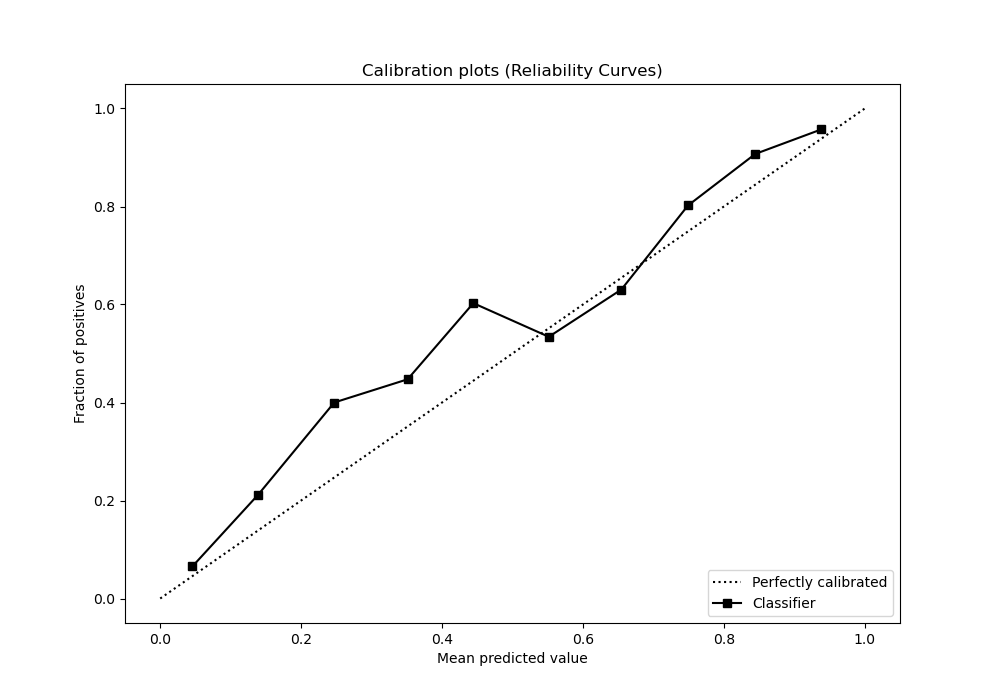
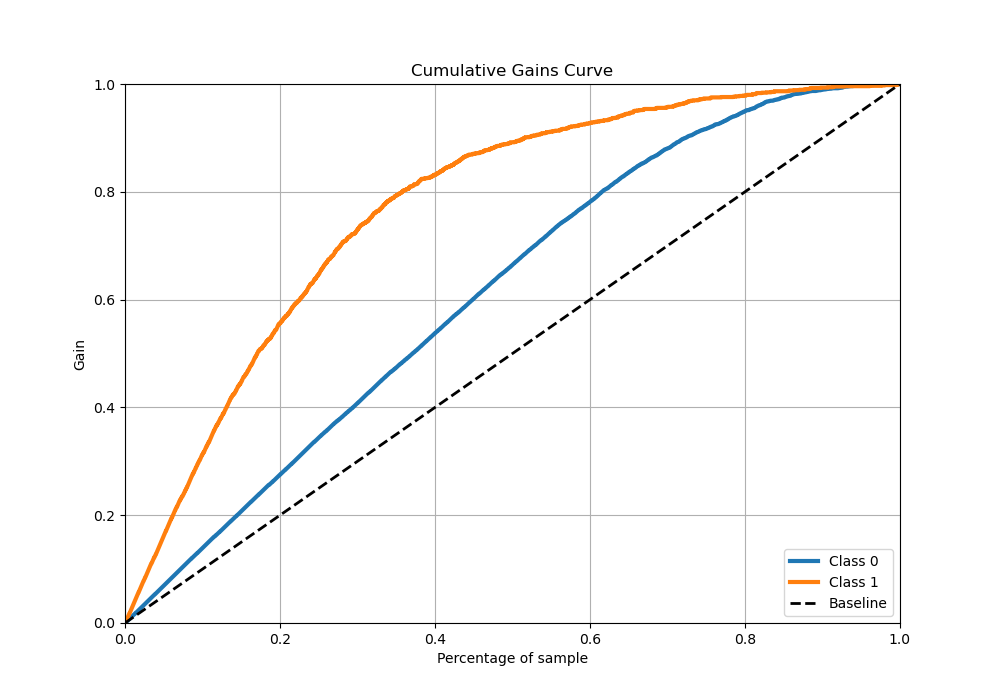
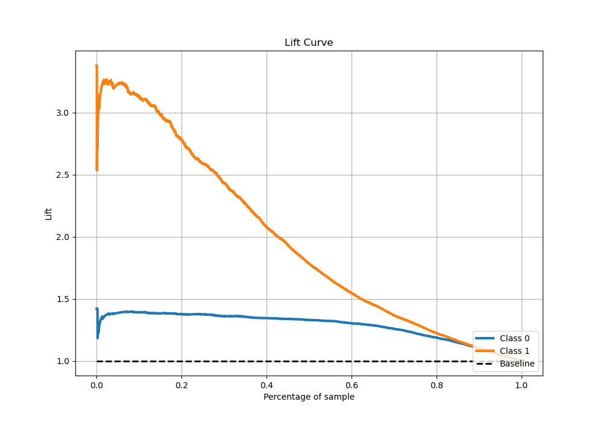

# Summary of 55_RandomForest

[<< Go back](../README.md)

## Random Forest
- **n_jobs**: -1
- **criterion**: gini
- **max_features**: 0.8
- **min_samples_split**: 50
- **max_depth**: 7
- **eval_metric_name**: logloss
- **explain_level**: 0

## Validation
 - **validation_type**: kfold
 - **stratify**: True
 - **k_folds**: 5
 - **shuffle**: True
 - **random_seed**: 42

## Optimized metric
logloss

## Training time

21.8 seconds

## Metric details
|           |    score |   threshold |
|:----------|---------:|------------:|
| logloss   | 0.385071 | nan         |
| auc       | 0.885417 | nan         |
| f1        | 0.728379 |   0.2765    |
| accuracy  | 0.840286 |   0.389056  |
| precision | 0.963855 |   0.914233  |
| recall    | 1        |   0.0603636 |
| mcc       | 0.6115   |   0.317497  |

## Metric details with threshold from accuracy metric
|           |    score |   threshold |
|:----------|---------:|------------:|
| logloss   | 0.385071 |  nan        |
| auc       | 0.885417 |  nan        |
| f1        | 0.720056 |    0.389056 |
| accuracy  | 0.840286 |    0.389056 |
| precision | 0.74765  |    0.389056 |
| recall    | 0.694426 |    0.389056 |
| mcc       | 0.609352 |    0.389056 |

## Confusion matrix (at threshold=0.389056)
|              |   Predicted as 0 |   Predicted as 1 |
|:-------------|-----------------:|-----------------:|
| Labeled as 0 |             3196 |              349 |
| Labeled as 1 |              455 |             1034 |

## Learning curves

## Confusion Matrix

## Normalized Confusion Matrix

## ROC Curve

## Kolmogorov-Smirnov Statistic

## Precision-Recall Curve

## Calibration Curve

## Cumulative Gains Curve

## Lift Curve

[<< Go back](../README.md)
