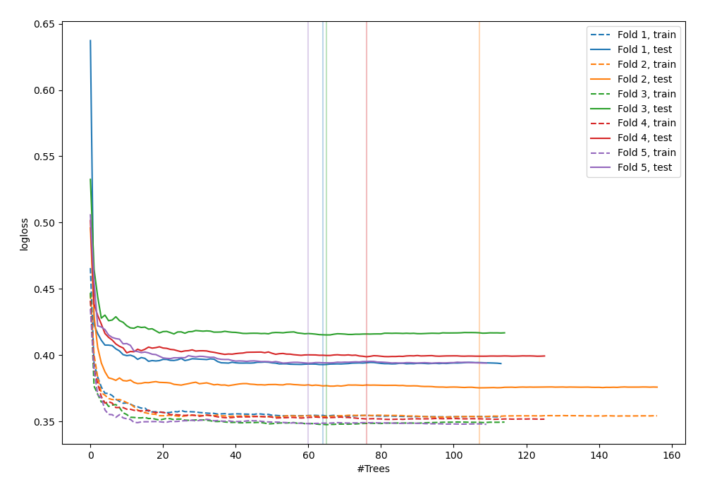
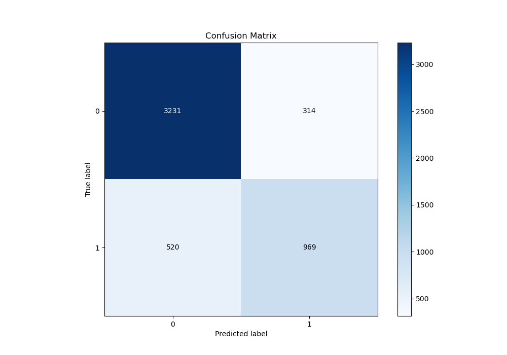
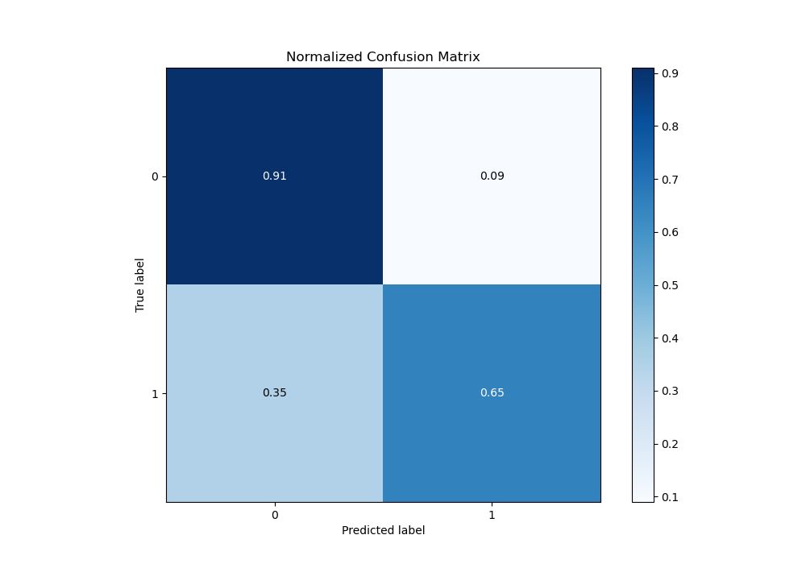
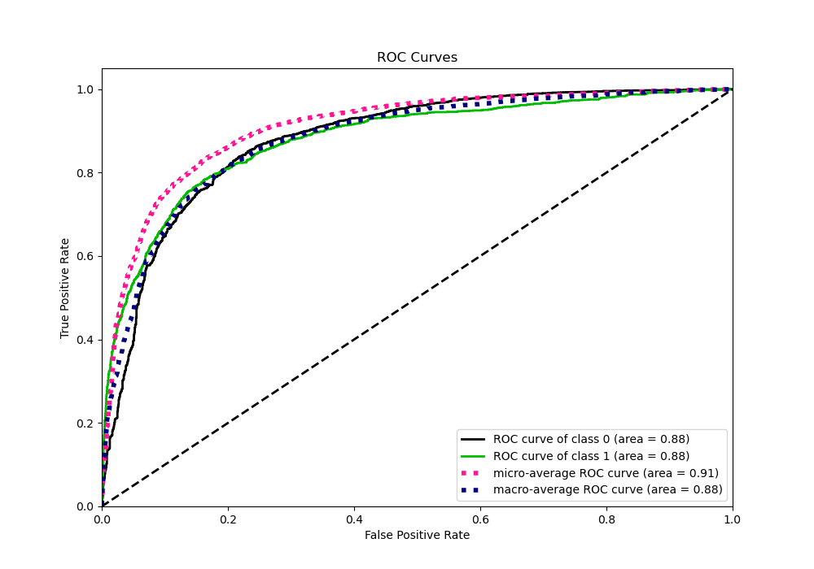
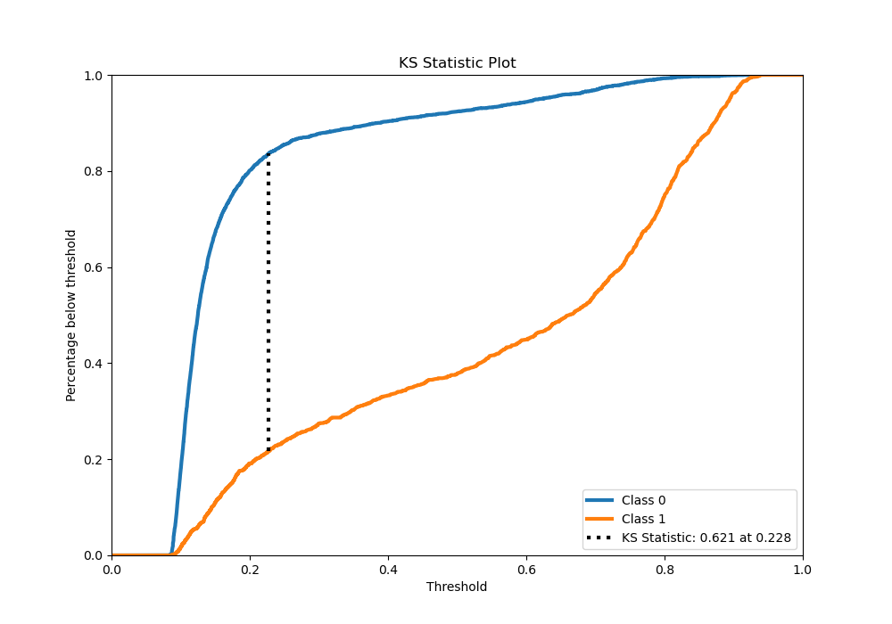
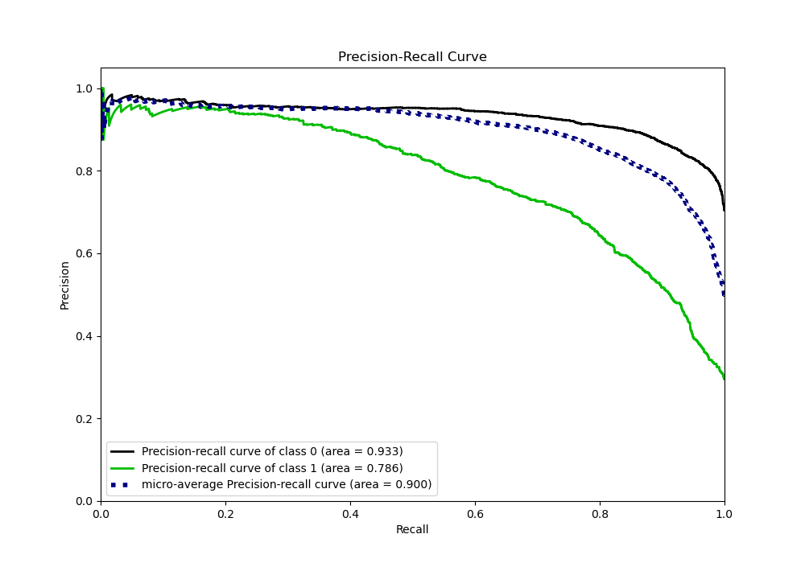
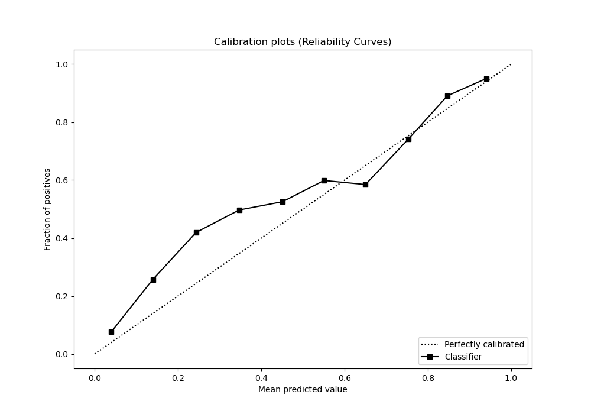
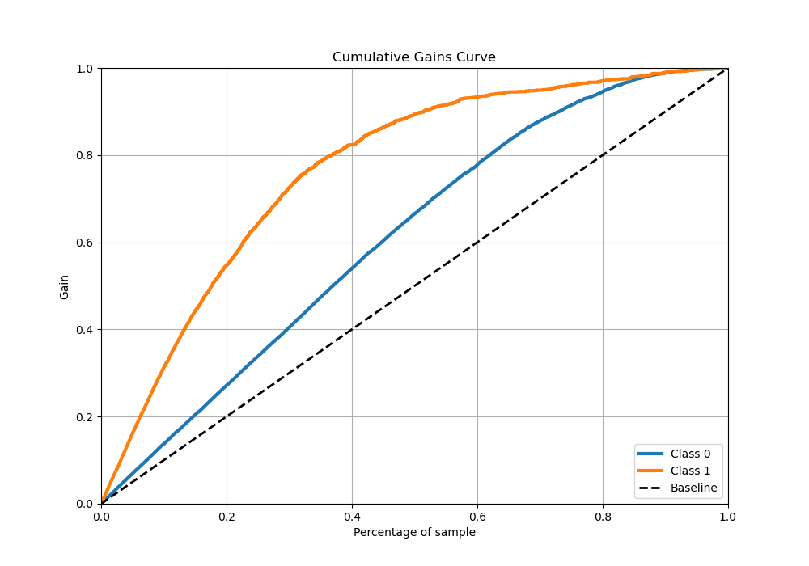
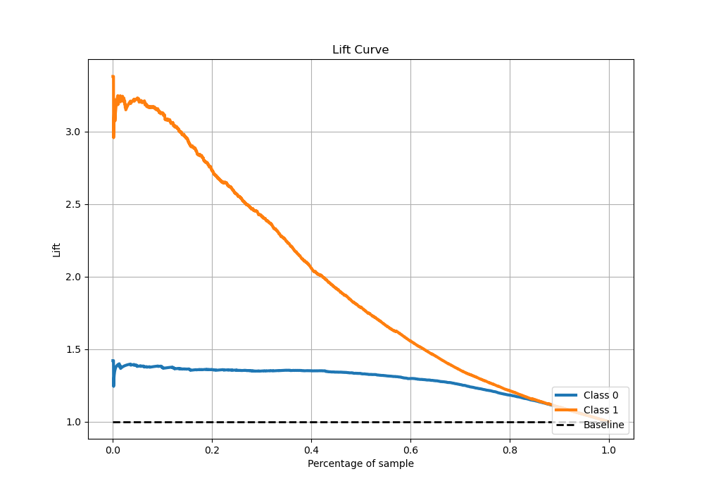

# Summary of 56_RandomForest

[<< Go back](../README.md)

## Random Forest
- **n_jobs**: -1
- **criterion**: gini
- **max_features**: 0.8
- **min_samples_split**: 40
- **max_depth**: 6
- **eval_metric_name**: logloss
- **explain_level**: 0

## Validation
 - **validation_type**: kfold
 - **stratify**: True
 - **k_folds**: 5
 - **shuffle**: True
 - **random_seed**: 42

## Optimized metric
logloss

## Training time

26.3 seconds

## Metric details
|           |    score |   threshold |
|:----------|---------:|------------:|
| logloss   | 0.395189 | nan         |
| auc       | 0.879515 | nan         |
| f1        | 0.723307 |   0.268813  |
| accuracy  | 0.834327 |   0.435016  |
| precision | 0.95279  |   0.843775  |
| recall    | 1        |   0.0759495 |
| mcc       | 0.602557 |   0.268813  |

## Metric details with threshold from accuracy metric
|           |    score |   threshold |
|:----------|---------:|------------:|
| logloss   | 0.395189 |  nan        |
| auc       | 0.879515 |  nan        |
| f1        | 0.699134 |    0.435016 |
| accuracy  | 0.834327 |    0.435016 |
| precision | 0.755261 |    0.435016 |
| recall    | 0.650772 |    0.435016 |
| mcc       | 0.588785 |    0.435016 |

## Confusion matrix (at threshold=0.435016)
|              |   Predicted as 0 |   Predicted as 1 |
|:-------------|-----------------:|-----------------:|
| Labeled as 0 |             3231 |              314 |
| Labeled as 1 |              520 |              969 |

## Learning curves

## Confusion Matrix

## Normalized Confusion Matrix

## ROC Curve

## Kolmogorov-Smirnov Statistic

## Precision-Recall Curve

## Calibration Curve

## Cumulative Gains Curve

## Lift Curve

[<< Go back](../README.md)
