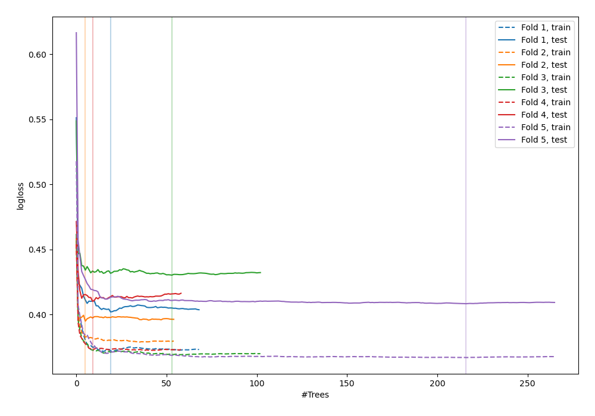
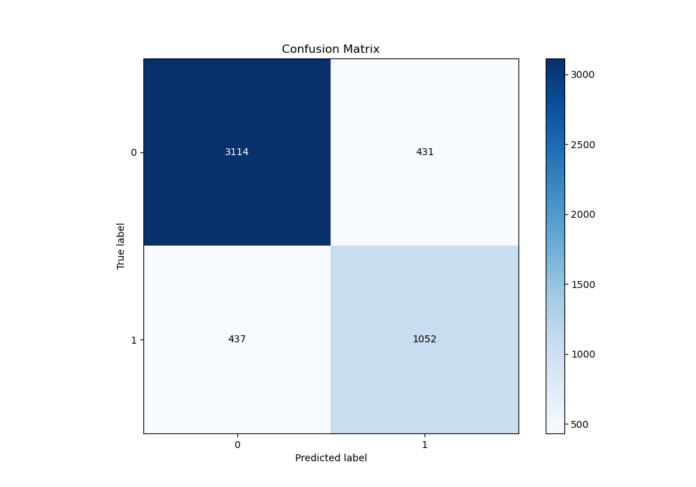
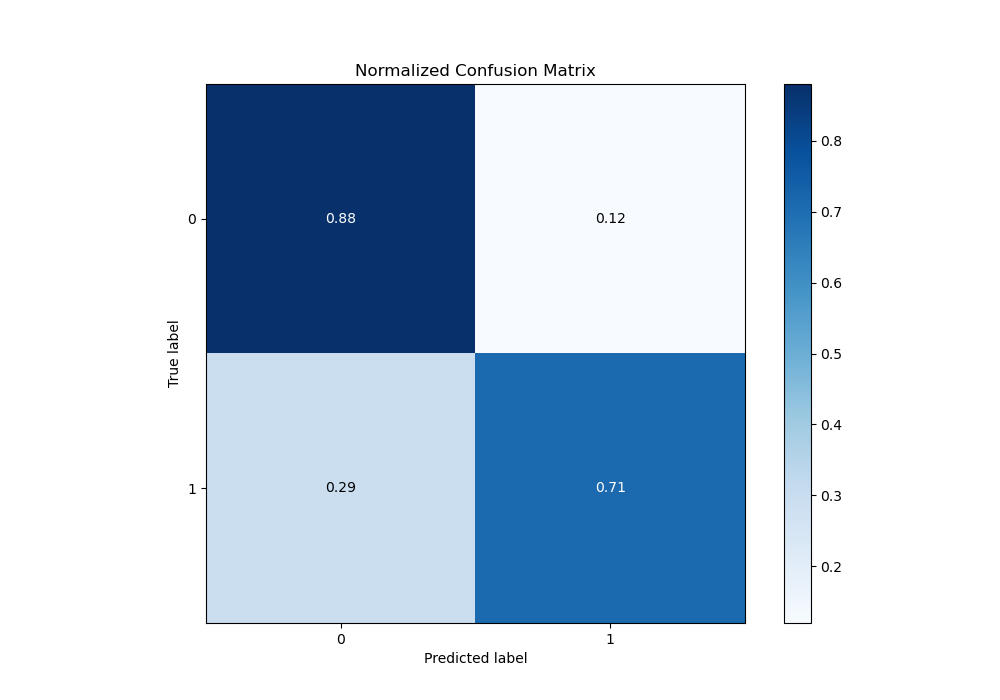
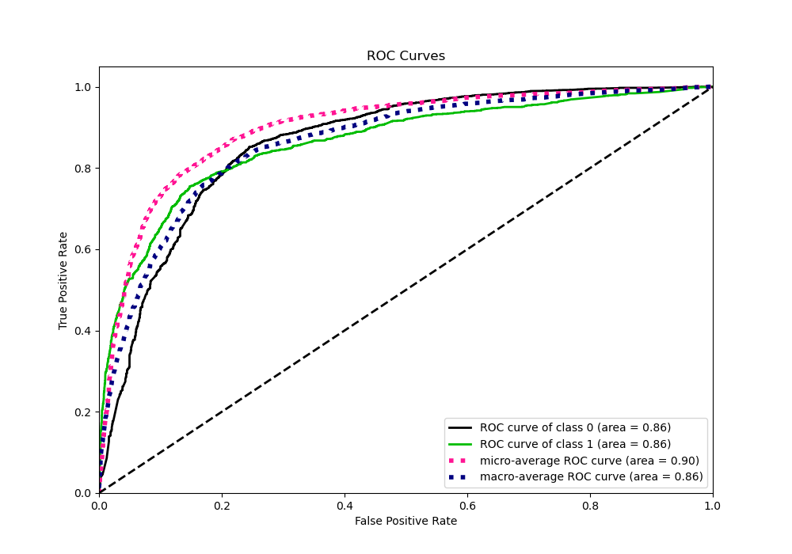
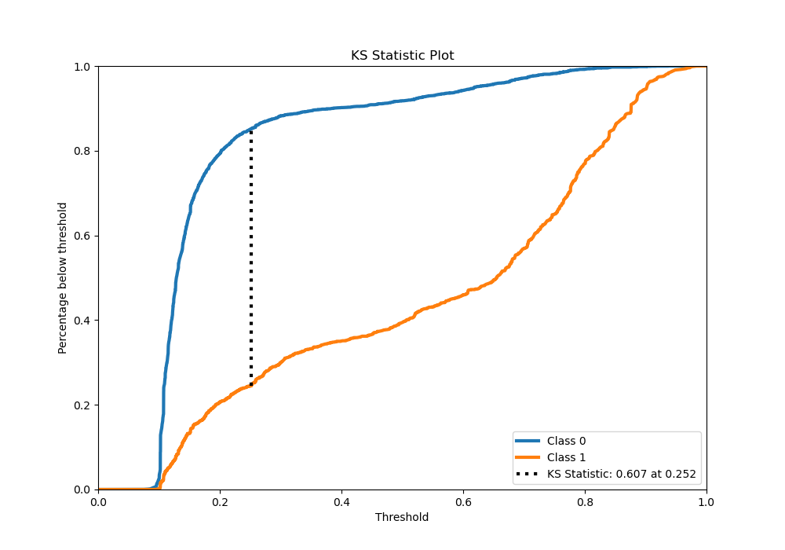
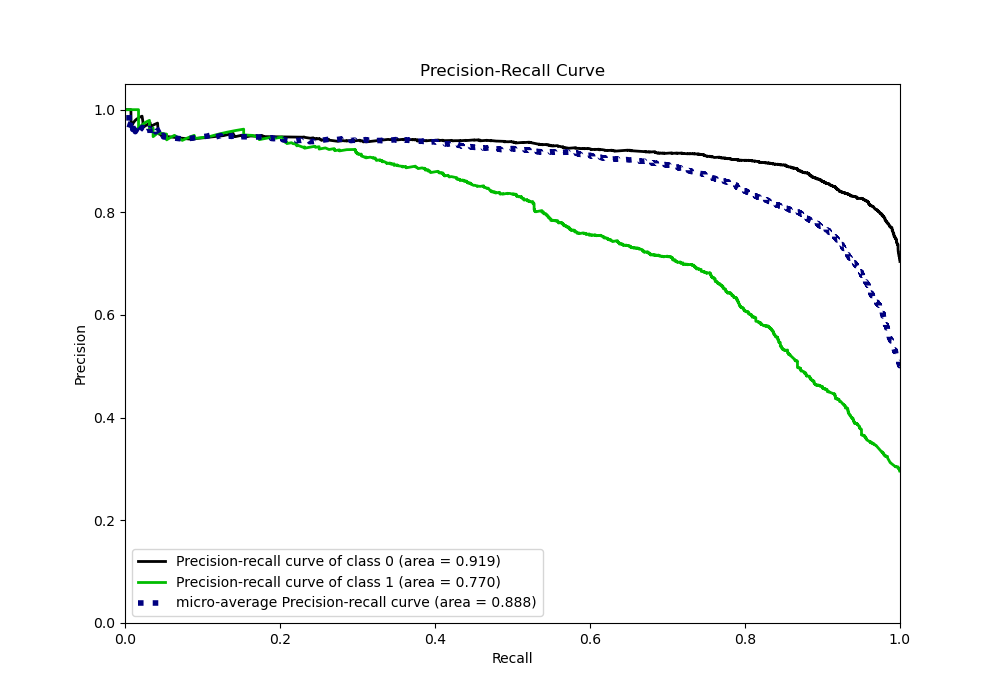
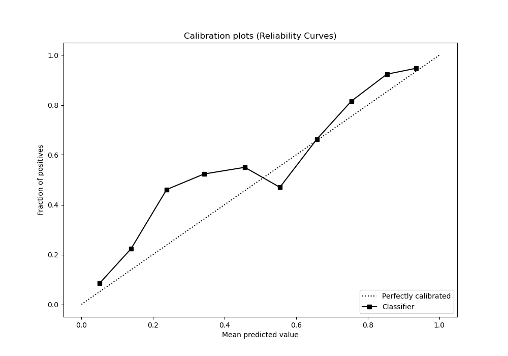
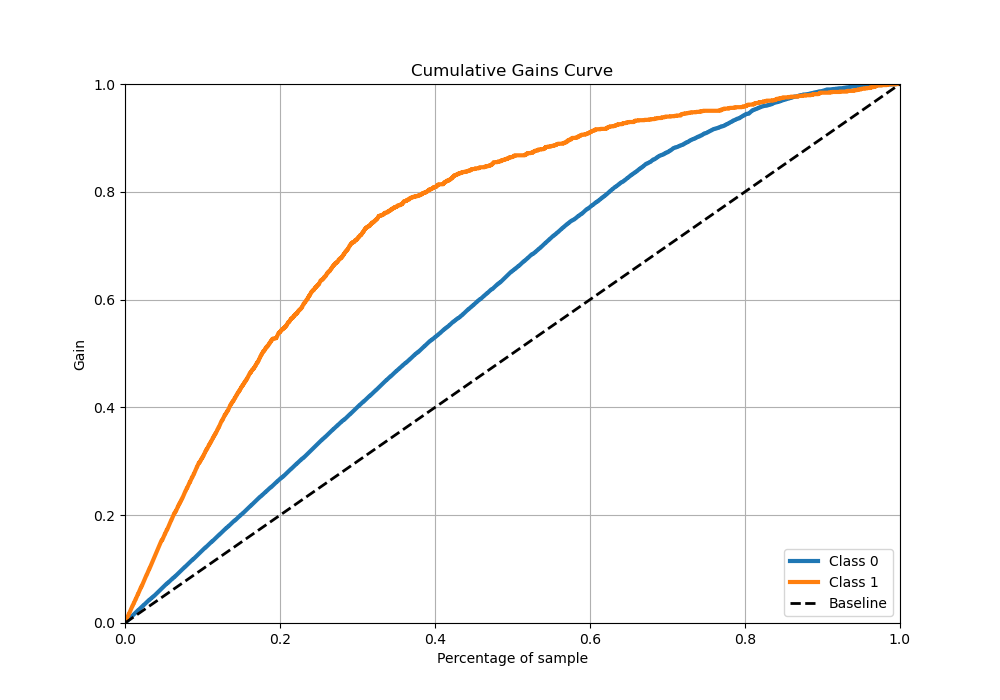
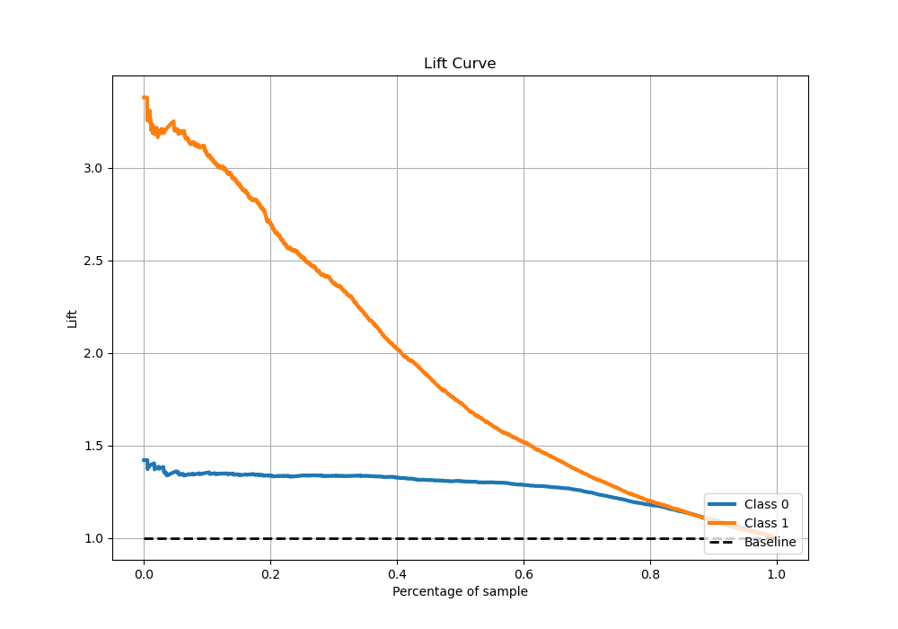

# Summary of 57_RandomForest

[<< Go back](../README.md)

## Random Forest
- **n_jobs**: -1
- **criterion**: gini
- **max_features**: 0.9
- **min_samples_split**: 20
- **max_depth**: 5
- **eval_metric_name**: logloss
- **explain_level**: 0

## Validation
 - **validation_type**: kfold
 - **stratify**: True
 - **k_folds**: 5
 - **shuffle**: True
 - **random_seed**: 42

## Optimized metric
logloss

## Training time

21.2 seconds

## Metric details
|           |    score |   threshold |
|:----------|---------:|------------:|
| logloss   | 0.409183 | nan         |
| auc       | 0.862688 | nan         |
| f1        | 0.714286 |   0.254267  |
| accuracy  | 0.827573 |   0.294997  |
| precision | 0.961373 |   0.847082  |
| recall    | 1        |   0.0678312 |
| mcc       | 0.589433 |   0.264954  |

## Metric details with threshold from accuracy metric
|           |    score |   threshold |
|:----------|---------:|------------:|
| logloss   | 0.409183 |  nan        |
| auc       | 0.862688 |  nan        |
| f1        | 0.707941 |    0.294997 |
| accuracy  | 0.827573 |    0.294997 |
| precision | 0.709373 |    0.294997 |
| recall    | 0.706514 |    0.294997 |
| mcc       | 0.585621 |    0.294997 |

## Confusion matrix (at threshold=0.294997)
|              |   Predicted as 0 |   Predicted as 1 |
|:-------------|-----------------:|-----------------:|
| Labeled as 0 |             3114 |              431 |
| Labeled as 1 |              437 |             1052 |

## Learning curves

## Confusion Matrix

## Normalized Confusion Matrix

## ROC Curve

## Kolmogorov-Smirnov Statistic

## Precision-Recall Curve

## Calibration Curve

## Cumulative Gains Curve

## Lift Curve

[<< Go back](../README.md)
