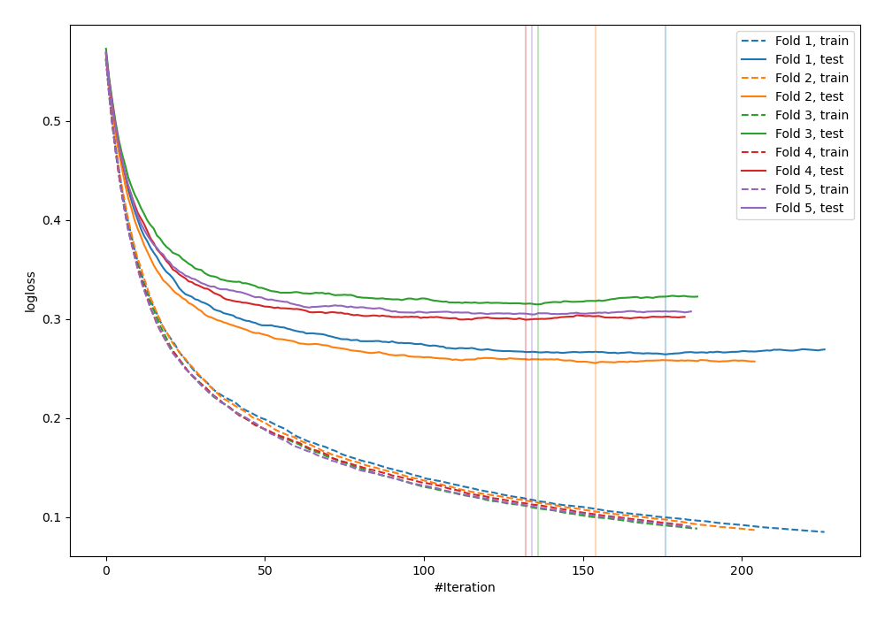
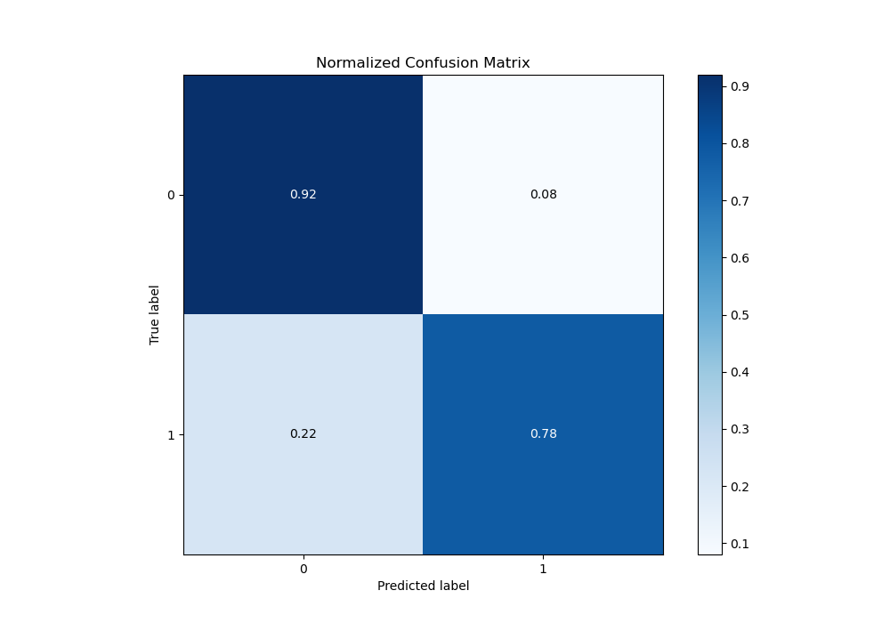
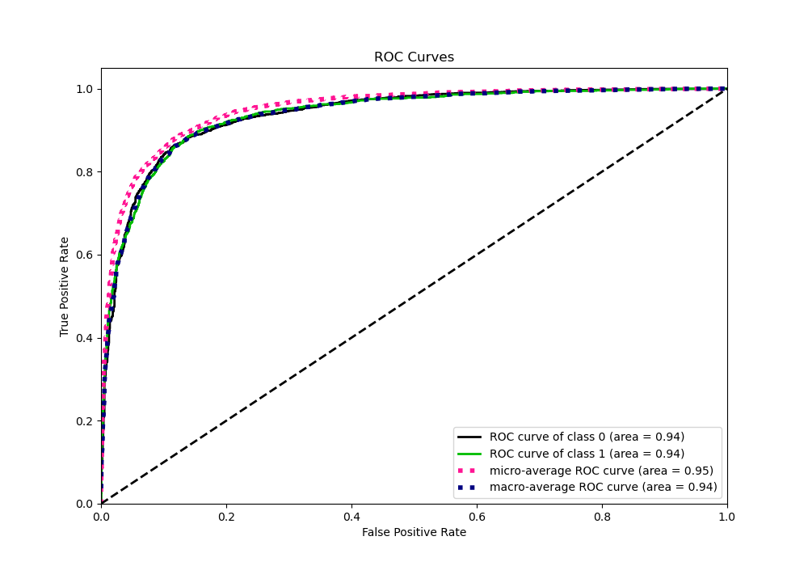
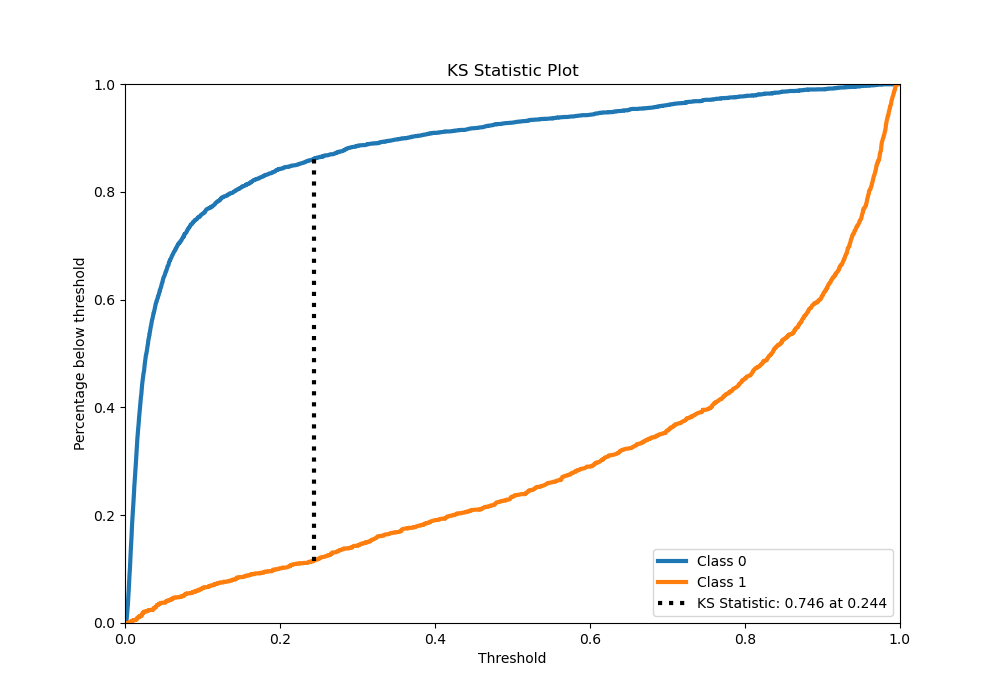
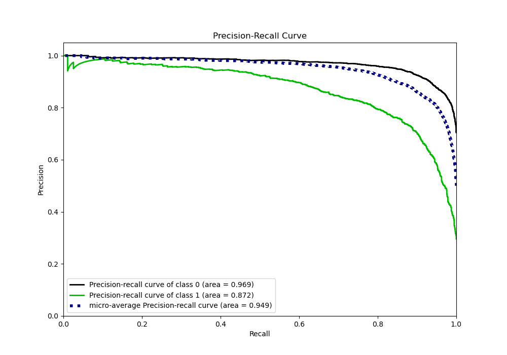
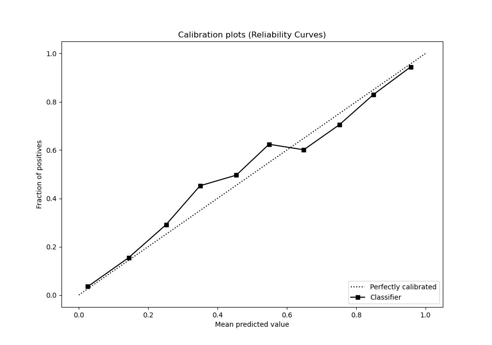
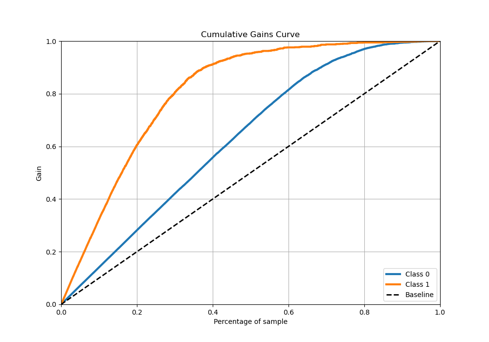
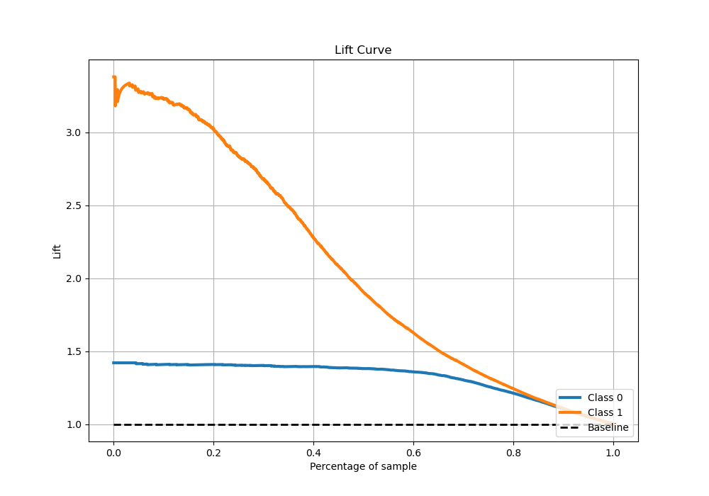

# Summary of 59_Xgboost

[<< Go back](../README.md)

## Extreme Gradient Boosting (Xgboost)
- **n_jobs**: -1
- **objective**: binary:logistic
- **eta**: 0.1
- **max_depth**: 9
- **min_child_weight**: 1
- **subsample**: 0.6
- **colsample_bytree**: 0.5
- **eval_metric**: logloss
- **explain_level**: 0

## Validation
 - **validation_type**: kfold
 - **stratify**: True
 - **k_folds**: 5
 - **shuffle**: True
 - **random_seed**: 42

## Optimized metric
logloss

## Training time

22.3 seconds

## Metric details
|           |    score |    threshold |
|:----------|---------:|-------------:|
| logloss   | 0.287665 | nan          |
| auc       | 0.936642 | nan          |
| f1        | 0.80454  |   0.300062   |
| accuracy  | 0.881605 |   0.475506   |
| precision | 0.984962 |   0.980575   |
| recall    | 1        |   0.00106361 |
| mcc       | 0.717981 |   0.300062   |

## Metric details with threshold from accuracy metric
|           |    score |   threshold |
|:----------|---------:|------------:|
| logloss   | 0.287665 |  nan        |
| auc       | 0.936642 |  nan        |
| f1        | 0.79603  |    0.475506 |
| accuracy  | 0.881605 |    0.475506 |
| precision | 0.811584 |    0.475506 |
| recall    | 0.781061 |    0.475506 |
| mcc       | 0.71293  |    0.475506 |

## Confusion matrix (at threshold=0.475506)
|              |   Predicted as 0 |   Predicted as 1 |
|:-------------|-----------------:|-----------------:|
| Labeled as 0 |             3275 |              270 |
| Labeled as 1 |              326 |             1163 |

## Learning curves

## Confusion Matrix

## Normalized Confusion Matrix

## ROC Curve

## Kolmogorov-Smirnov Statistic

## Precision-Recall Curve

## Calibration Curve

## Cumulative Gains Curve

## Lift Curve

[<< Go back](../README.md)
