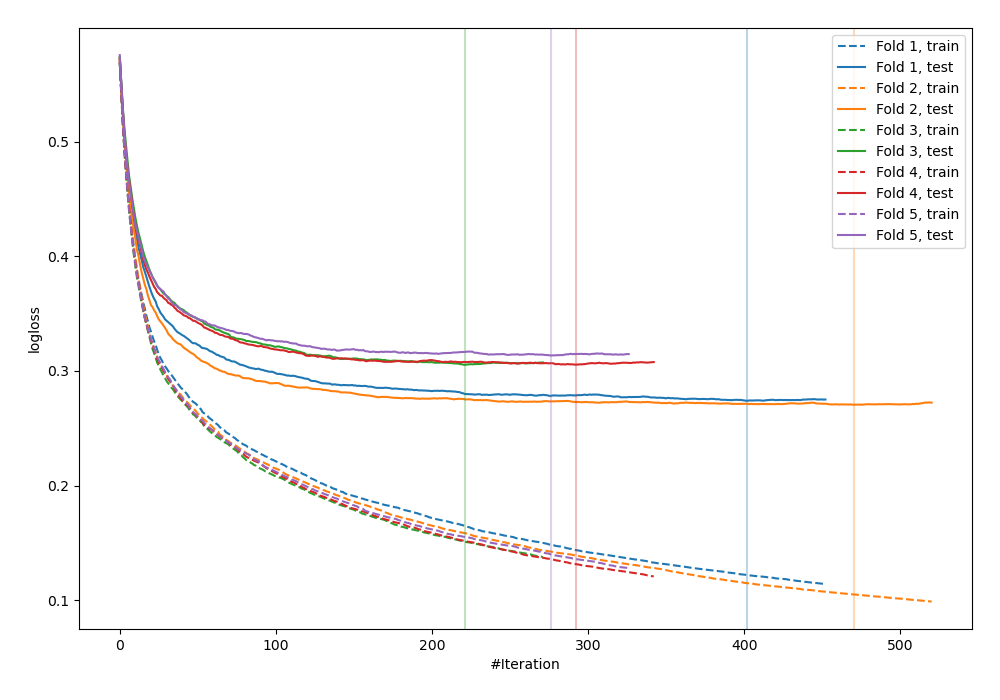
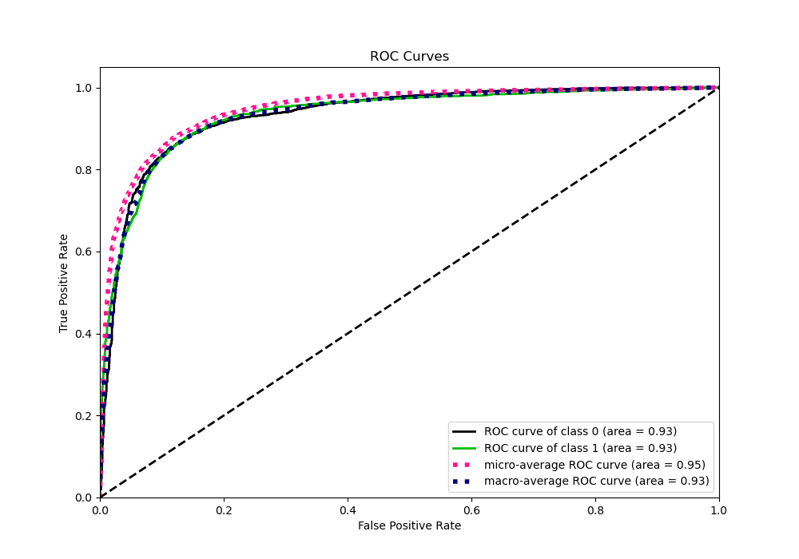
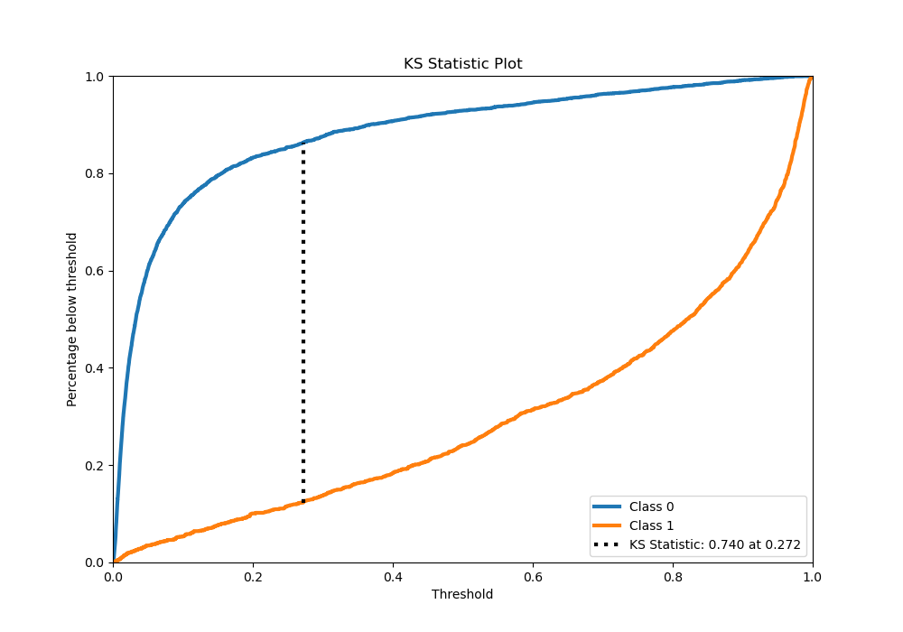
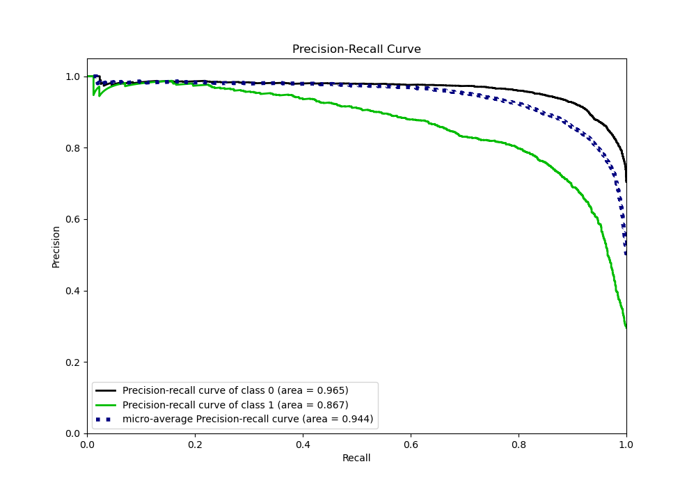
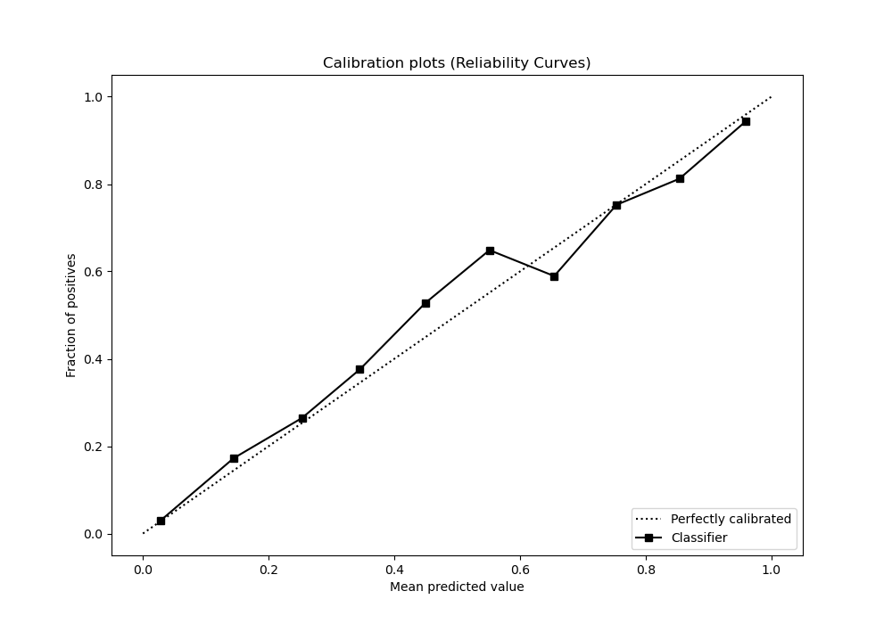
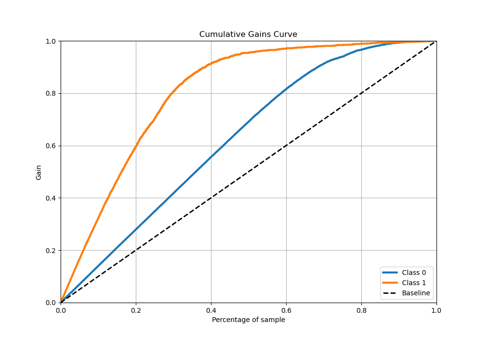
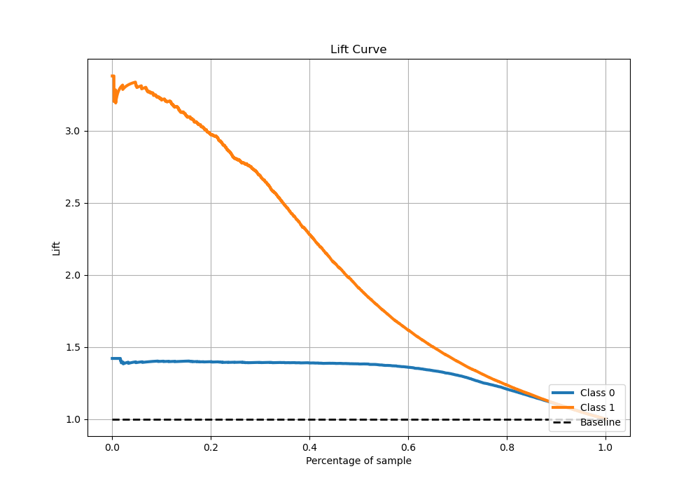

# Summary of 5_Xgboost

[<< Go back](../README.md)

## Extreme Gradient Boosting (Xgboost)
- **n_jobs**: -1
- **objective**: binary:logistic
- **eta**: 0.1
- **max_depth**: 7
- **min_child_weight**: 5
- **subsample**: 1.0
- **colsample_bytree**: 0.5
- **eval_metric**: logloss
- **explain_level**: 0

## Validation
 - **validation_type**: kfold
 - **stratify**: True
 - **k_folds**: 5
 - **shuffle**: True
 - **random_seed**: 42

## Optimized metric
logloss

## Training time

17.1 seconds

## Metric details
|           |    score |     threshold |
|:----------|---------:|--------------:|
| logloss   | 0.293721 | nan           |
| auc       | 0.933007 | nan           |
| f1        | 0.802083 |   0.376083    |
| accuracy  | 0.881208 |   0.438335    |
| precision | 0.987124 |   0.972526    |
| recall    | 1        |   0.000399251 |
| mcc       | 0.715988 |   0.376083    |

## Metric details with threshold from accuracy metric
|           |    score |   threshold |
|:----------|---------:|------------:|
| logloss   | 0.293721 |  nan        |
| auc       | 0.933007 |  nan        |
| f1        | 0.798789 |    0.438335 |
| accuracy  | 0.881208 |    0.438335 |
| precision | 0.800405 |    0.438335 |
| recall    | 0.797179 |    0.438335 |
| mcc       | 0.714519 |    0.438335 |

## Confusion matrix (at threshold=0.438335)
|              |   Predicted as 0 |   Predicted as 1 |
|:-------------|-----------------:|-----------------:|
| Labeled as 0 |             3249 |              296 |
| Labeled as 1 |              302 |             1187 |

## Learning curves

## Confusion Matrix

## Normalized Confusion Matrix

## ROC Curve

## Kolmogorov-Smirnov Statistic

## Precision-Recall Curve

## Calibration Curve

## Cumulative Gains Curve

## Lift Curve

[<< Go back](../README.md)
