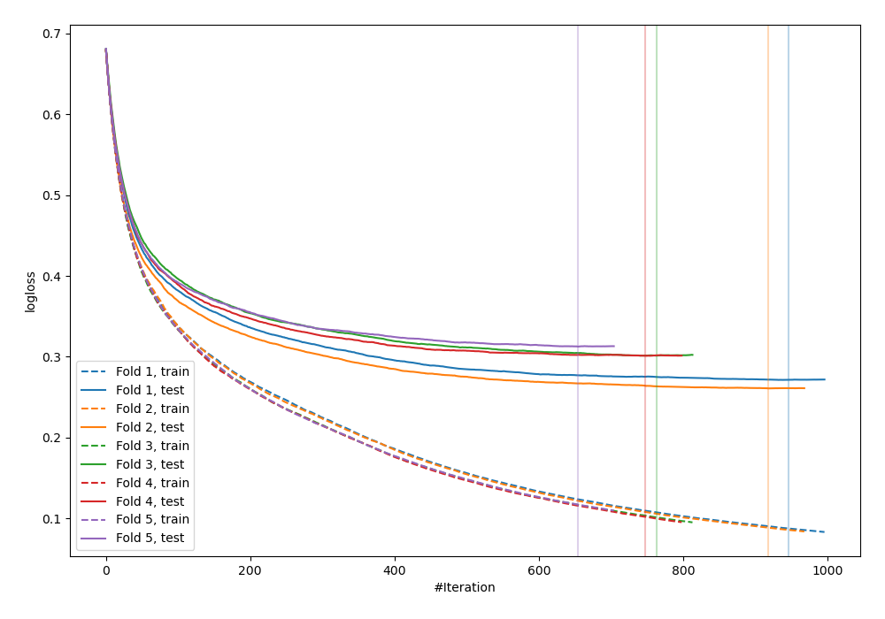
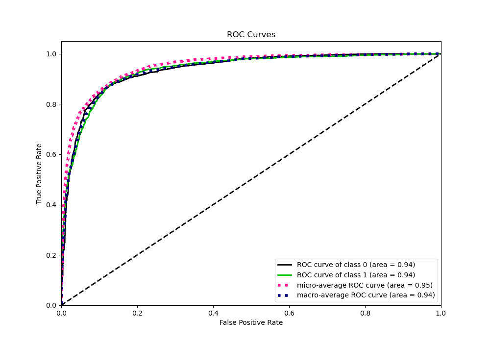
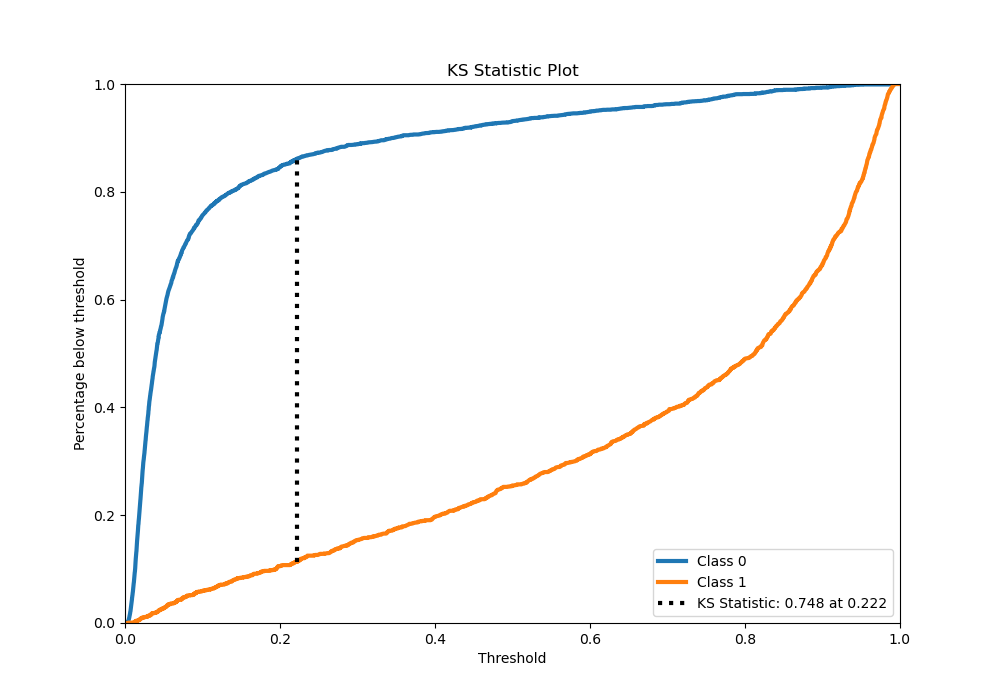
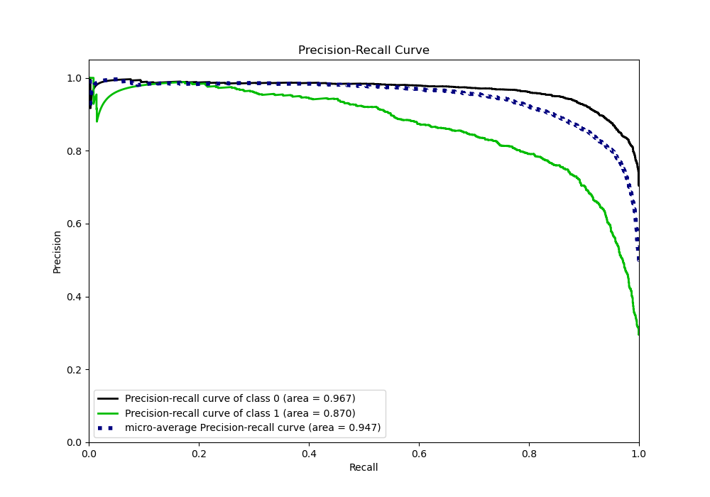
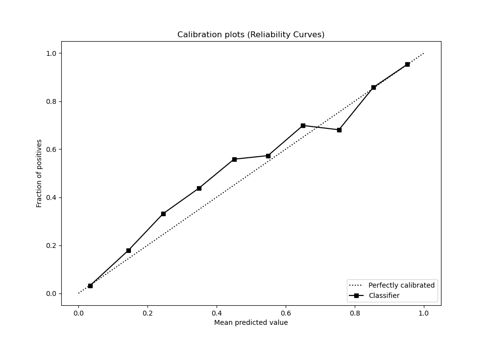
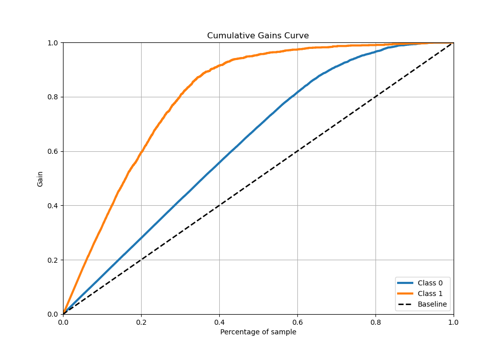
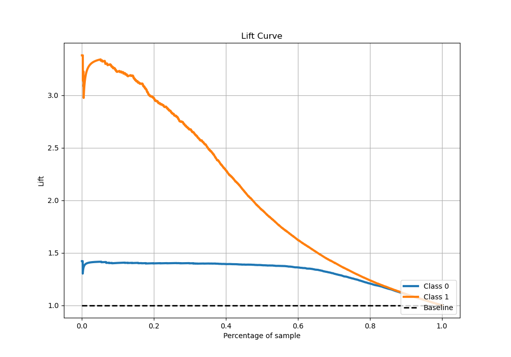

# Summary of 60_CatBoost

[<< Go back](../README.md)

## CatBoost
- **n_jobs**: -1
- **learning_rate**: 0.025
- **depth**: 9
- **rsm**: 0.8
- **loss_function**: Logloss
- **eval_metric**: Logloss
- **explain_level**: 0

## Validation
 - **validation_type**: kfold
 - **stratify**: True
 - **k_folds**: 5
 - **shuffle**: True
 - **random_seed**: 42

## Optimized metric
logloss

## Training time

261.5 seconds

## Metric details
|           |    score |   threshold |
|:----------|---------:|------------:|
| logloss   | 0.289528 | nan         |
| auc       | 0.935782 | nan         |
| f1        | 0.804469 |   0.261769  |
| accuracy  | 0.879221 |   0.385386  |
| precision | 0.987124 |   0.955998  |
| recall    | 1        |   0.0026468 |
| mcc       | 0.717659 |   0.261769  |

## Metric details with threshold from accuracy metric
|           |    score |   threshold |
|:----------|---------:|------------:|
| logloss   | 0.289528 |  nan        |
| auc       | 0.935782 |  nan        |
| f1        | 0.798809 |    0.385386 |
| accuracy  | 0.879221 |    0.385386 |
| precision | 0.787345 |    0.385386 |
| recall    | 0.810611 |    0.385386 |
| mcc       | 0.712699 |    0.385386 |

## Confusion matrix (at threshold=0.385386)
|              |   Predicted as 0 |   Predicted as 1 |
|:-------------|-----------------:|-----------------:|
| Labeled as 0 |             3219 |              326 |
| Labeled as 1 |              282 |             1207 |

## Learning curves

## Confusion Matrix

## Normalized Confusion Matrix

## ROC Curve

## Kolmogorov-Smirnov Statistic

## Precision-Recall Curve

## Calibration Curve

## Cumulative Gains Curve

## Lift Curve

[<< Go back](../README.md)
