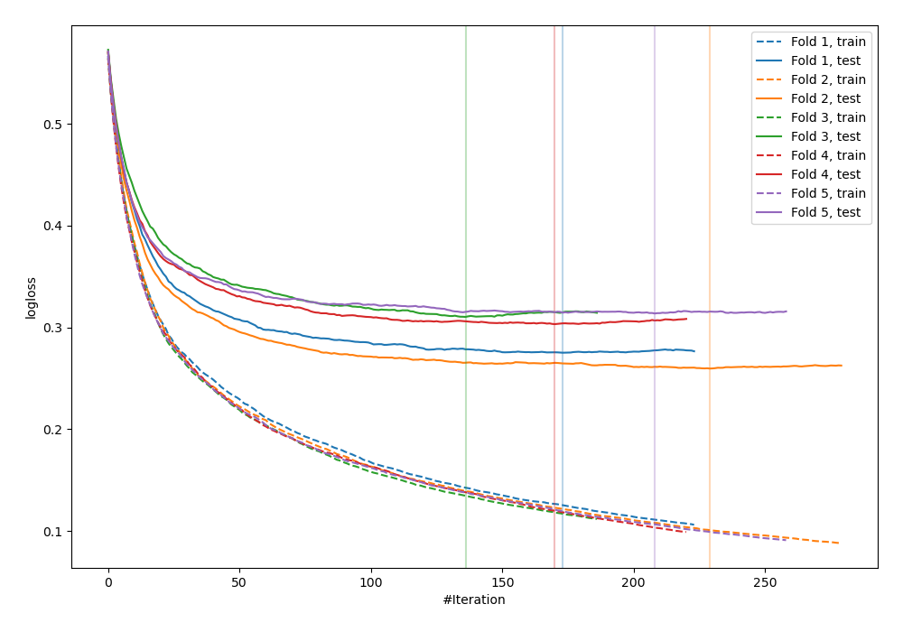
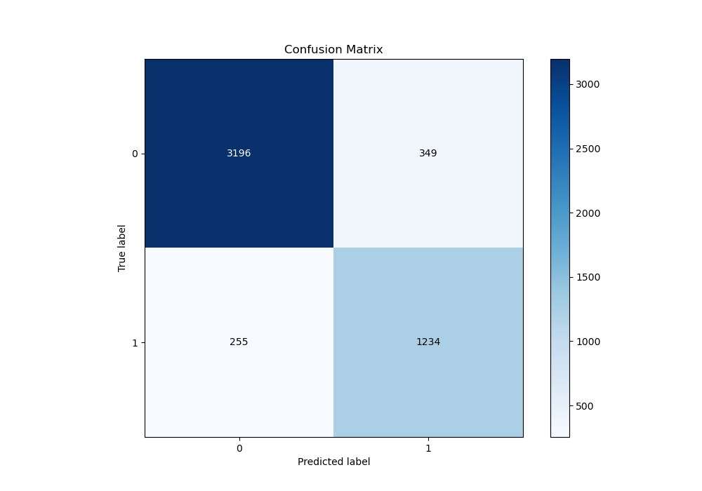
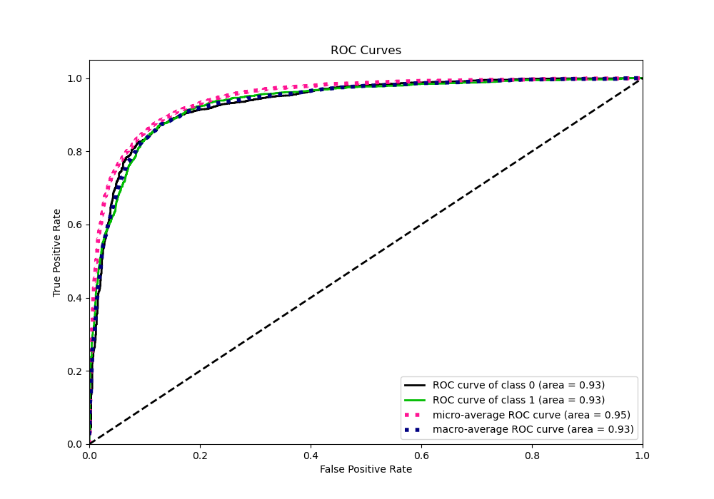
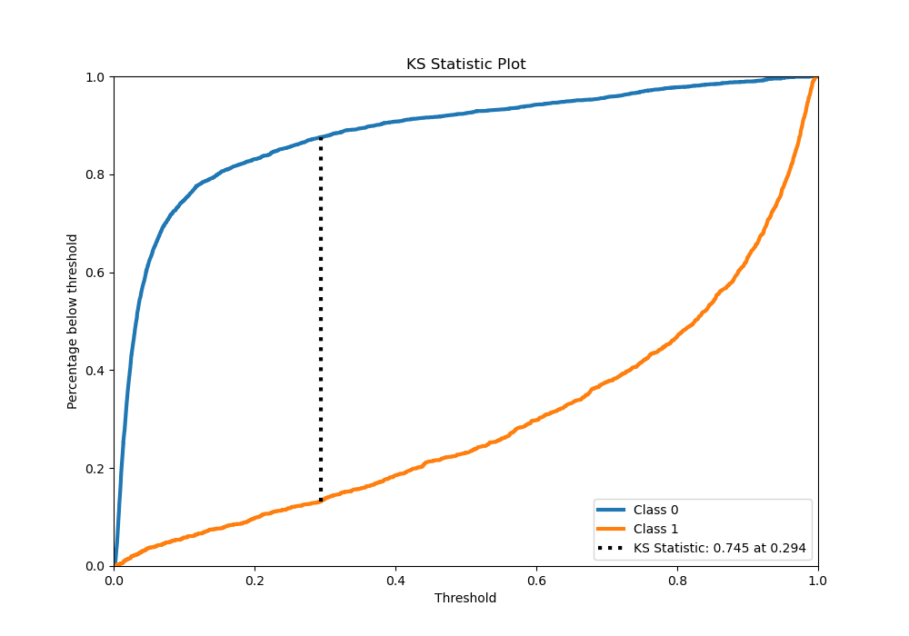
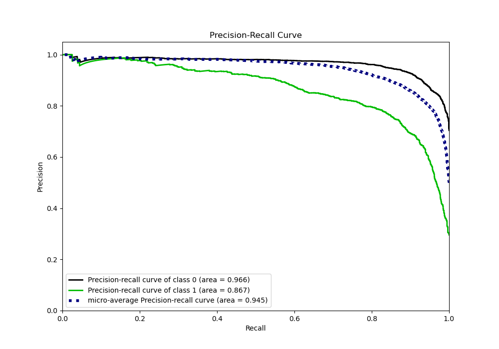
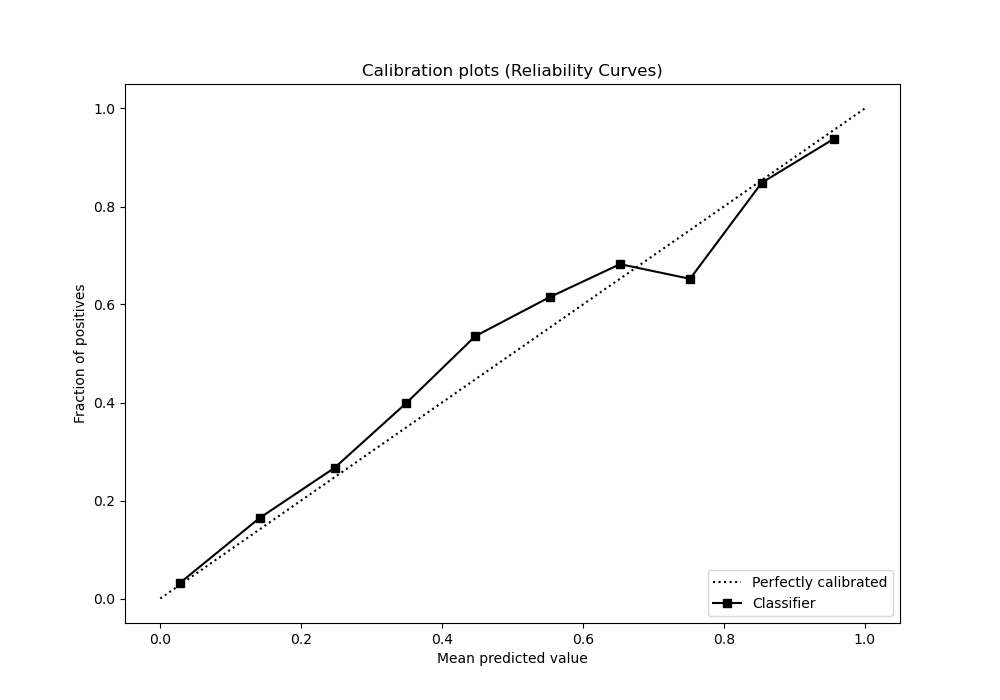
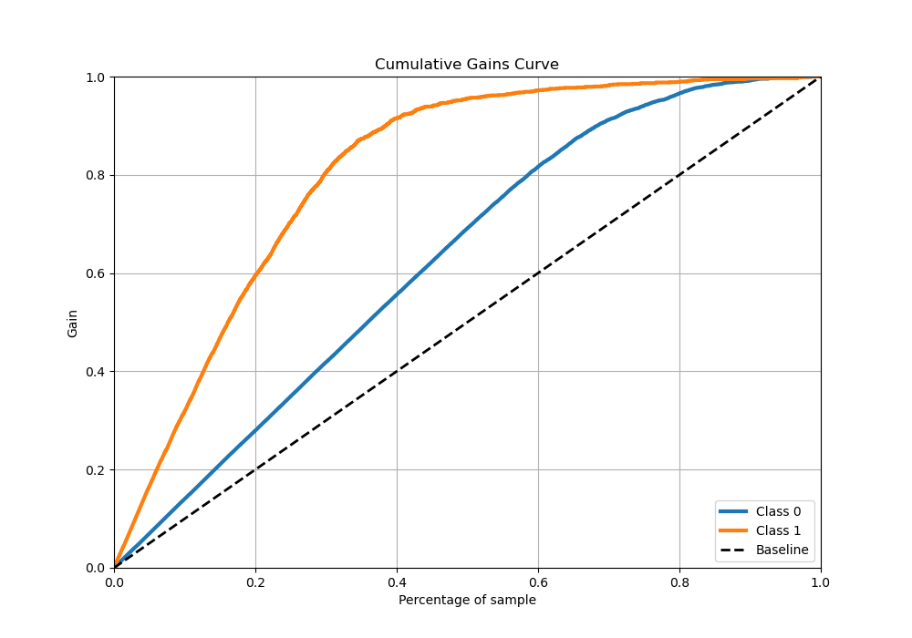
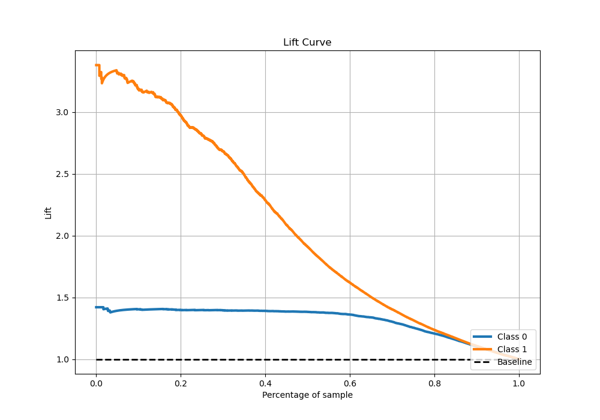

# Summary of 63_Xgboost

[<< Go back](../README.md)

## Extreme Gradient Boosting (Xgboost)
- **n_jobs**: -1
- **objective**: binary:logistic
- **eta**: 0.1
- **max_depth**: 7
- **min_child_weight**: 1
- **subsample**: 0.7
- **colsample_bytree**: 0.5
- **eval_metric**: logloss
- **explain_level**: 0

## Validation
 - **validation_type**: kfold
 - **stratify**: True
 - **k_folds**: 5
 - **shuffle**: True
 - **random_seed**: 42

## Optimized metric
logloss

## Training time

17.0 seconds

## Metric details
|           |    score |     threshold |
|:----------|---------:|--------------:|
| logloss   | 0.292372 | nan           |
| auc       | 0.933697 | nan           |
| f1        | 0.803972 |   0.3485      |
| accuracy  | 0.880016 |   0.378157    |
| precision | 0.987124 |   0.967763    |
| recall    | 1        |   0.000950055 |
| mcc       | 0.717862 |   0.378157    |

## Metric details with threshold from accuracy metric
|           |    score |   threshold |
|:----------|---------:|------------:|
| logloss   | 0.292372 |  nan        |
| auc       | 0.933697 |  nan        |
| f1        | 0.803385 |    0.378157 |
| accuracy  | 0.880016 |    0.378157 |
| precision | 0.779533 |    0.378157 |
| recall    | 0.828744 |    0.378157 |
| mcc       | 0.717862 |    0.378157 |

## Confusion matrix (at threshold=0.378157)
|              |   Predicted as 0 |   Predicted as 1 |
|:-------------|-----------------:|-----------------:|
| Labeled as 0 |             3196 |              349 |
| Labeled as 1 |              255 |             1234 |

## Learning curves

## Confusion Matrix

## Normalized Confusion Matrix

## ROC Curve

## Kolmogorov-Smirnov Statistic

## Precision-Recall Curve

## Calibration Curve

## Cumulative Gains Curve

## Lift Curve

[<< Go back](../README.md)
