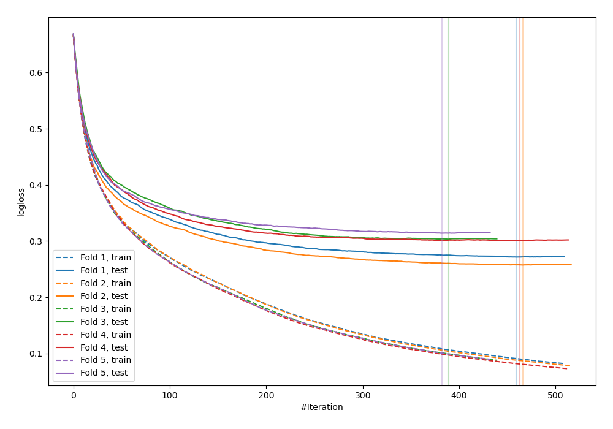
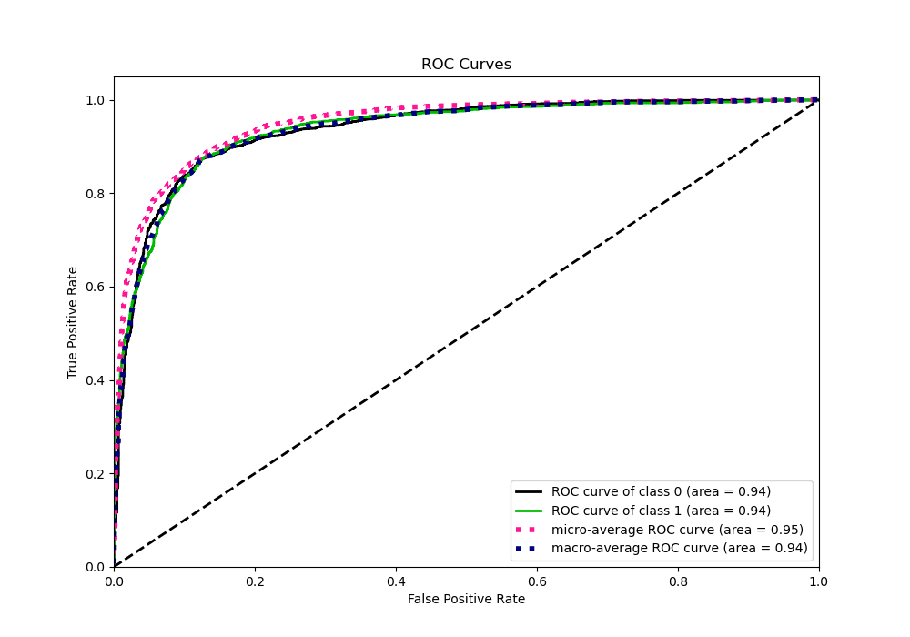
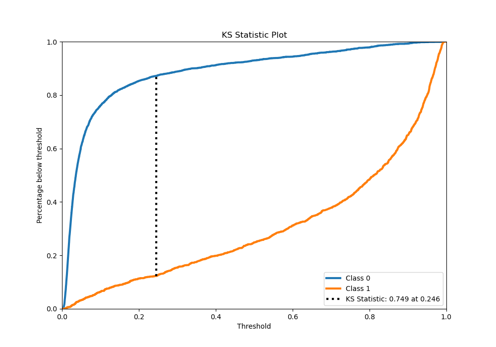
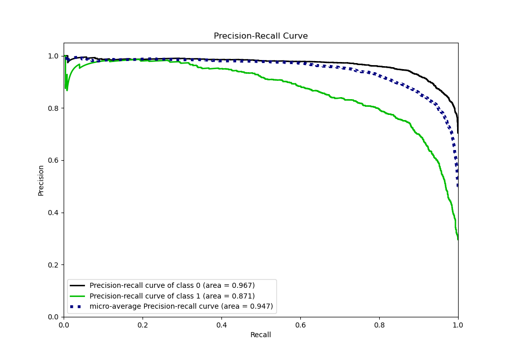
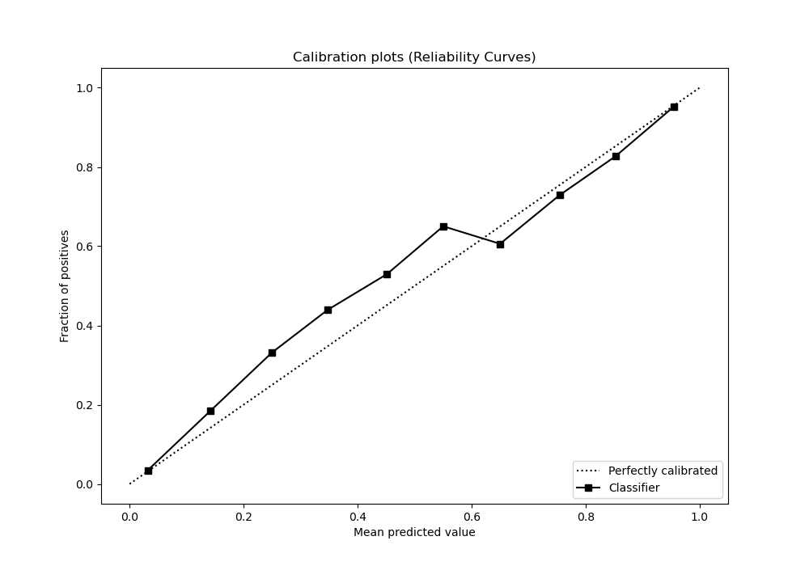
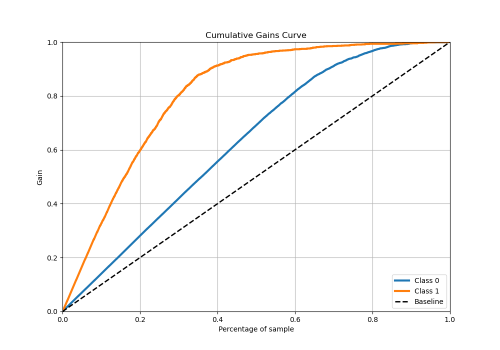
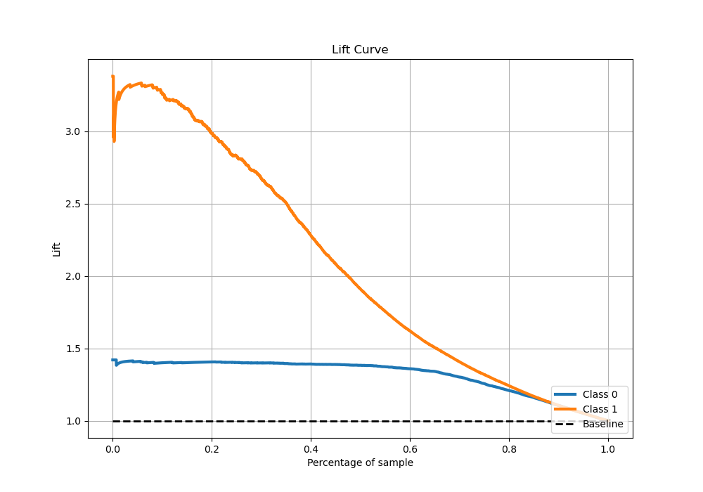

# Summary of 65_CatBoost

[<< Go back](../README.md)

## CatBoost
- **n_jobs**: -1
- **learning_rate**: 0.05
- **depth**: 9
- **rsm**: 0.8
- **loss_function**: Logloss
- **eval_metric**: Logloss
- **explain_level**: 0

## Validation
 - **validation_type**: kfold
 - **stratify**: True
 - **k_folds**: 5
 - **shuffle**: True
 - **random_seed**: 42

## Optimized metric
logloss

## Training time

157.9 seconds

## Metric details
|           |    score |    threshold |
|:----------|---------:|-------------:|
| logloss   | 0.289532 | nan          |
| auc       | 0.935655 | nan          |
| f1        | 0.804469 |   0.255824   |
| accuracy  | 0.88081  |   0.416301   |
| precision | 0.985866 |   0.953884   |
| recall    | 1        |   0.00179596 |
| mcc       | 0.717659 |   0.255824   |

## Metric details with threshold from accuracy metric
|           |    score |   threshold |
|:----------|---------:|------------:|
| logloss   | 0.289532 |  nan        |
| auc       | 0.935655 |  nan        |
| f1        | 0.798116 |    0.416301 |
| accuracy  | 0.88081  |    0.416301 |
| precision | 0.79973  |    0.416301 |
| recall    | 0.796508 |    0.416301 |
| mcc       | 0.713564 |    0.416301 |

## Confusion matrix (at threshold=0.416301)
|              |   Predicted as 0 |   Predicted as 1 |
|:-------------|-----------------:|-----------------:|
| Labeled as 0 |             3248 |              297 |
| Labeled as 1 |              303 |             1186 |

## Learning curves

## Confusion Matrix

## Normalized Confusion Matrix

## ROC Curve

## Kolmogorov-Smirnov Statistic

## Precision-Recall Curve

## Calibration Curve

## Cumulative Gains Curve

## Lift Curve

[<< Go back](../README.md)
