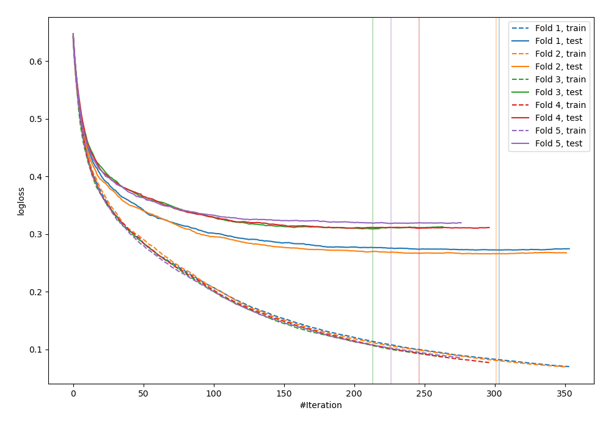
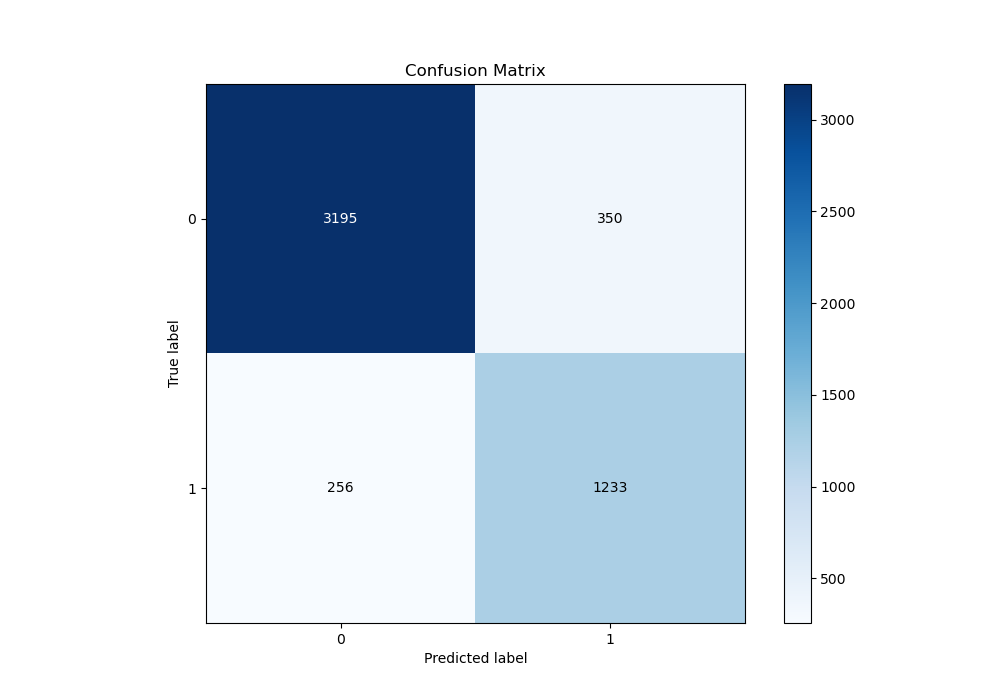
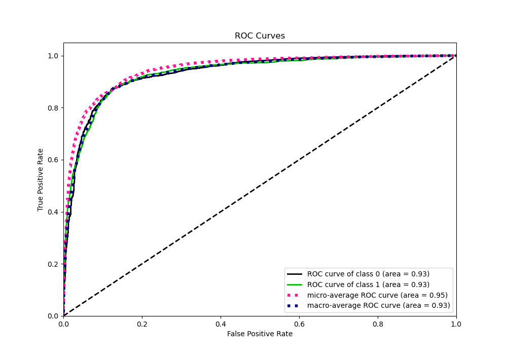
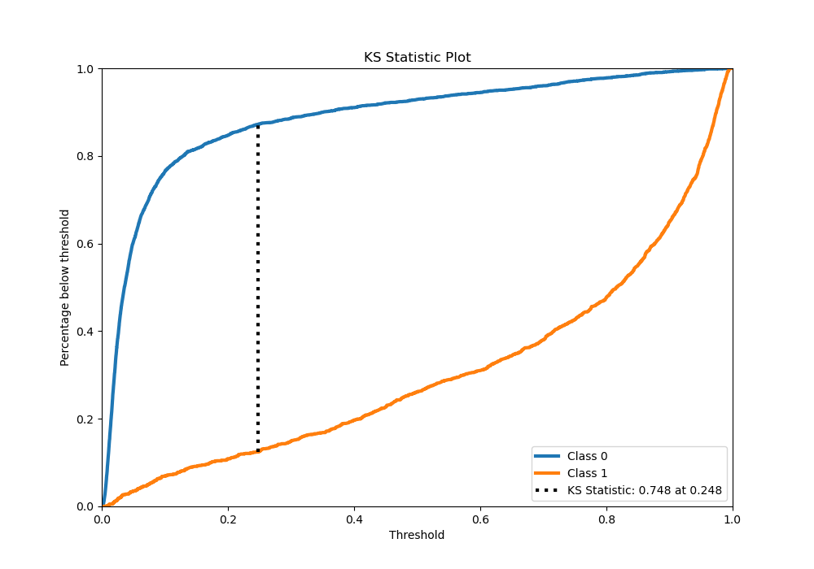
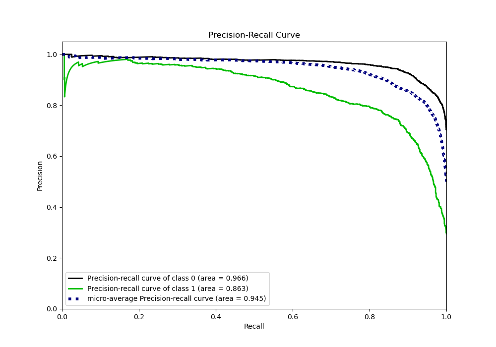
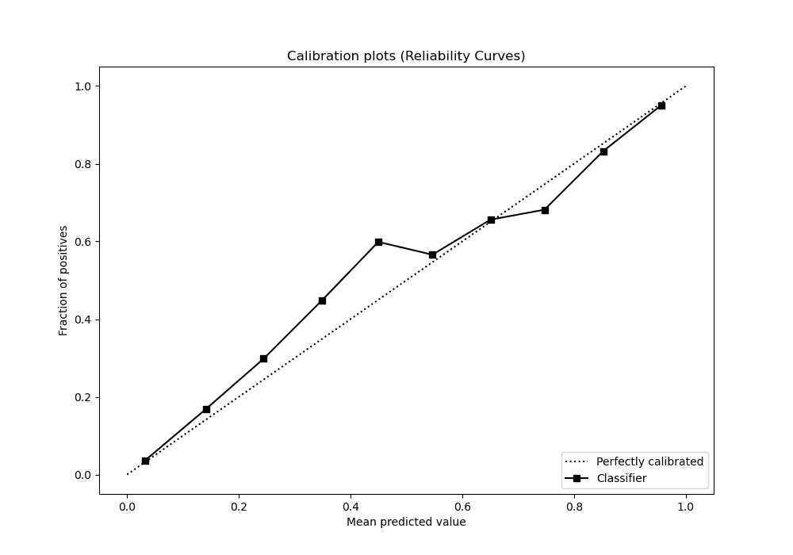
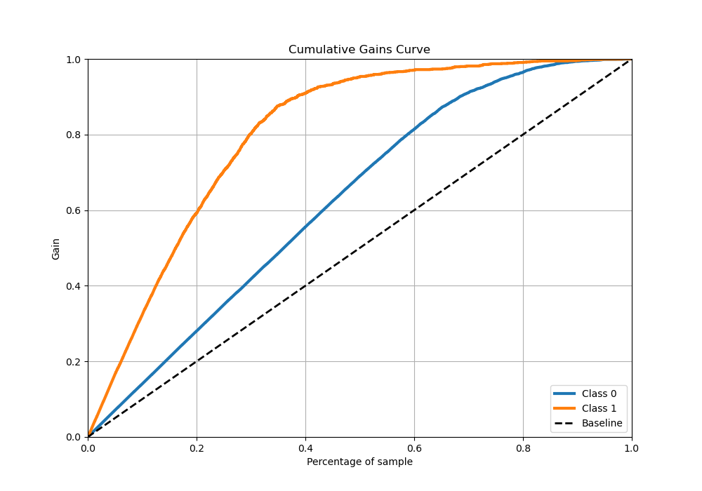
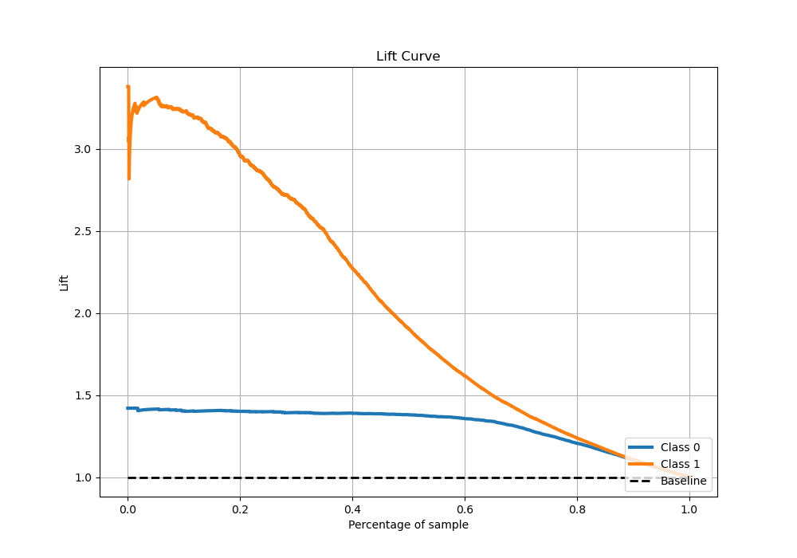

# Summary of 67_CatBoost

[<< Go back](../README.md)

## CatBoost
- **n_jobs**: -1
- **learning_rate**: 0.1
- **depth**: 8
- **rsm**: 0.9
- **loss_function**: Logloss
- **eval_metric**: Logloss
- **explain_level**: 0

## Validation
 - **validation_type**: kfold
 - **stratify**: True
 - **k_folds**: 5
 - **shuffle**: True
 - **random_seed**: 42

## Optimized metric
logloss

## Training time

59.6 seconds

## Metric details
|           |    score |     threshold |
|:----------|---------:|--------------:|
| logloss   | 0.295351 | nan           |
| auc       | 0.932611 | nan           |
| f1        | 0.802734 |   0.357775    |
| accuracy  | 0.879619 |   0.357775    |
| precision | 0.978541 |   0.964609    |
| recall    | 1        |   0.000754753 |
| mcc       | 0.716925 |   0.357775    |

## Metric details with threshold from accuracy metric
|           |    score |   threshold |
|:----------|---------:|------------:|
| logloss   | 0.295351 |  nan        |
| auc       | 0.932611 |  nan        |
| f1        | 0.802734 |    0.357775 |
| accuracy  | 0.879619 |    0.357775 |
| precision | 0.778901 |    0.357775 |
| recall    | 0.828073 |    0.357775 |
| mcc       | 0.716925 |    0.357775 |

## Confusion matrix (at threshold=0.357775)
|              |   Predicted as 0 |   Predicted as 1 |
|:-------------|-----------------:|-----------------:|
| Labeled as 0 |             3195 |              350 |
| Labeled as 1 |              256 |             1233 |

## Learning curves

## Confusion Matrix

## Normalized Confusion Matrix

## ROC Curve

## Kolmogorov-Smirnov Statistic

## Precision-Recall Curve

## Calibration Curve

## Cumulative Gains Curve

## Lift Curve

[<< Go back](../README.md)
