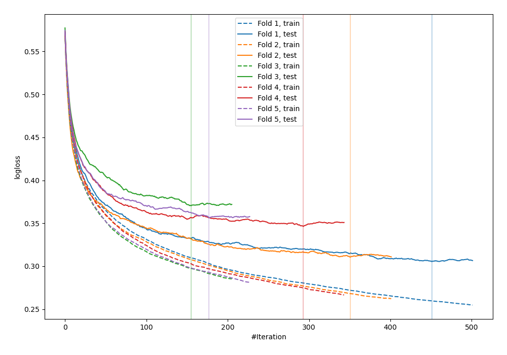
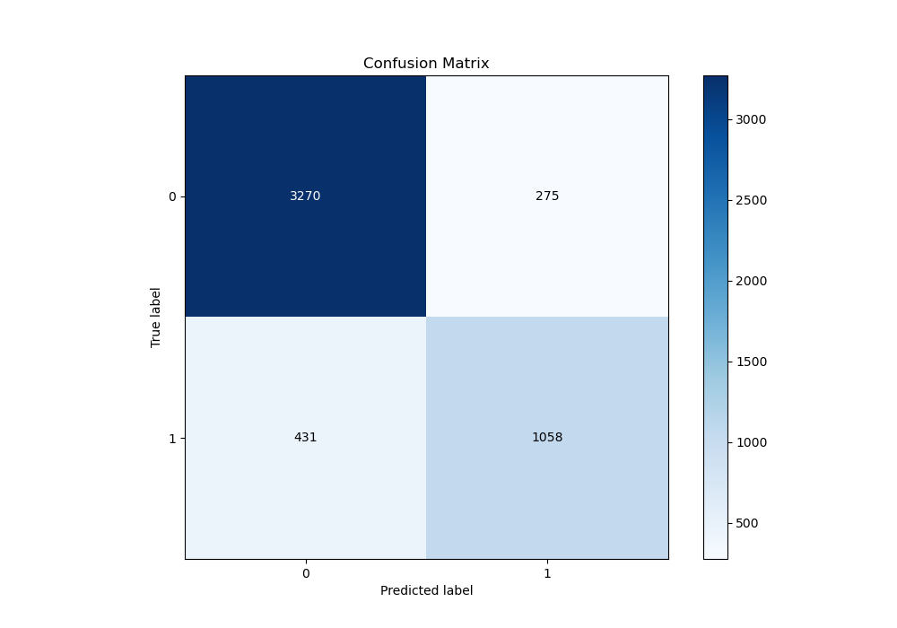
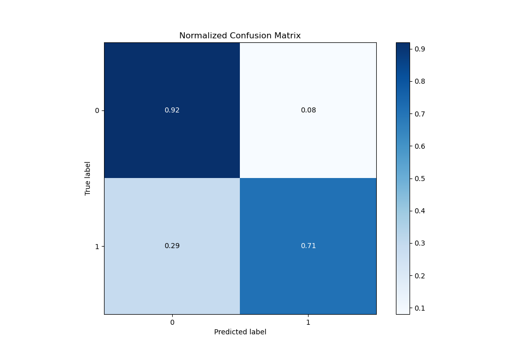
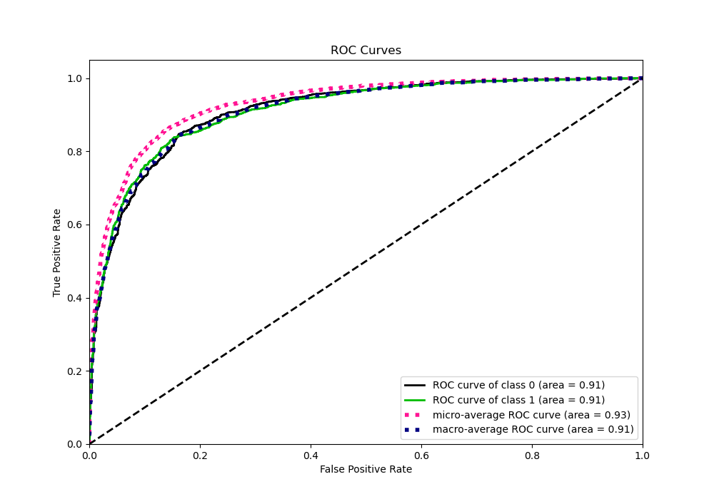
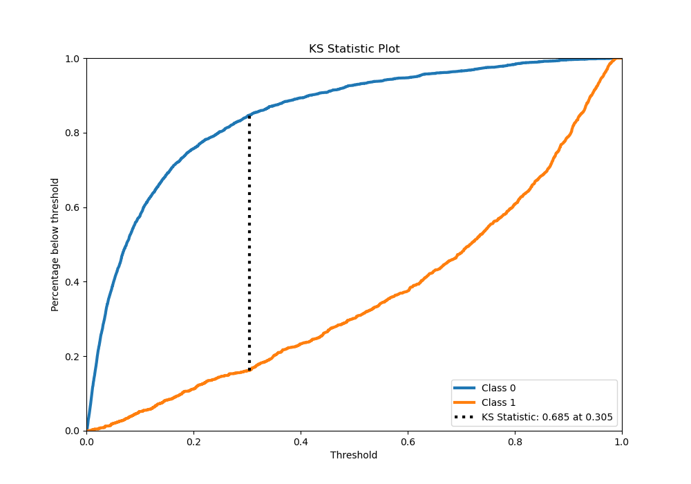
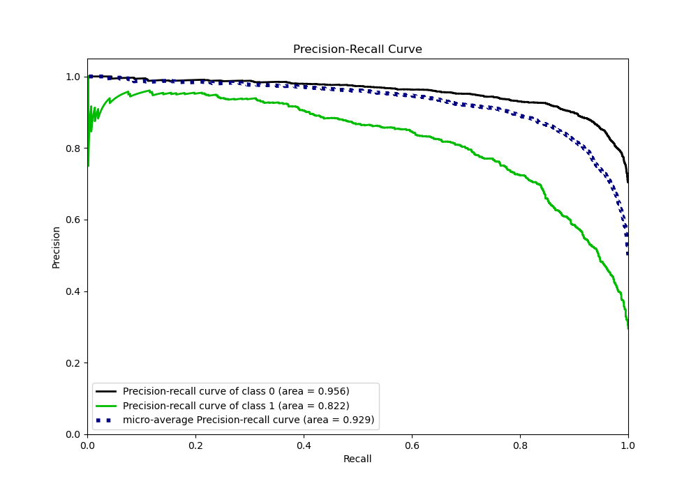
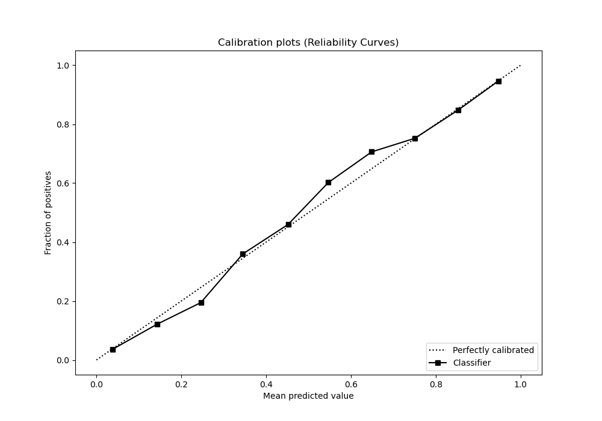
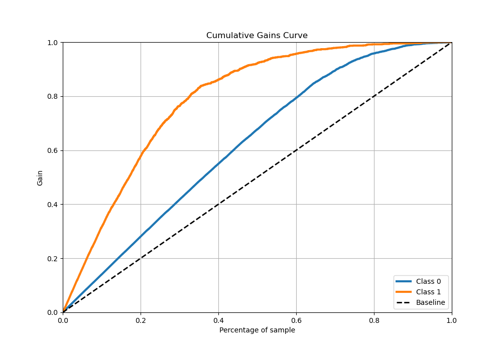
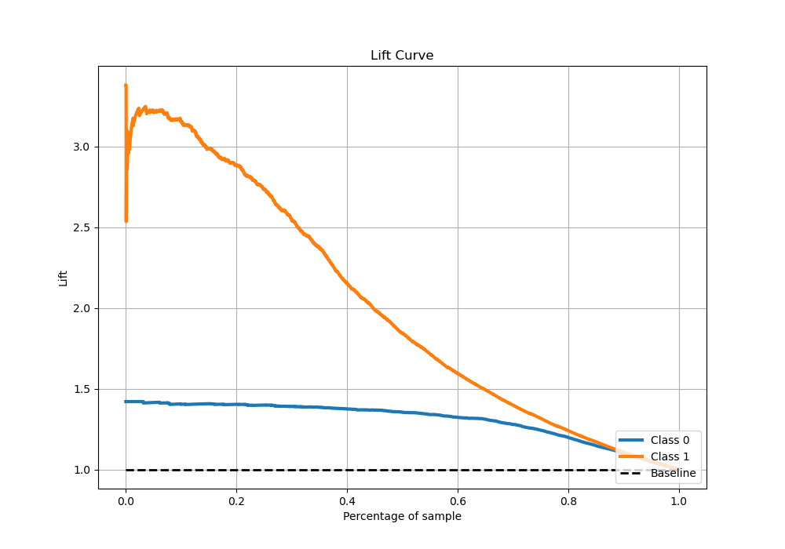

# Summary of 6_Xgboost

[<< Go back](../README.md)

## Extreme Gradient Boosting (Xgboost)
- **n_jobs**: -1
- **objective**: binary:logistic
- **eta**: 0.15
- **max_depth**: 6
- **min_child_weight**: 25
- **subsample**: 0.5
- **colsample_bytree**: 0.5
- **eval_metric**: logloss
- **explain_level**: 0

## Validation
 - **validation_type**: kfold
 - **stratify**: True
 - **k_folds**: 5
 - **shuffle**: True
 - **random_seed**: 42

## Optimized metric
logloss

## Training time

16.3 seconds

## Metric details
|           |    score |     threshold |
|:----------|---------:|--------------:|
| logloss   | 0.337886 | nan           |
| auc       | 0.910838 | nan           |
| f1        | 0.761665 |   0.338469    |
| accuracy  | 0.859754 |   0.483419    |
| precision | 0.956284 |   0.936807    |
| recall    | 1        |   0.000437008 |
| mcc       | 0.660096 |   0.41944     |

## Metric details with threshold from accuracy metric
|           |    score |   threshold |
|:----------|---------:|------------:|
| logloss   | 0.337886 |  nan        |
| auc       | 0.910838 |  nan        |
| f1        | 0.749823 |    0.483419 |
| accuracy  | 0.859754 |    0.483419 |
| precision | 0.793698 |    0.483419 |
| recall    | 0.710544 |    0.483419 |
| mcc       | 0.654733 |    0.483419 |

## Confusion matrix (at threshold=0.483419)
|              |   Predicted as 0 |   Predicted as 1 |
|:-------------|-----------------:|-----------------:|
| Labeled as 0 |             3270 |              275 |
| Labeled as 1 |              431 |             1058 |

## Learning curves

## Confusion Matrix

## Normalized Confusion Matrix

## ROC Curve

## Kolmogorov-Smirnov Statistic

## Precision-Recall Curve

## Calibration Curve

## Cumulative Gains Curve

## Lift Curve

[<< Go back](../README.md)
