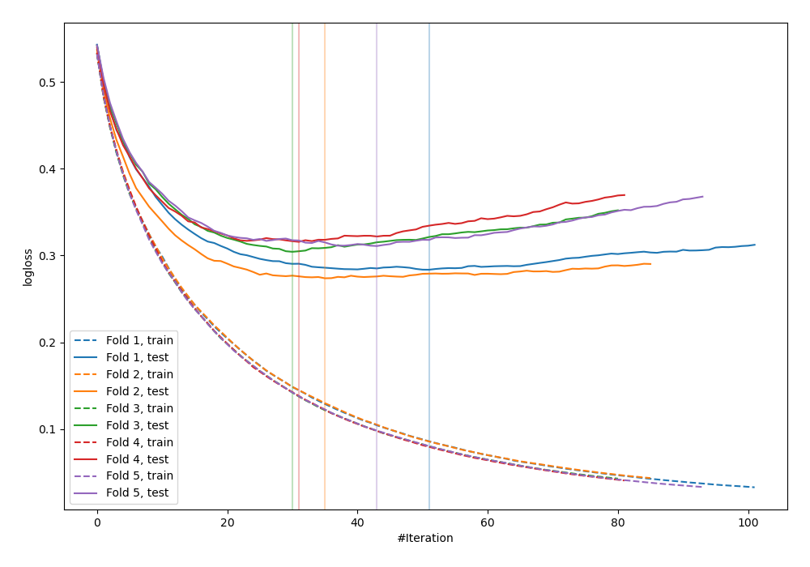
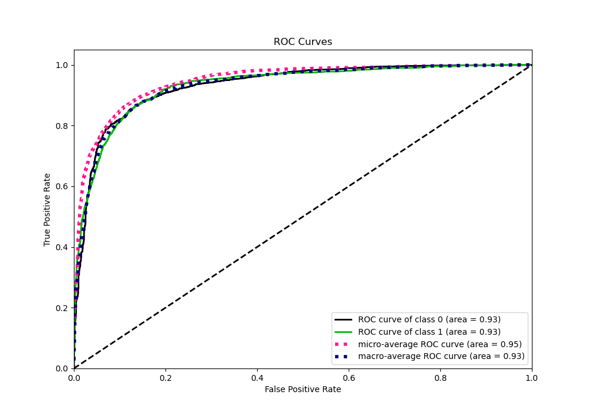
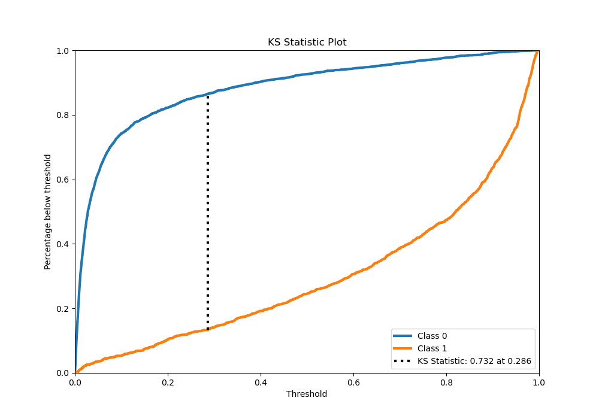
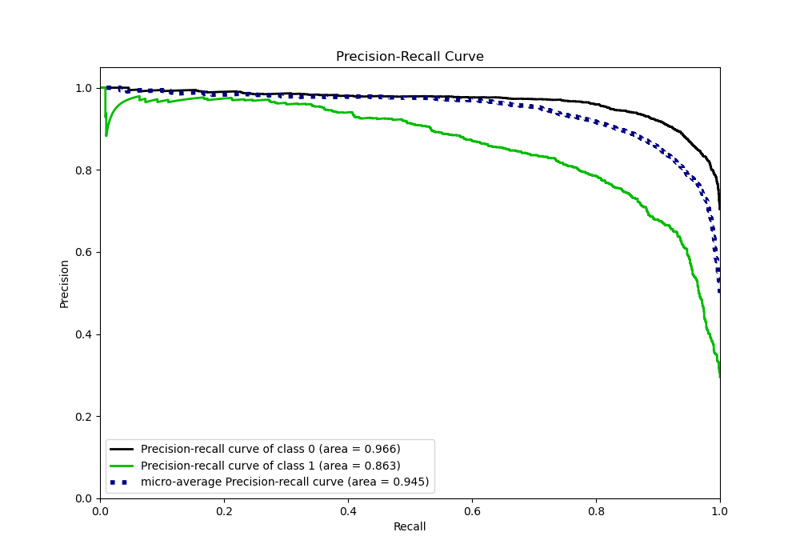
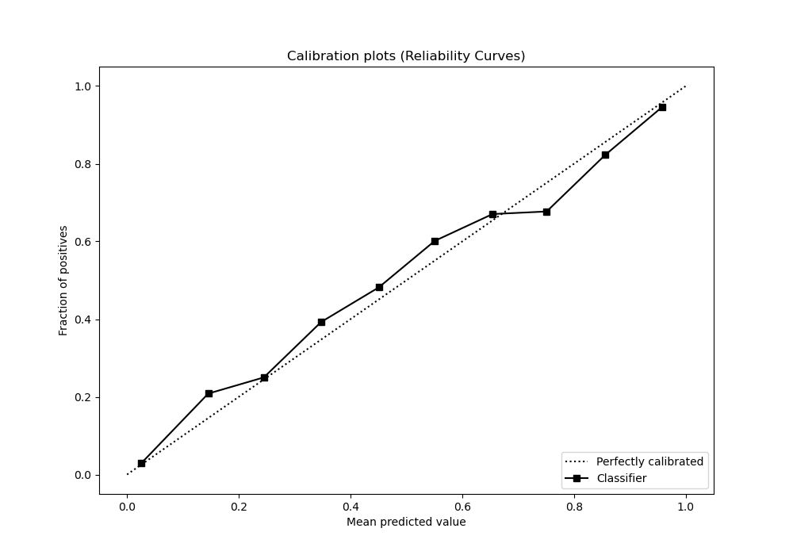
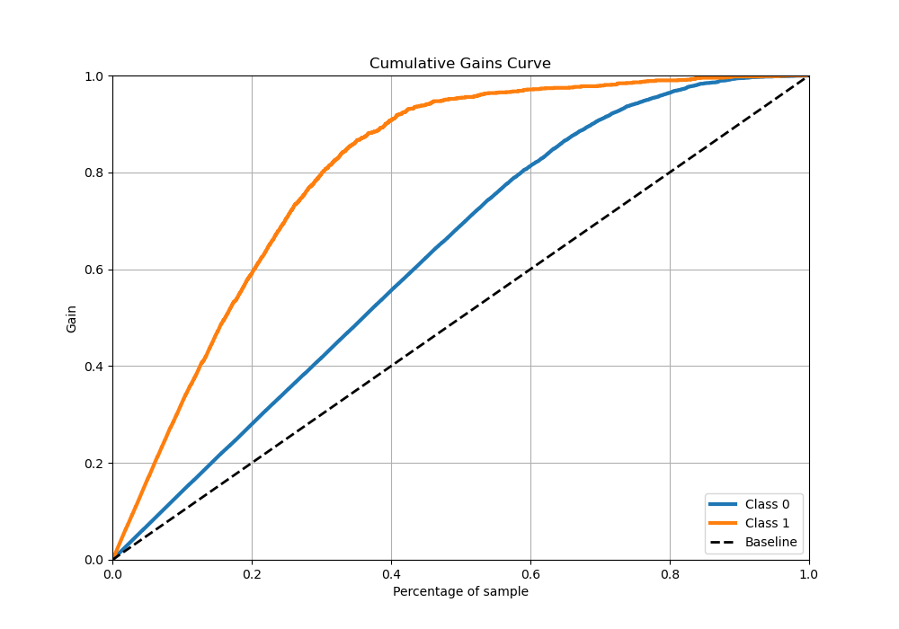
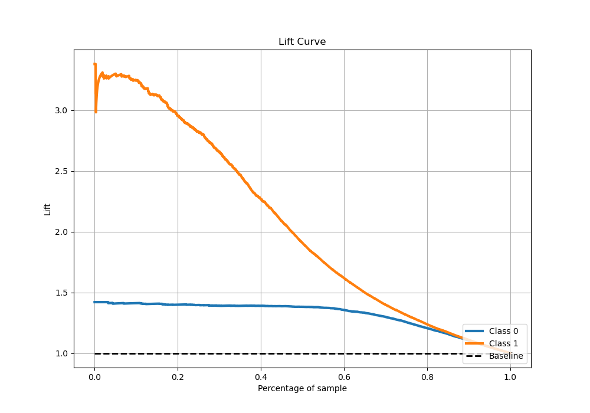

# Summary of 71_LightGBM

[<< Go back](../README.md)

## LightGBM
- **n_jobs**: -1
- **objective**: binary
- **num_leaves**: 127
- **learning_rate**: 0.2
- **feature_fraction**: 1.0
- **bagging_fraction**: 1.0
- **min_data_in_leaf**: 50
- **metric**: binary_logloss
- **custom_eval_metric_name**: None
- **explain_level**: 0

## Validation
 - **validation_type**: kfold
 - **stratify**: True
 - **k_folds**: 5
 - **shuffle**: True
 - **random_seed**: 42

## Optimized metric
logloss

## Training time

15.1 seconds

## Metric details
|           |    score |     threshold |
|:----------|---------:|--------------:|
| logloss   | 0.297588 | nan           |
| auc       | 0.931888 | nan           |
| f1        | 0.79319  |   0.329003    |
| accuracy  | 0.875646 |   0.472341    |
| precision | 0.975904 |   0.985781    |
| recall    | 1        |   1.93856e-05 |
| mcc       | 0.703241 |   0.408599    |

## Metric details with threshold from accuracy metric
|           |    score |   threshold |
|:----------|---------:|------------:|
| logloss   | 0.297588 |  nan        |
| auc       | 0.931888 |  nan        |
| f1        | 0.785763 |    0.472341 |
| accuracy  | 0.875646 |    0.472341 |
| precision | 0.801117 |    0.472341 |
| recall    | 0.770987 |    0.472341 |
| mcc       | 0.698462 |    0.472341 |

## Confusion matrix (at threshold=0.472341)
|              |   Predicted as 0 |   Predicted as 1 |
|:-------------|-----------------:|-----------------:|
| Labeled as 0 |             3260 |              285 |
| Labeled as 1 |              341 |             1148 |

## Learning curves

## Confusion Matrix

## Normalized Confusion Matrix

## ROC Curve

## Kolmogorov-Smirnov Statistic

## Precision-Recall Curve

## Calibration Curve

## Cumulative Gains Curve

## Lift Curve

[<< Go back](../README.md)
