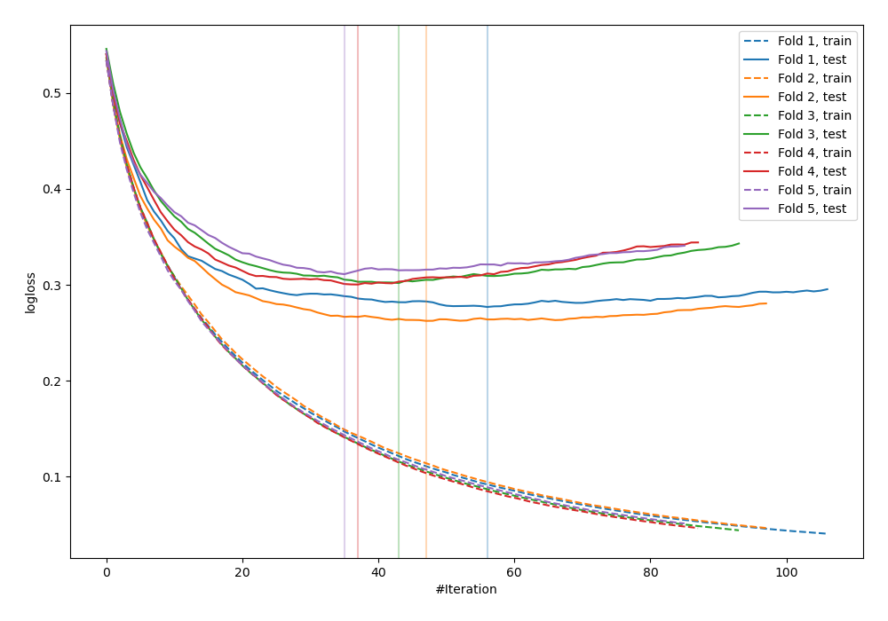
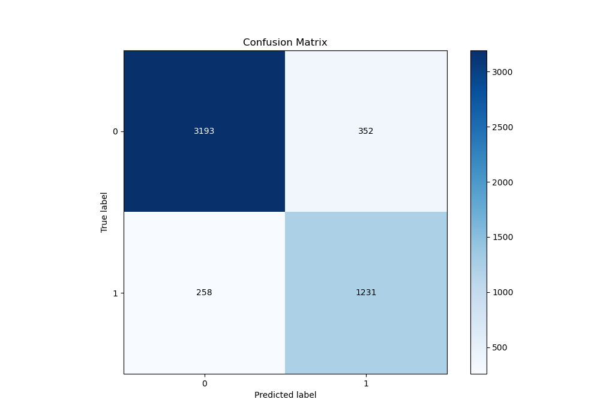
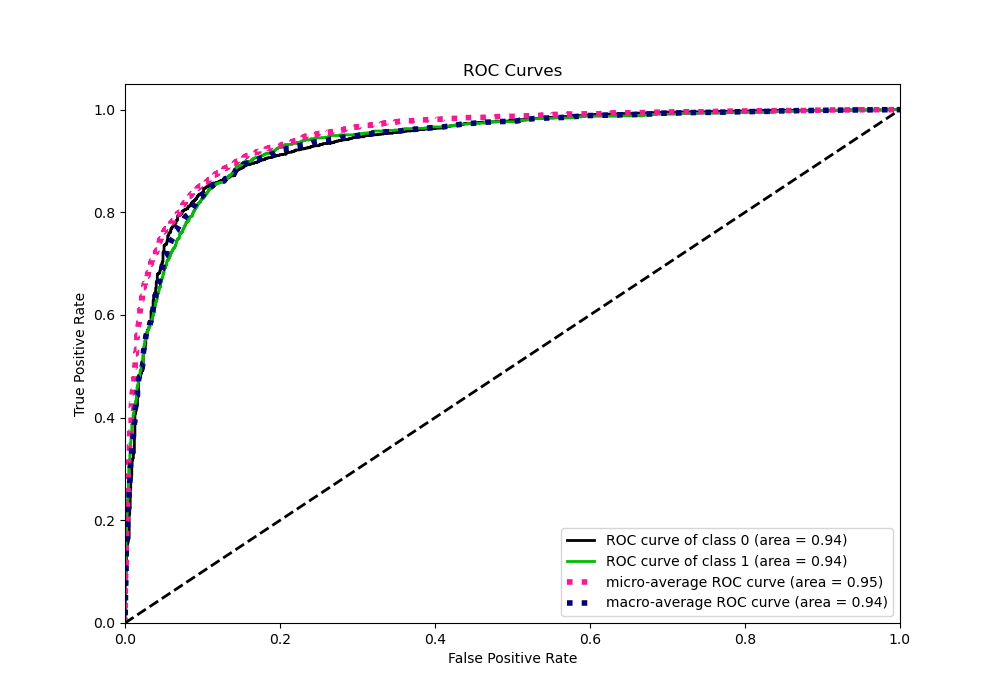
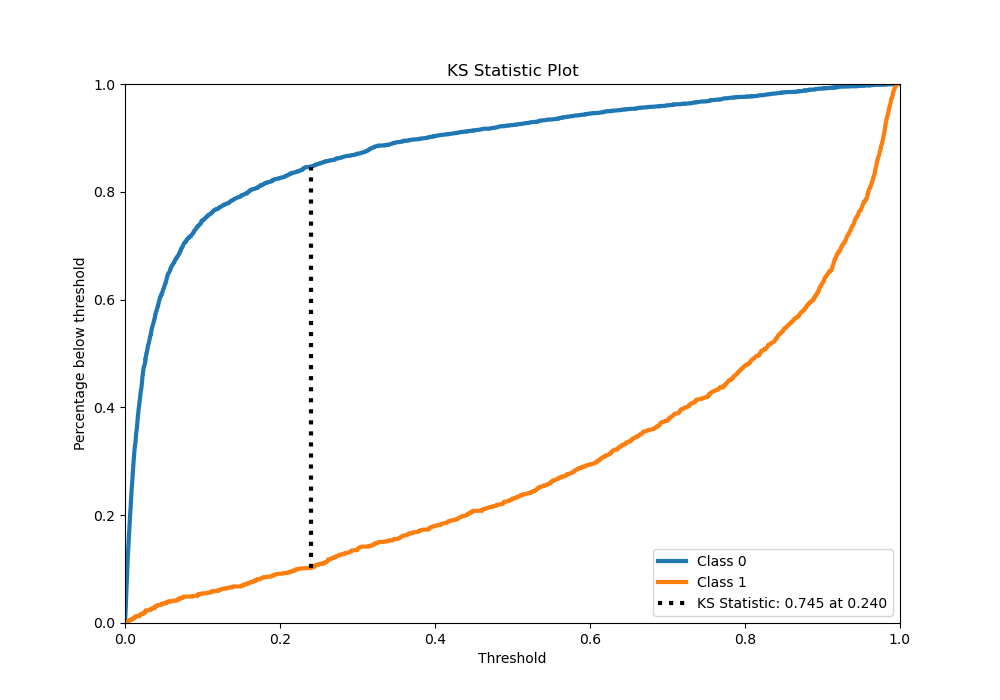
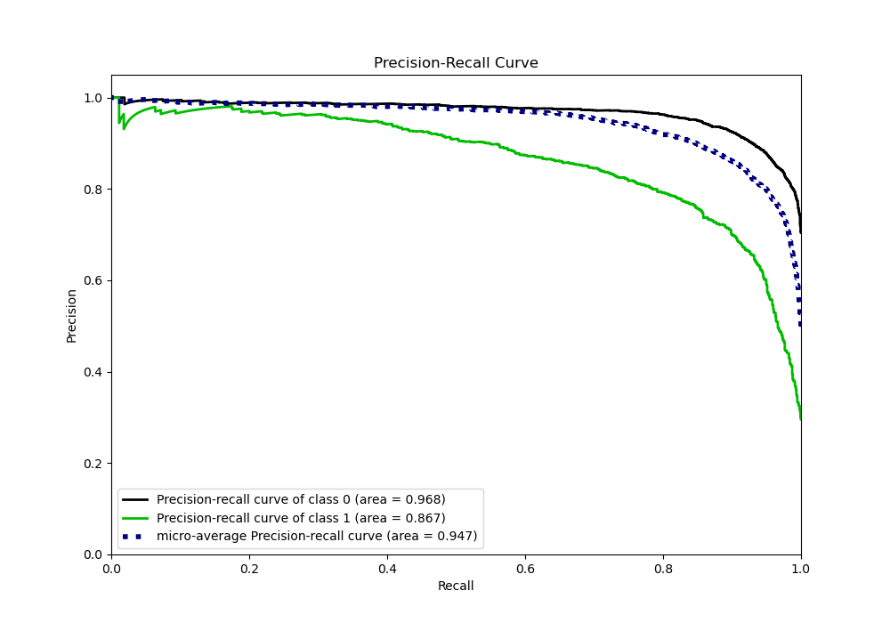
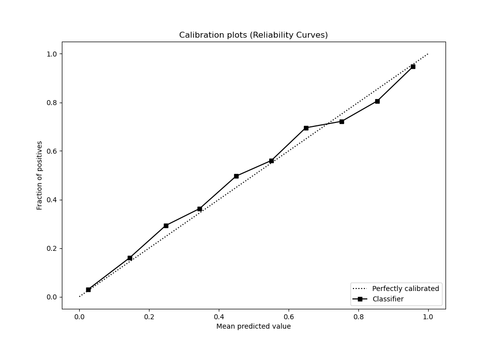
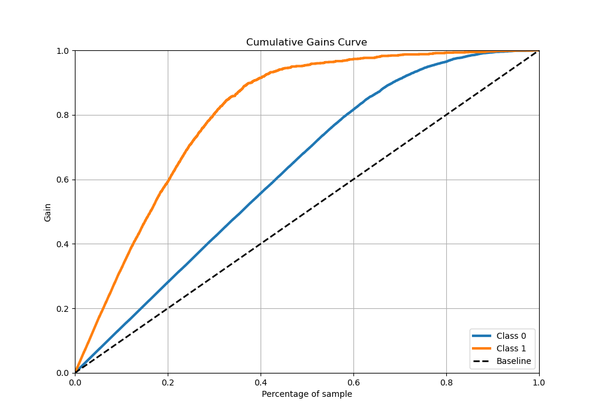
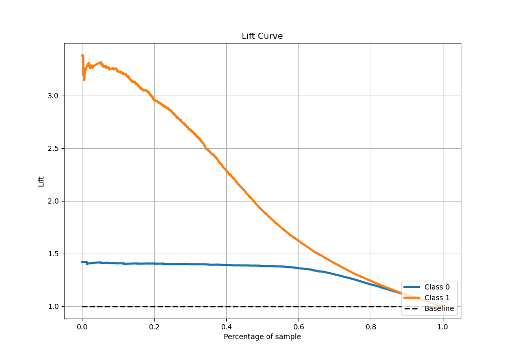

# Summary of 73_LightGBM

[<< Go back](../README.md)

## LightGBM
- **n_jobs**: -1
- **objective**: binary
- **num_leaves**: 95
- **learning_rate**: 0.2
- **feature_fraction**: 0.5
- **bagging_fraction**: 0.9
- **min_data_in_leaf**: 50
- **metric**: binary_logloss
- **custom_eval_metric_name**: None
- **explain_level**: 0

## Validation
 - **validation_type**: kfold
 - **stratify**: True
 - **k_folds**: 5
 - **shuffle**: True
 - **random_seed**: 42

## Optimized metric
logloss

## Training time

12.6 seconds

## Metric details
|           |    score |     threshold |
|:----------|---------:|--------------:|
| logloss   | 0.290607 | nan           |
| auc       | 0.935221 | nan           |
| f1        | 0.802691 |   0.355486    |
| accuracy  | 0.878824 |   0.391473    |
| precision | 0.978541 |   0.969173    |
| recall    | 1        |   3.41287e-05 |
| mcc       | 0.715878 |   0.355486    |

## Metric details with threshold from accuracy metric
|           |    score |   threshold |
|:----------|---------:|------------:|
| logloss   | 0.290607 |  nan        |
| auc       | 0.935221 |  nan        |
| f1        | 0.801432 |    0.391473 |
| accuracy  | 0.878824 |    0.391473 |
| precision | 0.777637 |    0.391473 |
| recall    | 0.826729 |    0.391473 |
| mcc       | 0.71505  |    0.391473 |

## Confusion matrix (at threshold=0.391473)
|              |   Predicted as 0 |   Predicted as 1 |
|:-------------|-----------------:|-----------------:|
| Labeled as 0 |             3193 |              352 |
| Labeled as 1 |              258 |             1231 |

## Learning curves

## Confusion Matrix

## Normalized Confusion Matrix

## ROC Curve

## Kolmogorov-Smirnov Statistic

## Precision-Recall Curve

## Calibration Curve

## Cumulative Gains Curve

## Lift Curve

[<< Go back](../README.md)
