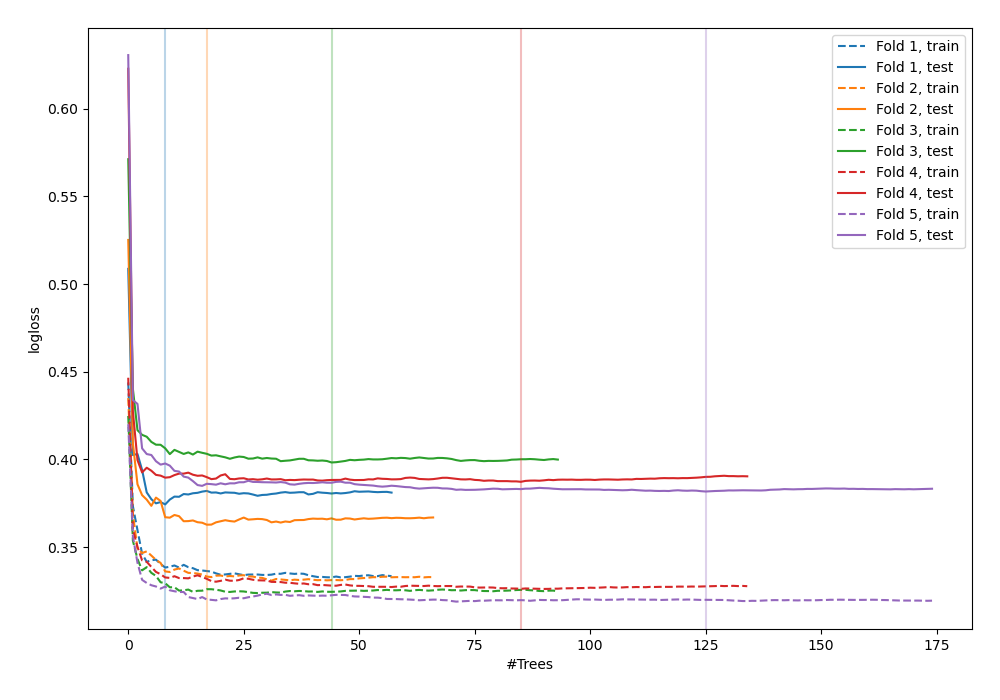
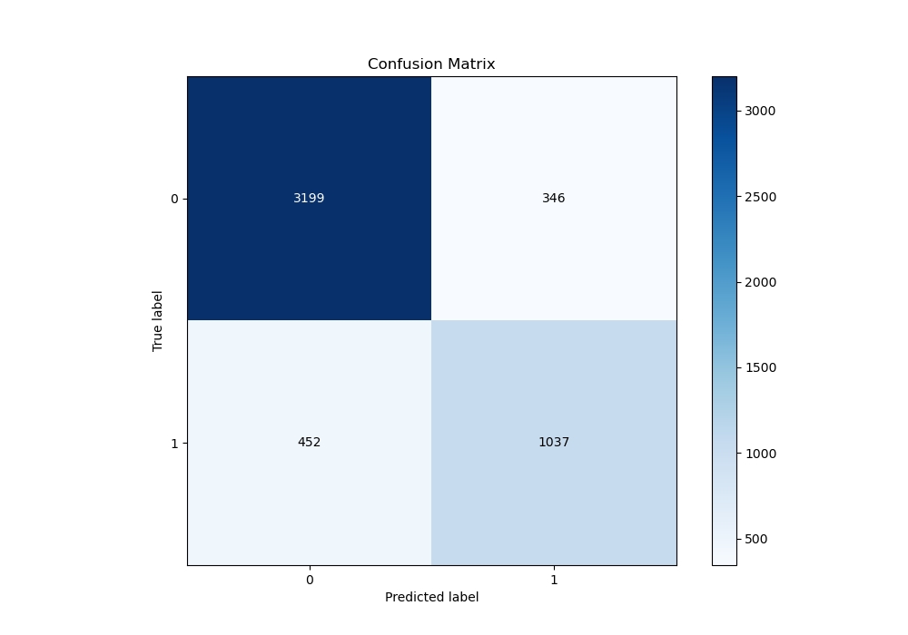
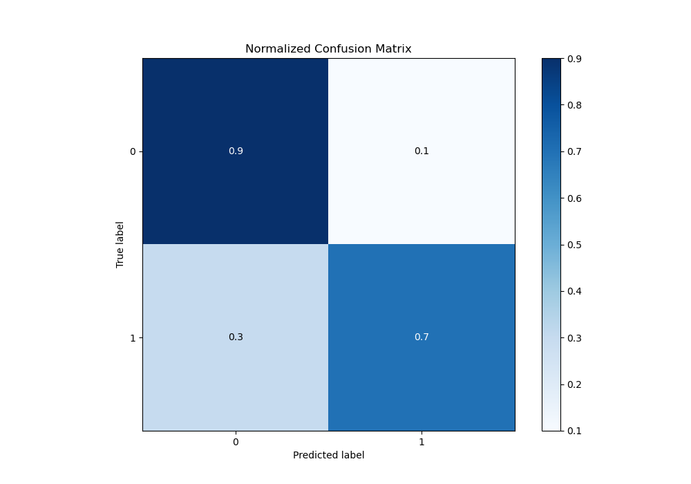
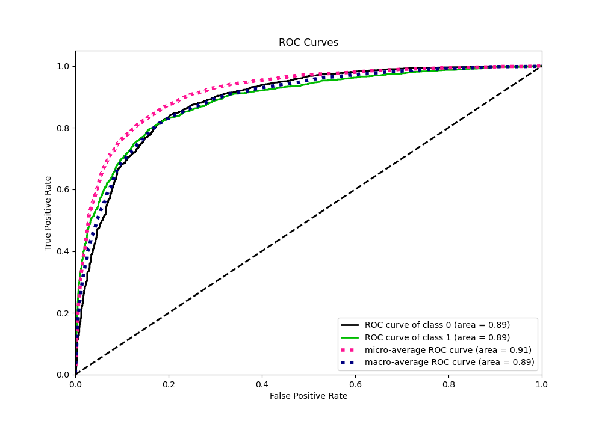
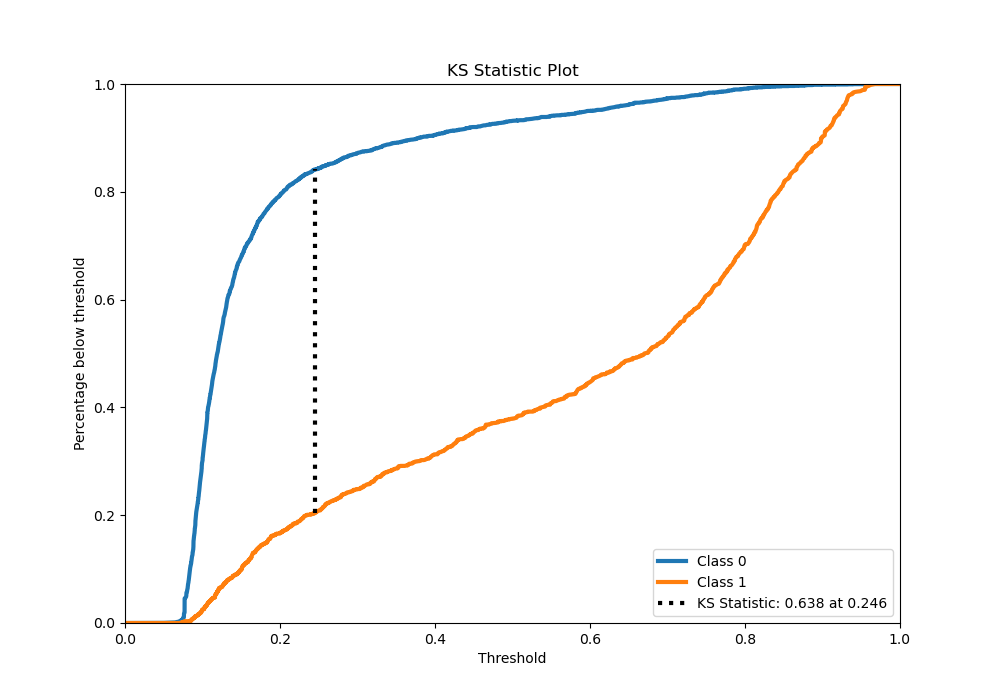
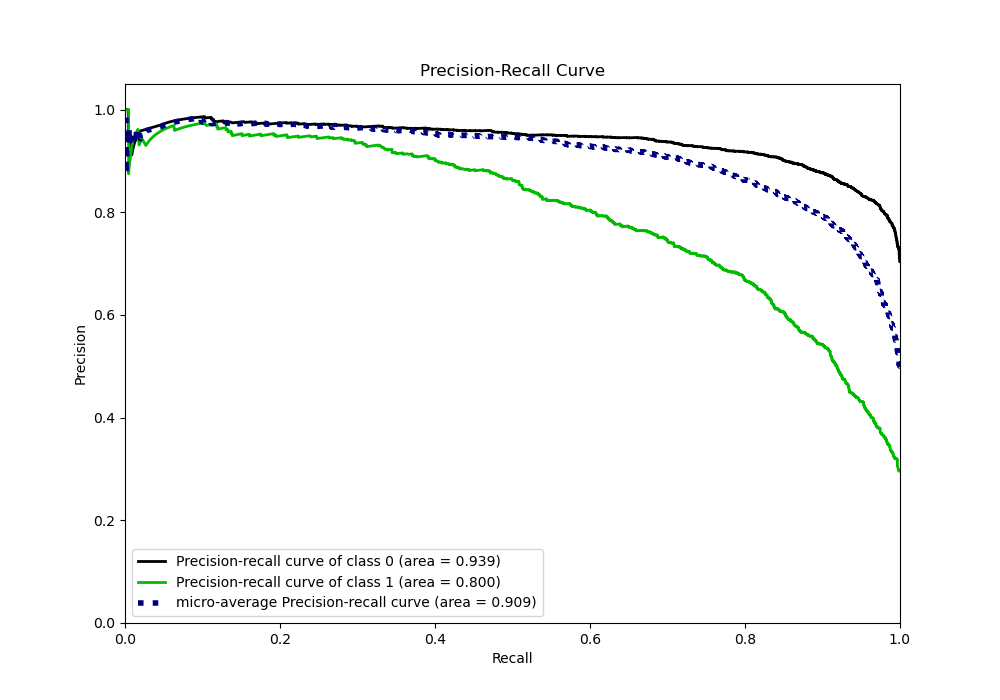
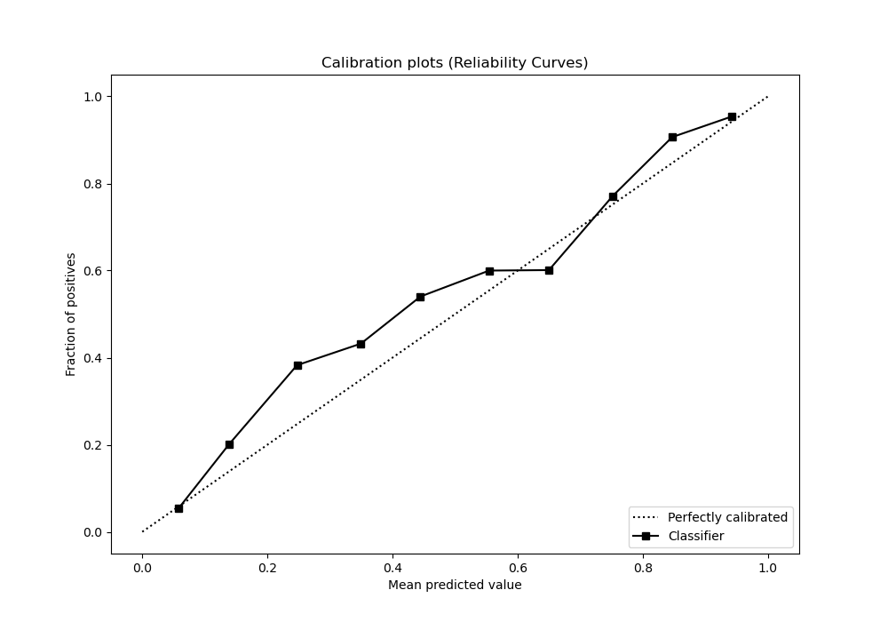
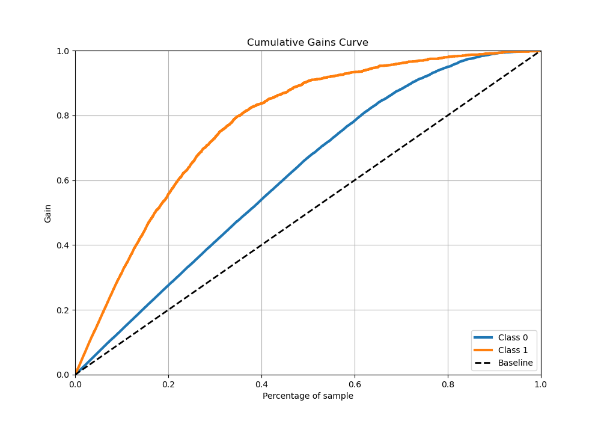
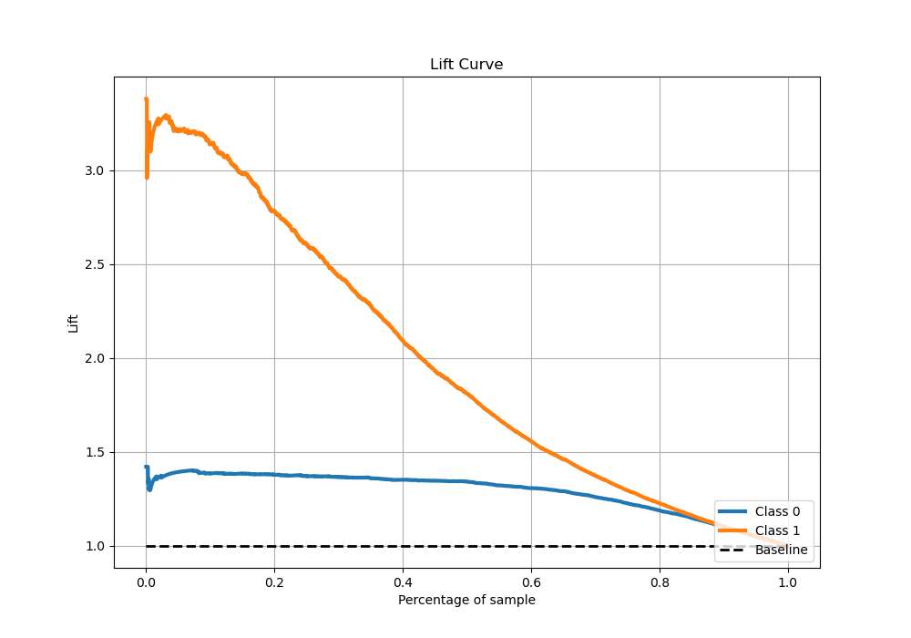

# Summary of 75_RandomForest

[<< Go back](../README.md)

## Random Forest
- **n_jobs**: -1
- **criterion**: gini
- **max_features**: 0.8
- **min_samples_split**: 40
- **max_depth**: 7
- **eval_metric_name**: logloss
- **explain_level**: 0

## Validation
 - **validation_type**: kfold
 - **stratify**: True
 - **k_folds**: 5
 - **shuffle**: True
 - **random_seed**: 42

## Optimized metric
logloss

## Training time

23.7 seconds

## Metric details
|           |    score |   threshold |
|:----------|---------:|------------:|
| logloss   | 0.380871 | nan         |
| auc       | 0.888861 | nan         |
| f1        | 0.731223 |   0.250429  |
| accuracy  | 0.841478 |   0.388537  |
| precision | 0.969925 |   0.904942  |
| recall    | 1        |   0.0453881 |
| mcc       | 0.612277 |   0.388537  |

## Metric details with threshold from accuracy metric
|           |    score |   threshold |
|:----------|---------:|------------:|
| logloss   | 0.380871 |  nan        |
| auc       | 0.888861 |  nan        |
| f1        | 0.722145 |    0.388537 |
| accuracy  | 0.841478 |    0.388537 |
| precision | 0.749819 |    0.388537 |
| recall    | 0.696441 |    0.388537 |
| mcc       | 0.612277 |    0.388537 |

## Confusion matrix (at threshold=0.388537)
|              |   Predicted as 0 |   Predicted as 1 |
|:-------------|-----------------:|-----------------:|
| Labeled as 0 |             3199 |              346 |
| Labeled as 1 |              452 |             1037 |

## Learning curves

## Confusion Matrix

## Normalized Confusion Matrix

## ROC Curve

## Kolmogorov-Smirnov Statistic

## Precision-Recall Curve

## Calibration Curve

## Cumulative Gains Curve

## Lift Curve

[<< Go back](../README.md)
