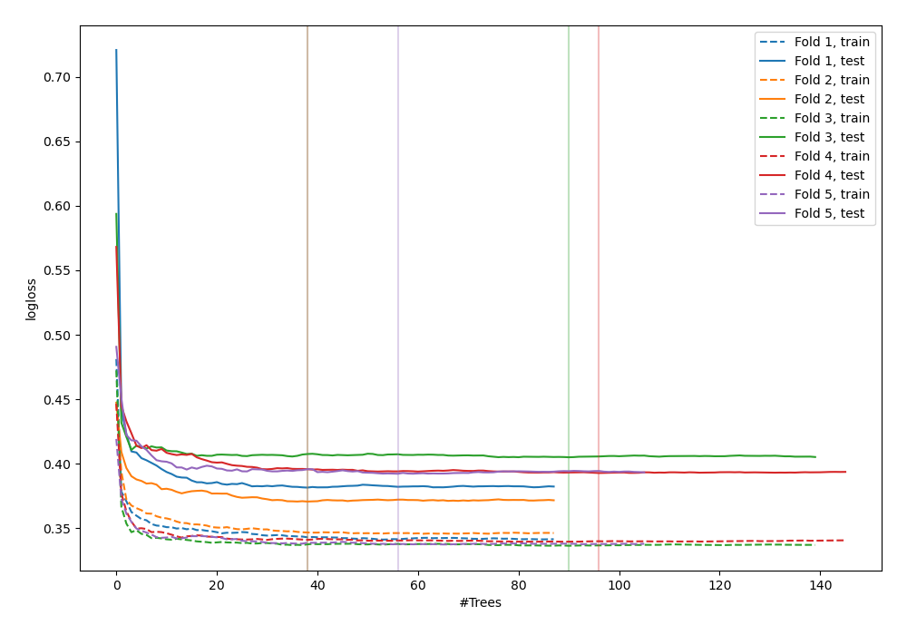
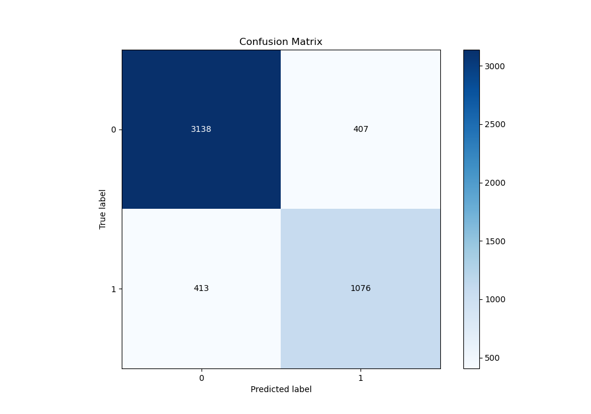
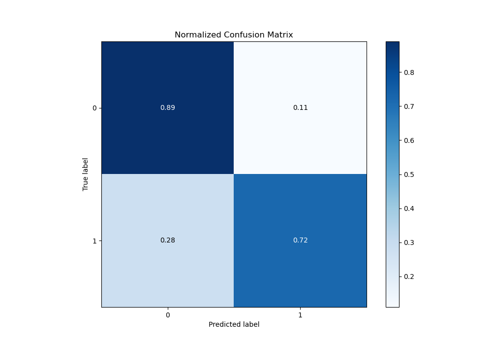
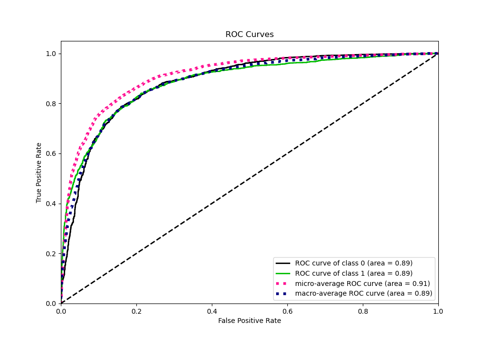
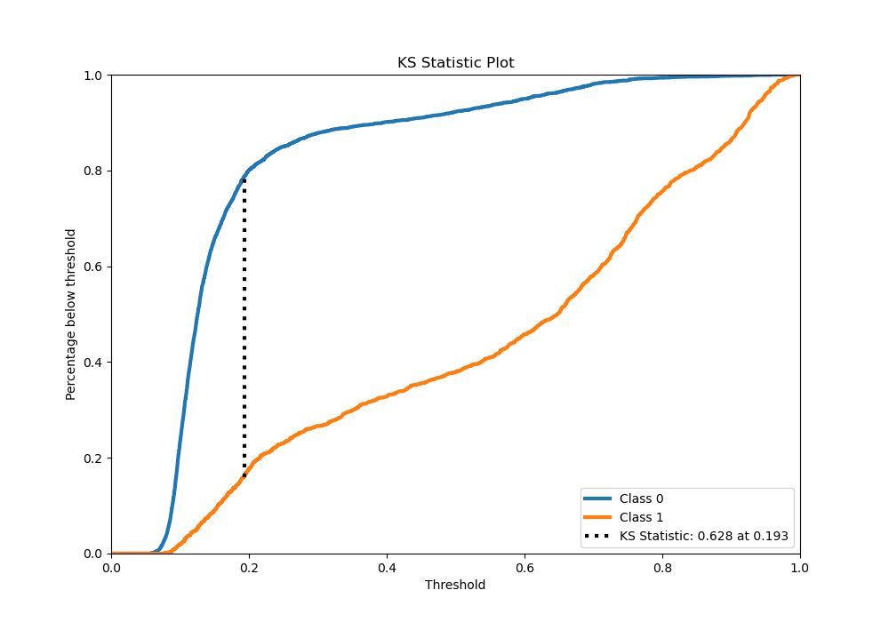
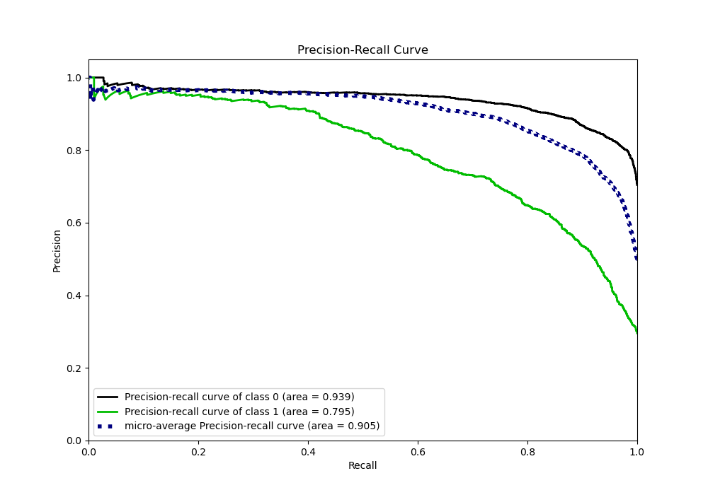
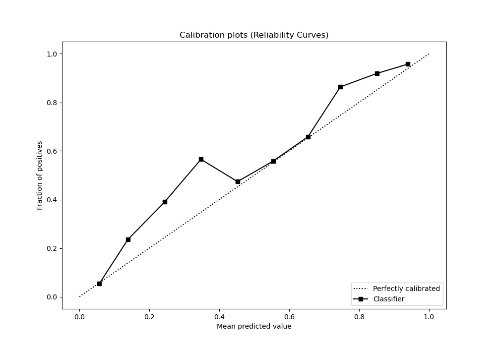
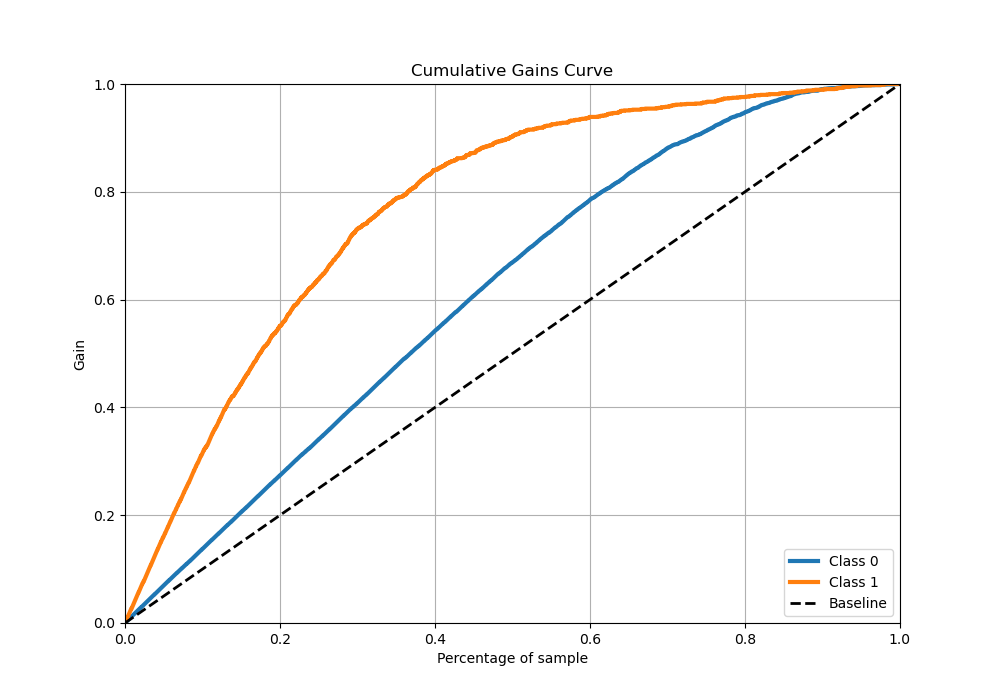
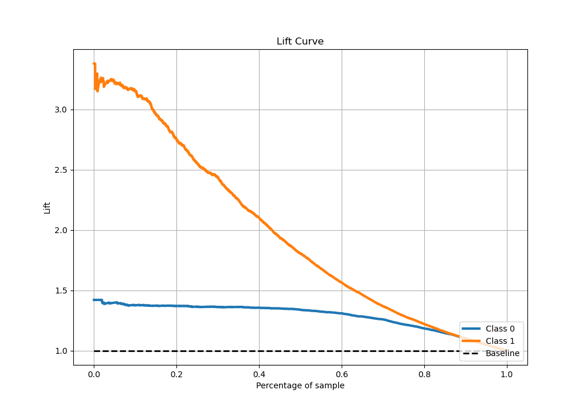

# Summary of 76_RandomForest

[<< Go back](../README.md)

## Random Forest
- **n_jobs**: -1
- **criterion**: entropy
- **max_features**: 0.8
- **min_samples_split**: 30
- **max_depth**: 6
- **eval_metric_name**: logloss
- **explain_level**: 0

## Validation
 - **validation_type**: kfold
 - **stratify**: True
 - **k_folds**: 5
 - **shuffle**: True
 - **random_seed**: 42

## Optimized metric
logloss

## Training time

25.0 seconds

## Metric details
|           |    score |   threshold |
|:----------|---------:|------------:|
| logloss   | 0.388488 | nan         |
| auc       | 0.886047 | nan         |
| f1        | 0.724092 |   0.321179  |
| accuracy  | 0.837108 |   0.321179  |
| precision | 0.963855 |   0.944382  |
| recall    | 1        |   0.0510066 |
| mcc       | 0.608537 |   0.321179  |

## Metric details with threshold from accuracy metric
|           |    score |   threshold |
|:----------|---------:|------------:|
| logloss   | 0.388488 |  nan        |
| auc       | 0.886047 |  nan        |
| f1        | 0.724092 |    0.321179 |
| accuracy  | 0.837108 |    0.321179 |
| precision | 0.725556 |    0.321179 |
| recall    | 0.722633 |    0.321179 |
| mcc       | 0.608537 |    0.321179 |

## Confusion matrix (at threshold=0.321179)
|              |   Predicted as 0 |   Predicted as 1 |
|:-------------|-----------------:|-----------------:|
| Labeled as 0 |             3138 |              407 |
| Labeled as 1 |              413 |             1076 |

## Learning curves

## Confusion Matrix

## Normalized Confusion Matrix

## ROC Curve

## Kolmogorov-Smirnov Statistic

## Precision-Recall Curve

## Calibration Curve

## Cumulative Gains Curve

## Lift Curve

[<< Go back](../README.md)
