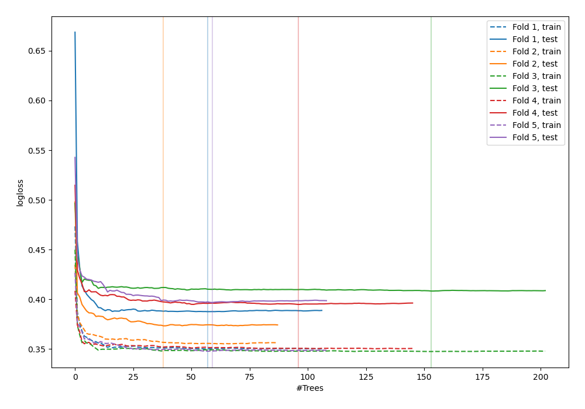
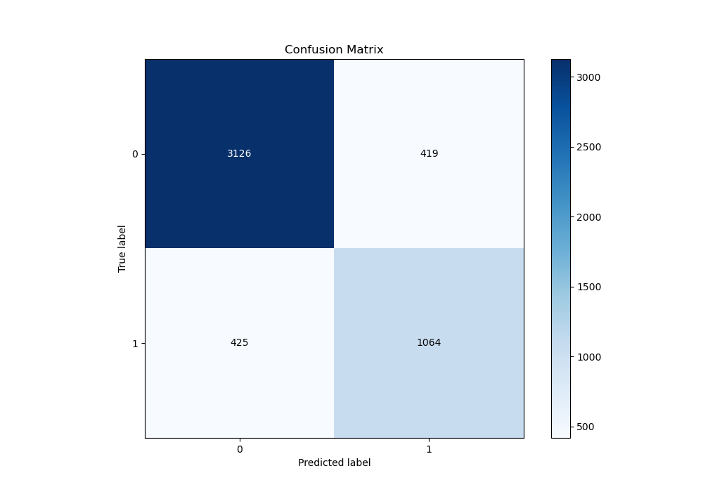
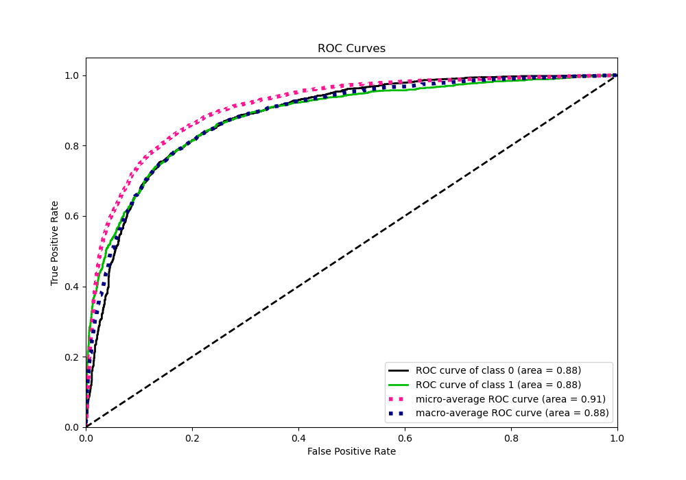
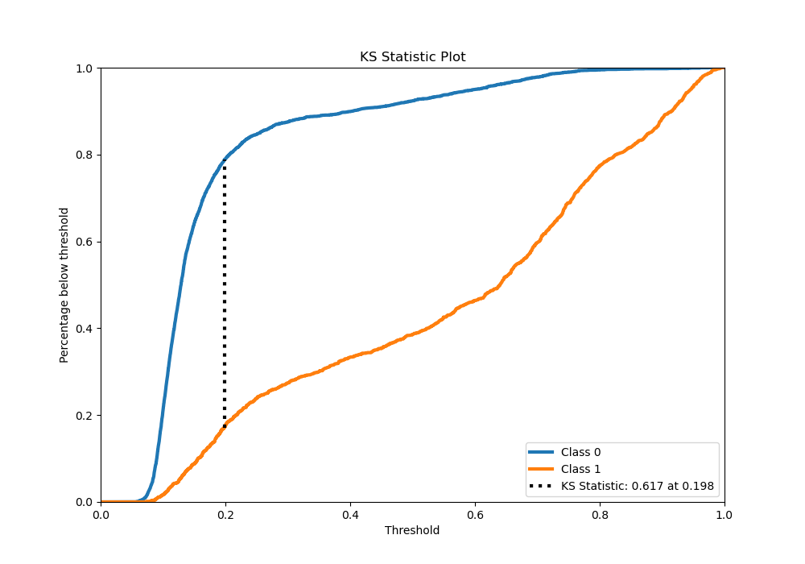
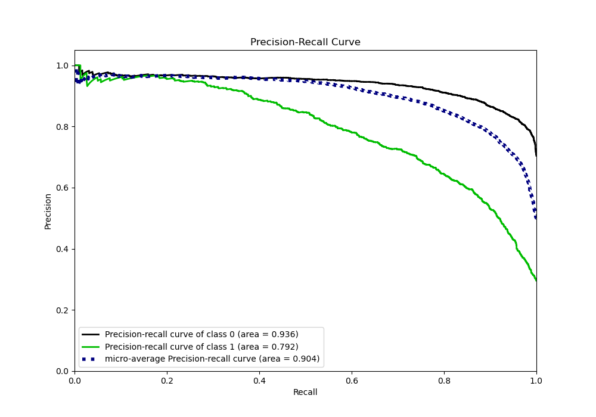
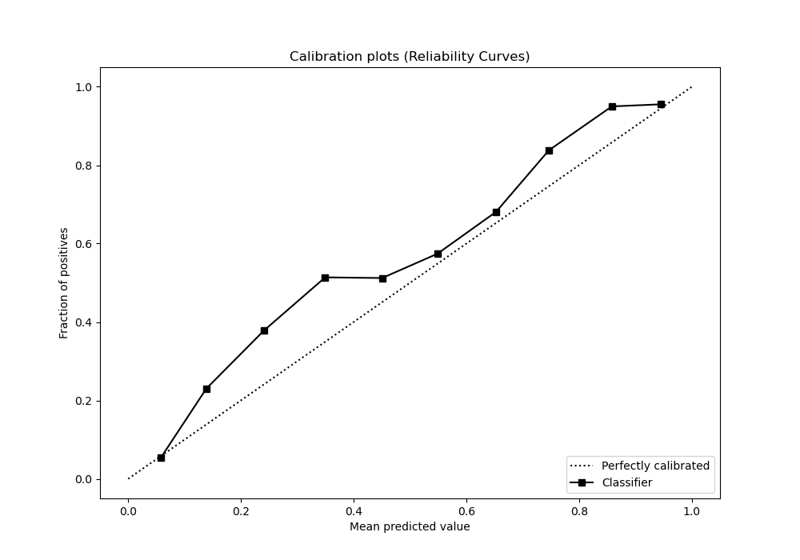
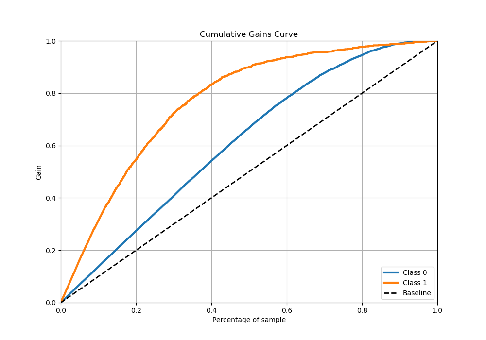
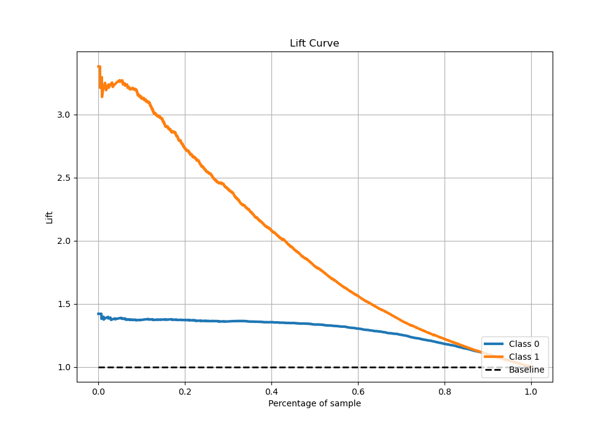

# Summary of 77_RandomForest

[<< Go back](../README.md)

## Random Forest
- **n_jobs**: -1
- **criterion**: entropy
- **max_features**: 0.8
- **min_samples_split**: 50
- **max_depth**: 6
- **eval_metric_name**: logloss
- **explain_level**: 0

## Validation
 - **validation_type**: kfold
 - **stratify**: True
 - **k_folds**: 5
 - **shuffle**: True
 - **random_seed**: 42

## Optimized metric
logloss

## Training time

27.8 seconds

## Metric details
|           |    score |   threshold |
|:----------|---------:|------------:|
| logloss   | 0.392144 | nan         |
| auc       | 0.883584 | nan         |
| f1        | 0.71875  |   0.275742  |
| accuracy  | 0.83234  |   0.317361  |
| precision | 0.965665 |   0.879075  |
| recall    | 1        |   0.0510277 |
| mcc       | 0.598259 |   0.29653   |

## Metric details with threshold from accuracy metric
|           |    score |   threshold |
|:----------|---------:|------------:|
| logloss   | 0.392144 |  nan        |
| auc       | 0.883584 |  nan        |
| f1        | 0.716016 |    0.317361 |
| accuracy  | 0.83234  |    0.317361 |
| precision | 0.717465 |    0.317361 |
| recall    | 0.714574 |    0.317361 |
| mcc       | 0.597079 |    0.317361 |

## Confusion matrix (at threshold=0.317361)
|              |   Predicted as 0 |   Predicted as 1 |
|:-------------|-----------------:|-----------------:|
| Labeled as 0 |             3126 |              419 |
| Labeled as 1 |              425 |             1064 |

## Learning curves

## Confusion Matrix

## Normalized Confusion Matrix

## ROC Curve

## Kolmogorov-Smirnov Statistic

## Precision-Recall Curve

## Calibration Curve

## Cumulative Gains Curve

## Lift Curve

[<< Go back](../README.md)
