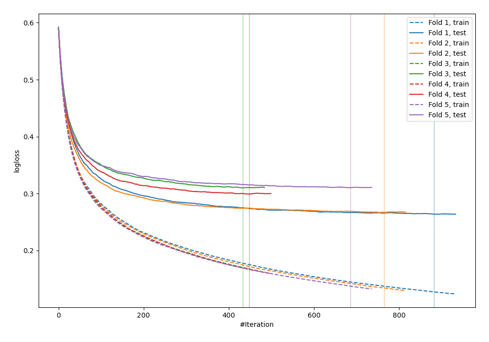
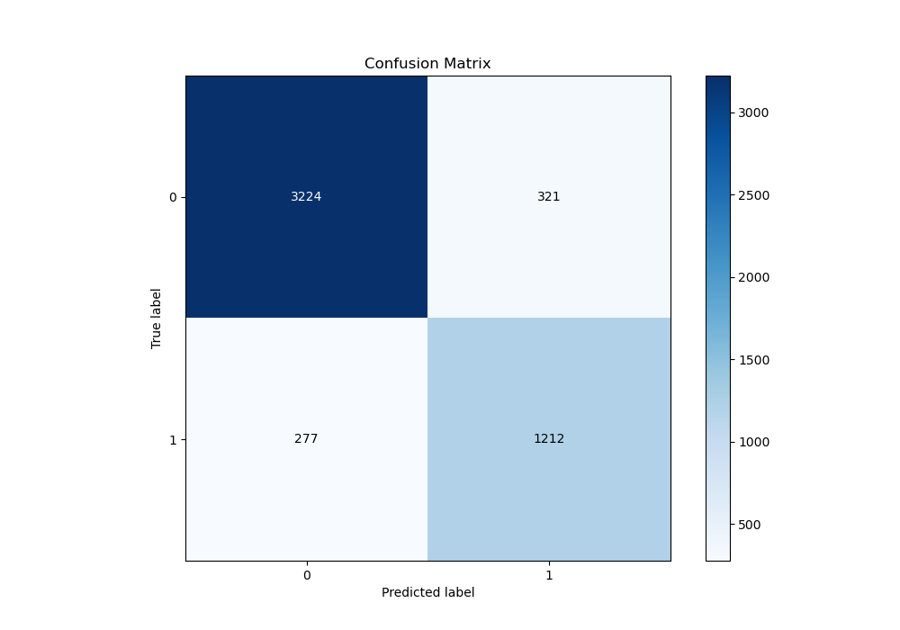
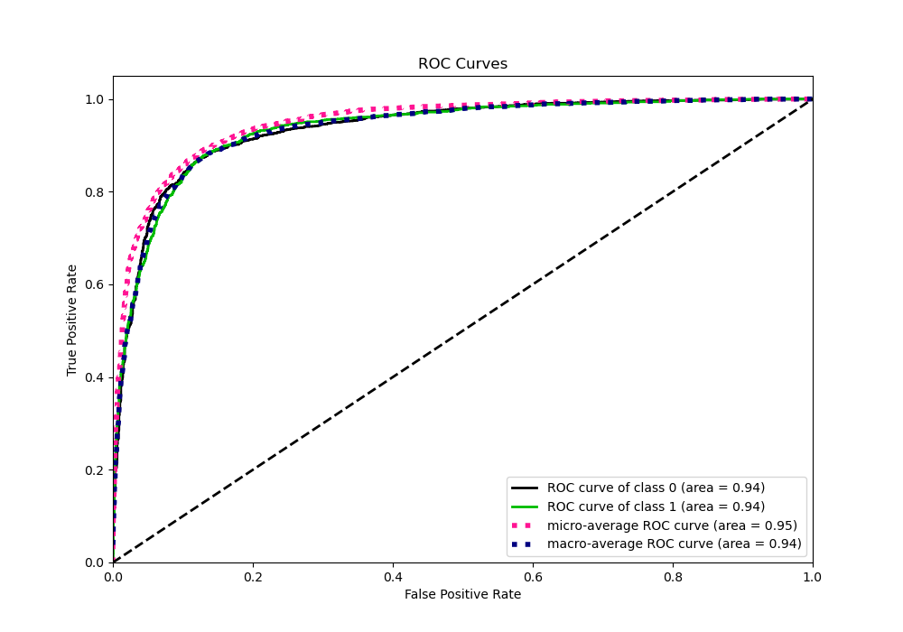
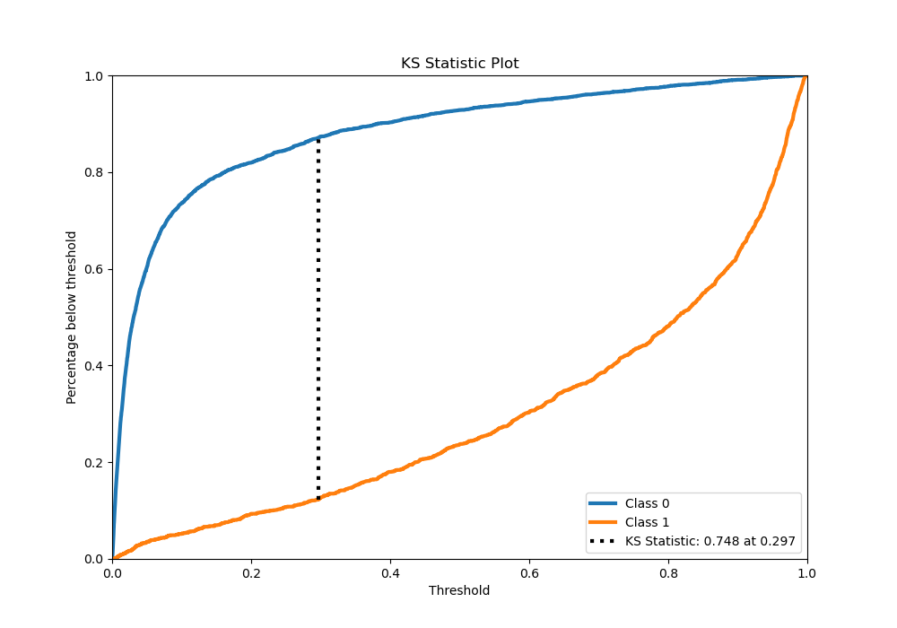
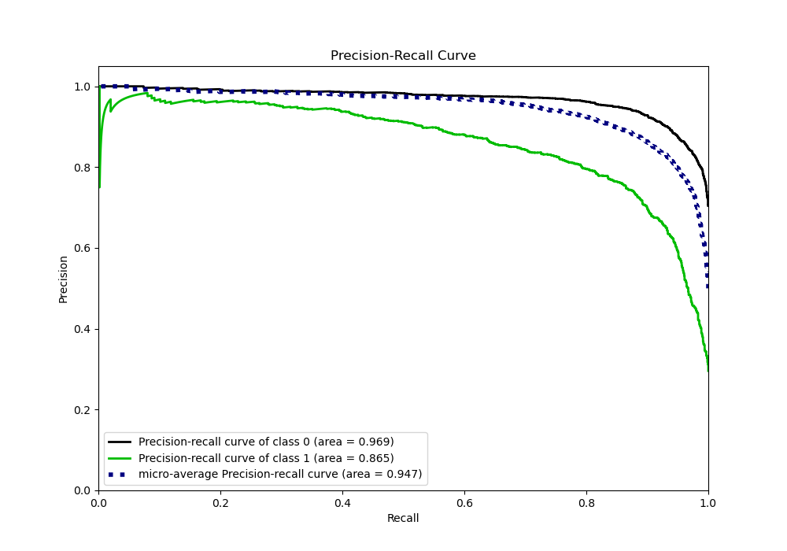
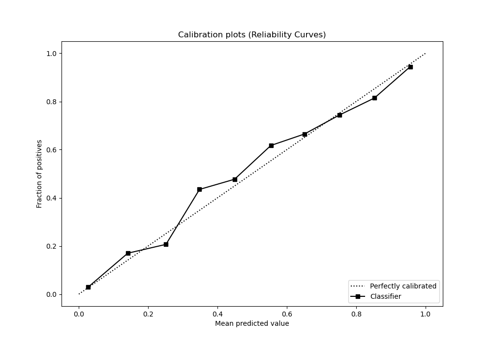
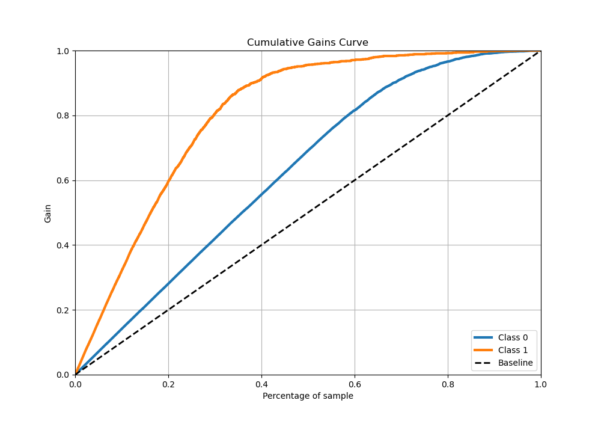
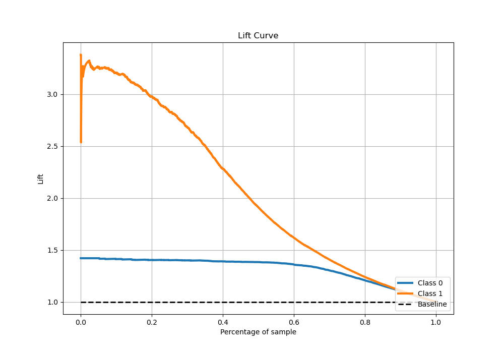

# Summary of 7_Xgboost

[<< Go back](../README.md)

## Extreme Gradient Boosting (Xgboost)
- **n_jobs**: -1
- **objective**: binary:logistic
- **eta**: 0.05
- **max_depth**: 9
- **min_child_weight**: 10
- **subsample**: 0.8
- **colsample_bytree**: 0.6
- **eval_metric**: logloss
- **explain_level**: 0

## Validation
 - **validation_type**: kfold
 - **stratify**: True
 - **k_folds**: 5
 - **shuffle**: True
 - **random_seed**: 42

## Optimized metric
logloss

## Training time

268.5 seconds

## Metric details
|           |    score |     threshold |
|:----------|---------:|--------------:|
| logloss   | 0.29007  | nan           |
| auc       | 0.935452 | nan           |
| f1        | 0.805801 |   0.330379    |
| accuracy  | 0.881208 |   0.418568    |
| precision | 0.977444 |   0.97962     |
| recall    | 1        |   8.06723e-05 |
| mcc       | 0.719826 |   0.330379    |

## Metric details with threshold from accuracy metric
|           |    score |   threshold |
|:----------|---------:|------------:|
| logloss   | 0.29007  |  nan        |
| auc       | 0.935452 |  nan        |
| f1        | 0.802118 |    0.418568 |
| accuracy  | 0.881208 |    0.418568 |
| precision | 0.790607 |    0.418568 |
| recall    | 0.813969 |    0.418568 |
| mcc       | 0.717428 |    0.418568 |

## Confusion matrix (at threshold=0.418568)
|              |   Predicted as 0 |   Predicted as 1 |
|:-------------|-----------------:|-----------------:|
| Labeled as 0 |             3224 |              321 |
| Labeled as 1 |              277 |             1212 |

## Learning curves

## Confusion Matrix

## Normalized Confusion Matrix

## ROC Curve

## Kolmogorov-Smirnov Statistic

## Precision-Recall Curve

## Calibration Curve

## Cumulative Gains Curve

## Lift Curve

[<< Go back](../README.md)
