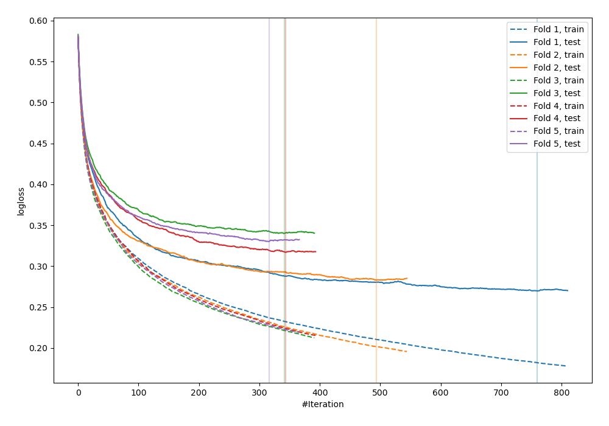
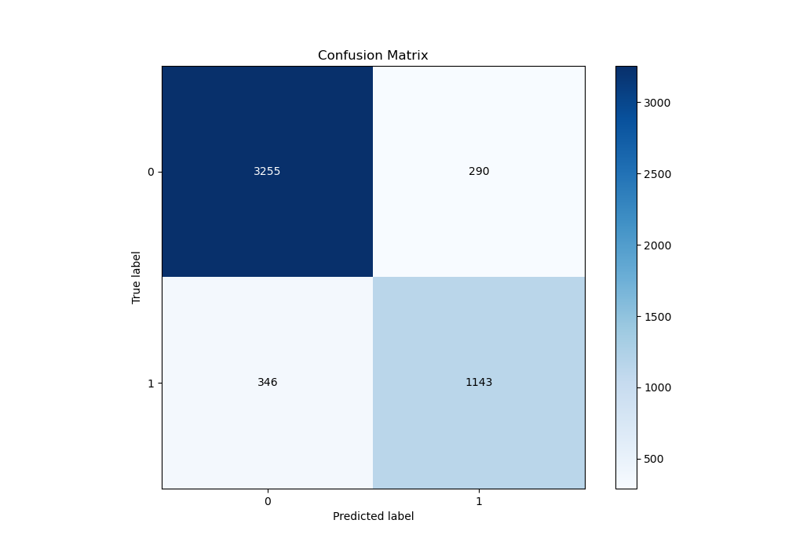
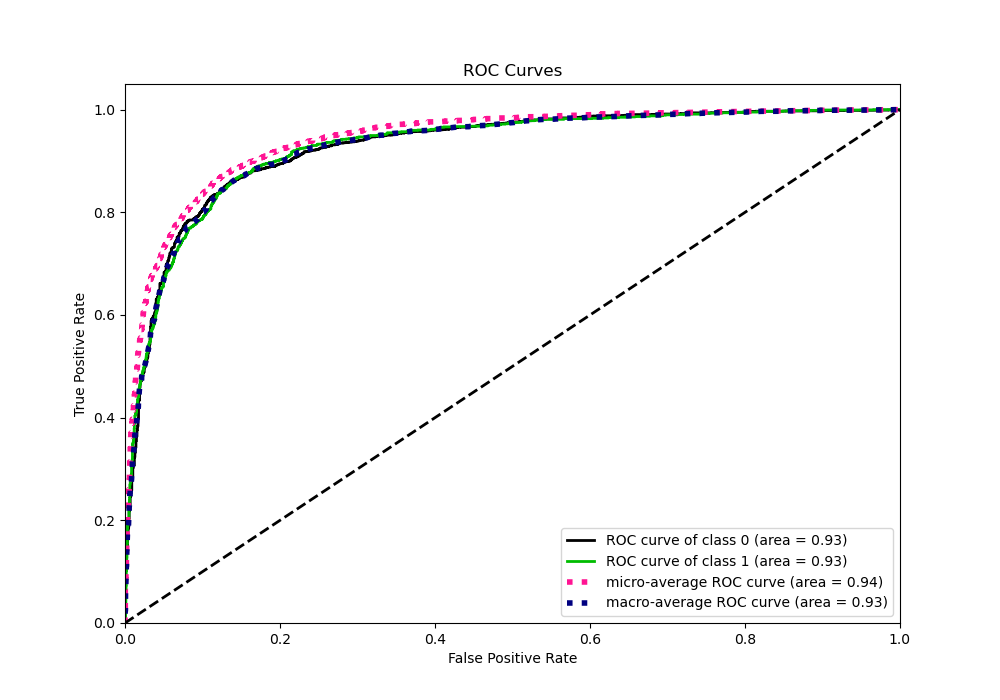
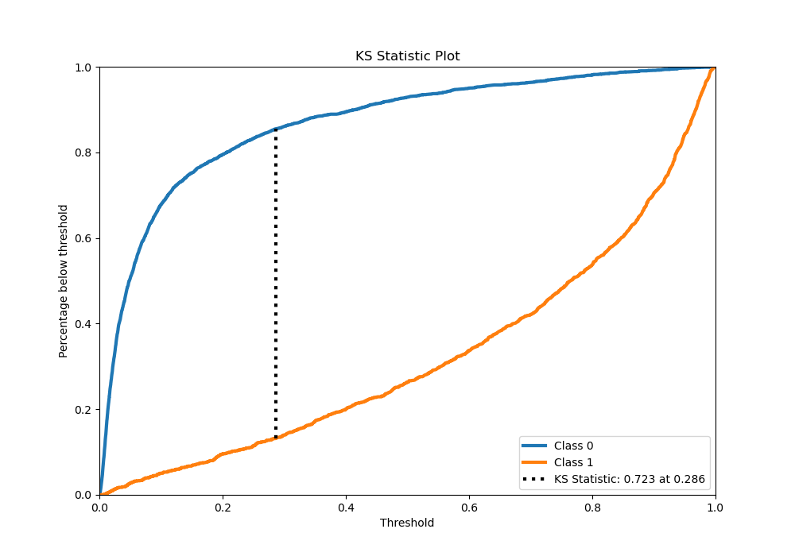
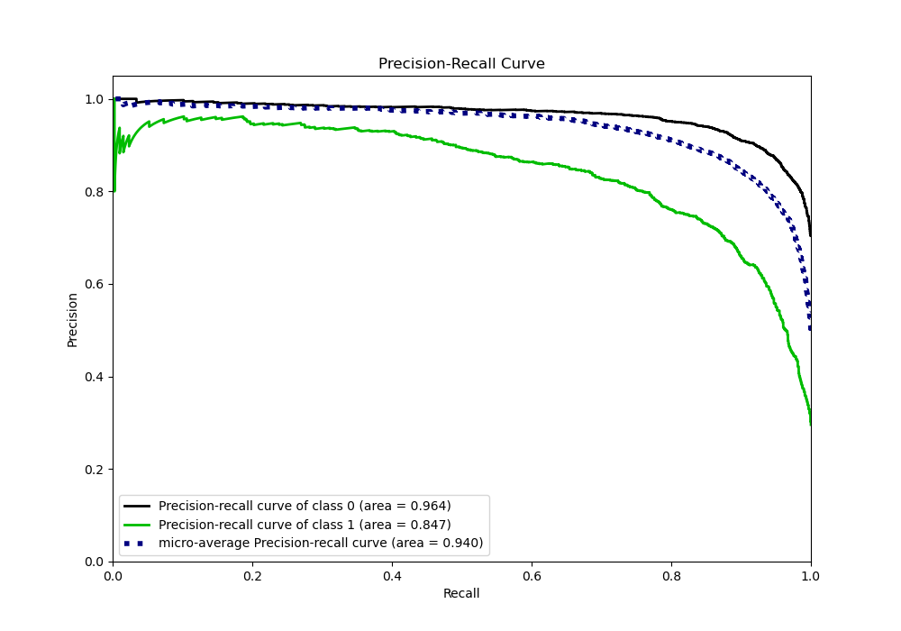
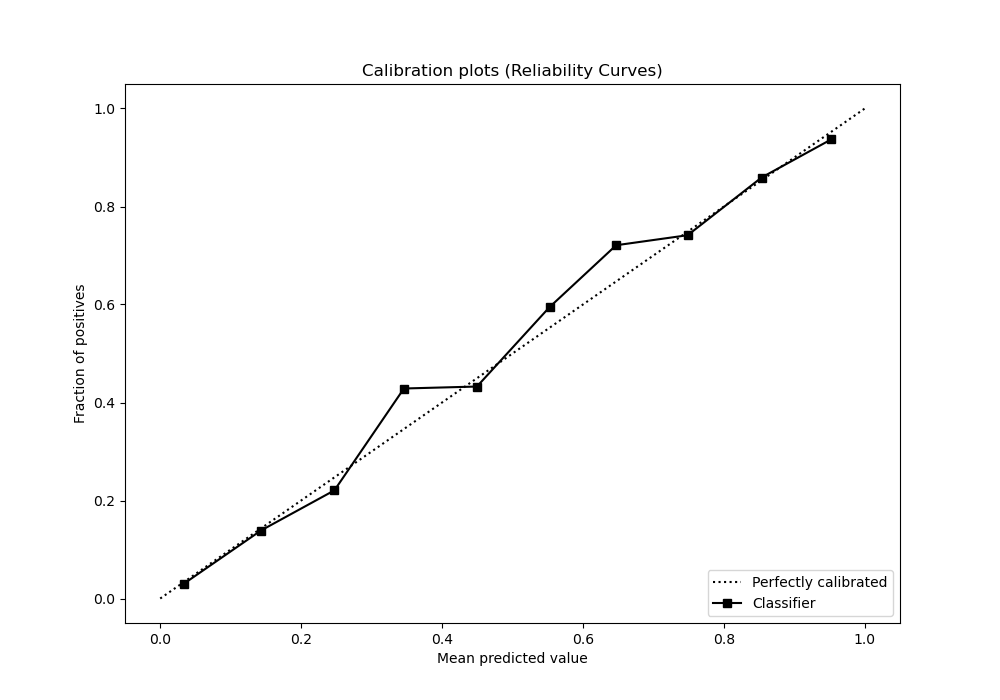
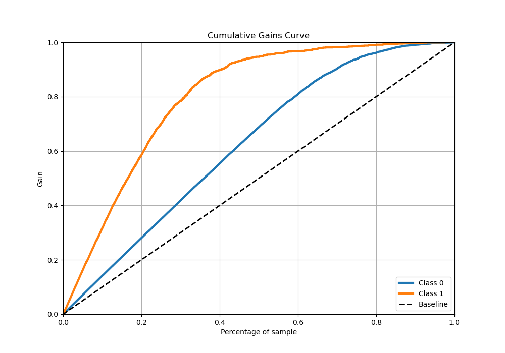
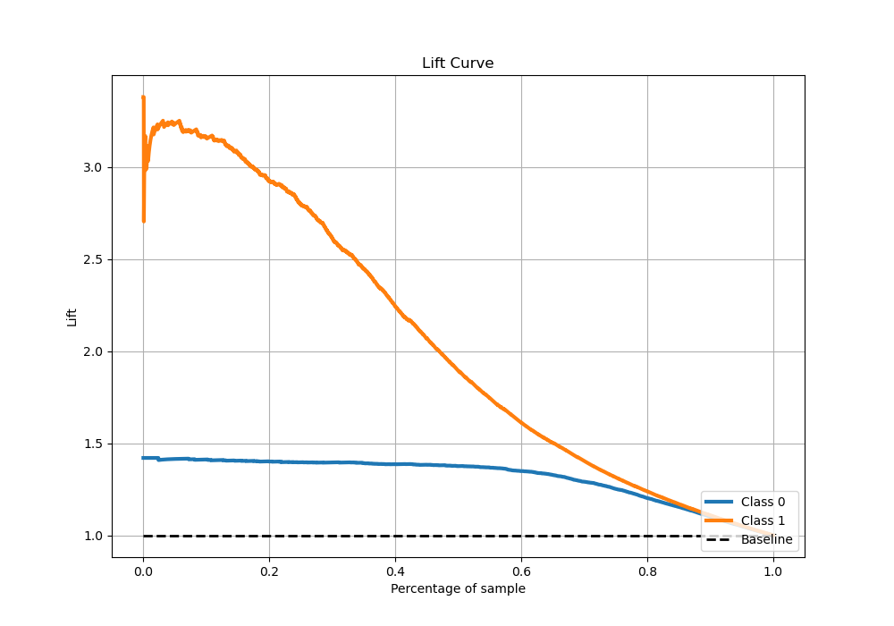

# Summary of 8_Xgboost

[<< Go back](../README.md)

## Extreme Gradient Boosting (Xgboost)
- **n_jobs**: -1
- **objective**: binary:logistic
- **eta**: 0.1
- **max_depth**: 4
- **min_child_weight**: 10
- **subsample**: 0.6
- **colsample_bytree**: 0.6
- **eval_metric**: logloss
- **explain_level**: 0

## Validation
 - **validation_type**: kfold
 - **stratify**: True
 - **k_folds**: 5
 - **shuffle**: True
 - **random_seed**: 42

## Optimized metric
logloss

## Training time

22.5 seconds

## Metric details
|           |    score |     threshold |
|:----------|---------:|--------------:|
| logloss   | 0.307955 | nan           |
| auc       | 0.927258 | nan           |
| f1        | 0.786255 |   0.337621    |
| accuracy  | 0.873659 |   0.462664    |
| precision | 0.961131 |   0.944162    |
| recall    | 1        |   0.000249267 |
| mcc       | 0.693639 |   0.462664    |

## Metric details with threshold from accuracy metric
|           |    score |   threshold |
|:----------|---------:|------------:|
| logloss   | 0.307955 |  nan        |
| auc       | 0.927258 |  nan        |
| f1        | 0.782341 |    0.462664 |
| accuracy  | 0.873659 |    0.462664 |
| precision | 0.797627 |    0.462664 |
| recall    | 0.767629 |    0.462664 |
| mcc       | 0.693639 |    0.462664 |

## Confusion matrix (at threshold=0.462664)
|              |   Predicted as 0 |   Predicted as 1 |
|:-------------|-----------------:|-----------------:|
| Labeled as 0 |             3255 |              290 |
| Labeled as 1 |              346 |             1143 |

## Learning curves

## Confusion Matrix

## Normalized Confusion Matrix

## ROC Curve

## Kolmogorov-Smirnov Statistic

## Precision-Recall Curve

## Calibration Curve

## Cumulative Gains Curve

## Lift Curve

[<< Go back](../README.md)
