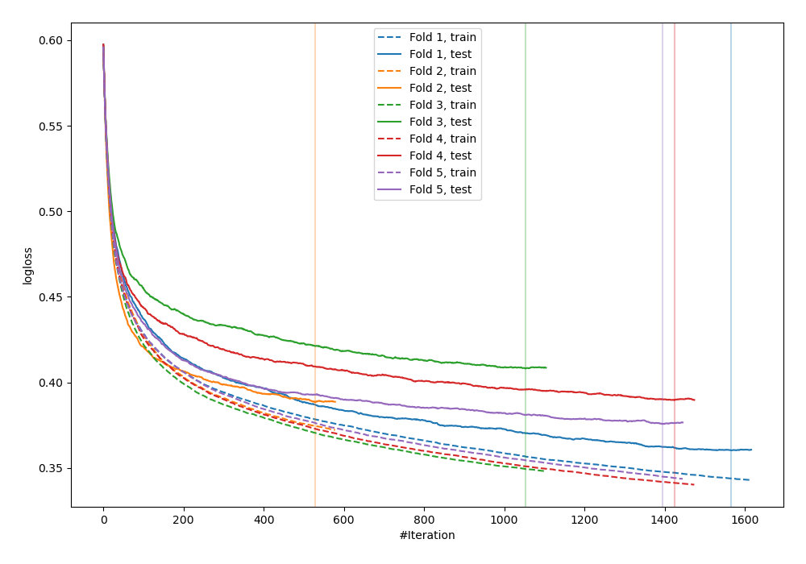
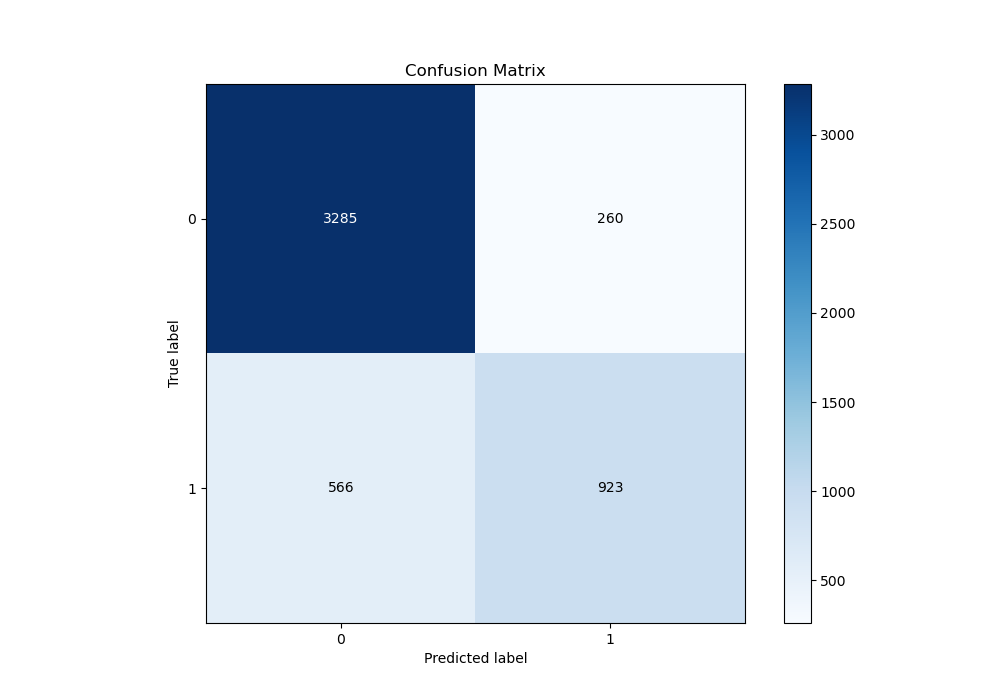
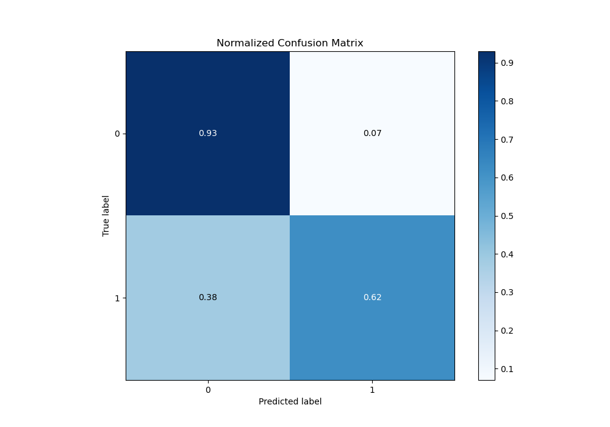
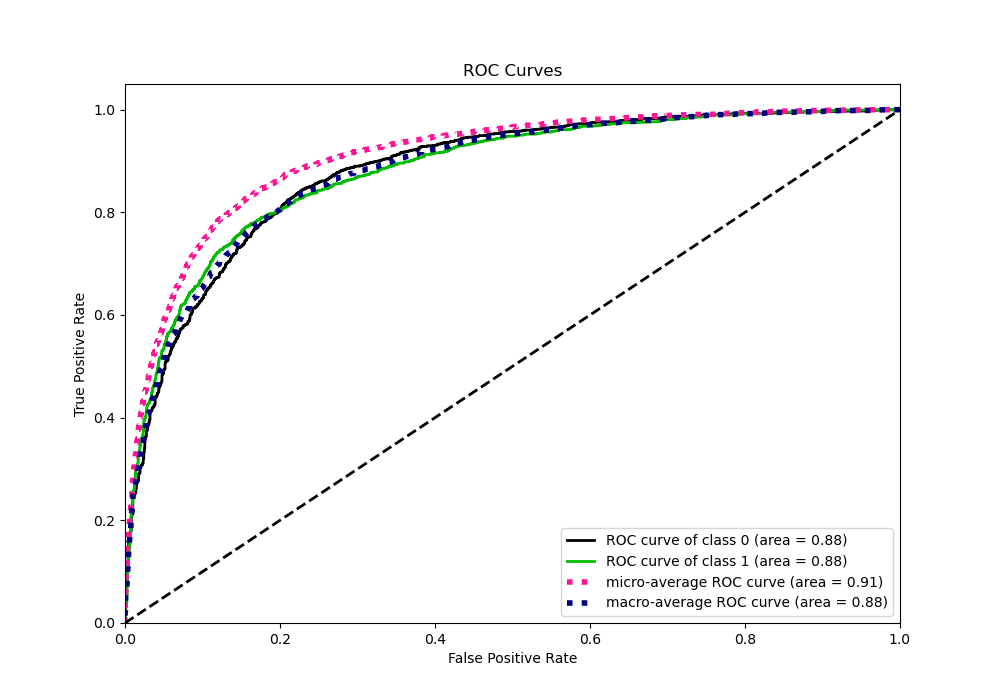
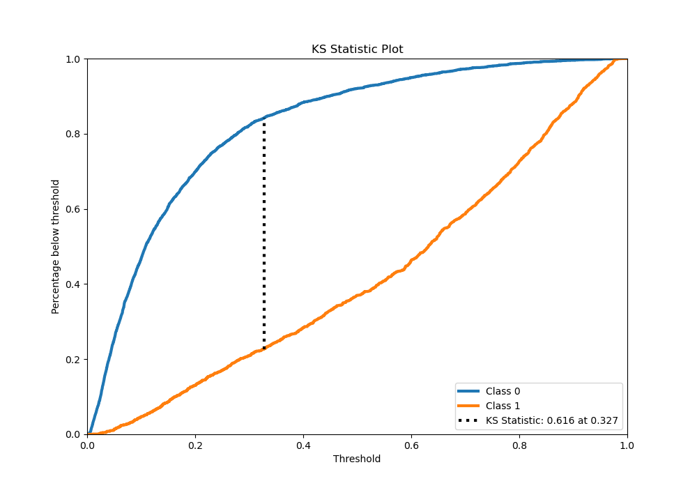
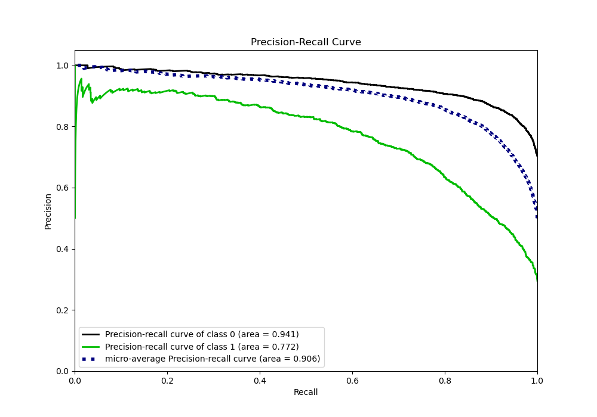
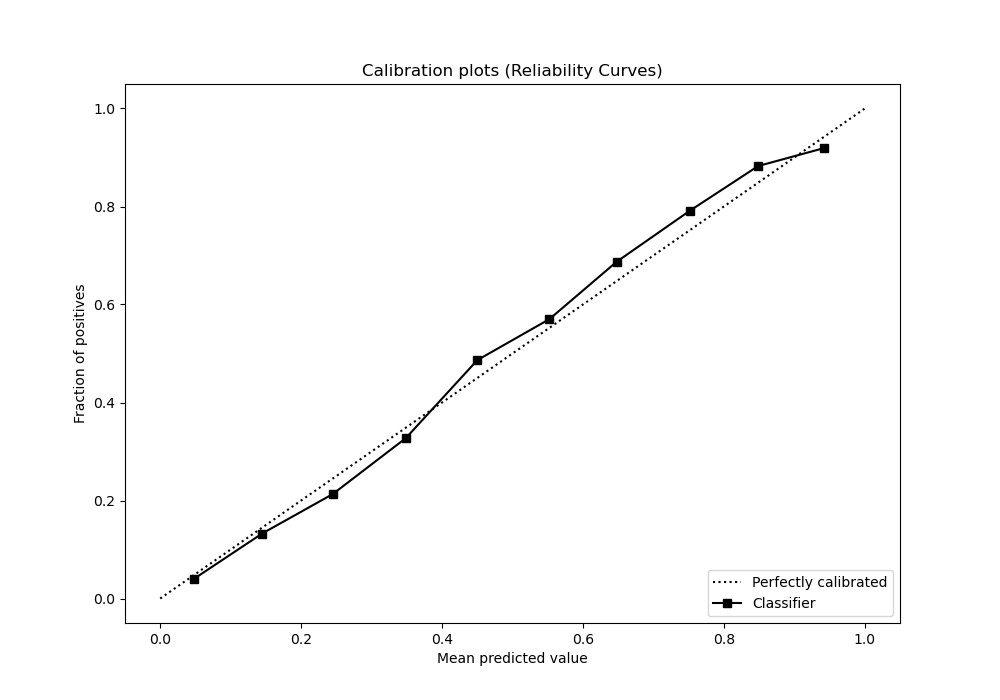
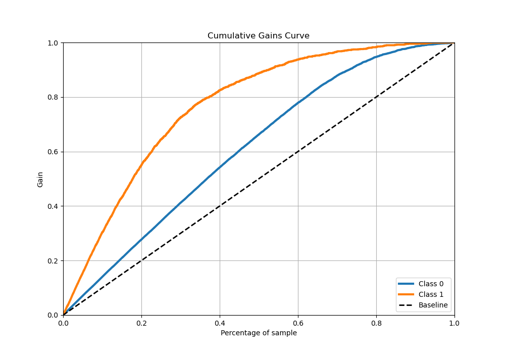
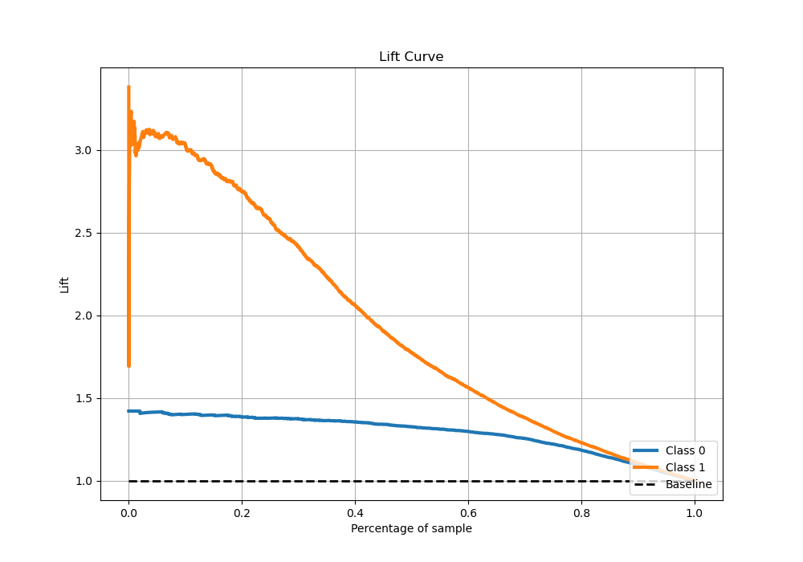

# Summary of 9_Xgboost

[<< Go back](../README.md)

## Extreme Gradient Boosting (Xgboost)
- **n_jobs**: -1
- **objective**: binary:logistic
- **eta**: 0.05
- **max_depth**: 6
- **min_child_weight**: 50
- **subsample**: 0.5
- **colsample_bytree**: 0.7
- **eval_metric**: logloss
- **explain_level**: 0

## Validation
 - **validation_type**: kfold
 - **stratify**: True
 - **k_folds**: 5
 - **shuffle**: True
 - **random_seed**: 42

## Optimized metric
logloss

## Training time

71.3 seconds

## Metric details
|           |    score |    threshold |
|:----------|---------:|-------------:|
| logloss   | 0.384427 | nan          |
| auc       | 0.881837 | nan          |
| f1        | 0.72005  |   0.334139   |
| accuracy  | 0.835916 |   0.519806   |
| precision | 0.923497 |   0.904938   |
| recall    | 1        |   0.00162937 |
| mcc       | 0.599943 |   0.399606   |

## Metric details with threshold from accuracy metric
|           |    score |   threshold |
|:----------|---------:|------------:|
| logloss   | 0.384427 |  nan        |
| auc       | 0.881837 |  nan        |
| f1        | 0.690868 |    0.519806 |
| accuracy  | 0.835916 |    0.519806 |
| precision | 0.78022  |    0.519806 |
| recall    | 0.619879 |    0.519806 |
| mcc       | 0.588295 |    0.519806 |

## Confusion matrix (at threshold=0.519806)
|              |   Predicted as 0 |   Predicted as 1 |
|:-------------|-----------------:|-----------------:|
| Labeled as 0 |             3285 |              260 |
| Labeled as 1 |              566 |              923 |

## Learning curves

## Confusion Matrix

## Normalized Confusion Matrix

## ROC Curve

## Kolmogorov-Smirnov Statistic

## Precision-Recall Curve

## Calibration Curve

## Cumulative Gains Curve

## Lift Curve

[<< Go back](../README.md)
