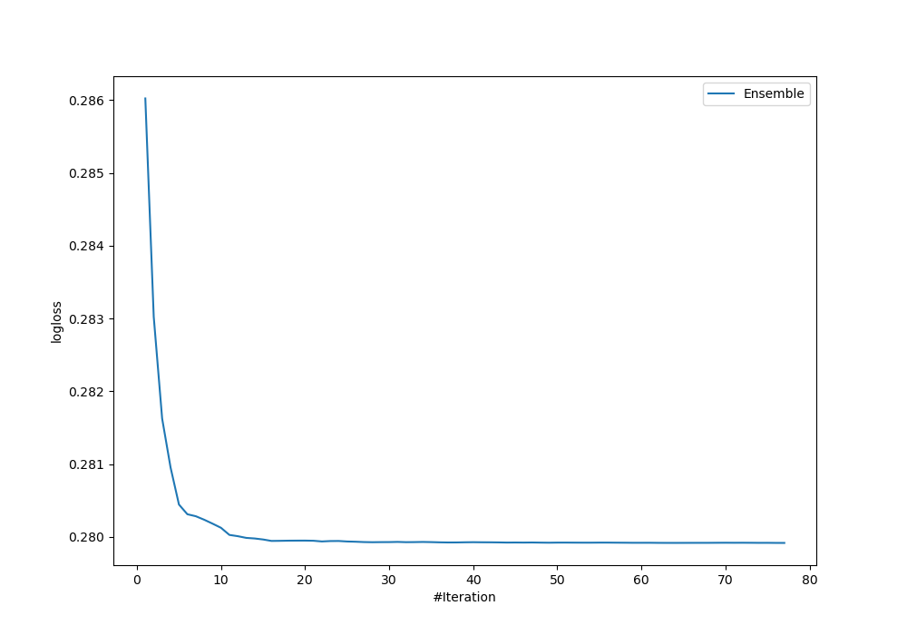
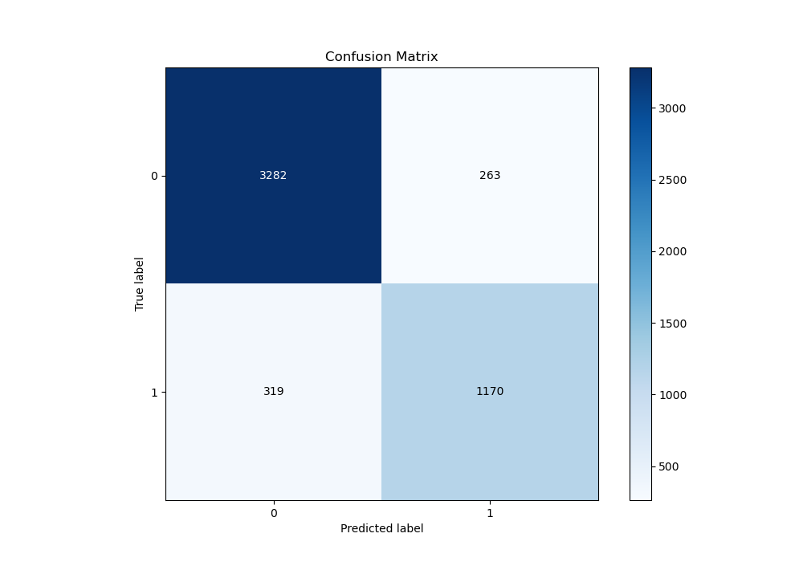
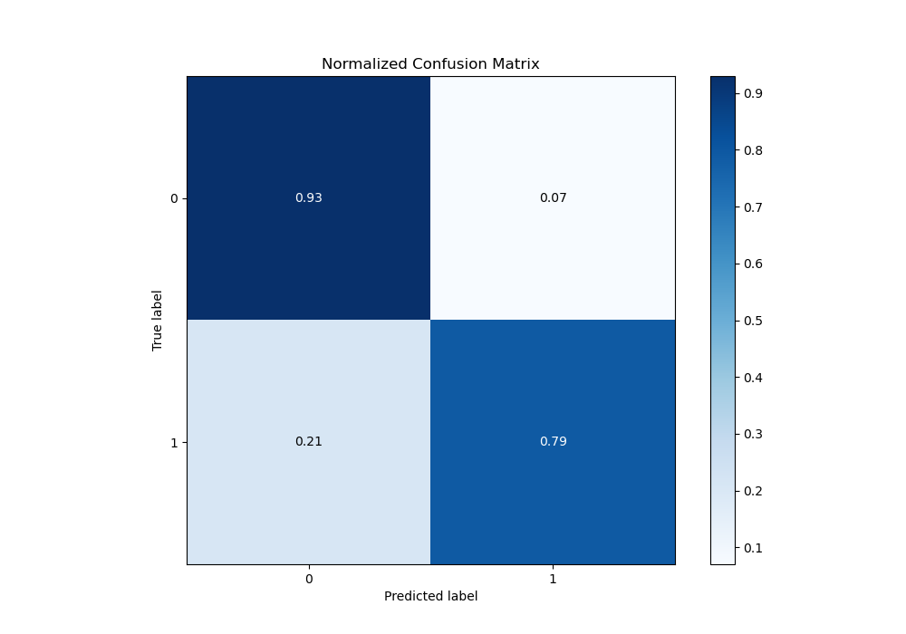
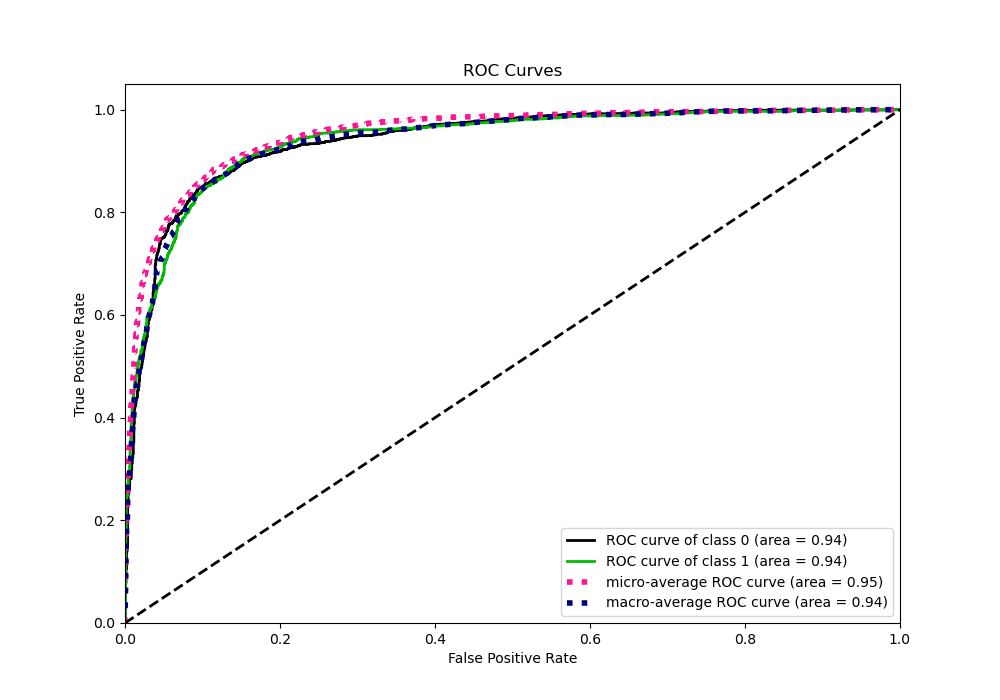
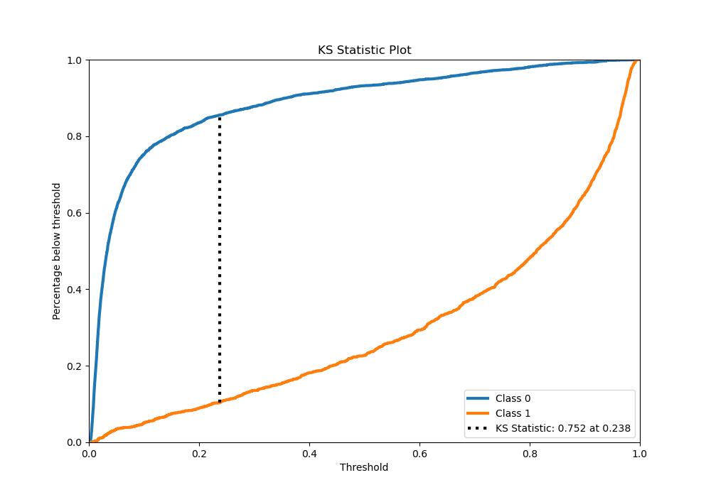
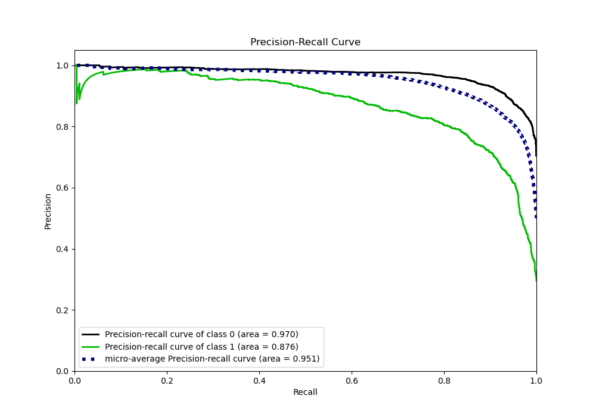
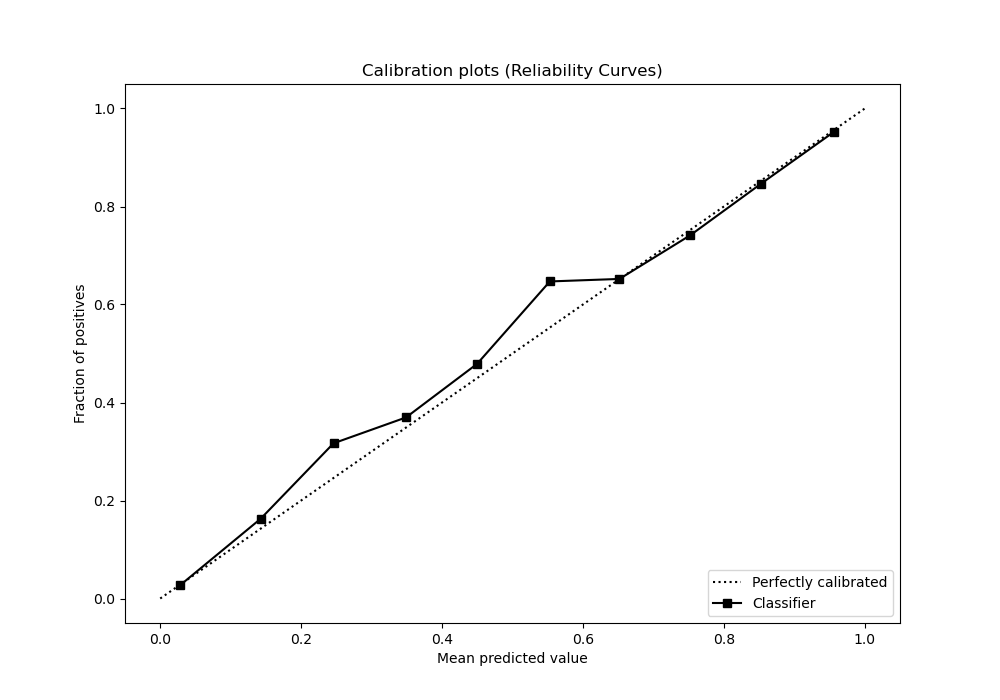
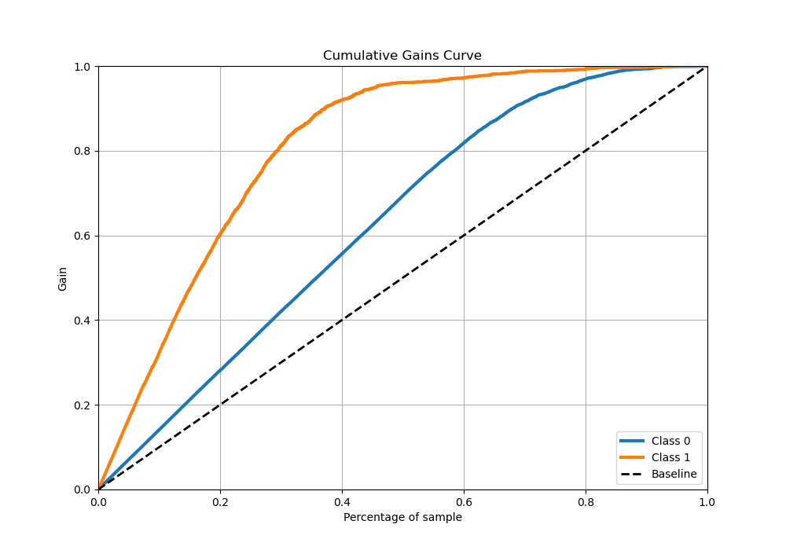
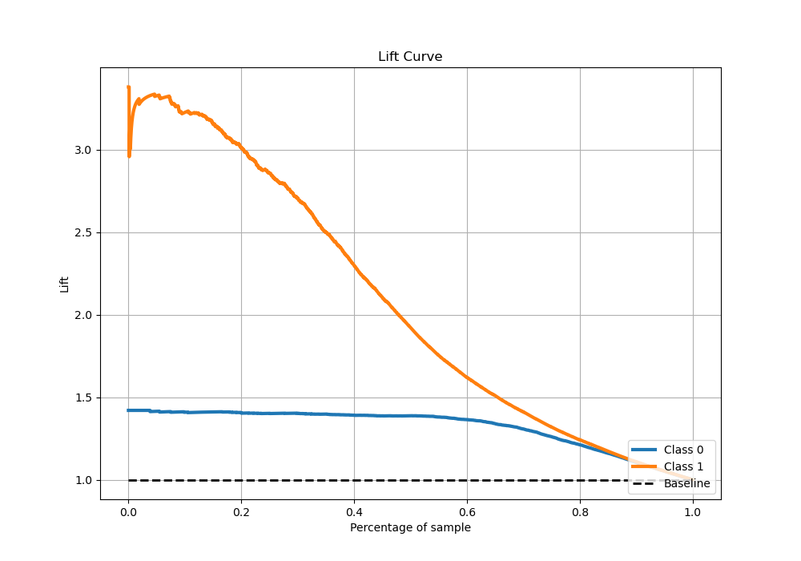

# Summary of Ensemble

[<< Go back](../README.md)

## Ensemble structure
| Model       |   Weight |
|:------------|---------:|
| 12_Xgboost  |       11 |
| 18_LightGBM |        1 |
| 22_LightGBM |        5 |
| 25_CatBoost |        6 |
| 30_CatBoost |        2 |
| 44_Xgboost  |        1 |
| 47_CatBoost |        4 |
| 59_Xgboost  |        6 |
| 64_Xgboost  |        8 |
| 65_CatBoost |        4 |
| 72_LightGBM |        2 |
| 73_LightGBM |       14 |
| 7_Xgboost   |       13 |

## Metric details
|           |    score |    threshold |
|:----------|---------:|-------------:|
| logloss   | 0.279919 | nan          |
| auc       | 0.939409 | nan          |
| f1        | 0.809896 |   0.370858   |
| accuracy  | 0.884386 |   0.468457   |
| precision | 0.987124 |   0.962357   |
| recall    | 1        |   0.00168687 |
| mcc       | 0.727237 |   0.370858   |

## Metric details with threshold from accuracy metric
|           |    score |   threshold |
|:----------|---------:|------------:|
| logloss   | 0.279919 |  nan        |
| auc       | 0.939409 |  nan        |
| f1        | 0.800821 |    0.468457 |
| accuracy  | 0.884386 |    0.468457 |
| precision | 0.816469 |    0.468457 |
| recall    | 0.785762 |    0.468457 |
| mcc       | 0.719682 |    0.468457 |

## Confusion matrix (at threshold=0.468457)
|              |   Predicted as 0 |   Predicted as 1 |
|:-------------|-----------------:|-----------------:|
| Labeled as 0 |             3282 |              263 |
| Labeled as 1 |              319 |             1170 |

## Learning curves

## Confusion Matrix

## Normalized Confusion Matrix

## ROC Curve

## Kolmogorov-Smirnov Statistic

## Precision-Recall Curve

## Calibration Curve

## Cumulative Gains Curve

## Lift Curve

[<< Go back](../README.md)
