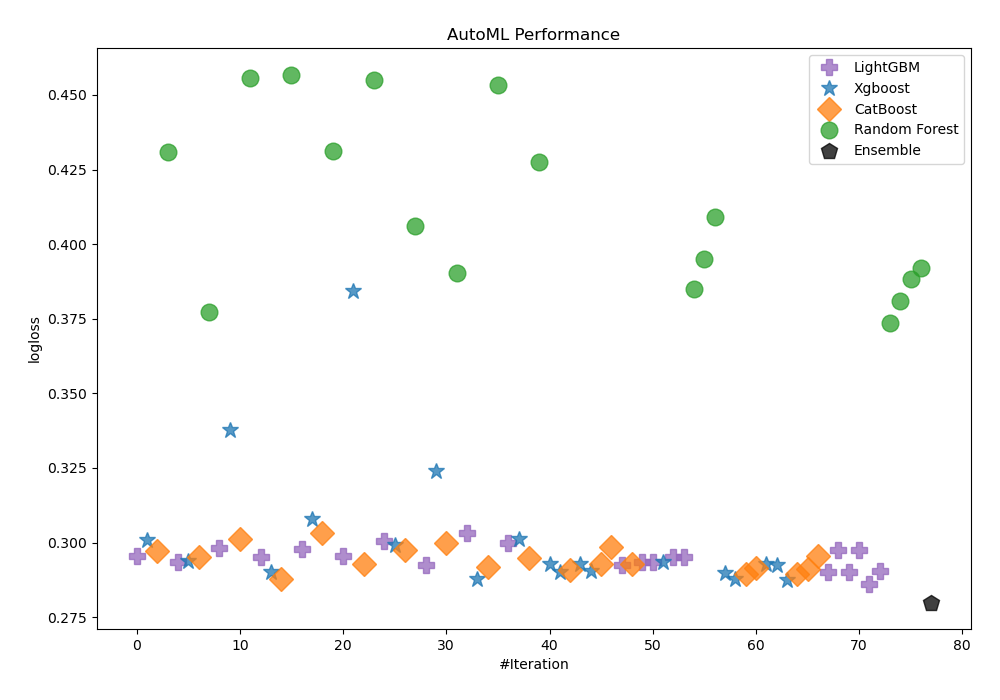
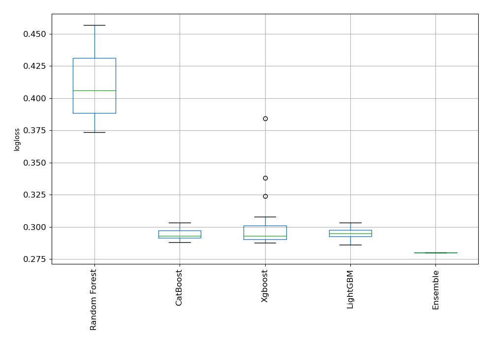
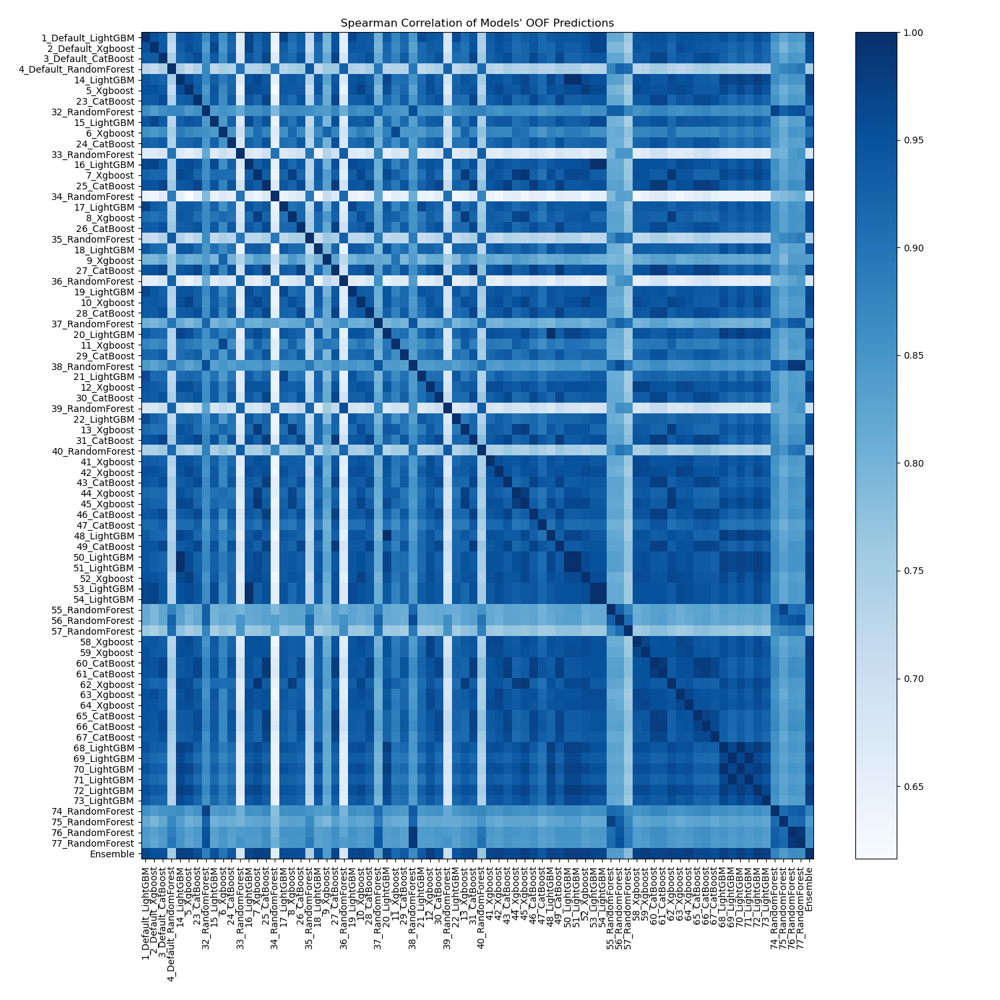

# AutoML Leaderboard

| Best model   | name                                                       | model_type    | metric_type   |   metric_value |   train_time |
|:-------------|:-----------------------------------------------------------|:--------------|:--------------|---------------:|-------------:|
|              | [1_Default_LightGBM](1_Default_LightGBM/README.md)         | LightGBM      | logloss       |       0.295539 |        29.81 |
|              | [2_Default_Xgboost](2_Default_Xgboost/README.md)           | Xgboost       | logloss       |       0.300857 |        16.35 |
|              | [3_Default_CatBoost](3_Default_CatBoost/README.md)         | CatBoost      | logloss       |       0.297063 |        18.74 |
|              | [4_Default_RandomForest](4_Default_RandomForest/README.md) | Random Forest | logloss       |       0.430844 |        27.1  |
|              | [14_LightGBM](14_LightGBM/README.md)                       | LightGBM      | logloss       |       0.293602 |         9.19 |
|              | [5_Xgboost](5_Xgboost/README.md)                           | Xgboost       | logloss       |       0.293721 |        17.51 |
|              | [23_CatBoost](23_CatBoost/README.md)                       | CatBoost      | logloss       |       0.295341 |        29.06 |
|              | [32_RandomForest](32_RandomForest/README.md)               | Random Forest | logloss       |       0.377331 |        19.77 |
|              | [15_LightGBM](15_LightGBM/README.md)                       | LightGBM      | logloss       |       0.298086 |         8.14 |
|              | [6_Xgboost](6_Xgboost/README.md)                           | Xgboost       | logloss       |       0.337886 |        16.72 |
|              | [24_CatBoost](24_CatBoost/README.md)                       | CatBoost      | logloss       |       0.301282 |        14.23 |
|              | [33_RandomForest](33_RandomForest/README.md)               | Random Forest | logloss       |       0.455832 |        17.02 |
|              | [16_LightGBM](16_LightGBM/README.md)                       | LightGBM      | logloss       |       0.295024 |        75.29 |
|              | [7_Xgboost](7_Xgboost/README.md)                           | Xgboost       | logloss       |       0.29007  |       268.86 |
|              | [25_CatBoost](25_CatBoost/README.md)                       | CatBoost      | logloss       |       0.287927 |       265.23 |
|              | [34_RandomForest](34_RandomForest/README.md)               | Random Forest | logloss       |       0.456845 |        18.65 |
|              | [17_LightGBM](17_LightGBM/README.md)                       | LightGBM      | logloss       |       0.297998 |       331.85 |
|              | [8_Xgboost](8_Xgboost/README.md)                           | Xgboost       | logloss       |       0.307955 |        22.9  |
|              | [26_CatBoost](26_CatBoost/README.md)                       | CatBoost      | logloss       |       0.303213 |        15.08 |
|              | [35_RandomForest](35_RandomForest/README.md)               | Random Forest | logloss       |       0.431186 |        17.61 |
|              | [18_LightGBM](18_LightGBM/README.md)                       | LightGBM      | logloss       |       0.295668 |        16.95 |
|              | [9_Xgboost](9_Xgboost/README.md)                           | Xgboost       | logloss       |       0.384427 |        71.77 |
|              | [27_CatBoost](27_CatBoost/README.md)                       | CatBoost      | logloss       |       0.292758 |        66.72 |
|              | [36_RandomForest](36_RandomForest/README.md)               | Random Forest | logloss       |       0.455066 |        21.26 |
|              | [19_LightGBM](19_LightGBM/README.md)                       | LightGBM      | logloss       |       0.300465 |        12.86 |
|              | [10_Xgboost](10_Xgboost/README.md)                         | Xgboost       | logloss       |       0.299243 |        50.86 |
|              | [28_CatBoost](28_CatBoost/README.md)                       | CatBoost      | logloss       |       0.297593 |        19.3  |
|              | [37_RandomForest](37_RandomForest/README.md)               | Random Forest | logloss       |       0.405926 |        26.2  |
|              | [20_LightGBM](20_LightGBM/README.md)                       | LightGBM      | logloss       |       0.292437 |        18.08 |
|              | [11_Xgboost](11_Xgboost/README.md)                         | Xgboost       | logloss       |       0.324035 |        33.45 |
|              | [29_CatBoost](29_CatBoost/README.md)                       | CatBoost      | logloss       |       0.299765 |        21.92 |
|              | [38_RandomForest](38_RandomForest/README.md)               | Random Forest | logloss       |       0.390215 |        26.14 |
|              | [21_LightGBM](21_LightGBM/README.md)                       | LightGBM      | logloss       |       0.303371 |       123.86 |
|              | [12_Xgboost](12_Xgboost/README.md)                         | Xgboost       | logloss       |       0.287869 |       145.32 |
|              | [30_CatBoost](30_CatBoost/README.md)                       | CatBoost      | logloss       |       0.291867 |        47.54 |
|              | [39_RandomForest](39_RandomForest/README.md)               | Random Forest | logloss       |       0.453365 |        22.04 |
|              | [22_LightGBM](22_LightGBM/README.md)                       | LightGBM      | logloss       |       0.299881 |        24.4  |
|              | [13_Xgboost](13_Xgboost/README.md)                         | Xgboost       | logloss       |       0.301107 |        38.75 |
|              | [31_CatBoost](31_CatBoost/README.md)                       | CatBoost      | logloss       |       0.294731 |        63.33 |
|              | [40_RandomForest](40_RandomForest/README.md)               | Random Forest | logloss       |       0.427432 |        21.77 |
|              | [41_Xgboost](41_Xgboost/README.md)                         | Xgboost       | logloss       |       0.29284  |        17.62 |
|              | [42_Xgboost](42_Xgboost/README.md)                         | Xgboost       | logloss       |       0.290291 |        12.14 |
|              | [43_CatBoost](43_CatBoost/README.md)                       | CatBoost      | logloss       |       0.290747 |       145.85 |
|              | [44_Xgboost](44_Xgboost/README.md)                         | Xgboost       | logloss       |       0.292762 |        34.32 |
|              | [45_Xgboost](45_Xgboost/README.md)                         | Xgboost       | logloss       |       0.290552 |        27.95 |
|              | [46_CatBoost](46_CatBoost/README.md)                       | CatBoost      | logloss       |       0.292966 |        88.63 |
|              | [47_CatBoost](47_CatBoost/README.md)                       | CatBoost      | logloss       |       0.298677 |        34.26 |
|              | [48_LightGBM](48_LightGBM/README.md)                       | LightGBM      | logloss       |       0.292437 |        10.2  |
|              | [49_CatBoost](49_CatBoost/README.md)                       | CatBoost      | logloss       |       0.292742 |        42.62 |
|              | [50_LightGBM](50_LightGBM/README.md)                       | LightGBM      | logloss       |       0.293602 |        15.08 |
|              | [51_LightGBM](51_LightGBM/README.md)                       | LightGBM      | logloss       |       0.293602 |        10.81 |
|              | [52_Xgboost](52_Xgboost/README.md)                         | Xgboost       | logloss       |       0.293523 |        18.07 |
|              | [53_LightGBM](53_LightGBM/README.md)                       | LightGBM      | logloss       |       0.295024 |        15.73 |
|              | [54_LightGBM](54_LightGBM/README.md)                       | LightGBM      | logloss       |       0.295024 |        16.08 |
|              | [55_RandomForest](55_RandomForest/README.md)               | Random Forest | logloss       |       0.385071 |        22.18 |
|              | [56_RandomForest](56_RandomForest/README.md)               | Random Forest | logloss       |       0.395189 |        26.67 |
|              | [57_RandomForest](57_RandomForest/README.md)               | Random Forest | logloss       |       0.409183 |        21.66 |
|              | [58_Xgboost](58_Xgboost/README.md)                         | Xgboost       | logloss       |       0.289974 |        25.1  |
|              | [59_Xgboost](59_Xgboost/README.md)                         | Xgboost       | logloss       |       0.287665 |        22.64 |
|              | [60_CatBoost](60_CatBoost/README.md)                       | CatBoost      | logloss       |       0.289528 |       261.89 |
|              | [61_CatBoost](61_CatBoost/README.md)                       | CatBoost      | logloss       |       0.291455 |       262.87 |
|              | [62_Xgboost](62_Xgboost/README.md)                         | Xgboost       | logloss       |       0.292855 |        32.02 |
|              | [63_Xgboost](63_Xgboost/README.md)                         | Xgboost       | logloss       |       0.292372 |        17.38 |
|              | [64_Xgboost](64_Xgboost/README.md)                         | Xgboost       | logloss       |       0.287636 |        16.26 |
|              | [65_CatBoost](65_CatBoost/README.md)                       | CatBoost      | logloss       |       0.289532 |       158.25 |
|              | [66_CatBoost](66_CatBoost/README.md)                       | CatBoost      | logloss       |       0.291079 |       163.56 |
|              | [67_CatBoost](67_CatBoost/README.md)                       | CatBoost      | logloss       |       0.295351 |        60.02 |
|              | [68_LightGBM](68_LightGBM/README.md)                       | LightGBM      | logloss       |       0.29028  |        25.15 |
|              | [69_LightGBM](69_LightGBM/README.md)                       | LightGBM      | logloss       |       0.297588 |        15.09 |
|              | [70_LightGBM](70_LightGBM/README.md)                       | LightGBM      | logloss       |       0.29028  |        15.2  |
|              | [71_LightGBM](71_LightGBM/README.md)                       | LightGBM      | logloss       |       0.297588 |        15.43 |
|              | [72_LightGBM](72_LightGBM/README.md)                       | LightGBM      | logloss       |       0.286024 |        17.32 |
|              | [73_LightGBM](73_LightGBM/README.md)                       | LightGBM      | logloss       |       0.290607 |        12.93 |
|              | [74_RandomForest](74_RandomForest/README.md)               | Random Forest | logloss       |       0.37361  |        22.39 |
|              | [75_RandomForest](75_RandomForest/README.md)               | Random Forest | logloss       |       0.380871 |        24.13 |
|              | [76_RandomForest](76_RandomForest/README.md)               | Random Forest | logloss       |       0.388488 |        25.37 |
|              | [77_RandomForest](77_RandomForest/README.md)               | Random Forest | logloss       |       0.392144 |        28.14 |
| **the best** | [Ensemble](Ensemble/README.md)                             | Ensemble      | logloss       |       0.279919 |        27.78 |

### AutoML Performance

### AutoML Performance Boxplot

### Spearman Correlation of Models

