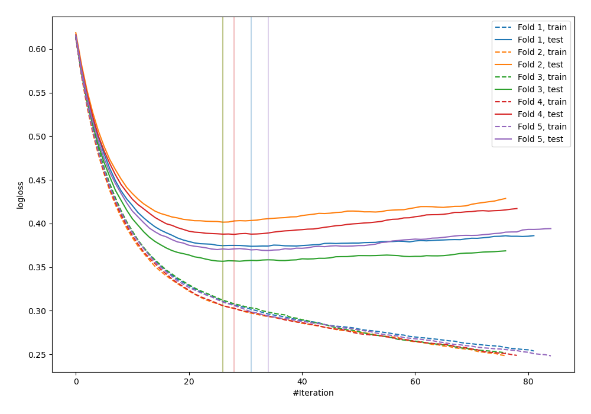
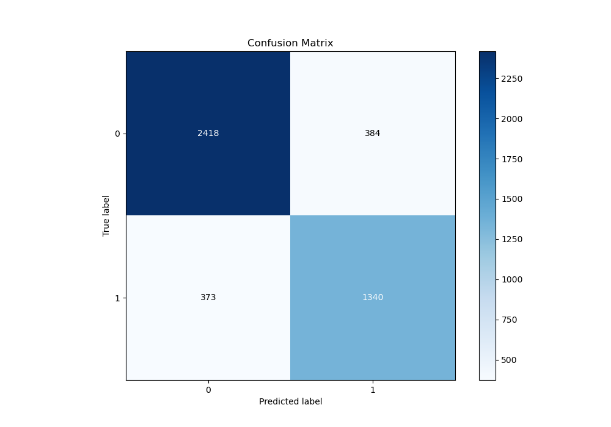
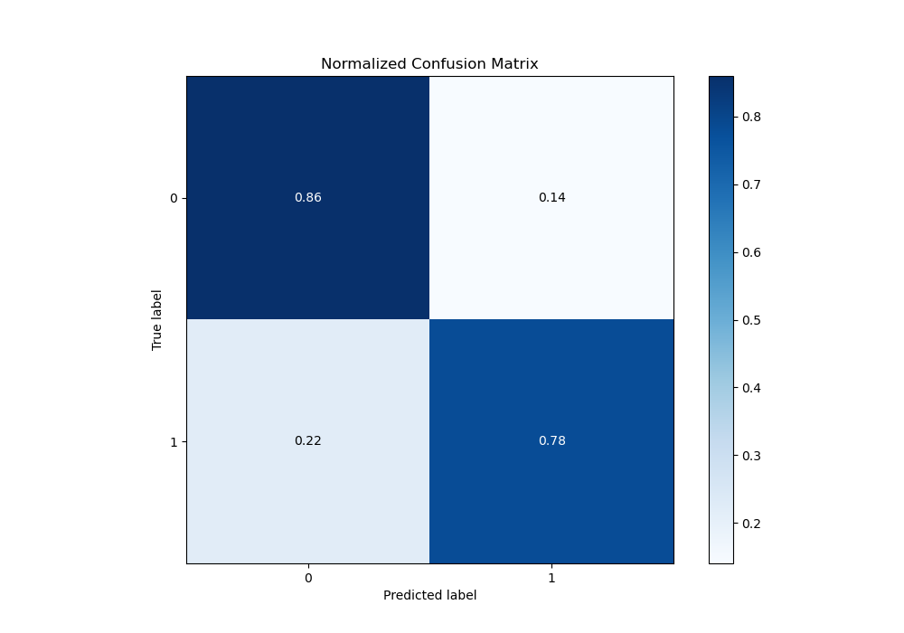
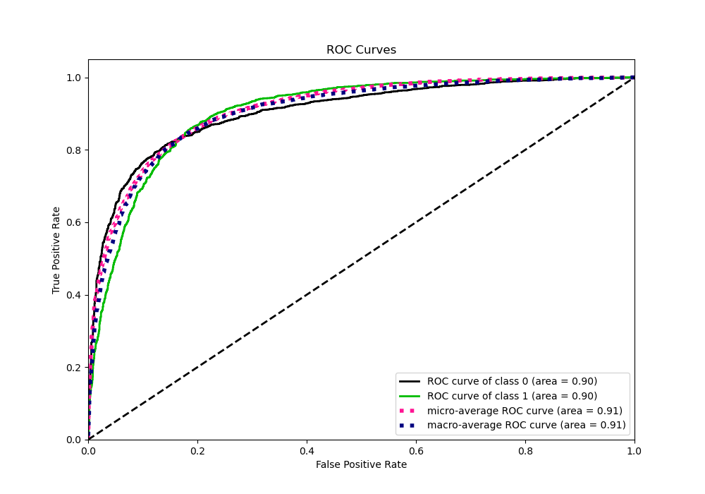
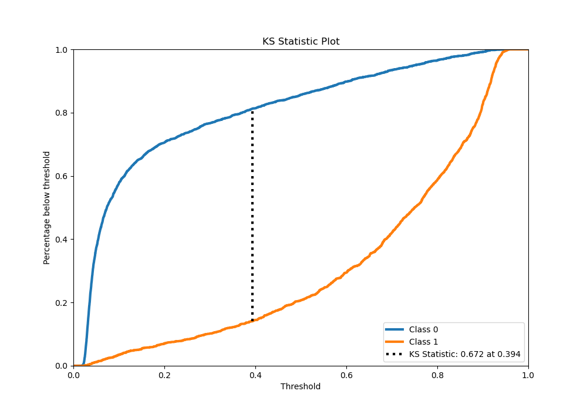
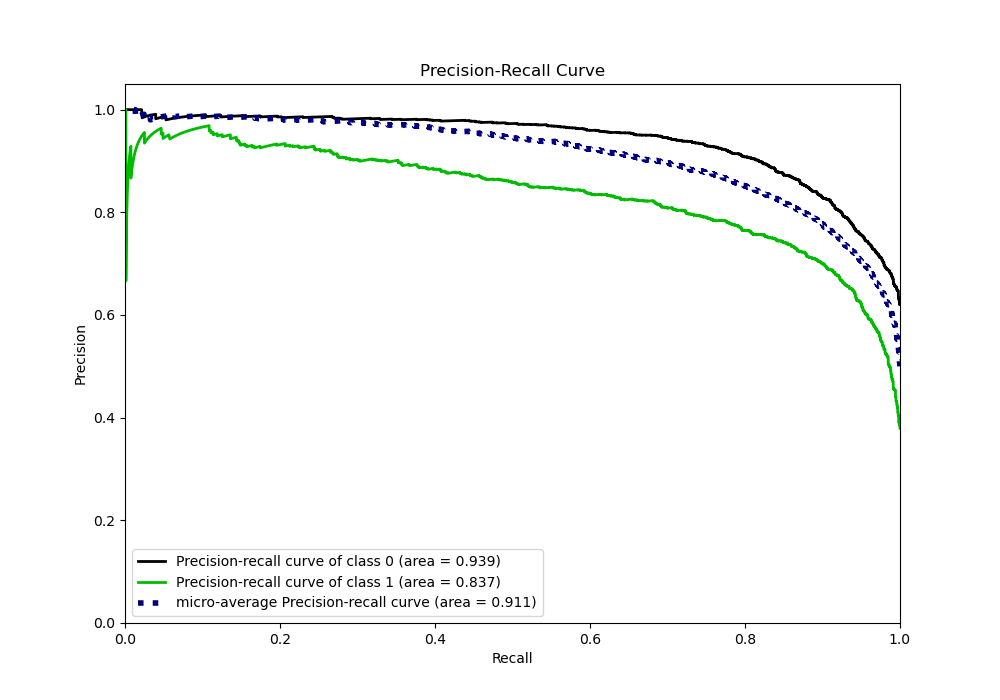
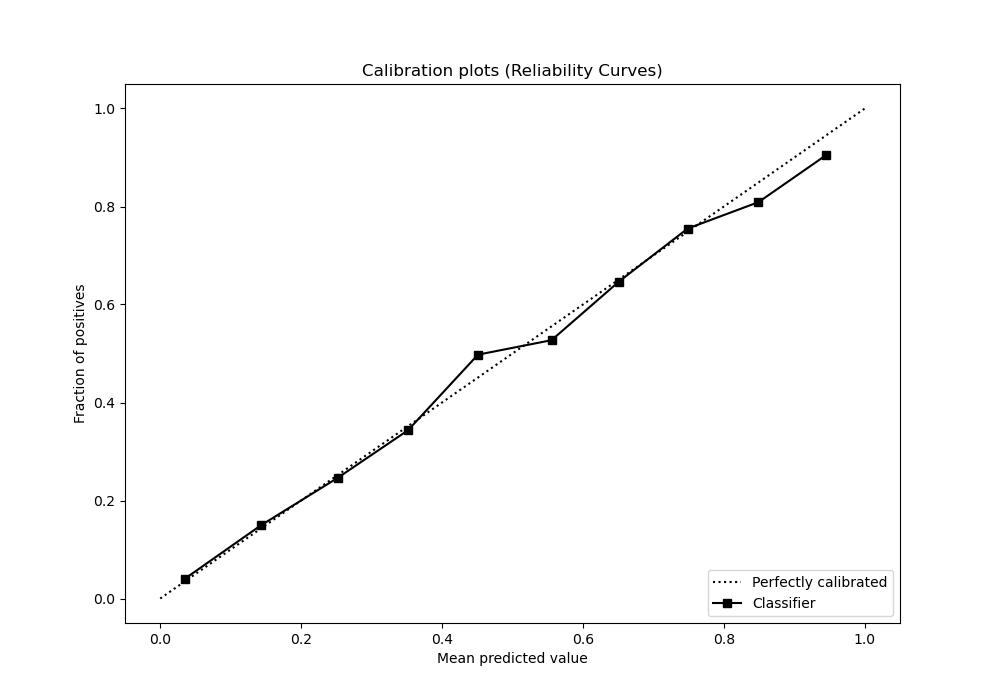
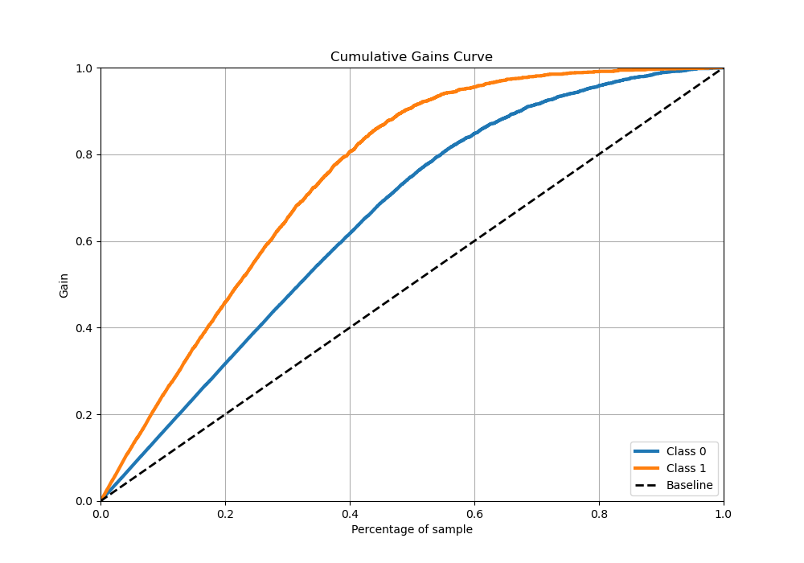
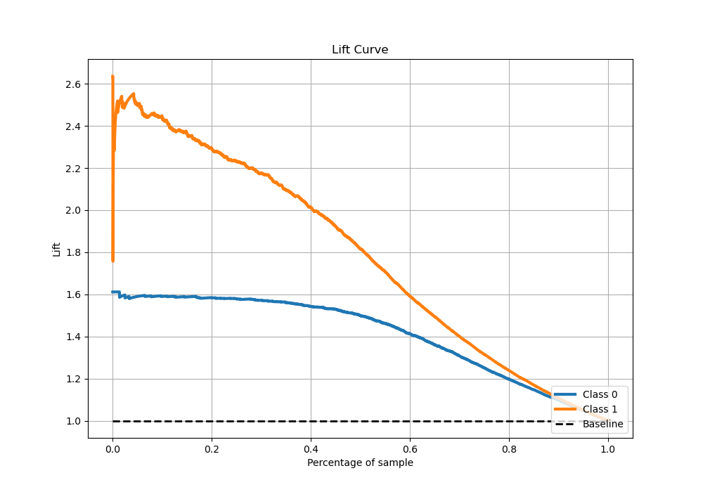

# Summary of 10_Xgboost_Stacked

[<< Go back](../README.md)

## Extreme Gradient Boosting (Xgboost)
- **n_jobs**: -1
- **objective**: binary:logistic
- **eta**: 0.1
- **max_depth**: 5
- **min_child_weight**: 5
- **subsample**: 0.7
- **colsample_bytree**: 0.6
- **eval_metric**: logloss
- **explain_level**: 0

## Validation
 - **validation_type**: kfold
 - **stratify**: True
 - **k_folds**: 5
 - **shuffle**: True
 - **random_seed**: 42

## Optimized metric
logloss

## Training time

21.6 seconds

## Metric details
|           |    score |   threshold |
|:----------|---------:|------------:|
| logloss   | 0.377788 | nan         |
| auc       | 0.904919 | nan         |
| f1        | 0.793094 |   0.39508   |
| accuracy  | 0.832337 |   0.518185  |
| precision | 0.959732 |   0.920523  |
| recall    | 1        |   0.0164215 |
| mcc       | 0.655803 |   0.39508   |

## Metric details with threshold from accuracy metric
|           |    score |   threshold |
|:----------|---------:|------------:|
| logloss   | 0.377788 |  nan        |
| auc       | 0.904919 |  nan        |
| f1        | 0.77975  |    0.518185 |
| accuracy  | 0.832337 |    0.518185 |
| precision | 0.777262 |    0.518185 |
| recall    | 0.782253 |    0.518185 |
| mcc       | 0.644413 |    0.518185 |

## Confusion matrix (at threshold=0.518185)
|              |   Predicted as 0 |   Predicted as 1 |
|:-------------|-----------------:|-----------------:|
| Labeled as 0 |             2418 |              384 |
| Labeled as 1 |              373 |             1340 |

## Learning curves

## Confusion Matrix

## Normalized Confusion Matrix

## ROC Curve

## Kolmogorov-Smirnov Statistic

## Precision-Recall Curve

## Calibration Curve

## Cumulative Gains Curve

## Lift Curve

[<< Go back](../README.md)
